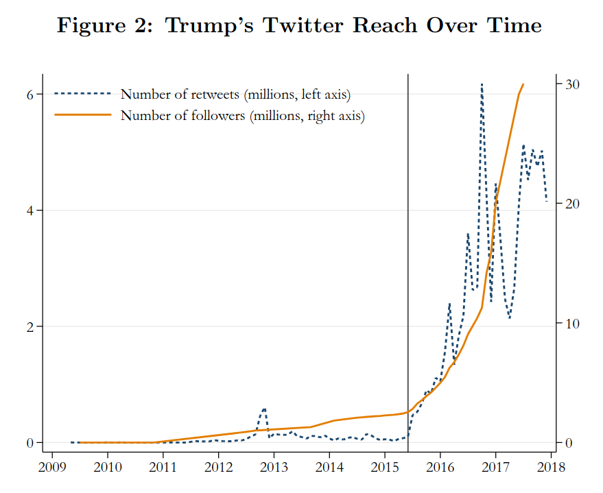
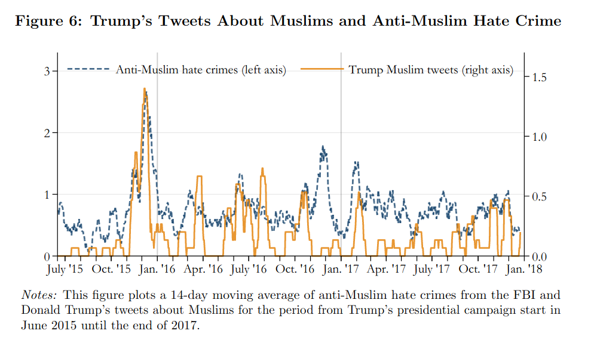
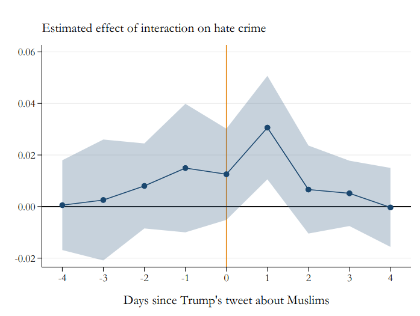
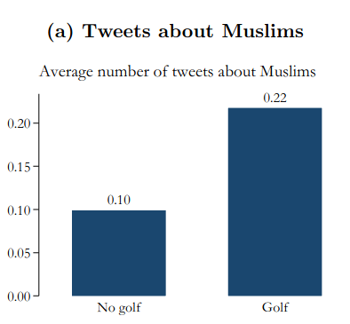

```{r setup, include=FALSE}
knitr::opts_chunk$set(echo = FALSE)
require(haven)
require(data.table)
require(ggplot2)
require(magrittr)
require(ggdag)
require(stringr)
require(ggpubr)
```

# Correlation to Causation

## Solutions to Confounding

1. Recap
2. Differences in Differences

    - definition
    - two examples

# Recap


## Solutions to Confounding

**Every way** of using correlation as evidence for causality **makes assumptions**

- FPCI cannot be solved without assumptions
- With assumptions, can say confounding/bias is not a problem

---

| Solution | How Bias<br>Solved | Which Bias<br>Removed | Assumes | Internal<br>Validity | External<br>Validity |
|--------------------|------------------------------|------------------------------------------------|---------|----------------------|----------------------|
| Experiment | Randomization<br>Breaks $W \rightarrow X$ link | **All** confounding variables | 1. $X$ is random<br> 2. Change only $X$ | Highest | Lowest | 
| Conditioning | Hold confounders<br>constant | Only variables <br> conditioned on | 1. Condition on all confounders <br> 2. Low measurement error | Lowest | Highest |
| Before and After | Hold confounders <br> constant | variables <br> unchanging <br> over time | No confounders <br> change w/ $X$ | Lower | Higher | 

## Example: Gun Laws

### **Does easing restrictions on gun laws increase murders committed using guns?**

- Some states in the US require all handgun purchasers to acquire a permit-to-purchase (PTP) license.
- Only persons with a permit may purchase firearms
- In late 2007, Missouri eliminated its PTP requirement

## Example: Gun Laws

[Webster et al (2014)](https://link.springer.com/article/10.1007/s11524-014-9865-8) investigate:

- Did the removal of the PTP law **increase** firearms homicides in Missouri?

>- Conditioning?: Lots of unique features of Missori; no "otherwise similar" state.
>- Easy comparison is Before and After

---

```{r, echo = F, message=F, warning=F}
guns = fread('./results.csv', integer64 = 'double') %>%
       .[!is.na(Year)] 
guns[, gun_rate := as.numeric(`Age-Adjusted Rate`)]

border = c("Illinois", "Iowa", "Nebraska", "Kansas", "Oklahoma", "Arkansas", "Tennessee", "Kentucky")
guns_use = guns[State %in% c("Missouri", "Arkansas")]
guns_use[, States := ifelse(State %in% border, "Border", "Missouri")]
#guns_use = guns_use[, list(gun_rate = mean(gun_rate)), by = list(States, Year)]
ggplot(guns_use[Year %in% 2007:2008 & State %in% "Missouri"], aes(x = Year, y = gun_rate)) +
  geom_line() +
  geom_point() +
  geom_vline(xintercept = 2007.5, linetype = 2, colour= 'red') +
  theme_bw() +
  ylim(0,7) +
  scale_x_continuous(breaks=c(2007,2008)) + 
  ylab("Firearms Homicide Rate") +
  ggtitle("Firearms Homicide Rate:", subtitle = "Missouri, before and after PTP repeal")
```

POLL

## Example: Gun Laws

Holds all unique, **unchanging** characteristics of Missouri constant. 

But, we have to assume that there is nothing else about Missouri that...

- changed around the same time as the PTP repeal
- also affected Firearms Homicides

No long-term trends, changes in measurement, or anticipation either...

---

```{r, echo = F, message=F, warning=F}

ggplot(guns_use[Year %in% 1999:2012 & State %in% "Missouri"], aes(x = Year, y = gun_rate)) +
  geom_line() +
  geom_point() +
  geom_vline(xintercept = 2007.5, linetype = 2, colour= 'red') +
  theme_bw() +
  ylim(0,7) +
  scale_x_continuous(breaks=c(1999:2012)) + 
  ylab("Firearms Homicide Rate") +
  ggtitle("Firearms Homicide Rate:", subtitle = "Missouri, before and after PTP repeal")
```

Does this plot make it easier/harder to believe PTP repeal caused more murders?

## Example: Gun Laws

- Maybe an upward trend in long term?
- But maybe 2006-2007 was aberration, 2008 a return to trend?
- What else happened in 2008?

Could be that **other things were changing between 2007-2008** that confound relationship between PTP and Murders

## Example: Gun Laws

What can we do to remove confounding from other variables that **change over time**, like...

- weather patterns (hot weather $\to$ murders)
- global financial crises/economic shocks
- political events

>- One option: compare Missouri to another state with **no change** in PTP law. Arkansas

---


Arkansas has a different history that Missouri, so there are differences that are unchanging between them. 

But, if Arkansas experiences same regional economic, political, cultural trends as Missouri, they might have the **same trends over time**.

---

```{r, echo = F, message=F, warning=F}

ggplot(guns_use[Year %in% 2007:2008 & State %in% c("Missouri", "Arkansas")], aes(x = Year, y = gun_rate, color = State)) +
  geom_line() +
  geom_point() +
  geom_vline(xintercept = 2007.5, linetype = 2, colour= 'red') +
  theme_bw() +
  ylim(0,7) +
  scale_x_continuous(breaks=c(2007:2008)) + 
  ylab("Firearms Homicide Rate") +
  ggtitle("Firearms Homicide Rate:", subtitle = "Missouri and Arkansas, before and after Missouri PTP repeal") + 
  theme(legend.position = 'bottom')
```

Missouri/Arkansas different in 2007, but if Missouri had same trend (absent the PTP repeal) as Arkansas, we'd expect...

---

```{r, echo = F, message=F, warning=F}

p_data = guns_use[Year %in% 2007:2008 & State %in% c("Missouri", "Arkansas"), list(State, Year, gun_rate, Trend = 'factual')]

cf_data = guns_use[Year %in% 2007:2008 & State %in% c("Missouri", "Arkansas"), list(State, Year, gun_rate, Trend = 'counterfactual')]
ar_diff = p_data[, gun_rate[2] - gun_rate[1]]
mo_2007 = p_data[, gun_rate[3]]
mo_2008 = p_data[, gun_rate[4]]

cf_data[Year %in% 2008 & State %in% c("Missouri"), gun_rate := mo_2007 + ar_diff]

plot_data = rbind(p_data, cf_data[State %in% "Missouri"])
plot_data[, Trend := factor(Trend, levels = c("factual", "counterfactual"))]
ggplot(plot_data, aes(x = Year, y = gun_rate, color = State, linetype = Trend)) +
  geom_line() +
  geom_point() +
  geom_vline(xintercept = 2007.5, linetype = 2, colour= 'red') +
    geom_segment(y = mo_2007 + ar_diff, yend= mo_2008, x = 2008, xend = 2008, colour = 'black') +
  theme_bw() +
  ylim(0,7) +
  scale_x_continuous(breaks=c(2007:2008)) + 
  ylab("Firearms Homicide Rate") +
  ggtitle("Firearms Homicide Rate:", subtitle = "Missouri and Arkansas, before and after Missouri PTP repeal") + 
  theme(legend.position = 'bottom')
```

Missouri would have (counterfactually) had the same trend as Arkansas, if it hadn't repealed PTP

## Design: Difference in Difference

**What is it?**

- Compare "treated" cases to "untreated" cases before and after the "treatment" takes place

**How does it work?**

- Hold constant **unchanging** attributes of cases (compare same case before and after "treatment")
- Hold constant variables that **change together** over time in both "treated" and "untreated" cases
- Trend in "untreated" case assumed to be **counterfactual trend** in "treated" case

## Design: Difference in Difference

Consider 2 states $\mathrm{Missouri}$ and $\mathrm{Arkansas}$ at two times $Before$ and $After$ Missouri implements PTP repeal ("treated").

- $\mathrm{Missouri}$ sees increase in murder rate 
- $\mathrm{Arkansas}$ sees slight decrease in murder rate

We measure $Homicide$ ($Y$) in both states. 

## Design: Difference in Difference

So:

- $\mathrm{Difference \ 1} = Homicide_{After} - Homicide_{Before}$ gives us change in murders in a $State$...
    - holding **unchanging attributes of state** constant (*same case over time*)
- $\mathrm{Difference \ 2} = \mathrm{Difference \ 1}_{Missouri} - \mathrm{Difference \ 1}_{Arkansas}$ gives us change in murders in $Treated$ over time, compared to $Control$ 
    - holds **shared trends of both states** constant (*difference in trends*)

## Design: Difference in Difference

|                   | $Homocide_{Before}$ | $Homicide_{After}$ | **First Difference** |
|-------------------|:--------:|:--------:|:----------------:|
| $\mathrm{Missouri}$         |   $4.6$  |   $6.2$  |       $1.6$      |
| $\mathrm{Arkansas}$         |   $5.6$  |   $5.4$  |       $-0.2$      |
| **Second Difference** |          |          |      $1.8$      |

<br> 

We assume Missouri **would have had** same trend as Arkansas, absent PTP repeal ($-0.2$), can conclude that firearms homicides **increased** in Missouri by $1.8$ per 100k.

## Example: Difference in Difference

### **Confounding Solved**...

All confounding variables (affect whether a PTP repealed; affect firearms homicides) that are **unchanging over time** are held constant 

- comparing change over time with-in the same case

All confounding variables that **change the similarly** in "treated" and "untreated" case are held constant.

- By comparing change over time in "treated" to change over time in "control"

## Design: Difference in Difference

In order to infer $X$ causes $Y$ if $X,Y$ correlated in difference-in-difference comparison...

### **Must Assume**

- we assume trend in $Y$ for "untreated" case is the "counterfactual trend" in $Y$ for what the "treated" case **would have done** absent "treatment"
- Equivalently: we assume "treated" and "untreated" have the "parallel trends" in $Y$.
- Equivalently: **no variables** that affect $Y$ and **change over time differently** in "treated" and "untreated" cases

---

```{r, echo = F, message=F, warning=F}

p_data = guns_use[Year %in% 1999:2012 & State %in% c("Missouri", "Arkansas"), list(State, Year, gun_rate, Trend = 'factual')]

cf_data = guns_use[Year %in% 2007:2012 & State %in% c("Missouri"), list(State, Year, gun_rate, Trend = 'counterfactual')]
ar_diff = p_data[, gun_rate[9:14] - gun_rate[9]]
mo_2007 = p_data[, gun_rate[23]]
#mo_post = p_data[, gun_rate[4]]

cf_data[, gun_rate := mo_2007 + ar_diff]

plot_data = rbind(p_data, cf_data[State %in% "Missouri"])
plot_data[, Trend := factor(Trend, levels = c("factual", "counterfactual"))]
ggplot(plot_data, aes(x = Year, y = gun_rate, color = State, linetype = Trend)) +
  geom_line() +
  geom_point() +
  geom_vline(xintercept = 2007.5, linetype = 2, colour= 'red') +
  theme_bw() +
  ylim(0,7) +
  scale_x_continuous(breaks=c(1999:2012)) + 
  ylab("Firearms Homicide Rate") +
  ggtitle("Firearms Homicide Rate:", subtitle = "Missouri and Arkansas, before and after Missouri PTP repeal") + 
  theme(legend.position = 'bottom')
```

Do you believe assumption of parallel trends?

## Example: Difference in Difference

### **Confounding UNSolved**...

- Arkansas and Missouri murder rates mostly move together before 2007. 
- But large change in AR in 2001/2002 not in MO
- But in 2007, before law took effect, murders dipped

<br>

Perhaps there is some things that affect murder rates that change differently in these two states.

---

| Solution | How Bias<br>Solved | Which Bias<br>Removed | Assumes | Internal<br>Validity | External<br>Validity |
|--------------------|------------------------------|------------------------------------------------|---------|----------------------|----------------------|
| Experiment | Randomization<br>Breaks $W \rightarrow X$ link | **All** confounding variables | 1. $X$ is random<br> 2. Change only $X$ | Highest | Lowest | 
| Conditioning | Hold confounders<br>constant | Only variables <br> conditioned on | 1. Condition on all confounders <br> 2. Low measurement error | Lowest | Highest |
| Before and After | Hold confounders <br> constant | variables <br> unchanging <br> over time | No confounders <br> change w/ $X$ | Lower | Higher | 
| Diff in Diff | Hold confounders <br> constant | unchanging and <br> similarly changing | Parallel trends /<br> no differently <br> changing | Higher | Lower | 

# Application

## Trump's Twitter and Hate Crimes

[Mueller and Schwarz (2020)](https://papers.ssrn.com/sol3/papers.cfm?abstract_id=3149103) investigate:

Did Trump's tweeting of anti-Muslim messages **increase** anti-Muslim hate crimes?

## Trump's Twitter and Hate Crimes

We can't observe the US in the absence of Trump tweeting against Muslims, so authors use correlation...

## Trump's Twitter and Hate Crimes

Trump's Twitter gained attention as he ran for President.



## Trump's Twitter: **Before and After** 

When Trump gained prominence, anti-Muslim hate crimes increased


## Trump's Twitter: **Before and After** 



## Trump's Twitter and Hate Crimes

Even comparing US to itself over time...

could be that...

- something **other than Trump's Twitter changed** between 2014 and 2015
- days with more Trump Tweets could be different in other ways (different news events)

<br>

>- Before-and-after comparisons could easily suffer from confounding

## Trump's Twitter and Hate Crimes

We can solve this problem using a **difference-in-difference**:

- were the changes in anti-Muslim hate crimes **greater** in places with **greater exposure to Twitter** ("treated") than in places with **less exposure to Twitter** ("untreated")

How do we know it is about Twitter?

- maybe places with more Twitter users different in other ways that leads to different patterns after 2014
- places w/ more initial joiners to Twitter at SXSW in 2007 (have more Twitter users later on)

## Trump's Twitter and Hate Crimes


Counties with more SXSW Twitter Joiners (treated) see larger increase in hate crimes following rise of Trump's Twitter

## Trump's Twitter and Hate Crimes



Counties with more (vs fewer) SXSW Twitter Joiners see larger increases in hate crimes in the days following Trump's anti-Muslim tweets

## Trump's Twitter and Hate Crimes



Days with Trump **golfing** have more anti-Muslim tweets! (Tweets unrelated to news cycle, but due to golf)

Counties with more Twitter users see greater increases in hate crimes in days after Trump golfs 


## Trump's Twitter and Hate Crimes

- Can't be confounding due to unchanging differences b/t places with more/fewer Twitter users (same counties over time)
- Can't be confounding due to changing events (compare high/low twitter use counties on the same dates)
- Can't be confounding due to changing events (examine only tweets induced by Trump golfing)
- Can't be confounding due to different trends in high/low Twitter counties (use SXSW Twitter joiners)

With reasonable assumptions (no different trends in places with more SXSW 2007 attendees on days when Trump golfs), social media rhetoric causes hate crimes.


# Fin

## Key Lessons

Know what kinds of questions to ask about

- Defining concepts/variables, measuring/sampling error
- What causality is, why it is hard to prove
- What kinds of assumptions we must make to prove causality
- Demanding transparent, systematic evidence that considers alternatives

### Can better answer "**what should we do?**"
