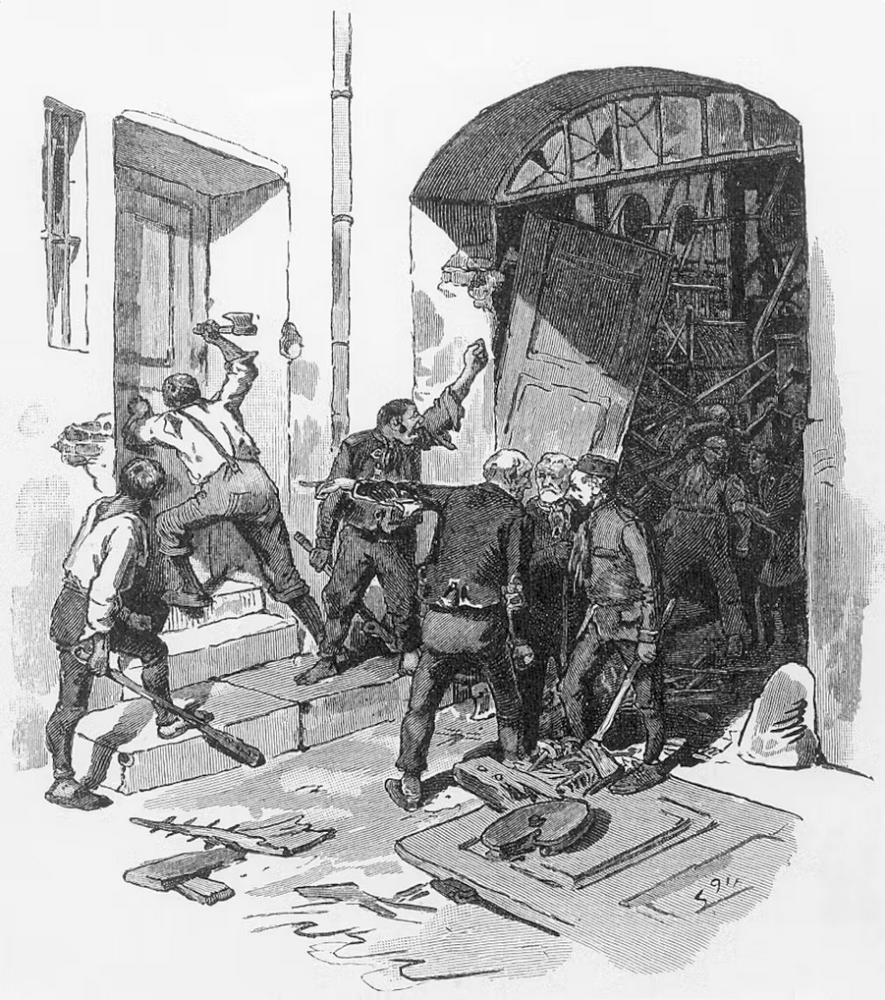
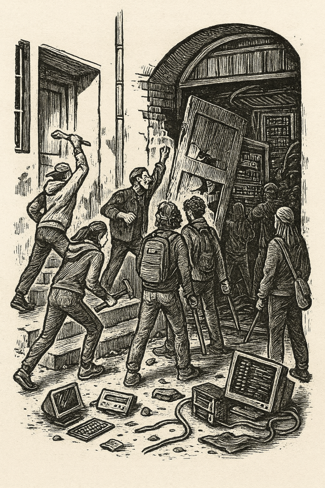

```{r setup, include=FALSE}
knitr::opts_chunk$set(echo = FALSE)
require(haven)
require(data.table)
require(ggplot2)
require(magrittr)
require(ggdag)
require(stringr)
require(ggpubr)
```

# Wrapping Up

## Overview

1. Conclusion
2. Examples
3. Exam Prep

# Conclusions

---

### **Learning Objectives**

<div style="font-size:x-large">

- **Give reasons** for why truth is important in politics.
- **Identify** the types of claims made (implicitly or explicitly) in real-world political discourse.
- **Identify** which of these claims can be subject to scientific scrutiny.
- **Explain** what distinguishes scientific from unscientific forms of evidence.
- **Analyze** real-world descriptive and causal claims about politics and **identify** specific errors with the use of evidence and **explain** *why* these errors occurred.
- **Analyze** real-world causal claims and **identify** the types of causal evidence provided and **explain** the assumptions needed for this evidence to be valid.
- **Apply** these tools of analysis to **explain** how both claims and a critical engagement with the evidence for those claims change their opinion on the issue at hand. 

</div>


---

### **Examples**

>- Should we regulate/limit the use of AI in the workplace?

>- Should we regulate social media content and messages?


---

### **Why Truth?**

1. Instrumental rationality / clarity
2. For power to not be domination: need **informed** consent
3. Building and sharing a world together impossible if we all chase lies

---

### **How do we learn the truth?**

1. What kinds of **claims** are people making?
2. Which of these claims are **empirical** vs. **normative**

---

### **How do we learn the truth?**

**Science**:

- examines **empirical** claims (that speak to normative claims)
- employs evidence that **is capable of showing claims to be wrong** (*severity*)

>- only works with "common sense"... *sensus communis*: perceptions and understandings of the world must be *communicated* with others

---

### Descriptive Claims:

- Concept $\to$ is definition systematic/transparent?
- Variable/validity $\to$ Does variable capture concept? Does choice of variable lead us to support claim even if it is false?
- Measure/measurement error $\to$ Do measurement strategies lead to error? What kind of error? Does this error lead us to support claim even if it is false?

---

### Causal Claims:


- $\color{red}{\text{Counterfactuals}}$ $\to$ Correlation $\to$ Confounding? $\to$ Direction? $\to$ Severity?
- What is the "solution" to confounding used?
- How does it "solve" confounding? (what sources of confounding are removed?)
- What **assumptions** does it make? (Do these assumptions seem plausible?)
- What **trade offs** does it make?

---

### **Practically**

- Is this media or message that I am exposed to attempting to persuade me or change my behavior?
- What is this message attempting to get me to do/believe?
- How does this message attempt to persuade or motivate me?
- Does the message employ claims and evidence?
- What could go wrong with this evidence?
- What would be **better** evidence?


# Applications

## Automation and Wages

[Acemoglu and Restrepo (2022)](https://economics.mit.edu/sites/default/files/2022-10/Tasks%20Automation%20and%20the%20Rise%20in%20US%20Wage%20Inequality.pdf) investigate:

Has automation of work helped or hurt workers?

## Automation and Wages

Data:

- **Exposure to automation** ($X$): industry-level investment in robotics and software and  adoption of these technologies outside the US
- **Wages** ($Y$): Hourly Real Wages for workers.

"Cases": 

- Demographic groups defined by race, age, gender, education levels
- For each group, calculate "exposure to automation" based on the industries they work in
- For each group, calculate hourly real wages


## Automation and Wages

Rather than looking at wages in industries with more automation, or change in wages in the US over time, use a **difference in differences**: 

They compare:

- Change in real wages for demographic groups with **high exposure** to automation between 1980 and 2016 (change in $Y$ for group where $X$ changes)

- Change in real wages for demographic groups with **low/no exposure** to automation between 1980 and 2016 (change in $Y$ for group where $X$ **does not change**)

Assume that **counterfactual trend** in wages for workers exposed to automation **SAME** as **factual trend** in wages for workers **not exposed** to automation.

---


For groups with greater increase in automation exposure, greater decline in wages

## Automation and Wages

Correlation suggestions Automation $\xrightarrow{causes}$ declining wages 

- Can't be confounding due to **unchanging** differences b/t demographic groups, industries
- Can't be confounding due to factors **similarly affecting** all groups (e.g. national/global changes)

For this to be the causal effect of automation, need to believe that wages for workers exposed / not exposed to automation would have been similar without automation...


---


No differences in wage trends **before** automation.

## Automation and Wages

It still could be that **other things** that affect wages changed **differently** for workers exposed to automation than for those who were not.

- Read the paper to see how authors rule out alternatives (e.g. moving manufacturing jobs elsewhere due to trade competition)

---

> "capital takes what it will in the absence of constraints and **technology is a tool that can be used for good or for ill**... Yes, [**during the Industrial Revolution** of the 19th Century] **you got progress**, but you **also had costs** that were huge and very long-lasting. A hundred years of much harsher conditions for working people, lower real wages, much worse health and living conditions, less autonomy, greater hierarchy.  And the reason that we came out of it wasn't some law of economics, but rather a grass roots social struggle in which unions, more progressive politics and, ultimately, better institutions played a key role — and a redirection of technological change away from pure automation also contributed importantly."

- Daron Acemoglu

---

Luddites?

<center></center>

---

Yes... Luddites.

<center></center>

---

Yes... Luddites.

<center></center>


## Trump's Twitter and Hate Crimes

[Mueller and Schwarz (2023)](https://www.aeaweb.org/articles/pdf/doi/10.1257/app.20210211) investigate:

Did Trump's tweeting of anti-Muslim messages **increase** anti-Muslim hate crimes?

## Trump's Twitter and Hate Crimes

Trump's Twitter gained attention as he ran for President.


Made nearly 300 negative tweets about Muslims.

## Trump's Twitter and Hate Crimes

When Trump gained prominence, anti-Muslim hate crimes increased


## Trump's Twitter and Hate Crimes


## Trump's Twitter and Hate Crimes

Compare

- Hate crimes against Muslims ($Y$)
- Twitter-exposed to non-exposed (number of twitter users in a county): different exposure to $X$
- Before and after rise of Trump's Twitter: $X$

## Trump's Twitter and Hate Crimes


Counties with more SXSW Twitter Joiners (treated) see larger increase in hate crimes following rise of Trump's Twitter

## Trump's Twitter and Hate Crimes


Days with Trump **golfing** followed by more hate crimes

## Trump's Twitter and Hate Crimes


Counties with more Twitter user have more hate crimes on days after Trump tweets while **golfing** 


## Trump's Twitter and Hate Crimes

- Can't be confounding due to unchanging differences b/t places with more/fewer Twitter users (same counties over time)
- Can't be confounding due to changing events (compare high/low twitter use counties on the same dates)
- Can't be confounding due to different trends in high/low Twitter counties (use SXSW Twitter joiners)

With reasonable assumptions (no different trends in places with more SXSW  2007 attendees on days when Trump golfs), social media rhetoric causes hate crimes.

# Exam Prep

---

<small>

What explains right-wing radicalization in the United States? Existing research emphasizes demographic changes, economic insecurity, and elite polarization. This paper highlights an additional factor: the impact of foreign wars on society at home. [McAlexander et al (2024)](https://doi.org/10.1017/S0003055423000904) argue communities that bear the greatest costs of foreign wars are prone to higher rates of right-wing radicalization. U.S. military engagements predict surges in membership of far-right organizations as veterans “bring the war home,” and experts note military and law enforcement personnel are disproportionately represented in far-right political organizations. 

To examine this claim, they examine the correlation between fatalities during the US wars in Iraq and Afghanistan and activity on Parler in US counties. Comparing counties with similar population density, % military aged, Republican voting, internet access, education, income, refugee population, racial composition, and military service, they find greater war casualties **increases** Parler video uploads

</small>


---

<smaller>

The green transition should result in far-reaching changes in the labor market. There are new opportunities for “green” jobs related to environmental sustainability, but also entire communities face uncertain futures due to their reliance on the extraction or burning of fossil fuels. Far-right parties have often campaigned against climate change policies. Do right-wing messages against climate change cause workers and communities that rely on jobs with greater emissions to shift their vote toward the right?

To examine this question, [Heddesheimer et al (2025)](https://www.cambridge.org/core/journals/american-political-science-review/article/green-transition-and-political-polarization-along-occupational-lines/5A563C0DBDC283E9111DBD980F1A52C9) examine the case of the AfD (a far-right political party) in Germany. In 2016, the AfD shifted from supporting to opposing a green energy transition. The researchers compare the change in votes for the AfD between 2010-2015 and 2016-2019 among workers in high-carbon emitting industries vs. the change in votes for the AfD among workers in low-carbon emitting industries.

They find that support for the AfD increased **more** among workers in high-emitting industries than among workers in low-emitting industries.


</small>


---

<small>

Social media algorithms profoundly impact our lives: allegedly increasing anger and fear and amplifying political polarization. Yet our understanding of these algorithms’ impact has been limited, as platforms are often unwilling to test (and publish) analyses of these claims. 

[Piccardi et al (2025)](https://doi.org/10.1126/science.adu5584) built a browser extension that intercepted and re-ranked web-based social media feeds. Using an LLM identified content expressing antidemocratic attitudes and partisan animosity, and could then deliver users an altered feed. Then, they recruited 1256 X users during the weeks prior to the 2024 US election. At random, some users had antidemocratic and hostile content placed more highly in their feed, lower in their feed, and had their feed unchanged. All participants were then surveyed about partisan polarization and their emotions.

Compared those whose feeds were unchanged: those with more anti-democratic and hostile content reported greater polarization as well as anger and sadness; those with less of this content reported less polarization and less anger and sadness.


</small>


---

<small>

Many far-right groups’ offline activities—like the insurrection at the US Capitol on January 6, 2021—were organized, in part, online. Do online communication tools, such as Discord or Telegram, facilitate radical political mobilization?

To address this question, [Bailard et al (2024)](https://doi.org/10.1017/S0003055423001478) examined the content of the Proud Boys Telegram channel. They counted the number of messages that identify some problem and/or attribute blame for a problem (diagnostic frames) or that emphasize shared identity and values to justify taking action (motivational frames). They examined changes in the number of violent events involving the Proud Boys before and after increases in diagnostic and motivational messages on Telegram.

They find that there are increases in Proud Boy violence in the week following an uptick in messages on Telegram.


</small>
