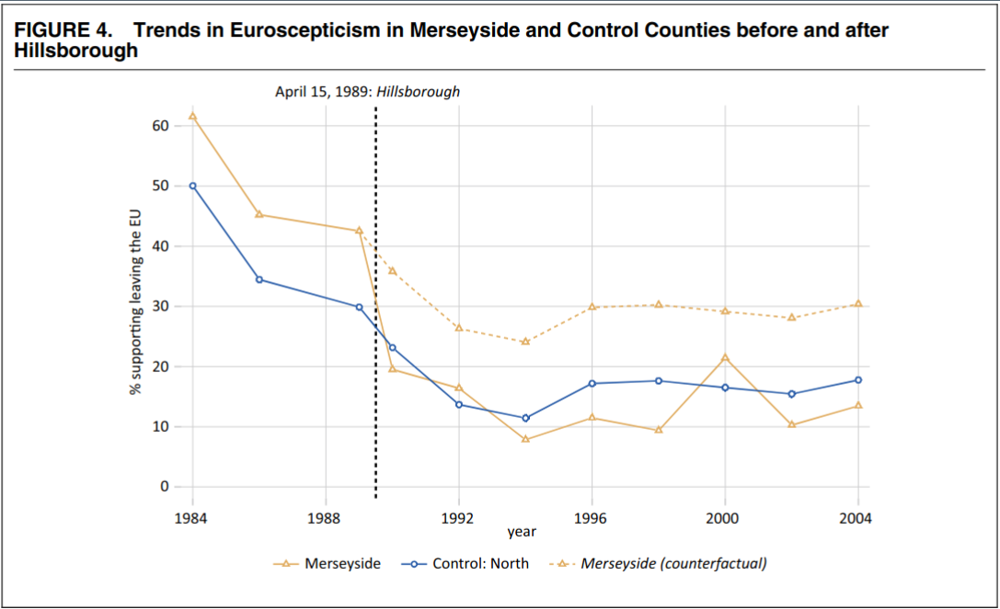
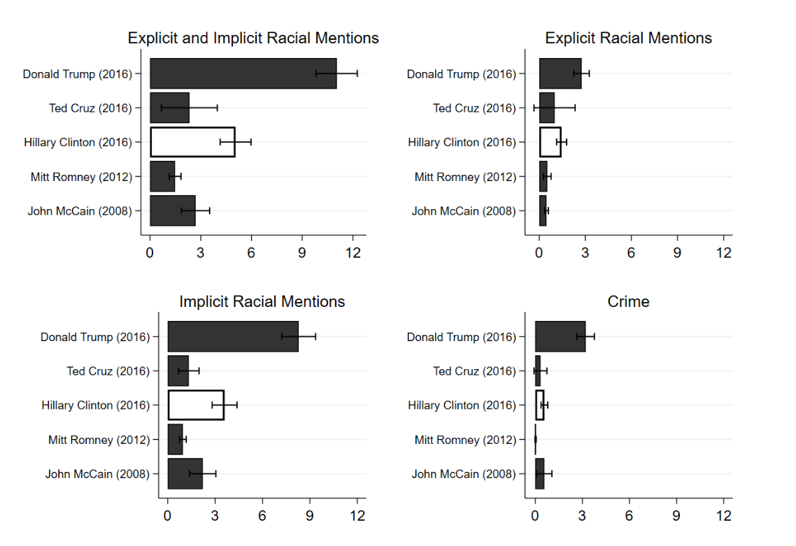
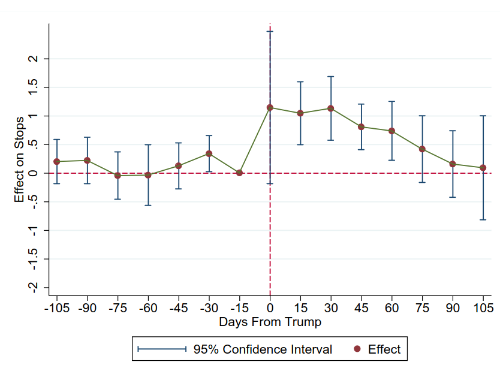
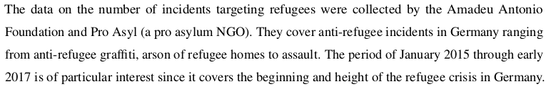
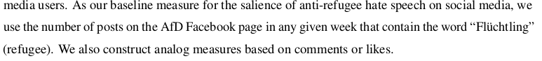

```{r setup, include=FALSE}
knitr::opts_chunk$set(echo = FALSE)
require(haven)
require(data.table)
require(ggplot2)
require(magrittr)
require(ggdag)
require(stringr)
require(ggpubr)
```

# Wrapping Up

## Overview

1. Recap: Solutions to Confounding
2. Final Examples
3. End of Term Plan

# Recap

---

| Solution | How Bias<br>Solved | Which Bias<br>Removed | Assumes | Internal<br>Validity | External<br>Validity |
|--------------------|------------------------------|------------------------------------------------|---------|----------------------|----------------------|
| Experiment | Randomization<br>Breaks $W \rightarrow X$ link | **All** confounding variables | 1. $X$ is random<br> 2. Change only $X$ | Highest | Lowest | 
| Conditioning | Hold confounders<br>constant | Only variables <br> conditioned on | see above  | Lowest | Highest |
| Before and After | Hold confounders <br> constant | variables <br> unchanging <br> over time | No confounders <br> change w/ $X$ | Lower | Higher | 
| Diff in Diff | Hold confounders <br> constant | unchanging and <br> similarly changing | Parallel trends /<br> no differently <br> changing | Higher | Lower | 


## Example: Gun Laws

---

```{r, echo = F, message=F, warning=F}
guns = fread('./results.csv', integer64 = 'double') %>%
       .[!is.na(Year)] 
guns[, gun_rate := as.numeric(`Age-Adjusted Rate`)]

border = c("Illinois", "Iowa", "Nebraska", "Kansas", "Oklahoma", "Arkansas", "Tennessee", "Kentucky")
guns_use = guns[State %in% c("Missouri", "Arkansas")]
guns_use[, States := ifelse(State %in% border, "Border", "Missouri")]
```

```{r, echo = F, message=F, warning=F}

p_data = guns_use[Year %in% 1999:2012 & State %in% c("Missouri", "Arkansas"), list(State, Year, gun_rate, Trend = 'factual')]

cf_data = guns_use[Year %in% 2007:2012 & State %in% c("Missouri"), list(State, Year, gun_rate, Trend = 'counterfactual')]
ar_diff = p_data[, gun_rate[9:14] - gun_rate[9]]
mo_2007 = p_data[, gun_rate[23]]
#mo_post = p_data[, gun_rate[4]]

cf_data[, gun_rate := mo_2007 + ar_diff]

plot_data = rbind(p_data, cf_data[State %in% "Missouri"])
plot_data[, Trend := factor(Trend, levels = c("factual", "counterfactual"))]
ggplot(plot_data, aes(x = Year, y = gun_rate, color = State, linetype = Trend)) +
  geom_line() +
  geom_point() +
  geom_vline(xintercept = 2007.5, linetype = 2, colour= 'red') +
  theme_bw() +
  ylim(0,7) +
  scale_x_continuous(breaks=c(1999:2012)) + 
  ylab("Firearms Homicide Rate") +
  ggtitle("Firearms Homicide Rate:", subtitle = "Missouri and Arkansas, before and after Missouri PTP repeal") + 
  theme(legend.position = 'bottom')
```

## Difference-in-Differences

For all "solutions to confouding", the expectation is you can:

1. Asked to give an example of that solution, provide a general description
2. Correctly identify what solution is used in an example.
3. Recognize or think of possible confounding variables that are removed by this solution
4. Describe the assumptions we need to make in order to believe it is evidence of causality

# Last Examples:

## Media Effects on Political Attitudes

Social and political theorists have frequently argued that media---by shaping perceptions of events in the world, exposing people to narrative frames---affects beliefs and behaviors.

>- What might be some obstacles to evaluating the **causal** effect of media exposure?
>- Why might **experiments** be a poor strategy?
>- Why might **conditioning** not work very well?

## Media Effects on Political Attitudes


Foos and Bischoff examine the effect of changing exposure to *The Sun* on anti-EU attitudes and voting in the UK.

- *The Sun* is a tabloid with long-standing anti-EU coverage and editorial slant
- In 1989, ~100 fans of Liverpool FC died in stampede at a match; *The Sun* blamed the victims for the tragedy
- Boycott of the *The Sun* by fans and teams in the Liverpool area.

---

### Conditioning?

We could ignore this shift, and simply compare attitudes about the EU in areas (or among people) with greater vs less readership of *The Sun*:

- What might be some reasons to doubt the effectiveness of this approach?

---

### Before and After?

We could instead, compare attitudes toward the EU in Liverpool **before and after** the boycott:

- What might some advantages of this be?

>- Block **all** confounding variables that remain **constant** over time within Liverpool 
>- Advantage: No need to know what these variables are, measure them, specify a model, etc.

---

### Difference in Differences

In our example: we **don't know** how EU skepticism might have trended in Liverpool absent the boycott. But we **do know** how  EU skepticism in *the rest of the UK* trended absent the boycott.

---




## Media Effects on Political Attitudes

This shows that the Boycott of the *Sun* reduced Euro Skepticism in Liverpool

- Under the **parallel trends assumption** (untreated cases have the same *trends* as treated cases *in the absence of treatment*)
- This is an unbiased estimate of the **Average Treatment on Treated** ($ATT$):

  - the effect of treatment on the **treated** cases
  - it is TOTALLY fine if the effect of treatment on untreated cases would be different


## Trump Rallies and Police Bias

[Grosjean et al (2023)](https://doi.org/10.1093/qje/qjac037) investigate:

Did Trump's messaging at rallies affect police discrimination against racial minorities?

---



## Trump Rallies and Police Bias

Data:

- ~35 million police stops between 2015-2017 in 1474 counties, including race of person stopped
  - racial bias measured as different rate of stopping racial minorities vs whites
- Campaign rally location and dates


## Trump Rallies and Police Bias {.build}

**What might be some confounding variables if we just compared police bias in counties with rallies vs. no rallies?**

**What might be some confounding variables if we just compared police bias in counties before and after rallies?**

## Trump Rallies and Police Bias 

Authors can solve these problem using a **difference-in-differences**:

- were the changes in police discrimination **greater** in places  **with Trump Rallies** ("treated") than in places without **without Rallies** ("untreated")

## Trump Rallies and Police Bias 



Comparing $\text{Rallies} - \text{No Rallies}$


## Trump Rallies and Police Bias 

- Can't be confounding due to unchanging differences b/t places visited/not visited by Trump
- Can't be confounding due to changing national events (compare rally/no rally places on the same dates)
- Can't be confounding due to changing behavior of minorities (show no changes)
- Unlikely to be differently changing confounding, because of short timeframe

With reasonable assumptions (no different trends over a few weeks in places with rallies and without rallies), rallies cause police discrimination.

## Social Media and Hate Crime

## Example: Facebook and Hate Crime

### [**Mueller and Schwarz (2020)**](https://dx.doi.org/10.2139/ssrn.3082972) ask:

<br>

#### **Is social-media hate speech related to real-world violence?**

<br>

- Are there higher levels of **anti-refugee** violence in places with more exposure to social media in weeks with more social media anti-refugee hate speech?
- Address this question in the context of Germany (2015-2017)

## Example: Facebook and Hate Crime

**variable**: Attacks against refugee persons and property

<br>

**measure**: (for each week in each municipality)

<br>




## Example: Facebook and Hate Crime

**variable**: Number of anti-refugee posts on Facebook per week

<br>

**measure**:

<br>



---

```{r, echo = F, warning=F, message=F}

mueller = fread('./mueller_data.csv')

plot_data = mueller[, list(attack = mean(refugee_attacks_d), n = .N), by = list(ref_post)]

ggplot(plot_data, aes(x = ref_post, y = attack, size = n, weight = n)) + 
  geom_point() +
  geom_smooth() + 
  theme_bw() +
  theme(legend.position = 'none') +
  xlab("Anti Refugee FB Posts") +
  ylab("Anti-Refugee Attacks (Probability)") + 
  ggtitle("Facebook Hate Speech and Refugee Attacks\nAcross Germany by Week")
```

Is it plausible that nothing other than anti-refugee FB posts is changing over time?

## Example: Natural Experiment

Could be events that drive anti-refugee posts and hate crimes...

Mueller and Schwarz come up with "random" assignment to "treated" and "untreated" municipalities.

>- Internet outages reduce exposure to Facebook.
>- Communities with internet outages in the same week are "untreated" by Facebook hate speech, effectively random

---

```{r, echo = F, warning=F, message=F}
mueller[, outage_100 := any((internet_outage_p75 %in% 1) & (ref_post > 100)), by = kreis_code]
plot_data = mueller[(outage_100) & ref_post > 100, list(attack = refugee_attacks_d * 100), list(kreis_code, internet_outage_p75)]
plot_data[, `Internet Outage` := ifelse(internet_outage_p75, "Yes", "No")]


ggplot(plot_data[!is.na(internet_outage_p75)], aes(x = `Internet Outage`, y = attack)) + 
  stat_summary(fun.data = mean_cl_normal,  
                 geom = "errorbar") +
  stat_summary(fun = mean,  
                 geom = "point") +
  theme_bw() +
  xlab("Internet Outage") +
  ylab("Anti-Refugee Attacks (% Probability)") + 
  ggtitle("Refugee Attacks and Internet Outages\nin weeks with Many Widespread Facebook Hate Speech")
```


# Conclusions

## Value of Science

All ways of knowing require assumptions, only science leaves (in principle) all assumptions open to challenge

- Making assumptions explicit is the strength of scientific thinking

## Value of Science

If we want know: 

What is the state of the world? Are there problems we have to address? What should we do about those problems?

We can use scientific evidence, along with our value judgments, to answer these questions.

## Value of Science

If humans are to be capable of self-government, of participating in rule...

- we need to know what complex causal forces act upon us, and their consequences
- and, perilously, these very same economic, political, and social processes **undermine** our ability to know

## Value of Science

Tools of social scientific thinking do not guarantee success, but they are necessary 
