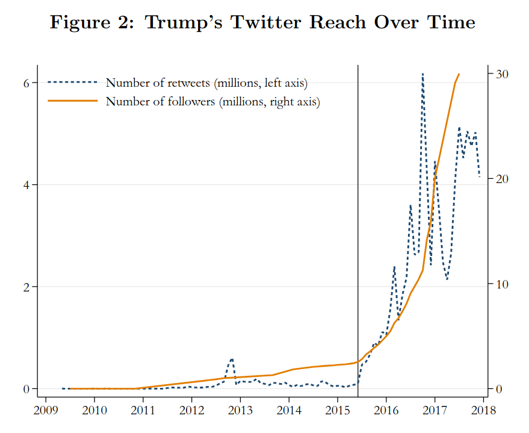
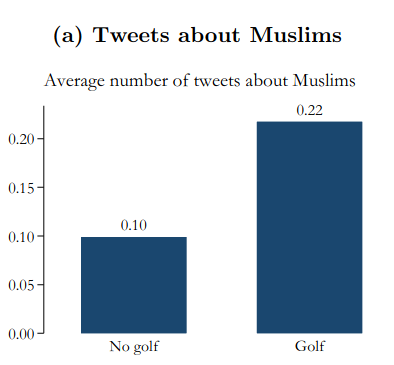
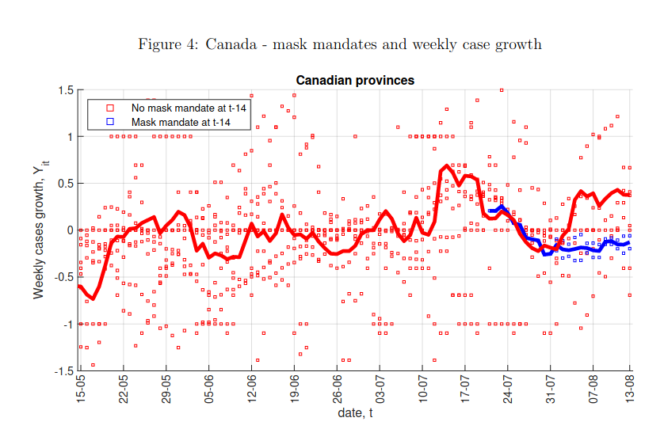
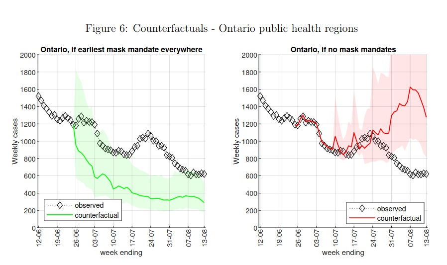

```{r setup, include=FALSE}
knitr::opts_chunk$set(echo = FALSE)
require(haven)
require(data.table)
require(ggplot2)
require(magrittr)
require(ggdag)
require(stringr)
require(ggpubr)
```

# Wrapping Up

## Overview

1. Recap: Solutions to Confounding
2. Last Examples
3. End of Term Plan

# Recap

---

| Solution | How Bias<br>Solved | Which Bias<br>Removed | Assumes | Internal<br>Validity | External<br>Validity |
|--------------------|------------------------------|------------------------------------------------|---------|----------------------|----------------------|
| Experiment | Randomization<br>Breaks $W \rightarrow X$ link | **All** confounding variables | 1. $X$ is random<br> 2. Change only $X$ | Highest | Lowest | 
| Conditioning | Hold confounders<br>constant | Only variables <br> conditioned on | 1. Condition on all confounders <br> 2. Low measurement error | Lowest | Highest |
| Before and After | Hold confounders <br> constant | variables <br> unchanging <br> over time | No confounders <br> change w/ $X$ | Lower | Higher | 
| Diff in Diff | Hold confounders <br> constant | unchanging and <br> similarly changing | Parallel trends /<br> no differently <br> changing | Higher | Lower | 


## Example: Gun Laws

---

```{r, echo = F, message=F, warning=F}
guns = fread('./results.csv', integer64 = 'double') %>%
       .[!is.na(Year)] 
guns[, gun_rate := as.numeric(`Age-Adjusted Rate`)]

border = c("Illinois", "Iowa", "Nebraska", "Kansas", "Oklahoma", "Arkansas", "Tennessee", "Kentucky")
guns_use = guns[State %in% c("Missouri", "Arkansas")]
guns_use[, States := ifelse(State %in% border, "Border", "Missouri")]
```

```{r, echo = F, message=F, warning=F}

p_data = guns_use[Year %in% 1999:2012 & State %in% c("Missouri", "Arkansas"), list(State, Year, gun_rate, Trend = 'factual')]

cf_data = guns_use[Year %in% 2007:2012 & State %in% c("Missouri"), list(State, Year, gun_rate, Trend = 'counterfactual')]
ar_diff = p_data[, gun_rate[9:14] - gun_rate[9]]
mo_2007 = p_data[, gun_rate[23]]
#mo_post = p_data[, gun_rate[4]]

cf_data[, gun_rate := mo_2007 + ar_diff]

plot_data = rbind(p_data, cf_data[State %in% "Missouri"])
plot_data[, Trend := factor(Trend, levels = c("factual", "counterfactual"))]
ggplot(plot_data, aes(x = Year, y = gun_rate, color = State, linetype = Trend)) +
  geom_line() +
  geom_point() +
  geom_vline(xintercept = 2007.5, linetype = 2, colour= 'red') +
  theme_bw() +
  ylim(0,7) +
  scale_x_continuous(breaks=c(1999:2012)) + 
  ylab("Firearms Homicide Rate") +
  ggtitle("Firearms Homicide Rate:", subtitle = "Missouri and Arkansas, before and after Missouri PTP repeal") + 
  theme(legend.position = 'bottom')
```

## Example: Gun Laws

Expectation is you can answer:

- What kind of solution to confounding?
- What kinds of confounding does it eliminate? 
- What do we have to assume in order to believe it is evidence of causality?

# Last Examples:

## Trump's Twitter and Hate Crimes

[Mueller and Schwarz (2020)](https://papers.ssrn.com/sol3/papers.cfm?abstract_id=3149103) investigate:

Did Trump's tweeting of anti-Muslim messages **increase** anti-Muslim hate crimes?

## Trump's Twitter and Hate Crimes

We can't observe the US in the absence of Trump tweeting against Muslims, so authors use correlation...

## Trump's Twitter and Hate Crimes

Trump's Twitter gained attention as he ran for President.



Trump made nearly 300 negative tweets about Muslims.


## Trump's Twitter and Hate Crimes

When Trump gained prominence, anti-Muslim hate crimes increased


## Trump's Twitter and Hate Crimes


## Trump's Twitter and Hate Crimes

Even comparing US to itself over time...

- could be that something **other than Trump's Twitter changed**
- Days with more Trump Tweets could be different in other ways

## Trump's Twitter and Hate Crimes


Counties with more SXSW Twitter Joiners (treated) see larger increase in hate crimes following rise of Trump's Twitter

## Trump's Twitter and Hate Crimes



Days with Trump **golfing** followed by more hate crimes

## Trump's Twitter and Hate Crimes

- Can't be confounding due to unchanging differences b/t places with more/fewer Twitter users (same counties over time)
- Can't be confounding due to changing events (compare high/low twitter use counties on the same dates)
- Can't be confounding due to different trends in high/low Twitter counties (use SXSW Twitter joiners)

With reasonable assumptions (no different trends in places with more SXSW  2007 attendees on days when Trump golfs), social media rhetoric causes hate crimes.

## Mask Mandates

[Karaivanov et al (2020)](https://www.nber.org/system/files/working_papers/w27891/w27891.pdf), economists at SFU, investigate:

> Have indoor mask mandates reduced COVID cases, on average?

## Mask Mandates





## Mask Mandates

Could be that mask mandates...

- happen in places with different socio-economic conditions
- imposed in places with upward trends

## Mask Mandates

Karaivanov et al use a variation on Difference in Difference...

- Difference in Difference assumes nothing is **changing differently** between places adopting mask mandate vs not
- But if mask mandate places 

    - adopt other policy changes
    - have more upward trending caseloads $\to$ people start changing behavior
    - Then no "parallel trends"
    
    
## Mask Mandates

Karaivanov et al address confounding by variables that change over time differently...

- difference-in-difference to Ontario PHU that are **similar in their trends** in COVID cases, stay-at-home behavior, and other public health policies.

## Mask Mandates

Estimate counterfactual world...



# Fin

## Key Lessons

Know what kinds of questions to ask about

- Defining concepts/variables, measuring/sampling error
- What causality is, why it is hard to prove
- What kinds of assumptions we must make to prove causality
- Demanding transparent, systematic evidence that considers alternatives

### Can better answer "**what should we do?**"
