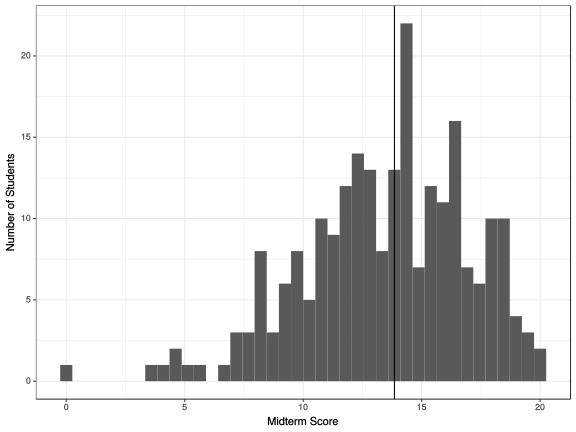
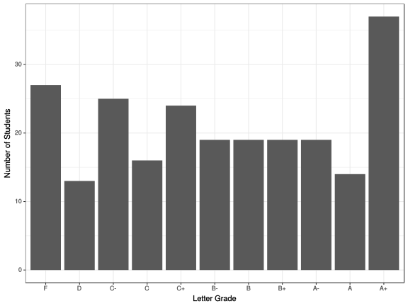

```{r setup, include=FALSE}
knitr::opts_chunk$set(echo = FALSE)
require(knitr)
require(data.table)
require(ggplot2)
require(ggdag)
require(magrittr)
```

<style>
div.footnotes {
  position: absolute;
  bottom: 0;
  margin-bottom: 10px;
  width: 80%;
  font-size: 0.6em;
}
</style>

<script src="https://ajax.googleapis.com/ajax/libs/jquery/3.1.1/jquery.min.js"></script>

<script>
  $(document).ready(function() {
    $('slide:not(.backdrop):not(.title-slide)').append('<div class=\"footnotes\">');

    $('footnote').each(function(index) {
      var text  = $(this).html();
      var fnNum = (index+1).toString().sup();
      $(this).html(text + fnNum);

      var footnote   = fnNum + ': ' + $(this).attr('content') + '<br/>';
      var oldContent = $(this).parents('slide').children('div.footnotes').html();
      var newContent = oldContent + footnote;
      $(this).parents('slide').children('div.footnotes').html(newContent);
    });
  });
</script>

# Testing Causal Theories

## Plan for Today:

### **(1) Midterm Results**


### **(2) Correlation**

- confounding (again)
- correlation

# Midterm Grades

## Distribution of Scores



## Distribution of Grades



## Grade Scaling?

### **No scaling of grades**

- solving "fat tail" would distort upper end of distribution

### **Option to Re-Weight**

- Commitment NOW to re-weight midterm to final  (no "take-backs")
- In principle, open to ANYONE

# Correlation

## Evidence for Causality

#### **Internal Validity**

A research design has **internal validity** when the **observed relationship** between  $X$ and $Y$ it finds is not a biased (systematically incorrect) estimate of the causal effect of $X$ on $Y$ (does not suffer from **confounding**).

#### **External Validity:**

Research design has **external validity** when the $X$ and $Y$ we examine match the causal theory and the cases we study match the set of cases/population the causal theory is supposed to describe

- If our study suffers from **sampling bias** $\to$ lack of **external validity**
- If our independent variable/dependent variables do not match the theory $\to$ lack of **external validity**

## Beyond Experiments:

Recall what hypotheses say: If $X$ causes $Y$

> We should observe that as $X$ changes, the potential outcomes of $Y$ change.

But FPCI says we can only ever see one potential outcome per case.

We always examine the relationship between the **observed** $X$ and the **observed** $Y$

- true in experiments
- true in any kind of causal investigation

## Beyond Experiments:

To **infer** a causal relationship between $X$ and $Y$ based on relationship between the **observed** $X$ and the **observed** $Y$, one of the following must be true

1. potential outcomes of $Y$ (the way cases behave when exposed to different levels of $X$) are the same for cases with different values of $X$ 
2. (identically) other factors that affect $Y$ (call them $W,Z,etc.$) are the same across/unrelated to different levels of $X$ (this is saying we have an absence of **confounding**) in the cases we compare.

## Beyond Experiments:

All "solutions" to the FPCI make assumptions about the **cases we compare** that allow us to accept one of these two points (previous slide), so we can infer causality from how observed values of $X$ and $Y$ are related.

- Experiments only look at observed values of $X$ and $Y$, but we can claim causality because we assume random assignment

## Beyond Experiments: Digression

We want to know whether having fewer guns reduces suicide, accidents, and aggressive uses of guns.

Imagine the following experiment: 

> We collect data on legal gun owners. We randomly assign half of them to receive a letter from the government that offers to pay them money to hand over their guns (a gun buyback). The other half receives no letter. We then compare suicide rates, accident rates, and gun victimization rates among the friends and families of **people who handed over their guns** against **people who did not hand over their guns**. We observe that suicide, accident, and gun victimization rates were lower in the "give-up-guns" group. Can we infer that having fewer guns **caused** a reduction?

## Correlation

#### **correlation**: 

degree of association or relationship between the **observed** values taken by two variables ($X$ and $Y$)

- Many different ways of doing this (compare group means, regression) are all fundamentally about correlation.
- correlations have a **direction**:
    - positive: implies that as $X$ increases, $Y$ increases
    - negative: $X$ increases, $Y$ decreases
- correlations have **strength** (has nothing to do **size of effect**):
    - **strong**: $X$ and $Y$ almost **always** move together 
    - **weak**: $X$ and $Y$ do not move together very much
- There is also a **technical** definition of correlation (later)

## 


But with some assumptions: correlation $\to$ causation

## Correlation

To understand assumptions, need to know what problems arise

### **Two types of problems**

- **bias** (spurious correlation, **confounding**): $X$ and $Y$ are correlated but the correlation does not result from **causal relationship** between those variables

- **random association**: correlations between $X$ and $Y$ occur **by chance** and do not reflect 

## Correlation: Bias/Confounding?

```{r, echo = F}
crime = fread('./crime.csv')
crime[, gun_ownership := as.numeric(gsub('%', '', gun_ownership))]
crime = crime[gun_murder_percapita<10,]
c = cor.test(crime$gun_ownership, crime$gun_murder_percapita)

plot(crime$gun_ownership, crime$gun_murder_percapita, xlab = "Gun Owners (%)", ylab = "Firearms Homicides Per Capita",
     main = 'No/Negative effect of gun ownership\n on Gun Homicide?')
abline(lm(gun_murder_percapita ~ gun_ownership, data=crime))
```

## Confounding (again)

**confounding** occurs when some other variable $W$ is causally linked to $X$ (independent variable) *and* $Y$ (dependent variable).

#### **or if we diagram**

If we diagram causal links between variables using this notation:  $X \to Y$ implies $X$ causes $Y$, then...

**confounding** occurs when there is a path between $X$ and $Y$ that is **non-causal** (goes the "wrong way" on at least one arrow)

## Confounding (again)

```{r, echo = F}
dagify(X ~ W,
       Y ~ W, 
       exposure = "X", 
       outcome = 'Y',
       latent = 'W') %>%
  ggdag(layout = 'tree')
```

## Confounding (again)

```{r, echo = F}
dagify(guns ~ hunting,
       popden ~ rural,
       crime ~ popden,
       hunting ~ rural,
       crime ~ guns, 
       exposure = "guns", 
       outcome = 'crime',
       labels = c('guns' = "Gun Ownership", 
                  'rural' = 'Rural Population',
                  'crime' = "Crime Rate",
                  'hunting' = 'Hunting',
                  'popden' = 'Population Density')) %>%
  ggdag_paths(layout = 'tree', text = F, use_labels = 'label') + 
  theme(legend.position = 'none')
```

## Confounding (again)

**Do *all* third variables create confounding/bias?**

### No.

$W$ produces no confounding under the following conditions:

1. $W$ is unrelated to $X$ or $Y$
2. $W$ is an **antecedent** variable
3. $W$ is an **intervening** variable

## Confounding (again)

**intervening variable**: a variable **through which** $X$ causes $Y$

- Intervening variables **do not** produce spurious correlations

$$X \rightarrow W \rightarrow Y$$

## Intervening Variable

```{r, echo = F}
dagify(fear ~ hate_speech,
       violence ~ fear,
       exposure = "hate_speech", 
       outcome = 'violence',
       labels = c('fear' = "Fear of Refugees", 
                  'violence' = 'Anti-Refugee Violence',
                  'hate_speech' = "Anti-Refugee Social Media (X)")) %>%
  ggdag_paths(layout = 'tree', text = F, use_labels = 'label') + 
  theme(legend.position = 'none')
```

## Antecedent Variable

**antecedent variable**: a variable that **affects** $Y$ **only through** $X$

- antecedent variables **do not** produce spurious correlations if they only affect $Y$ through $X$

$$Z \rightarrow X \rightarrow Y$$

$Z$ is **intervening variable**


## Antecedent Variable: OK

```{r, echo = F}
dagify(
       earnings ~ military,
       military ~ draft,
       exposure = "military", 
       outcome = 'earnings',
       labels = c('military' = "Military Service (X)", 
                  'earnings' = 'Job Earnings',
                  'draft' = "Draft Eligibility")) %>%
  ggdag(layout = 'tree', text = F, use_labels = 'label') + 
  theme(legend.position = 'none')
```

## Antecedent Variable: A Problem

```{r, echo = F}
dagify(
       earnings ~ military,
       military ~ draft,
       canada ~ draft,
       earnings ~ canada,
       exposure = "military", 
       outcome = 'earnings',
       labels = c('military' = "Military Service (X)", 
                  'earnings' = 'Job Earnings',
                  'draft' = "Draft Eligibility",
                   'canada' = "Draft Dodging")) %>%
  ggdag_paths(layout = 'tree', text = F, use_labels = 'label') + 
  theme(legend.position = 'none')
```

## Next Time:

### **DIRECTION OF BIAS**

### **RANDOM ASSOCIATION**