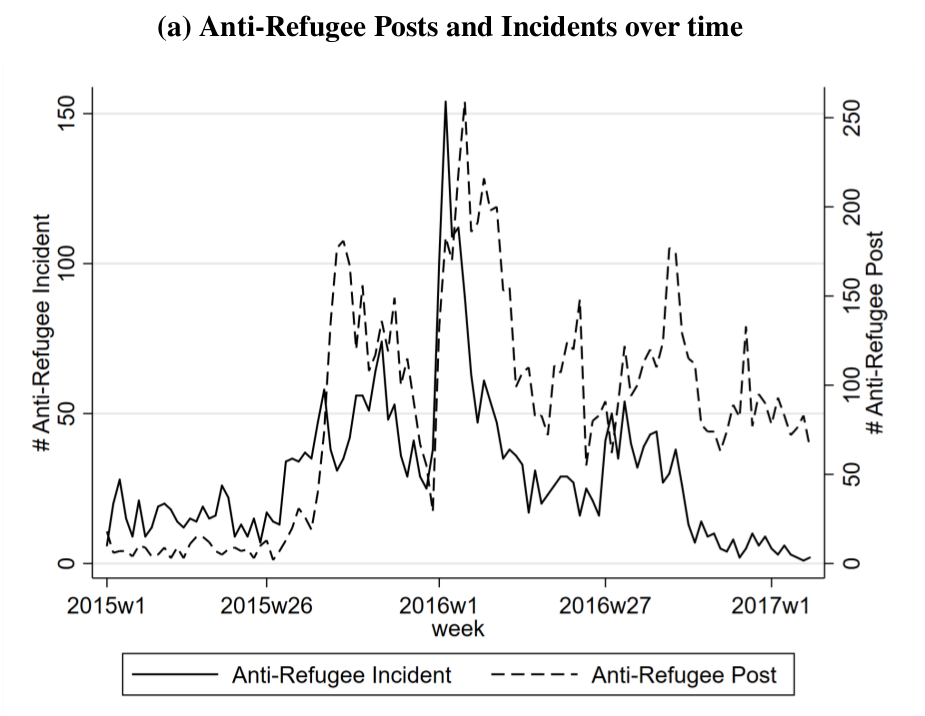

```{r setup, include=FALSE}
knitr::opts_chunk$set(echo = FALSE)
require(knitr)
require(data.table)
require(ggplot2)
require(ggdag)
require(magrittr)
```

<style>
div.footnotes {
  position: absolute;
  bottom: 0;
  margin-bottom: 10px;
  width: 80%;
  font-size: 0.6em;
}
</style>

<script src="https://ajax.googleapis.com/ajax/libs/jquery/3.1.1/jquery.min.js"></script>

<script>
  $(document).ready(function() {
    $('slide:not(.backdrop):not(.title-slide)').append('<div class=\"footnotes\">');

    $('footnote').each(function(index) {
      var text  = $(this).html();
      var fnNum = (index+1).toString().sup();
      $(this).html(text + fnNum);

      var footnote   = fnNum + ': ' + $(this).attr('content') + '<br/>';
      var oldContent = $(this).parents('slide').children('div.footnotes').html();
      var newContent = oldContent + footnote;
      $(this).parents('slide').children('div.footnotes').html(newContent);
    });
  });
</script>

# Testing Causal Theories

## Plan for Today:

### **(1) Correlation**

- correlation
- confounding (with diagrams)
- reverse causality
- direction of bias
- relationships that are NOT confounding
    - antecedent variables
    - intervening variables

## Correlation

#### **correlation**: 

degree of association or relationship between the **observed** values taken by two variables ($X$ and $Y$)

- Many different ways of doing this (compare group means, regression) are all fundamentally about correlation.
- correlations have a **direction**:
    - positive: implies that as $X$ increases, $Y$ increases
    - negative: $X$ increases, $Y$ decreases
- correlations have **strength** (has nothing to do **size of effect**):
    - **strong**: $X$ and $Y$ almost **always** move together 
    - **weak**: $X$ and $Y$ do not move together very much
- There is also a **technical** definition of correlation (later)

## Correlation

To infer causality from correlation, need to know what problems we have to assume are absent

### **Two types of problems**

- <u>**bias**</u> (spurious correlation, **confounding**): $X$ and $Y$ are correlated but the correlation does not result from **causal relationship** between those variables

- **random association**: correlations between $X$ and $Y$ occur **by chance** and do not reflect 

## Confounding (again)

**confounding** occurs when some other variable $W$ is causally linked to $X$ (independent variable) *and* $Y$ (dependent variable).

#### **or if we diagram**

If we diagram causal links between variables using this notation:  $X \to Y$ implies $X$ causes $Y$, then...

**confounding** occurs when there is a path between $X$ and $Y$ that is **non-causal** (goes the "wrong way" on at least one arrow)


## Confounding (Diagram)

```{r, echo = F}
dagify(x ~ w,
       y ~ w,
       y ~~ x,
       exposure = "x", 
       outcome = 'y'
       ) %>%
tidy_dagitty(layout='tree') %>%
ggplot(aes(x = x, y = y, xend = xend, yend = yend)) +
  geom_dag_node() +
  geom_dag_edges_link(mapping = aes(label = c('Increases', 'Increases', 'Spurious Correlation\n(Positive)', '')), 
                      angle_calc = "along", 
                      label_dodge = unit(c(-1,1,-1),'lines'), 
                      edge_linetype = rep(c(1,1,3), each = 100),
                      arrow = grid::arrow(length=grid::unit(c(10,10,0), 'pt'), type = 'closed')) +
  geom_dag_text(colour = 'white') +
  theme_dag() +
  scale_dag()
```

## Correlation: Bias/Confounding?

```{r, echo = F}
crime = fread('./crime.csv')
crime[, gun_ownership := as.numeric(gsub('%', '', gun_ownership))]
crime = crime[gun_murder_percapita<10,]
c = cor.test(crime$gun_ownership, crime$gun_murder_percapita)

plot(crime$gun_ownership, crime$gun_murder_percapita, xlab = "Gun Owners (%)", ylab = "Firearms Homicides Per Capita",
     main = 'No/Negative effect of gun ownership\n on Gun Homicide?')
abline(lm(gun_murder_percapita ~ gun_ownership, data=crime))
```

## Confounding (again)

```{r, echo = F}
dagify(guns ~ hunting,
       popden ~ rural,
       crime ~ popden,
       hunting ~ rural,
       crime ~ guns, 
       exposure = "guns", 
       outcome = 'crime',
       labels = c('guns' = "(X) Gun\nOwnership", 
                  'rural' = 'Rural\nPopulation',
                  'crime' = "(Y) Crime\nRate",
                  'hunting' = 'Hunting',
                  'popden' = 'Population\nDensity')) %>%
  tidy_dagitty(layout='tree') %>%
ggplot(aes(x = x, y = y, xend = xend, yend = yend)) +
  #geom_dag_node() +
  geom_dag_edges_link(mapping = aes(label = c('downward bias', 'increases', 'increases', 'increases', 'decreases', '')),  angle_calc = "along", label_dodge = unit(c(1,-1,1,-1,1),'lines')) +
  geom_dag_text(mapping = aes(label = label), colour = 'black') +
  theme_dag() +
  scale_dag()
```

## Confounding (again)

```{r, echo = F}
dagify(guns ~ hunting,
       popden ~ rural,
       crime ~ popden,
       hunting ~ rural,
       crime ~ guns, 
       exposure = "guns", 
       outcome = 'crime',
       labels = c('guns' = "(X) Gun\nOwnership", 
                  'rural' = 'Rural\nPopulation',
                  'crime' = "(Y) Crime\nRate",
                  'hunting' = 'Hunting',
                  'popden' = 'Population\nDensity')) %>%
ggdag_paths(layout = 'tree', text = T, text_col = 'black') + 
  theme(legend.position = 'none')

```


## Confounding: (Another Example)

#### **Causal claim:**

**Anti-refugee hate speech on social media causes anti-refugee violence?**

#### **Causal theory**

hate-speech $\to$ increase perceived threat $\to$ decrease acceptance of refugees $\to$ violence perceived as justified $\to$ violence

#### **variables**

**IV**: exposure to anti-refugee statements on Facebook; **DV**: incidents of violence against refugees

#### **Hypothesis**

Increase **exposure to anti-refugee content** online associated with increase in **violence against refugees**

## Confounding: (Another Example)

### **Mueller and Schwarz (2018)**

**Test this hypothesis in Germany (2015-2017)**:

- Observe **anti-refugee content**  on AfD Facebook page (overtime)
- Observe **anti-refugee violence** reported (overtime)

### What is the correlation?

- Should expect **positive** correlation

---



**Are they correlated?**

---


**Can you infer causality?**

## Confounding: (Another Example)

```{r, echo = F}
dagify(violence ~ hate,
       hate ~ att,
       threat ~ event,
       violence ~ threat,
       att ~ event,
       exposure = "guns", 
       outcome = 'crime',
       labels = c('hate' = "(X) Hate Speech", 
                  'event' = 'Refugee\nControversy',
                  'violence' = "(Y) Violence",
                  'att' = 'Anti-Refugee\nAttitude',
                  'threat' = 'Perceived\nThreat')) %>%
  tidy_dagitty(layout='tree') %>%
ggplot(aes(x = x, y = y, xend = xend, yend = yend)) +
  #geom_dag_node() +
  geom_dag_edges_link(mapping = aes(label = c('increases', 'increases', 'increases', 'Bias\n(upward)', 'increases', '')),  
                                    angle_calc = "along", label_dodge = unit(c(-1,-1,1,1,1),'lines'),
                                    edge_linetype = rep(c(1,1,1,3,1), each = 100),
                                    arrow = grid::arrow(length=grid::unit(c(10,10,10,0,10), 'pt'), type = 'closed')
                                    ) +
  geom_dag_text(mapping = aes(label = label), colour = 'black') +
  theme_dag() +
  scale_dag()
```

## Confounding: (Another Example)

```{r, echo = F}
dagify(violence ~ hate,
       hate ~ att,
       threat ~ event,
       violence ~ threat,
       att ~ event,
       exposure = "hate", 
       outcome = 'violence',
       labels = c('hate' = "(X) Hate Speech", 
                  'event' = 'Refugee\nControversy',
                  'violence' = "(Y) Violence",
                  'att' = 'Anti-Refugee\nAttitude',
                  'threat' = 'Perceived\nThreat')) %>%
  tidy_dagitty(layout='tree') %>%
ggdag_paths(layout = 'tree', text = T, text_col = 'black') + 
  theme(legend.position = 'none')
```

## Confounding: (Reverse Causality)

```{r, echo = F}
dagify(hate ~ bold,
      violence ~ bold,
       violence ~ hate,
       exposure = "hate", 
       outcome = 'violence',
      labels = c('hate' = "(X) Hate Speech", 
                  'violence' = "(Y) Violence",
                  'bold' = 'Embolden\nFar Right')
       ) %>%
tidy_dagitty(layout='tree') %>%
ggplot(aes(x = x, y = y, xend = xend, yend = yend)) +
  #geom_dag_node() +
  geom_dag_edges_link(mapping = aes(label = c('Increases', 'Increases', 'Spurious Correlation\n(Positive)', '')), 
                      angle_calc = "along", 
                      label_dodge = unit(c(-1,1,-1),'lines'), 
                      edge_linetype = rep(c(1,1,3), each = 100),
                      arrow = grid::arrow(length=grid::unit(c(10,10,0), 'pt'), type = 'closed', ends = c('last','first','last'))) +
  geom_dag_text(mapping = aes(label = label), colour = 'black') +
  theme_dag() +
  scale_dag()
```


## Reverse Causation

Does $X$ cause $Y$? Or does $Y$ cause $X$

**reverse causation**: bias introduced when our causal theory is that $X \rightarrow Y$ but in fact $Y \rightarrow X$

- Or $X \rightarrow Y$ **and** $Y \rightarrow X$

Why does this happen?

- Causes and effects often **mutually reinforce** each other


## Confounding: Direction of Bias

Product of **signs** on relationships between $W \to X$, $W \to Y$ gives us <u>**direction**</u> of **bias** created by **confounding**

|  | $W \xrightarrow{+} X$ | $W \xrightarrow{-} X$ |
|-----------------------|-------------------------------------|--------------------------------|
| $W \xrightarrow{+} Y$ | $Correlation(X,Y)$<br>Spurious (+) | $Correlation(X,Y)$<br>Spurious (-) |
| $W \xrightarrow{-} Y$ | $Correlation(X,Y)$<br>Spurious (-) | $Correlation(X,Y)$<br>Spurious (+) |

## Confounding: Direction of Bias

```{r, echo = F}
dagify(x ~ w,
       y ~ w,
       y ~~ x,
       exposure = "x", 
       outcome = 'y'
       ) %>%
tidy_dagitty(layout='tree') %>%
ggplot(aes(x = x, y = y, xend = xend, yend = yend)) +
  geom_dag_node() +
  geom_dag_edges_link(mapping = aes(label = c('Decreases', 'Increases', 'Bias \n(?)', '')), 
                      angle_calc = "along", 
                      label_dodge = unit(c(-1,1,-1),'lines'), 
                      edge_linetype = rep(c(1,1,3), each = 100),
                      arrow = grid::arrow(length=grid::unit(c(10,10,0), 'pt'), type = 'closed')) +
  geom_dag_text(colour = 'white') +
  theme_dag() +
  scale_dag()
```

## Confounding: Direction of Bias

```{r, echo = F}
dagify(x ~ w,
       y ~ w,
       y ~~ x,
       exposure = "x", 
       outcome = 'y'
       ) %>%
tidy_dagitty(layout='tree') %>%
ggplot(aes(x = x, y = y, xend = xend, yend = yend)) +
  geom_dag_node() +
  geom_dag_edges_link(mapping = aes(label = c('Decreases', 'Increases', 'Bias \n(Downward)', '')), 
                      angle_calc = "along", 
                      label_dodge = unit(c(-1,1,-1),'lines'), 
                      edge_linetype = rep(c(1,1,3), each = 100),
                      arrow = grid::arrow(length=grid::unit(c(10,10,0), 'pt'), type = 'closed')) +
  geom_dag_text(colour = 'white') +
  theme_dag() +
  scale_dag()
```

## Confounding: Direction of Bias

```{r, echo = F}
dagify(x ~ w,
       y ~ w,
       y ~~ x,
       exposure = "x", 
       outcome = 'y'
       ) %>%
tidy_dagitty(layout='tree') %>%
ggplot(aes(x = x, y = y, xend = xend, yend = yend)) +
  geom_dag_node() +
  geom_dag_edges_link(mapping = aes(label = c('Decreases', 'Decreases', 'Bias \n(?)', '')), 
                      angle_calc = "along", 
                      label_dodge = unit(c(-1,1,-1),'lines'), 
                      edge_linetype = rep(c(1,1,3), each = 100),
                      arrow = grid::arrow(length=grid::unit(c(10,10,0), 'pt'), type = 'closed')) +
  geom_dag_text(colour = 'white') +
  theme_dag() +
  scale_dag()
```


## Confounding: Direction of Bias

```{r, echo = F}
dagify(x ~ w,
       y ~ w,
       y ~~ x,
       exposure = "x", 
       outcome = 'y'
       ) %>%
tidy_dagitty(layout='tree') %>%
ggplot(aes(x = x, y = y, xend = xend, yend = yend)) +
  geom_dag_node() +
  geom_dag_edges_link(mapping = aes(label = c('Decreases', 'Decreases', 'Bias \n(Upward)', '')), 
                      angle_calc = "along", 
                      label_dodge = unit(c(-1,1,-1),'lines'), 
                      edge_linetype = rep(c(1,1,3), each = 100),
                      arrow = grid::arrow(length=grid::unit(c(10,10,0), 'pt'), type = 'closed')) +
  geom_dag_text(colour = 'white') +
  theme_dag() +
  scale_dag()
```

## Confounding: Direction of Bias

```{r, echo = F}
dagify(x ~ w,
       y ~ w,
       y ~~ x,
       exposure = "x", 
       outcome = 'y'
       ) %>%
tidy_dagitty(layout='tree') %>%
ggplot(aes(x = x, y = y, xend = xend, yend = yend)) +
  geom_dag_node() +
  geom_dag_edges_link(mapping = aes(label = c('Increases', 'Increases', 'Bias \n(?)', '')), 
                      angle_calc = "along", 
                      label_dodge = unit(c(-1,1,-1),'lines'), 
                      edge_linetype = rep(c(1,1,3), each = 100),
                      arrow = grid::arrow(length=grid::unit(c(10,10,0), 'pt'), type = 'closed')) +
  geom_dag_text(colour = 'white') +
  theme_dag() +
  scale_dag()
```


## Confounding: Direction of Bias

```{r, echo = F}
dagify(x ~ w,
       y ~ w,
       y ~~ x,
       exposure = "x", 
       outcome = 'y'
       ) %>%
tidy_dagitty(layout='tree') %>%
ggplot(aes(x = x, y = y, xend = xend, yend = yend)) +
  geom_dag_node() +
  geom_dag_edges_link(mapping = aes(label = c('Increases', 'Increases', 'Bias \n(Upward)', '')), 
                      angle_calc = "along", 
                      label_dodge = unit(c(-1,1,-1),'lines'), 
                      edge_linetype = rep(c(1,1,3), each = 100),
                      arrow = grid::arrow(length=grid::unit(c(10,10,0), 'pt'), type = 'closed')) +
  geom_dag_text(colour = 'white') +
  theme_dag() +
  scale_dag()
```

## Not Confounding

**Do *all* third variables create confounding/bias?**

### No.

$W$ produces no confounding under the following conditions:

1. $W$ is unrelated to $X$ or $Y$
2. $W$ is an **antecedent** variable
3. $W$ is an **intervening** variable

## Confounding (again)

**intervening variable**: a variable **through which** $X$ causes $Y$

- Intervening variables **do not** produce spurious correlations

$$X \rightarrow W \rightarrow Y$$

## Intervening Variable

```{r, echo = F}
dagify(fear ~ hate_speech,
       violence ~ fear,
       exposure = "hate_speech", 
       outcome = 'violence',
       labels = c('fear' = "Fear of Refugees", 
                  'violence' = 'Anti-Refugee Violence',
                  'hate_speech' = "Anti-Refugee Social Media (X)")) %>%
  ggdag_paths(layout = 'tree', text = F, use_labels = 'label') + 
  theme(legend.position = 'none')
```

## Antecedent Variable

**antecedent variable**: a variable that **affects** $Y$ **only through** $X$

- antecedent variables **do not** produce spurious correlations if they only affect $Y$ through $X$

$$Z \rightarrow X \rightarrow Y$$

$Z$ is **intervening variable**


## Antecedent Variable: OK

```{r, echo = F}
dagify(
       earnings ~ military,
       military ~ draft,
       exposure = "military", 
       outcome = 'earnings',
       labels = c('military' = "Military Service (X)", 
                  'earnings' = 'Job Earnings (Y)',
                  'draft' = "Draft\nEligibility (Z)")) %>%
  ggdag(layout = 'tree', text = F, use_labels = 'label') + 
  theme(legend.position = 'none')
```

## Antecedent Variable: A Problem

```{r, echo = F}
dagify(
       earnings ~ military,
       military ~ draft,
       canada ~ draft,
       earnings ~ canada,
       exposure = "military", 
       outcome = 'earnings',
       labels = c('military' = "Military Service (X)", 
                  'earnings' = 'Job Earnings (Y)',
                  'draft' = "Draft\nEligibility (Z)",
                   'canada' = "Draft Dodging")) %>%
  ggdag_paths(layout = 'tree', text = F, use_labels = 'label') + 
  theme(legend.position = 'none')
```

## 

|  | Third Variable? | Bias? |
|--------------------------|-----------------|----------------------------|
| Confounding | Yes | Yes |
| Antecedent Variables | Yes | No<br>If only **one path** |
| Intervening Variables | Yes | No |
| Reverse Causality | No | Yes |


## Next Time:

### **RANDOM ASSOCIATION**