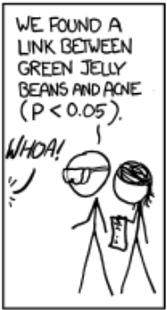

```{r setup, include=FALSE}
knitr::opts_chunk$set(echo = FALSE)
require(knitr)
require(data.table)
require(ggplot2)
require(ggdag)
require(magrittr)
```

<style>
div.footnotes {
  position: absolute;
  bottom: 0;
  margin-bottom: 10px;
  width: 80%;
  font-size: 0.6em;
}
</style>

<script src="https://ajax.googleapis.com/ajax/libs/jquery/3.1.1/jquery.min.js"></script>

<script>
  $(document).ready(function() {
    $('slide:not(.backdrop):not(.title-slide)').append('<div class=\"footnotes\">');

    $('footnote').each(function(index) {
      var text  = $(this).html();
      var fnNum = (index+1).toString().sup();
      $(this).html(text + fnNum);

      var footnote   = fnNum + ': ' + $(this).attr('content') + '<br/>';
      var oldContent = $(this).parents('slide').children('div.footnotes').html();
      var newContent = oldContent + footnote;
      $(this).parents('slide').children('div.footnotes').html(newContent);
    });
  });
</script>

# Testing Causal Theories

## Plan for Today:

### **(1) Correlation**

- correlation
    - technical details
- random association
    - $p$ values

## Correlation

#### **correlation**: 

degree of association or relationship between the **observed** values taken by two variables ($X$ and $Y$)

- Many different ways of doing this (compare group means, regression) are all fundamentally about correlation.
- correlations have a **direction**:
    - positive: implies that as $X$ increases, $Y$ increases
    - negative: $X$ increases, $Y$ decreases
- correlations have **strength** (has nothing to do **size of effect**):
    - **strong**: $X$ and $Y$ almost **always** move together 
    - **weak**: $X$ and $Y$ do not move together very much
- There is also a **technical** definition of correlation (later)


## Correlation

### What is it?

(Pearson) **correlation**: also has specific **mathematical** definition (you don't need to know it):

$$r = \frac{\sum_{i}^n (x_i - \bar{x})(y_i - \bar{y})}{\sqrt{\sum_i^n(x_i - \bar{x})^2}\sqrt{\sum_i^n (y_i - \bar{y})^2}}$$

This captures extent to which deviations from mean of $X$ move with deviations from mean of $Y$.

## Correlation

### What is it?

**mathematically**: correlation is the degree of **linear** association between $X$ and $Y$

- Takes values between $-1$ and $1$
- Values close to $1$ or $-1$ suggest **high** degree of *linear* association
- Values close to $0$ suggest **low** degree of *linear* association
- Value of correlation does **not** tell us **how much** $Y$ changes with $X$

## Correlation

### What is it?

**negative correlation**: (correlation $< 0$) values of $X$ and $Y$ move in opposite direction:

- higher values of $X$ appear with lower values of $Y$
- lower values of $X$ appear with higher values of $Y$

**positive correlation**: (correlation $> 0$) values of $X$ and $Y$ move in same direction:

- higher values of $X$ appear with higher values of $Y$
- lower values of $X$ appear with lower values of $Y$

## Correlation


## Correlation

```{r, echo = F}

x = rnorm(100)
y = 1.5*x + rnorm(100)

plot(x, y, main = 'Positive Correlation')

```

## Correlation

```{r, echo = F}

x = rnorm(100)
y = -1.5*x + rnorm(100)

plot(x, y, main = 'Negative Correlation')

```

## Correlation

- It is possible to see **perfect correlation** but small change in $Y$ across $X$

- It is possible to see **low correlation** but large change in $Y$ across $X$

- It is possible to see **perfect nonlinear relationship** between $X$ and $Y$ with $0$ correlation


## Correlation:

**weak correlation**: values for $X$ and $Y$ do not cluster along line

**strong correlation**: values for $X$ and $Y$ cluster strongly along a line

**strength of correlation** does not fully determine the **slope** of line describing $X,Y$ relationship

**effect size**: this is the **slope** of the line describing the $X,Y$ relationship. The larger the effect, the steeper the slope

## Correlation

```{r, echo = F}

x = rnorm(100)
y = 1.5*x + rnorm(100, sd = 5)
lims = range(y)
plot(x, y, main = 'Weak Positive Correlation', ylim = lims)

```

## Correlation

```{r, echo = F}

x = rnorm(100)
y = 0.5*x + rnorm(100, sd = 0.1)

plot(x, y, main = 'Strong Positive Correlation', ylim = lims)

```

# Random Association 

## Correlation: Random association

How do we know a correlation is **systematic**?

- How do we know that it is not simply a pattern by random chance?
- Apparent patterns can be produced by pure randomness

## Correlation: Random association

<iframe width=100% src="https://www.youtube.com/embed/no_elVGGgW8?autoplay=0" frameborder="0" allowfullscreen></iframe>

## Correlation: Random association

If you look at enough possible sets of variables, you might find a strong correlation

- But it could have happened by chance!
- So a correlation might not be "real"

(Arbitary Correlations)[http://www.tylervigen.com/spurious-correlations]

## Correlation: Random association

```{r, echo = F, message = F}
cage_data = data.frame(cage_films = c(2,2,2,3,1,1,2,3,4,1,4),
                       pool_deaths = c(109, 102, 102, 98, 85, 95, 96, 98, 123, 94, 102))
require(ggplot2)
ggplot(cage_data, aes(x =cage_films, y = pool_deaths)) + 
  geom_point(position = position_jitter(w = 0, h = 1)) + 
  geom_smooth(method = 'lm', fullrange = T, se = F) +
  theme_bw() +
  ggtitle("Do Nick Cage films cause Pool Drownings?") +
  xlab("Nick Cage Films per Year") + 
  ylab("Pool Drownings per Year (US)") + 
  theme(plot.title = element_text(size = 24, face = "bold"),
        axis.title=element_text(size=14,face="bold"))
```

## Random association: Statistics

Field of statistics investigates properties of **chance** events (stochastic processes):

- Probability theory tells us how likely events are to happen, given chance
- Can tell us how likely correlation of some value is to happen by chance


## Random association: Statistics

### How?

1. Compute correlation of $X$ and $Y$
2. How many **cases** do we have?
    - Patterns with many cases less likely to occur at random
3. Assign a probability that the correlation we see would have happened by chance

### ASSUMPTION

- We need to assume we know the chance process generating this correlation


## Random association: Statistics

```{r, echo = F}
c= 0
counter = 0
while (c < 0.9) {
  x = rnorm(5)
  y = rnorm(5)
  c = cor(x,y)
  counter = counter + 1
}

plot(x,y, main = "5 observations, x and y unrelated")
text(mean(x) - sd(x),mean(y), labels = paste0("Correlation: ", round(c, 2)),pos =4 )

```

## Random association: Statistics

```{r, echo = F}
plot(x,y, main = "5 observations, x and y unrelated")
text(mean(x) - sd(x),mean(y), labels = paste0("Correlation: ", round(c, 2)), pos =4 )
text(mean(x) + sd(x),mean(y), labels = paste0("Tries: ", counter))
```


## Random association: Statistics

```{r, echo = F}
c= 0
counter = 0
while (c < 0.9) {
  x = rnorm(10)
  y = rnorm(10)
  c = cor(x,y)
  counter = counter + 1
}

plot(x,y, main = "10 observations, x and y unrelated")
text(mean(x) - sd(x),mean(y), labels = paste0("Correlation: ", round(c, 2)), pos =4)

```

## Random association: Statistics

```{r, echo = F}
plot(x,y, main = "10 observations, x and y unrelated")
text(mean(x) - sd(x),mean(y), labels = paste0("Correlation: ", round(c, 2)), pos =4)
text(mean(x) + sd(x),mean(y), labels = paste0("Tries: ", counter))
```

## Random association: Statistics

```{r, echo = F}
c= 0
counter = 0
while (c < 0.9) {
  x = rnorm(15)
  y = rnorm(15)
  c = cor(x,y)
  counter = counter + 1
}

plot(x,y, main = "15 observations, x and y unrelated")
text(mean(x) - sd(x),mean(y), labels = paste0("Correlation: ", round(c, 2)), pos =4)

```

## Random association: Statistics

```{r, echo = F}
plot(x,y, main = "15 observations, x and y unrelated")
text(mean(x) - sd(x),mean(y), labels = paste0("Correlation: ", round(c, 2)), pos =4)
text(mean(x) + sd(x),mean(y), labels = paste0("Tries: ", counter))
```


## Random association: Statistics

### Same Correlation, More cases

```{r, echo = F, message=F}
require(MASS)
par(mfrow = c(1,2))
b1 = mvrnorm(50, mu = c(0,0), Sigma = matrix(c(1,0.5,0.5,1), byrow = T, ncol = 2))
b2 = mvrnorm(500, mu = c(0,0), Sigma = matrix(c(1,0.5,0.5,1), byrow = T, ncol = 2))

plot(b1[,1], b1[,2], main = "Few => Possibly random", xlab = 'x', ylab = 'y',
     xlim = range(rbind(b1,b2)), ylim = range(rbind(b1,b2)))
abline(lm(b1[,2] ~ b1[,1]))
plot(b2[,1], b2[,2], main = "Many => Less likely to be random", xlab = 'x', ylab = 'y',
     xlim = range(rbind(b1,b2)), ylim = range(rbind(b1,b2)))
abline(lm(b2[,2] ~ b2[,1]))
par(mfrow = c(1,1))

```

## Random association: Statistics

**statistical significance**: 

> An indication of **how likely** correlation we observe could have happened purely by chance.

> **higher** degree of statistical significance indicates correlation is **less** likely to have happened by chance

## Random association: Statistics

$p$ **value**:

- A numerical measure of **statistical significance**. Puts a number on how likely observed correlation would have occurred by chance, **assuming** a we know the chance procedure and the truth is a $0$ correlation.

- It is a probability, so is between $0$ and $1$.

- **Lower** $p$-values indicate **greater** statistical significance

$p < 0.05$ often used as threshold for "significant" result. 

- but it is not a magic number
- Can observe $p < 0.05$ by chance ($\frac{1}{20}$)


## Random association: Statistics

$p$ **value**:

Be wary of "$p$-hacking"

- $p$ values become meaningless if we look at many associations, then only report the ones that are "significant".

### Why?

- low $p$-values occur by chance when we look at lots of associations

## Significant?


## Significant?


## Significant?



## What else do you want to know?


## We'd want to know this


## We'd want to know this


## Random assocation

### Recap:

1. Correlations can appear by chance
2. We can assess **probability** of chance correlation if we know:
    - **strength** of correlation (close to $1,-1$)
    - **size** of the sample ($N$)
    - **underlying chance process**
3. $p$-values:
    - Obtained using mathematical formulaa
    
## Random assocation

### Recap:

| Statistical<br>Significance | $p$-value | By Chance? | Why? | "Real"? |
|:----------------------------:|:-----------------:|:----------:|:-------------------------------:|:----------------:|
| Low | High ($p > 0.05$) | Likely | small $N$<br>weak correlation | Probably **not** |
| High | Low ($p < 0.05$) | Unlikely | large $N$<br>strong correlation | Probably |

