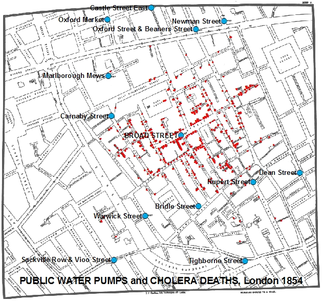

```{r setup, include=FALSE}
knitr::opts_chunk$set(echo = FALSE)
require(knitr)
require(data.table)
require(ggplot2)
require(ggdag)
require(magrittr)
```

<style>
div.footnotes {
  position: absolute;
  bottom: 0;
  margin-bottom: 10px;
  width: 80%;
  font-size: 0.6em;
}
</style>

<script src="https://ajax.googleapis.com/ajax/libs/jquery/3.1.1/jquery.min.js"></script>

<script>
  $(document).ready(function() {
    $('slide:not(.backdrop):not(.title-slide)').append('<div class=\"footnotes\">');

    $('footnote').each(function(index) {
      var text  = $(this).html();
      var fnNum = (index+1).toString().sup();
      $(this).html(text + fnNum);

      var footnote   = fnNum + ': ' + $(this).attr('content') + '<br/>';
      var oldContent = $(this).parents('slide').children('div.footnotes').html();
      var newContent = oldContent + footnote;
      $(this).parents('slide').children('div.footnotes').html(newContent);
    });
  });
</script>

# Correlation to Causation

## Plan for Today:

### **(1) Recap**

- correlation
- two problems:
    - confounding/bias
    - random association

### **(2) Solutions for Bias**

- design-based vs. adjustment-based
- conditioning
    - what is it?
    - how does it work?

# Correlation to Causation


## Testing Causal Claims

1. We start with a causal claim

2. Turn claim into a causal theory
    - causal logic, independent $X$/dependent $Y$ variables

3. Turn causal logic and $X$/$Y$ into hypotheses
    - expect that **potential outcomes** of $Y$ change with $X$
    
4. B/C of FPCI: imperfectly test hypotheses using **correlation** of <u>observed</u> values of $X$ and $Y$

5. Infer causality if:
    - assumptions about cases we compare let us ignore **confounding**/**bias**
    - correlation unlikely to have occured **by chance**

## Problems with Correlation

#### **Bias**/**Confounding**

Equivalently:

1. Observed cases with different values of $X$ have different potential outcomes of $Y$
2. Observed cases with different values of $X$ have different values of $W$, which is related to $Y$
3. There is a "backdoor" causal path from $X$ to $Y$

#### **Random Error**

1. Correlation between $X$ and $Y$ is by chance and reflects no change in $Y$ due to $X$.

## Solutions to Problems

#### **Bias/Confounding**

1. **adjustment-based** solutions
2. **design-based** solutions

#### **Random Error**

1. Increase number of **independent** cases
2. Take courses in statistics

## Solutions to Bias

### **adjustment-based**

- Identify possible **confounding** variables (e.g. $W, Z, V, U$)
- Measure these variables
- **adjust**  correlation of $X$ and $Y$ by "**conditioning**" on confounding variables

### **design-based**

- Compare cases that, <u>by assumption</u>, are 
    - similar in terms of confounding variables $W$/ potential outcomes of $Y$
    - exposed to $X$ in a manner unrelated to $W$/potential outcomes of $Y$

# Adjustment-Based Solutions

## Intuition: Adjustment

Adjustment-based approaches start from the...

### **Comparative Method:**

Sometimes called the "method of difference" (via John Stuart Mill), this assesses whether $X$ causes $Y$ by...

- comparing two cases that are the same in **all relevant** respects, except for value of $X$
- assess for these two cases whether $Y$ changes when $X$ changes (correlation)

## Intuition: Adjustment

### Question:

What causes the spread of **cholera**?

### Causal claim:

Contaminated water causes cholera outbreaks

### Obvious?

19th Century London saw repeated outbreaks of cholera, with mass death

- Dominant view was that "miasmas" or bad air caused diseases like cholera

## Intuition: Adjustment
 {.centered}

John Snow, MD


## Intuition: Adjustment

<iframe width=100% src="https://www.youtube.com/embed/d44LyYL3GkY?autoplay=0" frameborder="0" allowfullscreen></iframe>

## Intuition: Adjustment

Snow **could** compare places with contaminated water with those that did not, but there is a possibility of **confounding**:

- rotting organic material $\to$ miasmas $\to$ cholera?
- rotting organic material $\to$ contaminated water $\to$ cholera?

## Intuition: Adjustment

```{r, echo = F}
dagify(cholera ~ water,
       water ~ rot,
       miasma ~ rot,
       cholera ~ miasma,
       water ~ v_b,
       exposure = "water", 
       outcome = 'cholera',
       labels = c('water' = "(X) Bad Water", 
                  'cholera' = "(Y) Cholera",
                  'miasma' = 'Miasma',
                  "v_b" = "Vibrio cholerae",
                  'rot' = 'Rotting Material')) %>%
  tidy_dagitty(layout='circle') %>%
ggplot(aes(x = x, y = y, xend = xend, yend = yend)) +
  #geom_dag_node() +
  geom_dag_edges_link(mapping = aes(label = c('increases', 'increases', 'increases', 'increases', 'upward bias', '')),  
                                    angle_calc = "along", label_dodge = unit(c(-1,1,1,1,-1),'lines'),
                                    edge_linetype = rep(c(1,1,1,1,3), each = 100),
                                    arrow = grid::arrow(length=grid::unit(c(10,10,10,10,0), 'pt'), type = 'closed')
                                    ) +
  geom_dag_text(mapping = aes(label = label), colour = 'black') +
  theme_dag() +
  scale_dag()
```

## Intuition: Adjustment

Comparing **observed** water quality and cholera in:

- two **different** areas with different water quality
- same area at **different** times with different water quality

would not rule out **miasma** as explanation for cholera.

- "miasma" changes as "water" changes; might affect cholera; $\to$ confounding

## Broad Street Pump Outbreak (1854) {.centered}



## Broad Street Pump Outbreak (1854)

Near the outbreak

|  | **Brewers** | **Broad St. Residents** |
|-------|------------|------------|
| **Water Source** | **Brewery Well**/<br>**Beer** (Clean) | **Pump** (Contam.)|
| **Location** | Near pump | Near pump |
| **Timing** |  Aug. 1854 |  Aug. 1854 |
| **Miasmas?** | Yes? | Yes? |
| **Cholera** | **No** | **Yes** |


## Broad Street Pump Outbreak (1854)

Far from outbreak 

|  | **Lady and Niece** | **Non-Soho Residents** |
|-------|------------|------------|
| **Water Source** | **Broad Street Pump**<br>(Contam.) | **Another Pump**<br>(Clean) |
| **Location** | Far from Broad St. | Far from Broad St. |
| **Timing** |  Aug. 1854 |  Aug. 1854 |
| **Miasmas?** | No | No |
| **Cholera** | **Yes** | **No** |

## Intuition: Adjustment

```{r, echo = F}
dagify(cholera ~ water,
       water ~ rot,
       miasma ~ rot,
       cholera ~ miasma,
       water ~ v_b,
       exposure = "water", 
       outcome = 'cholera',
       labels = c('water' = "(X) Bad Water", 
                  'cholera' = "(Y) Cholera",
                  'miasma' = 'Miasma',
                  "v_b" = "Vibrio cholerae",
                  'rot' = 'Rotting Material')) %>%
  tidy_dagitty(layout='circle') %>%
ggplot(aes(x = x, y = y, xend = xend, yend = yend)) +
  #geom_dag_node() +
  geom_dag_edges_link(mapping = aes(label = c('held constant\n(link broken)', 'increases', 'increases', 'increases', 'increases\n(unbiased)', '')),  
                                    angle_calc = "along", label_dodge = unit(c(-1,1,1,1,-1),'lines'),
                                    edge_linetype = rep(c(2,1,1,1,1), each = 100),
                                    arrow = grid::arrow(length=grid::unit(c(0,10,10,10,10), 'pt'), type = 'closed')
                                    ) +
  geom_dag_text(mapping = aes(label = label), colour = 'black') +
  theme_dag() +
  scale_dag()
```

## Conditioning

A more **general** approach to the comparative method is:

### **conditioning**

when we observe $X$ and $Y$ for multiple cases, we examine the correlation of $X$ and $Y$ *within* groups of cases that have the **same values** of confounding variables $W, Z, \ldots$.

How does conditioning solve the problem? Equivalently:

- Cases compared have same potential outcomes of $Y$ for different values of $X$ 
- Cases compared have SAME values on confounding variables $W$; $W$ cannot be related to $X$ or to $Y$ $\to$ no confounding
- "Backdoor" path from $X$ to $Y$ is "blocked"

## Conditioning

Sometimes we think about "conditioning" like this:

- conditioning lets us find the correlation between $X$ and $Y$, *ceteris parabis*, "all else being equal".

But <u>**all else**</u> does not need to be equal:

- We only need to compare cases that are the same **on confounding variables**
- same on variables that are causally linked to $X$ and $Y$

## Conditioning: Example

### **Sanctuary Cities**

- Trump Administration intensified immigration enforcement  
- Some Cities/Counties opted to not assist US Immigrations and Customs Enforcement (ICE) by detaining immigrants for longer
- These are "Sanctuary Cities"

### **Effect on Crime**

- Trump and political allies suggest "sanctuary" policies undermine law enforcement, lead to more crime

**Does having "sanctuary" policy increase crime?**

## Conditioning: Example

| $i$ | $Sanctuary_i$ | $Crime_i^{Sanct.}$ | $Crime_i^{No \ Sanct.}$ | $S_i - No \ S_i$ |
|-----------|---------|---------|-------|-------|
| 1 | $\mathbf{Yes}$ | $\mathbf{35}$ | 40 | -5 |
| 2 | $\mathbf{Yes}$ | $\mathbf{35}$ | 40 | -5 |
| 3 | $\mathbf{Yes}$ | $\mathbf{5}$ | 10 |  -5 |
| 4 | $\mathbf{No}$ | 35 | $\mathbf{40}$ |  -5 |
| 5 | $\mathbf{No}$ | 5 | $\mathbf{10}$ |  -5 |
| 6 | $\mathbf{No}$ | 5 | $\mathbf{10}$ |  -5 |

## Conditioning: Example

If we simple look at the unadjusted difference in crime in **sanctuary** vs. **non-sanctuary** counties, we would get:

$$\frac{\overbrace{35 + 35 + 5}^{\text{Mean Crime in Sanctuary}}}{3} - \frac{\overbrace{40 + 10 + 10}^{\text{Mean Crime w/out Sanctuary}}}{3} = \frac{15}{3} \neq -5$$

**This is <u>bias</u> and must result from <u>confounding</u>**

## Conditioning: Example

$Urban_i$ is a confounding variable. Why?

| $i$ | $Sanctuary_i$ | $Urban_i$ | $Crime_i^{Sanct.}$ | $Crime_i^{No \ Sanct.}$ | $S_i - No \ S_i$ |
|-----------|---------|---|---------|-------|-------|
| 1 | $\mathbf{Yes}$ | $\mathbf{Yes}$ |  $\mathbf{35}$ | 40 | -5 |
| 2 | $\mathbf{Yes}$ | $\mathbf{Yes}$ |  $\mathbf{35}$ | 40 | -5 |
| 3 | $\mathbf{Yes}$ | $\mathbf{No}$ | $\mathbf{5}$ | 10 | -5 |
| 4 | $\mathbf{No}$ | $\mathbf{Yes}$ | 35 |  $\mathbf{40}$| -5 |
| 5 | $\mathbf{No}$ |  $\mathbf{No}$  | 5 | $\mathbf{10}$ | -5 |
| 6 | $\mathbf{No}$ |  $\mathbf{No}$  | 5 | $\mathbf{10}$ | -5 |

## Conditioning: Example

```{r, echo = F}
dagify(crime ~ urban,
       sanctuary ~ urban,
       crime ~ sanctuary,
       exposure = "sanctuary", 
       outcome = 'crime',
       labels = c('sanctuary' = "(X) Sanctuary", 
                  'crime' = "(Y) Crime",
                  'urban' = '(W) Urban')) %>%
  tidy_dagitty(layout='tree') %>%
ggplot(aes(x = x, y = y, xend = xend, yend = yend)) +
  #geom_dag_node() +
  geom_dag_edges_link(mapping = aes(label = c('decreases\n(but upward bias)', 'increases', 'increases', '')),  
                                    angle_calc = "along", label_dodge = unit(c(2,1,-1),'lines'),
                                    edge_linetype = rep(c(3,1,1), each = 100),
                                    arrow = grid::arrow(length=grid::unit(c(10,10,10), 'pt'), type = 'closed')
                                    ) +
  geom_dag_text(mapping = aes(label = label), colour = 'black') +
  theme_dag() +
  scale_dag()
```

## Conditioning: Example

If we condition on $Urban$ (compare $X$ and $Y$ for cases with same value of $Urban$), we can remove the bias.

| $i$ | $Sanctuary_i$ | $Urban_i$ | $Crime_i^{Sanct.}$ | $Crime_i^{No \ Sanct.}$ | $S_i - No \ S_i$ |
|-----------|---------|---|---------|-------|-------|
| 1 | $\mathbf{Yes}$ | $\mathbf{Yes}$ |  $\mathbf{35}$ | 40 | -5 |
| 2 | $\mathbf{Yes}$ | $\mathbf{Yes}$ |  $\mathbf{35}$ | 40 | -5 |
| 4 | $\mathbf{No}$ | $\mathbf{Yes}$ | 35 |  $\mathbf{40}$| -5 |
| 3 | $\mathbf{Yes}$ | $\mathbf{No}$ | $\mathbf{5}$ | 10 | -5 |
| 5 | $\mathbf{No}$ |  $\mathbf{No}$  | 5 | $\mathbf{10}$ | -5 |
| 6 | $\mathbf{No}$ |  $\mathbf{No}$  | 5 | $\mathbf{10}$ | -5 |

## Conditioning: Example

If we condition on $Urban$, we get the true effect of $-5$:

$$\frac{\overbrace{35 + 35}^{\text{Sanctuary (Urban)}}}{2} - \frac{\overbrace{40}^{\text{w/out Sanctuary (Urban)}}}{1} = -5$$

$$\frac{\overbrace{5}^{\text{Sanctuary (Not Urban)}}}{1} - \frac{\overbrace{10 + 10}^{\text{w/out Sanctuary (Not Urban)}}}{2} = -5$$

## Conditioning: Example

### **Why does this work**?

When we condition on $W$ (Urban), by looking at cases where $W$ is the same:

- there can be no relationship between $W$ and potential outcomes of $Y$ (Crime)
- there can be no relationship between $W$ and $X$ (sanctuary status)

Without these two relationships, confounding does not happen, there is no bias.

## Conditioning: Example

```{r, echo = F}
dagify(crime ~ urban,
       sanctuary ~ urban,
       crime ~ sanctuary,
       exposure = "sanctuary", 
       outcome = 'crime',
       labels = c('sanctuary' = "(X) Sanctuary", 
                  'crime' = "(Y) Crime",
                  'urban' = '(W) Urban')) %>%
  tidy_dagitty(layout='tree') %>%
ggplot(aes(x = x, y = y, xend = xend, yend = yend)) +
  #geom_dag_node() +
  geom_dag_edges_link(mapping = aes(label = c('decreases', 'held constant\n(link broken)', 'increases', '')),  
                                    angle_calc = "along", label_dodge = unit(c(1,2,-1),'lines'),
                                    edge_linetype = rep(c(1,2,1), each = 100),
                                    arrow = grid::arrow(length=grid::unit(c(10,0,10), 'pt'), type = 'closed')
                                    ) +
  geom_dag_text(mapping = aes(label = label), colour = 'black') +
  theme_dag() +
  scale_dag()
```

## Conditioning: Next Time

### **What assumptions must we make**
 
in order for **adjustment** solutions to confounding/bias to work?

