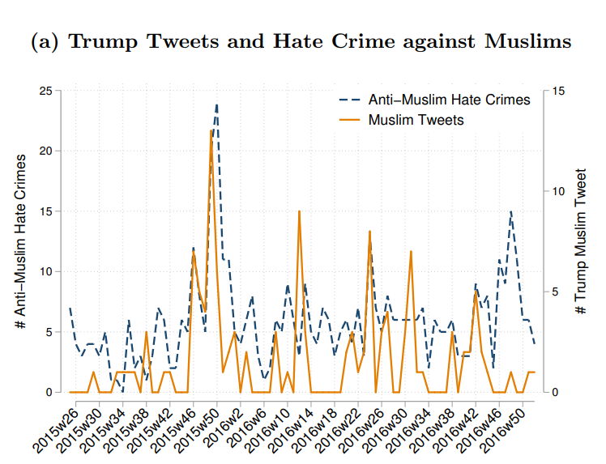

```{r setup, include=FALSE}
knitr::opts_chunk$set(echo = FALSE)
require(knitr)
require(data.table)
require(ggplot2)
require(ggdag)
require(magrittr)
```

<style>
div.footnotes {
  position: absolute;
  bottom: 0;
  margin-bottom: 10px;
  width: 80%;
  font-size: 0.6em;
}
</style>

<script src="https://ajax.googleapis.com/ajax/libs/jquery/3.1.1/jquery.min.js"></script>

<script>
  $(document).ready(function() {
    $('slide:not(.backdrop):not(.title-slide)').append('<div class=\"footnotes\">');

    $('footnote').each(function(index) {
      var text  = $(this).html();
      var fnNum = (index+1).toString().sup();
      $(this).html(text + fnNum);

      var footnote   = fnNum + ': ' + $(this).attr('content') + '<br/>';
      var oldContent = $(this).parents('slide').children('div.footnotes').html();
      var newContent = oldContent + footnote;
      $(this).parents('slide').children('div.footnotes').html(newContent);
    });
  });
</script>

# Correlation to Causation

## Plan for Today:

### **(1) Solutions for Bias**

- adjustment-based
- conditioning
    - what is it?
    - how does it work?
    - assumptions!
    
# Correlation to Causation

## Solutions to Bias

### **adjustment-based**

- Identify possible **confounding** variables (e.g. $W, Z, V, U$)
- Measure these variables
- **adjust**  correlation of $X$ and $Y$ by "**conditioning**" on confounding variables

### **design-based**

- Compare cases that, <u>by assumption</u>, are 
    - similar in terms of confounding variables $W$/ potential outcomes of $Y$
    - exposed to $X$ in a manner unrelated to $W$/potential outcomes of $Y$

## Conditioning

A more **general** approach to the comparative method is to **adjust** using:

### **conditioning**

when we observe $X$ and $Y$ for multiple cases, we examine the correlation of $X$ and $Y$ *within* groups of cases that have the **same values** of confounding variables $W, Z, \ldots$.

How does conditioning solve confounding?

- By holding $W$ constant in comparison, can be no relationship between $W$ and $X$, $W$ and $Y$.
- By definition, no longer confounding

## Conditioning

Sometimes we think about "conditioning" like this:

- conditioning lets us find the correlation between $X$ and $Y$, *ceteris parabis*, "all else being equal".

But <u>**all else**</u> does not need to be equal:

- We only need to compare cases that are the same **on confounding variables**
- same on variables that are causally linked to $X$ and $Y$

## Adjustment: Example

### **Sanctuary Cities**

- We saw in toy example, an "unadjusted" correlation between $Sanctuary$ and $Crime$ led to confounding and bias

- Conditioning on $Urban$ solved the confounding, removing the bias

## Adjustment: Example

### **A Real Test** Wong (2017)

Examines crime rates in 2492 US counties. 608 are "Sanctuary" counties.

Researcher matched counties on:

- population
- foreign-born percentage of the population
- percentage of population that is Latino/a
- level of urban development 

## Adjustment: Example

### **A Real Test** Wong (2017)

**Compared to similar non-sanctuary counties**

- Crime Rate is 35.5 crimes per 10k *fewer* in sanctuary counties
- Difference has low $p$ value: unlikely to have happened by chance

Sanctuary policies do not cause an **increase** in crime

## Adjustment: Example

```{r, echo = F}
dagify(crime ~ urban,
      crime ~ foreign, 
       sanctuary ~ urban,
       sanctuary ~ foreign,
       crime ~ sanctuary,
       exposure = "sanctuary", 
       outcome = 'crime',
       labels = c('sanctuary' = "(X) Sanctuary", 
                  'crime' = "(Y) Crime",
                  'urban' = '(W) Urban',
                  'foreign' = 'Immigrants')) %>%
  tidy_dagitty(layout='circle') %>%
ggplot(aes(x = x, y = y, xend = xend, yend = yend)) +
  #geom_dag_node() +
  geom_dag_edges_link(mapping = aes(label = c('held constant \n(no link)', 'held constant \n(no link)', 'decreases', 'held constant \n(no link)', "held constant \n(no link)", "")),  
                                    angle_calc = "along", label_dodge = unit(c(2,-2,1,-2,2),'lines'),
                                    edge_linetype = rep(c(3,3,1,3,3), each = 100),
                                    arrow = grid::arrow(length=grid::unit(c(10,10,10,10,10), 'pt'), type = 'closed')
                                    ) +
  geom_dag_text(mapping = aes(label = label), colour = 'black') +
  theme_dag() +
  scale_dag()
```

## Adjustment: Example

### **Can you think of any problems here?**

>- What else might be related to sanctuary policies?

>- economic growth $\to$ jobs $\to$ educated citizens $\to$ sanctuary

>- economic growth $\to$ jobs $\to$ lower crime

##

```{r, echo = F}
dagify(crime ~ urban,
      crime ~ foreign, 
       sanctuary ~ urban,
       sanctuary ~ foreign,
       crime ~ sanctuary,
       sanctuary ~ vibrant,
       crime ~ vibrant, 
       exposure = "sanctuary", 
       outcome = 'crime',
       labels = c('sanctuary' = "(X) Sanctuary", 
                  'crime' = "(Y) Crime",
                  'urban' = '(W) Urban',
                  'foreign' = 'Immigrants',
                  "vibrant" = "Growing\nEconomy"
                  )) %>%
  tidy_dagitty(layout='circle') %>%
ggplot(aes(x = x, y = y, xend = xend, yend = yend)) +
  #geom_dag_node() +
  geom_dag_edges_link(mapping = aes(label = c('held constant', 'held constant', 'upward bias', 'held constant', "held constant", "Decreases", 'Increases', '')),  
                                    angle_calc = "along", label_dodge = unit(c(1,-1,1,-1,1,1,1),'lines'),
                                    edge_linetype = rep(c(3,3,2,3,3,1,1), each = 100),
                                    arrow = grid::arrow(length=grid::unit(c(10,10,10,10,10,10,10), 'pt'), type = 'closed')
                                    ) +
  geom_dag_text(mapping = aes(label = label), colour = 'black') +
  theme_dag() +
  scale_dag()
```

## Adjustment: Assumptions

In order to infer $X$ causes $Y$ if $X,Y$ correlated after adjustment

### **Must Assume**

1. There are **no other confounding variables** (other than the ones you conditioned on)
    - that is, you have conditioned on ALL confounding variables
    - sometimes called 'ignorability assumption': you can ignore other variables

How do we **know** we have found and measured all confounding variables?

## Adjustment: Assumptions

In order to infer $X$ causes $Y$ if $X,Y$ correlated after adjustment

### **Must Assume**

<ol start=2>
  <li> 
  **Variables used to condition** relationship between $X$ and $Y$ are **measured without error**.</li>
</ol>

- even **random measurement error** in confounding variables leads conditioning to fail.
- you are no longer comparing like-with-like.

## Adjustment: Limitations

In addition to assumptions: adjustment has **other limitations**

- We are LIMITED by how many variables we can adjust for
    - more variables means: we need more cases
    - less likely we find cases that exactly match
    - relevant confounding variables not adjusted for

### **Side note**

We have shown adjustment that finds identical cases.

- in practice, researcher do not do this; use algorithms that approximate this

## Adjustment: Summary

**Adjustment**: "adjusts" correlation of $X$ (cause) and$ Y$ (outcome) by **conditioning** on specific, potentially confounding variables

- Examine correlation of $X,Y$ within groups with same values for confounding variables (**condition**)
- We assume: within these groups, $X$ is as-if randomly assigned
- Or, we assume: within these groups, nothing other than $X$ could affect values of $Y$

We can infer causality **ONLY IF**:

- no other unobserved/unknown confounding variables
- confounding variables measured without error

# Design-Based Solutions

## Design

**design-based** solutions to confounding:

- **Do not** identify and measure all confounding variables
- Choose a comparison that eliminates bias from many known/unknown measurable/unmeasurable confounding variables

Contrast to **adjustment**:

- focus less on measuring known confounding variables to find comparisons among many cases
- choose fewer cases where confounding is plausibly less or absent

## Design

### **Types of designs:**

<u>Designs using conditioning</u>

- Compare same case over time
- Compare cases known to be similar at same time
- "Differences in Differences"

<u>Designs using random exposure to $X$</u>

- experiments
- "natural experiments"

## Design

### **Designs using conditioning**

Choice of comparison **holds many confounding variables constant**

- we condition, not by finding confounding variables and measuring
- we condition by choosing cases known to be similar

Holds constant **many** confounding variables

## Design: Same Case

- Most similar case to a case?

>- ITSELF

## Design: Same Case


