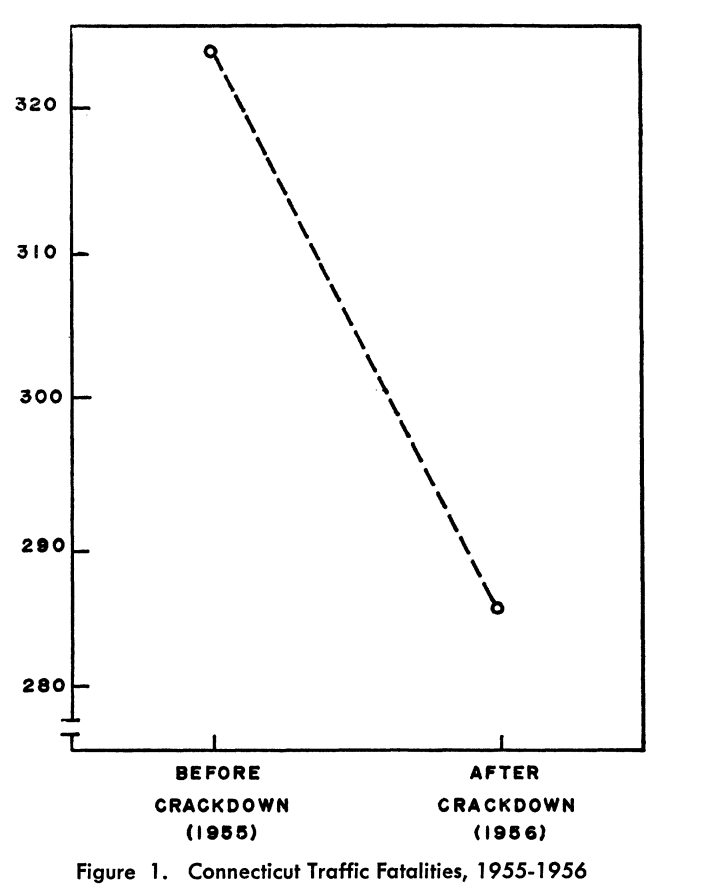
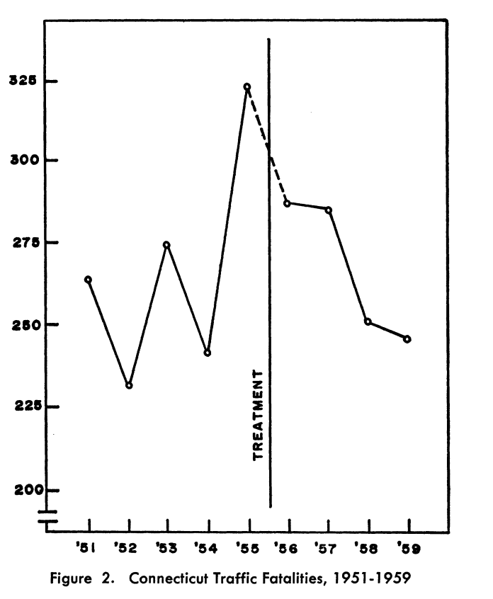
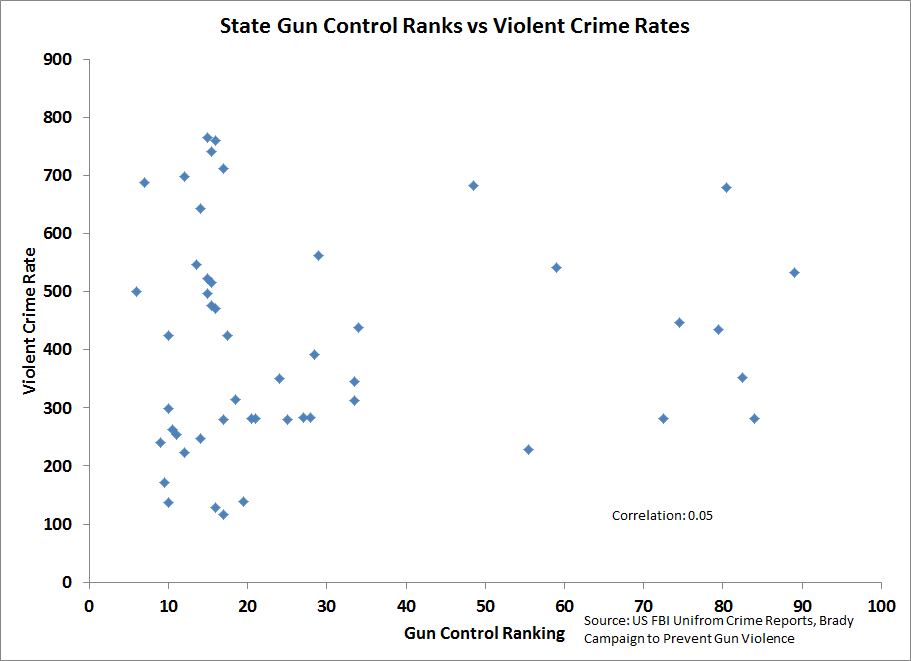
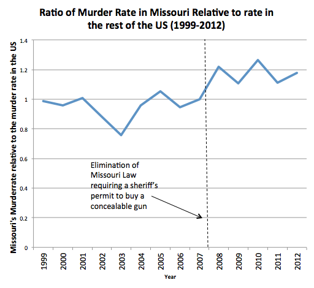
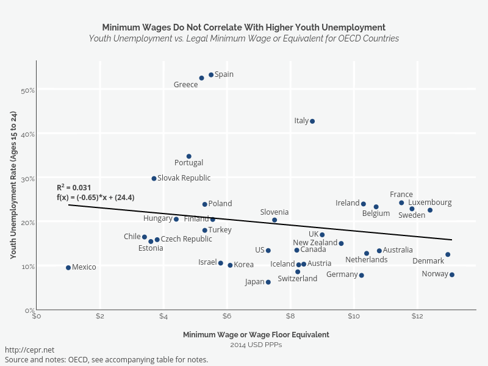

```{r setup, include=FALSE}
knitr::opts_chunk$set(echo = FALSE)
require(knitr)
require(data.table)
require(ggplot2)
require(ggdag)
require(magrittr)
```

<style>
div.footnotes {
  position: absolute;
  bottom: 0;
  margin-bottom: 10px;
  width: 80%;
  font-size: 0.6em;
}
</style>

<script src="https://ajax.googleapis.com/ajax/libs/jquery/3.1.1/jquery.min.js"></script>

<script>
  $(document).ready(function() {
    $('slide:not(.backdrop):not(.title-slide)').append('<div class=\"footnotes\">');

    $('footnote').each(function(index) {
      var text  = $(this).html();
      var fnNum = (index+1).toString().sup();
      $(this).html(text + fnNum);

      var footnote   = fnNum + ': ' + $(this).attr('content') + '<br/>';
      var oldContent = $(this).parents('slide').children('div.footnotes').html();
      var newContent = oldContent + footnote;
      $(this).parents('slide').children('div.footnotes').html(newContent);
    });
  });
</script>

# Correlation to Causation

## Plan for Today:

### **(1) Solutions for Bias**

- design-based
- same-case over time
- similar cases, same time

# Design-Based Solutions

## Design

**design-based** solutions to confounding:

- **Do not** identify and measure all confounding variables
- Choose a comparison that eliminates bias from many known/unknown measurable/unmeasurable confounding variables

Contrast to **adjustment**:

- focus less on measuring known confounding variables to find comparisons among many cases
- choose fewer cases where confounding is plausibly less or absent

## Design

### **Types of designs:**

<u>Designs using conditioning</u>

- Compare same case over time
- Compare cases known to be similar at same time
- "Differences in Differences"

<u>Designs using random exposure to $X$</u>

- experiments
- "natural experiments"

## Design

### **Designs using conditioning**

Choice of comparison **holds many confounding variables constant**

- we condition, not by finding confounding variables and measuring
- we condition by choosing cases known to be similar

Holds constant **many** confounding variables

## Design: Same Case

### **Same case over time**

What is it?

- Compare the same case to itself before and after change in $X$

How does it work?

- This is a kind of conditioning:
    - holds **constant** all **unchanging attributes** of the case


## Design: Same case

In 1956, Connecticut government responded to traffic deaths by increasing state police enforcement of speed limit and stronger fines/sentences

Did the speeding "crackdown" work?

We can compare Connecticut pre- and post- "crackdown"

## Design: Same case



## Design: Same case

### Advantage:

- All unchanging attributes of Connecticut held constant, cannot confound

### Disadvantages:

- What does this comparison not address?

## Design: Same case

### Disadvantages:

- Other rapidly-changing variables not accounted for (weather, safety of vehicles)
- Does not address long-term trends leading to decline in fatalities (road safety, medical procedures)
- Does crackdown change measurement, but not value of variable? (Measurement bias)
- Why was the law passed? 
    - change in policy due to major events (did major events have an effect, not policy?)
    - change in policy due to extreme event (low/high value of $Y$) then a return to normal?

## Design: Same case

### Disadvantages:

all problems of **confounding**: other factors affect $Y$ (road deaths) and correlated over time with $X$.

## Design: Same case



## Design: Same case

Does removing on restrictions on gun ownership increase violent crime?

- If laws restricting gun ownership reduce violence, removing them should lead to rise in violence.

## Design: Same case




## Design: Same case

Correlation is weak: stronger gun laws not clearly related to lower or higher violent crime

**possibility of confounding**

- places with more gun laws may be different in many ways:
    - urban vs. rural
    - liberal political views
    - quality of policing
    - types of crime (organized crime vs not)
    - etc.
    

Rather than **conditioning** on many possible variables... compare a case before and after change in the law    

## Design: Same case

In 2007, US state of Missouri **removed** a permit-to-purchase (PTP) handgun law, which required all handgun purchasers to obtain a license verifying that they have passed a background check.

Did this repeal in the law change the level of violent crime?

- comparison of Missouri to itself holds constant many possible confounding factors


## Design: Same case




## Design: Same case

What are some possibly confounding variables does this comparison does **not** address?


## Design: Same Case

**What is it?**

- Compare the same case to itself before and after change in $X$

**How does it work?**

- This is a kind of conditioning:
    - holds **constant** all **unchanging attributes** of the case

**Assumes**:

To infer causality

- No variables that affect $Y$ and **change over time** along with $X$.

## Design: Similar Cases

How do we deal with variables that **change over time**?

- We can look at cases that we expect to be similar on many attributes (usually due to spatial and temporal proximity)
    - Compare provinces/states within countries, rather than different countries
    - Compare districts/towns within provinces rather than different provinces
    - Compares people within neighborhoods rather than across different areas
    
What does this do? Comparisons like this:

- Conditions on/eliminates **all confounding variable** that are the **same** across cases
    - e.g. all confounding variables at country, province, neighborhood-level
    - including things that might change over time and affect cases equally
    
## Similar Cases: Example

### Minimum Wage Laws

Do minimum wage laws cause higher unemployment?

- Could cause employers to employ fewer people
- Or could cause wages to rise, without a change in who is employed

### Naive comparison:

Correlate unemployment with minimum wage laws across countries

## Similar Cases: Example



## Similar Cases: Example

Countries with different minimum wages likely differ in many ways:

- Political power of labor
- Unemployment insurance
- Health coverage
- Cultural/political institutions

### A better design?

Compare minimum-wage laws and unemployment **across provinces** within the same country

- Would keep **country-level** variables the same
- Fewer possible variables to condition/adjust for


## A better design?


## A better design?

Compare minimum-wage laws and unemployment **across border-counties** within the same country, on the **same provincial border**

### Advantage?

Provinces/states might also differ from each other in many ways:

- Counties/districts on province/state borders probably similar in MORE ways
- **Fewer differences** between these counties, **except** for minimum wage law
    


## Design: Similar Cases

**What is it?**

- Compare the similar cases (due to geographic/cultural proximity) with different values of $X$

**How does it work?**

- This is a kind of conditioning:
    - holds **constant** all variables that are the same across cases these cases, including things that change over time (similarly).

**Assumes**:

To infer causality

- No differences  on variables that affect $Y$ between "similar" cases with different values of $X$


