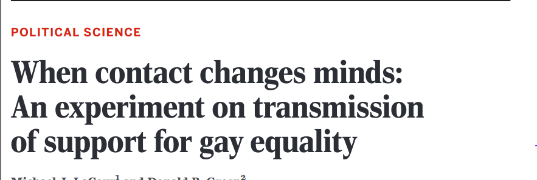
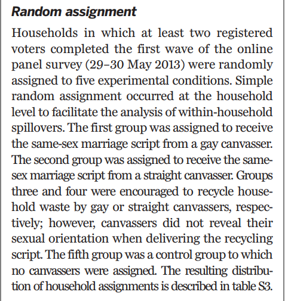
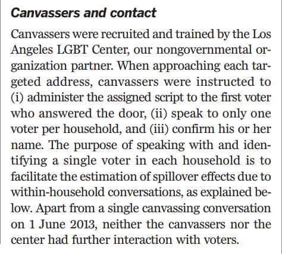
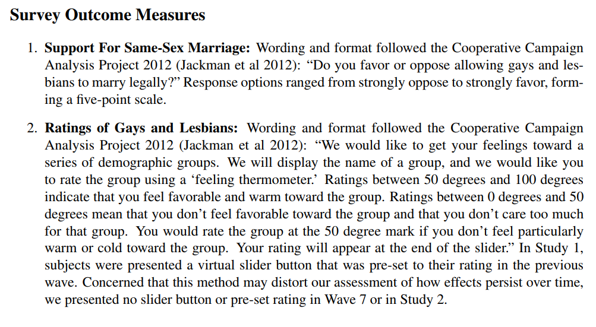
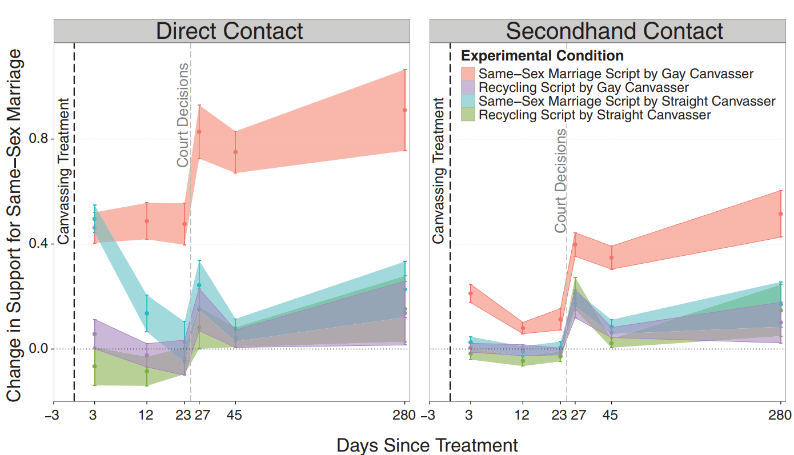
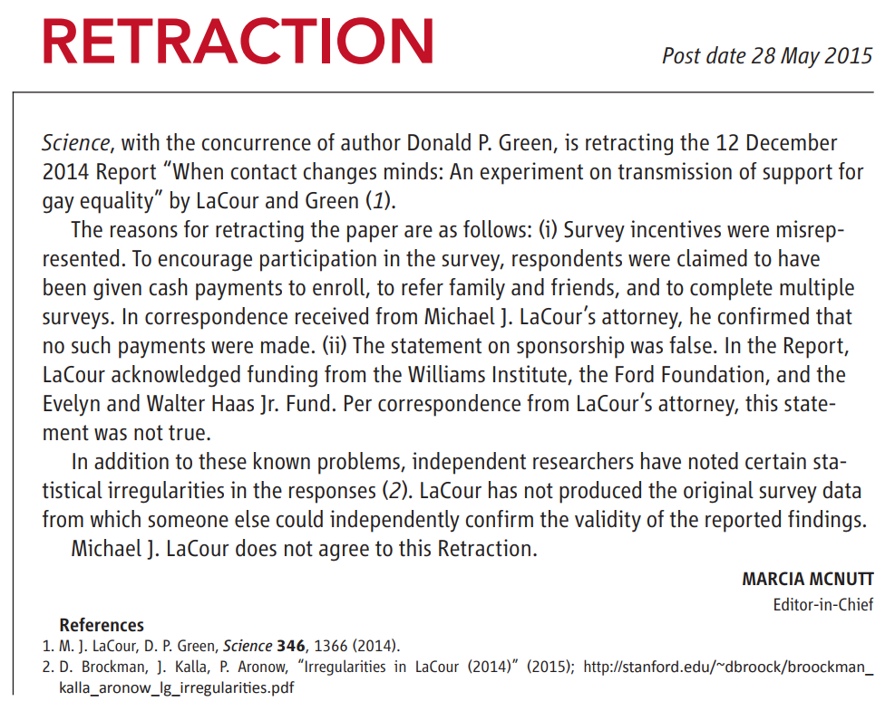
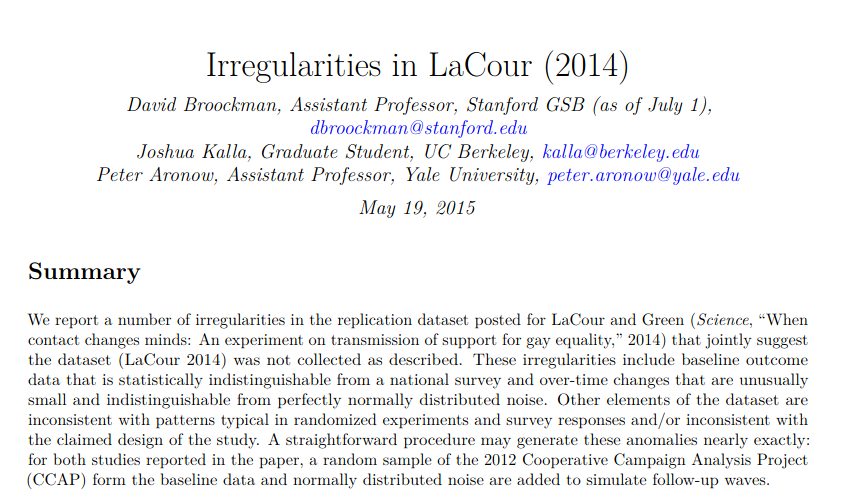

```{r setup, include=FALSE}
knitr::opts_chunk$set(echo = FALSE)
```

# What is Science?

## Plan for Today

Admin: Reflection 1 due Friday

### 1) Recap Weber's insights

### 2) Attributes of scientific evidence

### 3) Example

# Recap

# Scientific Evidence

## Two Key definitions

### **claim**: 

(For our purposes) a statement about what is true or valid. 

- If you can add "is true" to the end or "it is true that" to the beginning of the statement without changing the meaning, it is a claim.

### Don't overthink this definition. It is as simple as it seems.

## Two Key definitions

### **basis**: 

(For our purposes) the basis for a claim is the **reason we should accept the truth** or validity of that claim. It includes 

- the **evidence** that is used to "prove" the claim is true 

- and the **assumptions** required for the evidence to be valid "proof" (sometimes called the "warrant")


colloquially, we refer to both parts as "evidence"

## An example:

### **claim**: "It rained last night"

### **basis**: "I can see the street is wet"

<br>

What is the evidence? 

What are the assumptions behind that evidence? 

#

## Using Science to Evaluate Claims

**Science** is distinct as a form of thought in that: 

#### (1) Only certain *claims* can be investigated 

*(next week)*

#### (2) Has special rules for using evidence and making assumptions to evaluate claims

*today*

# What is makes evidence <br> "scientific"?

## Attributes of science?

Go to https://www.menti.com/fknajkidk8

## Attributes of science?

<div style='position: relative; padding-bottom: 56.25%; padding-top: 35px; height: 0; overflow: hidden;'><iframe sandbox='allow-scripts allow-same-origin' allowfullscreen='true' allowtransparency='true' frameborder='0' height='315' src='https://www.mentimeter.com/embed/e6bab70316b70b6bc7e3c34baf856c7f/4e6f3e3deed9' style='position: absolute; top: 0; left: 0; width: 100%; height: 100%;' width='420'></iframe></div>


## Attributes of Scientific Evidence:

### **Systematic use of evidence**

### **Transparent procedures**

### **Acknowledge uncertainty**

### **Test claim against alternatives**

## Transparent procedures 

### How did you arrive at your conclusion?

- What data / observations did you use?
- What comparisons did you make?
- What choices as a researcher did you make, and why?

### Why?

- Others can know the **assumptions** required to find result
- Others can challenge your choices/assumptions
- Others can replicate your work (objectivity)

## Consider alternatives 

### Test claim against other competing claims

- Whichever claim "survives" many different tests is best

### Why?

- Openness to being wrong (no assumption above challenge)
- Evidence consistent with **different** assumptions (objectivity)
- One piece of evidence can be consistent with many claims; Best claim generates most useful predictions

## Systematic Use of Evidence 

### Observations we make:

- Clear rules for **what** we observe
- Clear rules for **how** we observe
- Clear rules for **comparison**
- Avoid "cherry-picking" 

### Why?

- Cherry picking assumes a truth, picks data to support it
- Systematic rules allows others to investigate for themselves
    - No "secret sauce": (objectivity, enables challenging assumptions)
    
## Acknowledge uncertainty

### Limitations of finding:

- What questions remain unanswered after the study (what didn't it tell us)?
- What **assumptions** were made that might not be true?

### How certain or precise are the answers?

- Acknowledge possibility of results being driven by chance
- Acknowledge possibility of spurious relationships

## Poll

### **Which of these four do you think is the most important part of scientific evidence?**


# Example

## Consider a claim:

> **A person's prejudice against a group of people can be reduced through meaningful, interpersonal contact with a member of that group.**

>- This is the "contact hypothesis", famously articulated by Allport (1954)

## A specific question:

*Does contact reduce prejudice?*

Are efforts to **change the minds** of opponents same-sex marriage through a short conversation **more successful** when those conversations are with homosexuals (as compared to heterosexuals)?

<br>

Poll

## An investigation

### 2014 paper in *Science*: 

Researchers conducted an experiment to answer this question:



## What would you want to know...

### about **Transparent Procedures**?

## Treatments:



## Who was treated?


## How did they get treated?



## What were the survey questions?



## What would you want to know...

### about **Systematic use of evidence**?

## Systematic use of evidence:

### What was the sample?


## Systematic use of evidence:

### What were the comparisons?


## What would you want to know...

### about **Considering Alternatives**?

## Alternatives:

### Could it be that effect is simply from having someone come to the door?

<br>

>- Control group with "recycling canvasser" addresses this concern

## Alternatives:

### What if gay canvassers are different that straight in *other* ways?

<br>

- Might be better able to articulate issue
- Might be more motivated, so more persuasive
- Might be different in other ways that make them persuasive

>- Authors test for these differences, but find nothing major

## What would you want to know...

### about **Acknowledging Uncertainty**?

## Uncertainty

### Results have confidence intervals



## Uncertainty

### Results leave questions

<br>

- **Why were indirect effects larger for gay canvassers?**
- **Would this work for other identity groups?**

## Results:

### Canvassing for gay marriage (compared to recycling) **reduced prejudice**

<br> 

### Reductions in prejudice **larger** and **last longer** with **homosexual canvassers**

# Do you believe these results? 

Poll

---



## How was he caught?



## What of these is most important?


### **Systematic use of evidence**

### **Transparent procedures**

### **Acknowledge uncertainty**

### **Test claim against alternatives**

## Conclusion:

### <u>**Transparent procedures**</u>

### **Systematic use of evidence**

### **Acknowledge uncertainty**

### **Test claim against alternatives**

## Appendix

For the story of the fraud and replication, listen [here](https://www.thisamericanlife.org/584/for-your-reconsideration)