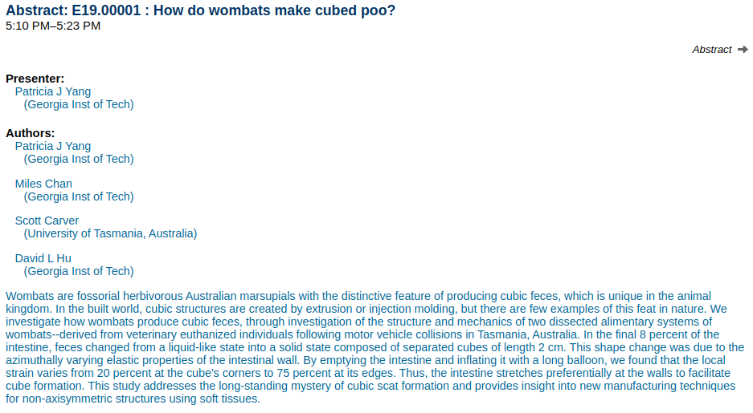
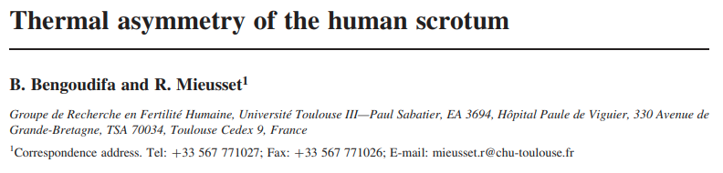
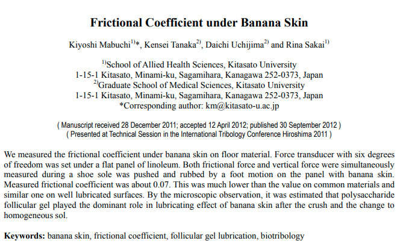

```{r setup, include=FALSE}
knitr::opts_chunk$set(echo = FALSE)
```

# What is the value of Science?

# Introduction

## Power and Justification

Last class, we saw:

- Power fundamental to political life
- Power makes justifications (for us to behave a certain way)
- Justifications involve claims about **values** and **facts**

We can **factually** interrogate justifications (to act a particular way)

We can **factually** investigate how power may be used to coerce or manipulate us into accepting justifications.

## Power and Justification

In light of the limitations of even our basic senses...

**How can we *KNOW* about relevant facts in the political world?**

**What can *science* do for us?**

- why can't science speak directly to values? (what we should do)
- what is distinct about how science speaks to facts?


## Objectives

1. Weber on "Science as a Vocation" (Why?)
2. Possible answers to "What is value of science"?
3. Weber's insights about what science is/is not
4. Weber's answer: what is the value of science

## {.centered}

<figure>

<figcaption>Max Weber. German. 1864-1920</figcaption>
</figure>

# Science as Vocation

# What is the value of science?

## Answer 1?

### **Science can reveal (Truth, Nature, or God) that unite what exists (what is) with what is right (what ought) and gives our lives *meaning*.**

<br> 

>- Weber says: "Not a chance."

## Answer 1?

Weber says that instead of giving unifying the true and the good, science produces **disenchantment**:

- $\to$ we can explain the world without the supernatural
- $\to$ humanity is not special or meaningful
- $\to$ "If these natural sciences lead to anything in this way, they are apt to make the belief that there is such a thing as the 'meaning' of the universe die out at its very roots."

## Insight 1

### **Science is a form of knowledge concerned with prediction**

>- It can tell us: if we take this action, what will happen
>- Science is, at a fundamental level, concerned with **causality**
>- This knowledge involves a kind of mastery/control over the world

## Insight 1

Because of this, Science cannot reveal:

- the True Path to the "Good" (e.g. Plato)
- the true values embedded in Nature
- God

## Insight 1

<iframe width="560" height="315" src="https://www.youtube.com/embed/iWYaC5YBaJk?si=MiGGGgI6senI_fK3" title="YouTube video player" frameborder="0" allow="accelerometer; autoplay; clipboard-write; encrypted-media; gyroscope; picture-in-picture; web-share" referrerpolicy="strict-origin-when-cross-origin" allowfullscreen></iframe>

## Insight 2

And it gets worse: what distinguishes science is that proceeds from limited presuppositions/assumptions

**Compared to "theology" (unscientific forms of thought), science only assumes that objective factual truths about our world exist and, but otherwise all knowledge or claims are open to scrutiny or challenge**

## Insight 2

What do we mean by **objective**?

- there exists a world that is **independent of our subjective perceptions**
- it is possible to reach answers about what exists and the causes of phenomena in this world that do not depend on the idiosyncrasies of an individual researcher
- link to causality/prediction
- but the questions we investigate may be **subjective** (we'll return to this)

## Insight 1

What do we mean by **theology**?

**In "theology"**: specific facts/values are taken as "revelation" or "faith" and cannot be questioned; other values /facts must be made to fit them

>- "Theology" can be religious but also secular (e.g. free-market capitalism will lift all;  history will progress toward equal society in which all share in owning means of production; scientific progress will be good for humanity)

## Insight 2

What do we mean by "assumptions open to challenge"

- Procedures (what counts as good evidence?)
- Concepts (what are the categories we use to organize our understanding and perception of the world)


## Paradoxically:

According to Weber, the rise of science did not destroy theology:

- instead, gives rise to a polytheism of values
- gives rise to **value pluralism**


## Insight 3:

> **"Science is meaningless because it gives no answer to our question: the only question important for us: What shall we do and how shall we live?"** - Tolstoi 

<br> 

>- Weber's point: science cannot resolve questions about **value**

# What is the best music?

## What is the best music?

Think, then write down...

- genre, artist, or song 

## What is the best music?

In groups, discuss your beliefs about the best music.

Discuss: how would you prove who is right... **scientifically**?

## What is the best music?


## Answer 2?

Science cannot tell us how to live, answer questions about value. Maybe:

### **Scientific knowledge and mastery over our lives leads to happiness.**


## Answer 2?

Weber throws serious shade :"Who believes this? Aside from a few big children in university chairs and editorial offices."


# What *can* science do?
 
##  Answer 3? 

### **Science is valuable in itself because it increases objective knowledge**

<br>

>- Weber still says NO!

## Insight 4

Even though science **cannot answer** questions of value...

### **Science is not "value-free". We use values to decide what is worthwhile to know about.**

<br> 

>- "More to know than can ever be known" - "The Circle of Life" by Tim Rice
>- Humans decide which questions to answer, informed by our values
>- Are these values/choices correct?

## {.centered}

<figure>

<figcaption>how, and why, wombats make cube-shaped faeces</figcaption>
</figure>

## {.centered}

<figure>

<figcaption>measuring scrotal temperature asymmetry in naked and clothed postmen in France</figcaption>
</figure>


## {.centered}

<figure>

<figcaption>measuring the amount of friction between a shoe and a banana skin, and between a banana skin and the floor, when a person steps on a banana skin that's on the floor</figcaption>
</figure>

## Not always silly:

- Racial Bias in Policing
- Women and Medicine
- What have been the consequences of colonialism/imperialism?
- How does wealth and political power enable control over media?
- How can our behavior be changed by "subconscious" cues?

## Serious Questions

- **Who decides what is worth studying?** 
- **Who decides what research is funded?**

This brings us back to power and criteria for good/poor justifications.

## Science and Power

- science is about prediction $\to$ mastery. Science can magnify tools of power.
- which questions get asked and which questions **don't** get asked scientifically always relevant to justifications invoked by power.
- science cannot **justify itself** 

# Do we *want* scientists <br> without values?

## Weber had values

A student who attended Weber's lectures recalled that outside of the lecture hall:

> "No-one had forgotten these hours in which the teacher of a value-free science passionately defended his own values, as he piled fact upon fact and weighed them."

# So what is the value <br>of science?

## Weber's Answer:

**clarity**: We hold values that tell us what is desirable. 

Science can **clarify**:

1. What actions we should take to reach the desirable outcome?
2. Are there unexpected consequences that place our values in conflict?

Science reveals *inconvenient facts*, where the world pushes back on our value commitments

## Clarity: an example

Libertarian utopian community in rural New Hampshire.

- Value 1: **Individual freedom from government regulation** (including waste disposal)
- Value 2: **Individual right to safety of person and property** 

>- Empirically, these were in contradiction...

#


## Weber's Answer:

In modern times, we have two choices:

1. go back with faith and devotion to theology 
2. or: it is our **duty** to apply science to clarify our values and to inform our actions.

But this responsibility ethic is a **value** that cannot be justified through science

## Weber meets Forst:

But if science is fundamentally about challenging assumptions, as Weber says, then science may be useful in demanding good justifications for power (as per Forst).

- when justifications to act a certain way cannot be challenged because coercion or other power is used to limit information/silence critics, we are in the realm of theology
- **principles of science** make it suited to interrogating justifications in a way that is compatible with critical theory principle.

## Why science?

**Science** cannot justify itself or its principles. 

If we want to fight for the principles of science, we have to invoke values motivating our choice to use science.

- ethic of responsibility
- critical theory principle


## Conclusion

Using Weber's 4 insights we will:

- Derive principles and attributes of scientific evidence
- See when evidence is unscientific 
- Identify types of questions science can/cannot answer


