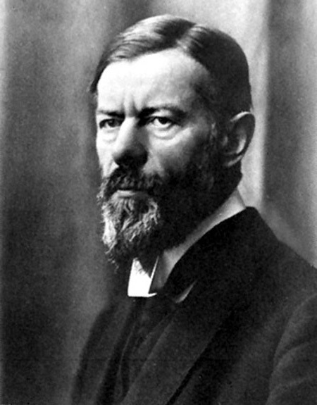

```{r setup, include=FALSE}
knitr::opts_chunk$set(echo = FALSE)
```

# What is Science?<br>What is its value?

## Today's Agenda

### 1. Max Weber

### 2. Science as Vocation Lecture

### 3. Four key lessons about science

### 4. What is our duty as scientists?

# Max Weber



# The Vocation Lectures

## His big question:

### What is the value of science?

### Why should one make it their calling?

## Considers several possibilities:

### Rejects most answers

### Settles on one key reason and our duty

## Rejected Option 1

### Science can get us closer to "God"/ the unity of what is right and what is

## Insight 1

**attributes of science**: science is a form of knowledge concerned with prediction

## Rejected Option 2

### Science can give us new, correct values that replace religion

## Insight 2

**attributes of science**: science cannot tell us how we ought to live our life: it cannot tell us which values we ought to have or what we ought to do

## Insight 3

**attributes of science**: compared to "theology" (unscientific forms of thought), science only assumes that scientific, objective truth exists and is valid, but otherwise all knowledge or claims are open to scrutiny or challenge

**Contrasts this with "theology"**: specific facts/values are taken as "revelation" or "faith" and not open to question

## Rejected Option 3

### Science is an end in itself

## Insight 4

**attributes of science**: science may be assume objective truth but is subjective in that it assumes that it is valuable or worthwhile to know something

# So why do science?

## Weber's Answer:

**clarity**: given certain values we hold and what those values tell us to do, science can clarify for us the means required to achieve those ends and unexpected consequences our actions might entail and whether values are in conflict.

## Duty of Scientists