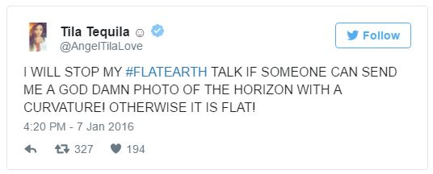

```{r setup, include=FALSE}
knitr::opts_chunk$set(echo = FALSE)
```

# What do we mean by "Truth"?

## Objectives

Getting to the Truth is important...

But what is "truth"?

1. What is a **claim**?
2. What types of **claims** are there?
3. What do we mean by **truth**?
4. What kinds of claims can be judged scientifically?

# Recap

## Three Reasons we need Truth in Politics

1. Weber: Value of science is that it gives us **truth** about whether means achieve our ends

2. Forst: access to **truth** is necessary in order to exercise freedom as autonomy (informed decisions)

3. Arendt: without **truth**, we build a world together on a foundation of shifting lies (which will be chaotic and fall apart)

## But what do we mean by **truth**?

<br>

### **What kinds of *claims* to truth do we make?**

<br>

### **What is our approach to *knowing* or *finding* truth?**


# Reasons and Claims

## Power involves giving Reasons

Forst says that power involves *giving reasons* to motivate people to change what they think and do.

Those *reasons* can be thought of a *claims* about what is true.

## Two Key definitions

### **claim**:

(For our purposes) a statement about what is **valid** or **true** or **right**. 

- If you can add "is true" to the end or "it is true that"/"it is correct to say that" to the beginning of the statement without changing the meaning, it is a (validity) claim.

### Don't overthink this definition. It is as simple as it seems.

## Two Key definitions

### **basis**: 

(For our purposes) the basis for a claim is the ***reason* we should accept** the validity of that claim. It includes 

- the **evidence** that is used to "prove" the claim is true 

- and the **warrant**: assumptions required for the evidence to be valid "proof"

colloquially, we refer to both parts as "evidence"

## An example:

### **claim**: "It rained last night."

### **basis**: "I looked outside and can see the street is wet."

<br>

What is the **evidence**? 

What are the **assumptions** linking that evidence to the claim? 

---

<iframe width="560" height="315" src="https://www.youtube.com/embed/cnw1ohwxQi4?si=BC3RMSk-iuwCG2Qo" title="YouTube video player" frameborder="0" allow="accelerometer; autoplay; clipboard-write; encrypted-media; gyroscope; picture-in-picture; web-share" referrerpolicy="strict-origin-when-cross-origin" allowfullscreen></iframe>

---

## Varieties of Claims

### Three dimensions

1. **Empirical vs. Normative**
2. **Varieties** of empirical and **normative claims/questions**
3. Falsifiable vs. unfalsifiable

## Empirical Claims

#### **empirical claim**:

<br>

is a claim about **what is/what exists** in the world or **how things that exist affect each other**. 

## Normative Claims

#### **normative claim**:

<br>

is a claim about **what is desirable or undesirable**, good or bad. 

- assert what **should or should not** be.
- "should" implied by the language of "right"/"wrong"
- "should" implied by "too much", "enough", or "not enough" of something.
- "should" implied by standards for what is "better"/"worse"

---

Return to the board: look at the reasons/claims given in the ad

- which are empirical? which are normative?


# Empirical Claims

## Descriptive claims:

### **descriptive claims:**

claims about what exists (or has existed/will exist) in the world: 

- **what phenomena exist** (what kinds of things exist?)
- **what is the type of a specific phenomenon** (what is this thing?)
- **amount/frequency of phenomena** (how much of something is there?)
- **relative amount/frequency of phenomena across different places/times** (how much of something is there here vs. there/now vs. then?)
- **what patterns are there in the shared appearance/non-appearance of different phenomena** (does this thing usually appear together with that other thing?)


## Causal claims:

### **causal claims**:

are claims about the how one phenomena ($X$) affects or causes another phenomena ($Y$). Causal claims state that $X$ **acts on** $Y$ in some way, not merely that they appear together in some pattern:

- the **effect** that one thing or event has on another thing (effects of causes)
- the **cause** of some event or thing in the world (causes of effects)
- the *conditions* under which some thing or event *happens* (causes of effects)
- the *process* through which one thing affects another (causes of effects)


## Causal or Descriptive?

(1) Canada is not experiencing an increase in immigration 

(2) Above average immigration rates do not lead to political conflict

(3) New immigrants are employed at rates higher than native born citizens

(4) Below average immigration slows economic growth 

(5) Canada *should* admit 100,000 more immigrants per year


# Normative Claims

## Normative Claims:

#### **value judgments**:

<br>

are normative claims that

- state what goal or ideal is "right" or "good" 
- or provide criteria/rules for judging what is "better" or "worse".

<br>

#### **They are not:**

- empirical claims for which the evidence is **invalid or missing**
- empirical claims that we can't persuade someone to drop in the face of better evidence

## Flat Earth!



## Flat Earth?


---

<smaller>
"Vancouver is a city on the edge. It seems politicians and the police are unable, unwilling or incapable of stopping what has turned into a version of Dante's Hell on the Downtown Eastside — illicit drug sales, open drug use, the stolen property bazaar, garbage, weapons, assaults, rape.

Vancouver no longer has a public health crisis that can be solved by needle exchanges, supervised injection sites, a naloxone-carting population, and pharmaceuticals substituted for illicit drugs. It is going to take more to solve the housing crisis by repurposing older hotels and simply putting roofs over people’s heads — a lot more.

Solving it requires bold leadership and a willingness to go beyond what has been done in the past, using evidence-based solutions that are in the best interests of all residents. Everyone deserves to feel safe, protected and respected, regardless of which neighbourhood they live in."</smaller>

- Editorial in the [Vancouver Sun](https://vancouversun.com/news/daphne-bramham-vancouver-needs-compassionate-solutions-to-street-chaos)


## Prescriptive Claims

#### **prescriptive claims**: 

<br>

are normative claims that assert what kinds of actions **should** be taken 

- hint: like a doctor or pharmacist, it *prescribes* a course of action. 
- there is a connection to reasons given by power.

---

Return to the board: look at the reasons/claims given in the ad

- which are descriptive? causal? value judgments? prescriptive claims?


# Truth


## How do we know something is true?

>- Reality $\to$ Mind

---

What shapes do you see?


---

What color are these fruits?


---

What color are these chess pieces?


---

What color are these fruits?


---


## How do we know something is true?

- Reality $\xrightarrow{}$ Mind
- Reality $\xleftarrow{}$ Mind

Kant lead a kind of "Copernican Revolution"

- our mind is part of reality and it **structures** our perception of reality
- we do not have **direct**/**unmediated** experience of reality.
- we have to reckon with how our perception is limited/flawed/misleading


## How do we know something is true?

Immanuel Kant in the *Critique of Pure Reason* distinguishes between:

***noumena***: the "things in themselves" in their existence **independent** of our perception

***phenomena***: the things **experienced** through the senses and filtered through the categories of our minds

## How do we know something is true?

This puts limits on what we can know to be true:

- We can **never** **know** the *noumena*. We can only seek to make inferences about the independent reality based on the **phenomena**. 
>- "Immanuel Kant, the arch-destroyer in the realm of thought, far surpassed in terrorism Maximilian Robespierre." - Heinrich Heine

## Scientific Truth

We are interested in **scientific truth** attainable through the faculty of Reason. 


**scientific truth** *assumes*:

1. there is an **objective reality** (*noumena*) outside of our perceptions
2. we all *experience* the ***same*** objective reality with others 
3. this reality operates under consistent rules
4. we can only learn about this objective reality **through our sense experiences** (*phenomena*) as filtered through our minds.

>- All other assumptions, concepts, claims are open to challenge. 

## Scientific Truth

Weber (a Kant stan) distinguishes science from "theology" in that 

**In "theology"**: specific facts or values are taken as "revelation" or "faith" and cannot be questioned; other values or facts must be made to fit them.

It makes **more assumptions** than science.

>- "Theology" can be religious but also secular (e.g. free-market capitalism will lift all;  history will progress toward equal society in which all share in owning means of production; technological development will be good for humanity)


## Scientific Truth

If we take up this idea of scientific truth, it has important implications for:

1. **which *types of claims*** we can judge to be true or false
2. **how *we use evidence*** to judge claims to be true or false.


## Scientific Truth and *Value*

In "Science as a Vocation", Weber includes this line:

> **"Science is meaningless because it gives no answer to our question: the only question important for us: What shall we do and how shall we live?"** - Tolstoi 

<br> 

>- Weber's point: scientific truth cannot apply to claims about **value**; cannot address **normative claims**

# What is the best music?

## What is the best music?

Think, then write down...

- genre, artist, or song 

## What is the best music?

In groups, discuss your beliefs about the best music.

Discuss: how would you prove who is right... **scientifically**?

## What is the best music?


## Scientific Truth and Values

Normative claims always reach **beyond empirical experience**.

- thus, we cannot use our sense experiences (phenomena) to learn about them.

Only **empirical claims** can be judged using scientific conception of truth.


# Conclusion

## Conclusion

1. What is a **claim**?
2. What types of **claims** are there: empirical and normative; descriptive and causal; value judgments and prescriptive claims
3. What do we mean by **truth**: scientific truth
4. What kinds of claims can be judged scientifically? Only empirical claims


Next class: HOW do we find truth, using science?
