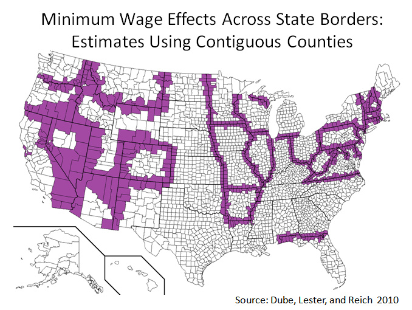
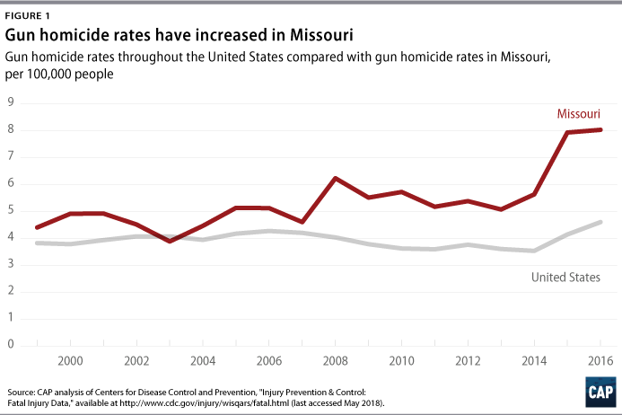
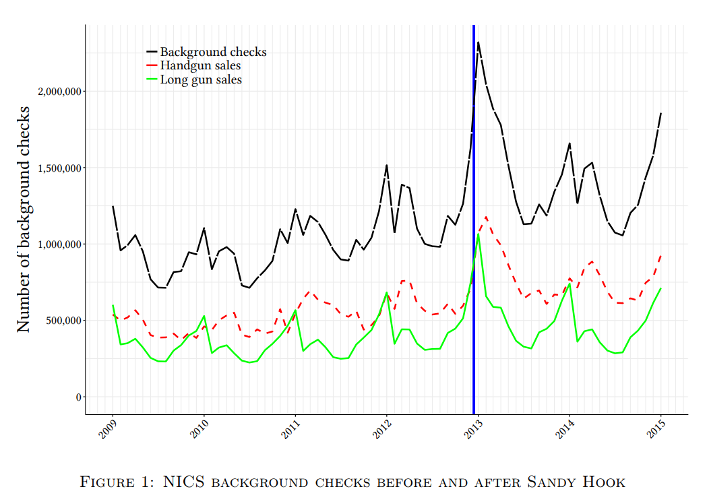
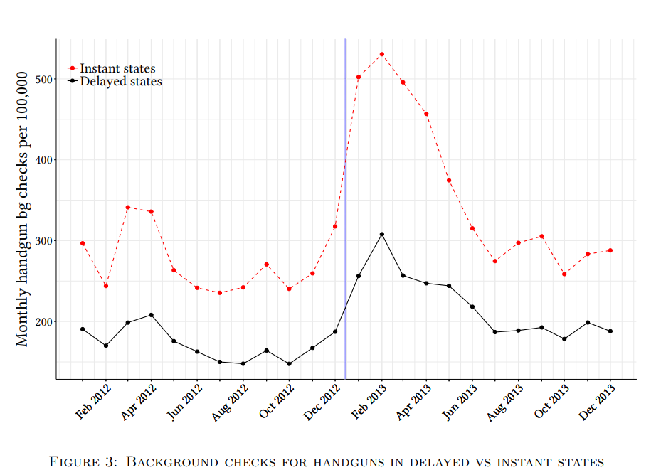
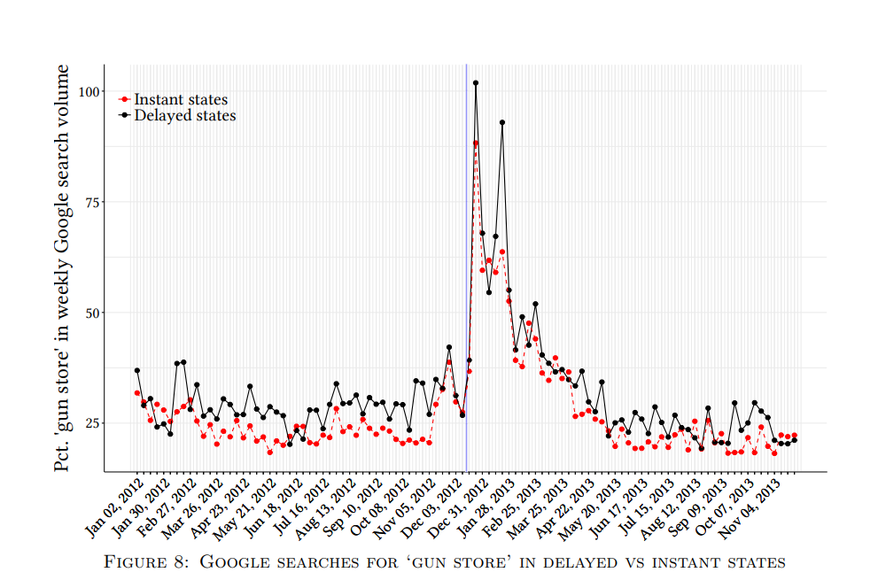
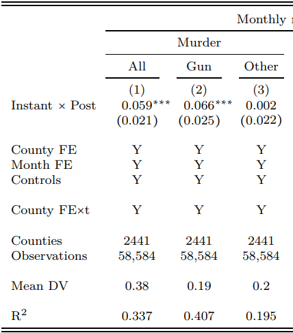

```{r setup, include=FALSE}
knitr::opts_chunk$set(echo = FALSE)
require(knitr)
require(data.table)
require(ggplot2)
require(ggdag)
require(magrittr)
```

<style>
div.footnotes {
  position: absolute;
  bottom: 0;
  margin-bottom: 10px;
  width: 80%;
  font-size: 0.6em;
}
</style>

<script src="https://ajax.googleapis.com/ajax/libs/jquery/3.1.1/jquery.min.js"></script>

<script>
  $(document).ready(function() {
    $('slide:not(.backdrop):not(.title-slide)').append('<div class=\"footnotes\">');

    $('footnote').each(function(index) {
      var text  = $(this).html();
      var fnNum = (index+1).toString().sup();
      $(this).html(text + fnNum);

      var footnote   = fnNum + ': ' + $(this).attr('content') + '<br/>';
      var oldContent = $(this).parents('slide').children('div.footnotes').html();
      var newContent = oldContent + footnote;
      $(this).parents('slide').children('div.footnotes').html(newContent);
    });
  });
</script>

# Correlation to Causation

## Plan for Today:

### **(1) Solutions for Bias**

- design-based
    - similar cases, same time
    - difference in difference
    
# Design-Based Solutions

## Design

### **Types of designs:**

<u>Designs using conditioning</u>

- Compare same case over time
- Compare cases known to be similar at same time
- "Differences in Differences"

<u>Designs using random exposure to $X$</u>

- experiments
- "natural experiments"


## Design: Similar Cases

How do we deal with variables that **change over time**?

- We can look at cases that we expect to be similar on many attributes (usually due to spatial and temporal proximity)

What does this do? Comparisons like this:

- Conditions on/eliminates **all confounding variable** that are the **same** across cases
    - e.g. all confounding variables at country, province, neighborhood-level
    - including things that might change over time and affect cases equally

## Design: Similar Cases

**What is it?**

- Compare the similar cases (due to geographic/cultural proximity) with different values of $X$ at same time

**How does it work?**

- holds **constant** all variables that are the same across these cases, including things that change over time.

**Assumptions to get causality**:

- Cases that are "similar" but have different values of $X$ are not different on variables $W$ that affect $Y$
    - They are not different in **unchanging** or **changing** ways at the time of the comparison

## Design: Similar Cases



## Design: Similar Cases

**What is it?**

- Compare the counties on border between two states at same time; one state has higher minimum wage

**How does it work?**

- Holds constant any shared **unchanging** variables (e.g. natural resources, transport infrastructure)
- Holds constant any shared **CHANGING** variables (shared regional economic growth)

**Assumptions to get causality**:

- Unemployment in counties in "minimum wage" unaffected by persistent/shifting differences b/t states (e.g. other policy differences, changing party in power)

## Design

**Same Case Over Time**

- **removes** confounding from **unchanging** attributes of the case
- **leaves** confounding from **changes** in the case over time

**Similar Cases Same Time**

- **removes** confounding from <u>shared</u> attributes of cases (**unchanging** or **changing**)
- **leaves** confounding from **unchanging differences** between cases
- **leaves** confounding from **changing differences** between cases

## Design: Difference in Difference

**What is it?**

- Compare "treated" cases to "untreated" cases before and after the "treatment"

**How does it work?**

- Hold constant **unchanging** attributes of cases (compare same case before and after "treatment")
- Hold constant variables that **change together** over time in "treated" and "untreated" cases

## Design: Difference in Difference

Consider 2 states $State_A$ and $State_B$ at two times $Before$ and $After$

- $State_T$ sees an increased number of guns between $Before$ and $After$
- $State_C$ sees no change in guns

We measure $Homicide$ ($Y$) in both states. 

## Design: Difference in Difference

So:

- $FirstDiff = Homocide_{Before} - Homicide_{After}$ gives us change in murders in a $State$...
    - holding **unchanging attributes of state** constant (*same case over time*)
- $SecondDiff = FirstDiff_{T} - FirstDiff_{C}$ gives us change in murders in $Treated$ over time, compared to $Control$
    - holding **shared trends of both states** constant (*similar cases at same points in time*)

## Design: Difference in Difference

|                   | $Homocide_{Before}$ | $Homicide_{After}$ | **First Difference** |
|-------------------|:--------:|:--------:|:----------------:|
| $State_T$         |   $15$  |   $14$  |       $-1$      |
| $State_C$         |   $20$  |   $16$  |       $-4$      |
| **Second Difference** |          |          |      $3$      |

## Design: Difference in Difference

**What is it?**

- Compare "treated" cases to "untreated" cases before and after the "treatment"

**How does it work?**

- Removes confounding from **unchanging** attributes of cases
- Removes confounding from variables that **change** similarly in treated and untreated cases

**Assumption**:

- "Untreated" case has the trend the "Treated" case **would have had** except for the "treatment"
- no variables that affect $Y$ and change over time differently in "treated" and "untreated" cases

## Design: Difference in Difference

**Assumption**:

- we assume "untreated" is the "counterfactual trend" for the "treated"
- we assume "treated" and "untreated" have the "parallel trends"

## Design: Difference in Difference




## Design: Difference in Difference


```{r, echo = F}

dd = data.table(State = rep(c('Treated', 'Control'), each = 6),
                Time = rep(-4:1, 2),
                Baseline = rep(c(0,5), each = 6),
                Trend = rep(c(rpois(4, 20),15,11) , 2),
                D = rep(c(3,0), each = 6)
                )
dd[, Homicides_Ct := Baseline + Trend]
dd[, Homicides := Homicides_Ct]
dd[State == 'Treated' & Time > 0, Homicides := Homicides + D]

ggplot(dd, aes(x = Time, y = Homicides, group = State, color = State)) +
  geom_vline(aes(xintercept = 0.5), color = 'gray', size = 2) +
  geom_line() + 
  geom_line(mapping = aes(x = Time, y = Homicides_Ct, group = State, color = State), linetype = 2) +
  geom_segment(mapping = aes(x = 1, xend = 1, y = 11, yend= 14), color = 'black') +
  theme_bw() + ylim(c(0,max(dd[, list(Homicides, Homicides_Ct)]))) +
  geom_text(aes(x = 0.65, y = 12.5, label = "Effect: +3"), color = "black") + 
  theme(legend.position="bottom") 

```

## Difference in Difference: Example

Does increase in gun ownership lead to more violence?

### Evidence so far

- In unadjusted correlation between states: no relationship
- In "same case over time": positive relationship

## Difference in Difference: Example

**Koenig and Schindler 2018**

### Study:

- December 2012, Sandy Hook shooting raised debate on gun control
- Gun purchases rose dramatically following the shooting
- Did increases in guns lead to more violent deaths?

## Difference in Difference: Example



## Difference in Difference: Example

But could there be **other** changes before and after Sandy Hook that affect crime other than guns?

### Difference-in-difference

Despite increase in **demand** for guns after Sandy Hook

- increase in gun purchases differ by state due to rules about waiting
    - some states permit purchasing guns immediately
    - other states require a **waiting** period to purchase a gun

- First Difference: compare counties to themselves before and after Sandy Hook
- Second Difference: compare change in counties in "instant" (treated) versus "delayed" (control states)

## Difference in Difference: Example

Do states with no waiting periods, compared to states with waiting periods

- see greater increases in gun purchases post-Sandy Hook ?
- see greater increases in gun violence post-Sandy Hook?

Holding constant:

- all unchanging attributes of a county
- any national trends in violent crime

## Difference in Difference: Example



## Difference in Difference: Example



## Difference in Difference: Example

Assumptions appear to hold:

- Counties in states with and without waiting periods have similar trends in gun purchases
- In both kinds of states, an similar increase in **demand** for guns, but policy limits number obtained


## Difference in Difference: Example



## Difference in Difference: Example

**Key Assumption**:

- No variables that are changing **differently** in "instant" gun states versus "wait" gun states in the time before and after Sandy Hook.
- Plausible:
    - short time period
    - pre-Sandy Hook trends are similar in both kinds of states