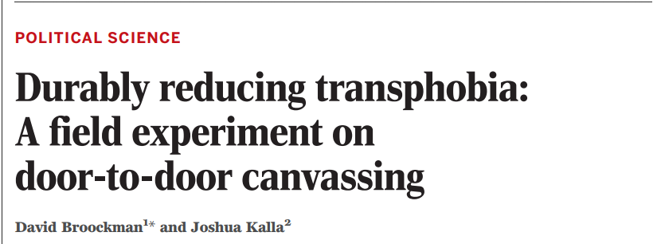

```{r setup, include=FALSE}
knitr::opts_chunk$set(echo = FALSE)
```

# Unscientific Evidence


## Objectives

### 1) What makes for "unscientific" evidence?

### 2) What are some examples of "unscientific" evidence?

### 3) **Objective**:

- **identify** unscientific evidence
- explain **why** it is unscientific

# Recap

## Claims and Bases

### **claims**: statements about what is true or valid

<br>

### **bases**: evidence (and assumptions about valid evidence) that support those claims

## Scientific Evidence:

### <u>**Transparent procedures**</u>

### **Systematic use of evidence**

### **Test claim against alternatives**

### **Acknowledge uncertainty**

## **Transparent procedures**


## **Transparent procedures**



# Unscientific Evidence

# {.centered}


## Paraphrasing Tolstoi

### **All [instances of scientific evidence] is alike; each [instance of unscientific evidence] is [unscientific] in its own way.**

## Paraphrasing Tolstoi

Despite an infinite number of topics for research:

- **Scientific** evidence shares similarities in how it adheres to the four attributes.
- **Unscientific** evidence can fail to meet four criteria in many **different** ways.

# {.centered}

[click here](https://video.foxnews.com/v/6051098424001#sp=show-clips)

## Stop and think:

1) **What is the guest's argument (claim)?**

2) **What is the primary evidence she offers to support it?**

3) **How does this evidence fail to meet the attributes (of scientific evidence)?**

#

## Unscientific Evidence: Personal experience

Evidence that appeals to **personal experience**:

> A claim based on one's own personal (nonsystematic) observation or one's own reaction to an observation

### Examples

"No one I knew voted for ____, so they must have cheated to win."

## Unscientific Evidence: Personal experience

### Personal experience can be misleading:

- We **generalize too quickly** from a small number of cases (<strike>acknowledge uncertainty</strike>)

- Our exposure to the world may be **skewed** (<strike>systematic use of evidence</strike>)

- We **observe** the world **selectively** (<strike>consider alternatives</strike>; <strike>systematic use of evidence</strike>)

## Personal experience: Generalize too quickly

### Claim
"I have a gluten intolerance". 

### Evidence

"I had [some product] a few times and each time I felt sick to my stomach afterwards."

## Personal experience: Skewed Exposure

### Claim

"Illegal immigrants are criminals."

### Evidence

"In news stories I see, most of the criminals are illegal immigrants."

## Selective Perception

### Claim

"Large, public places like mass transit are more dangerous than driving."

### Evidence 

"Remember all those terrorist attacks or mass shootings in public places and public transit?"

# {.centered}

<iframe width="560" height="315" src="https://www.youtube.com/embed/aASfk-ii0BM" frameborder="0" allow="accelerometer; autoplay; encrypted-media; gyroscope; picture-in-picture" allowfullscreen></iframe>

## Stop and think:

1) **What is his main argument (claim)?**

2) **What is the primary evidence he offers to support it?**

3) **How does this evidence fail to meet the four attributes (of science)?**

#

## What kind of claim is that?

### Appeal to common sense

## Evidence from common sense:

- argue that a **claim is true** because it is something "**everyone knows**" or "**just makes sense**"

## Unscientific Evidence: Common Sense

### Problems with common sense

- Often based on **analogy** emphasizing **superficial similarities** between **very different situations** (<strike>systematic use of evidence</strike>)

- Often common sense reasons **against** the claim (<strike>consider alternatives</strike>)

## False analogies

### Claim: 

In 2003:

> "US military invasion in Iraq will bring peace, democracy, and economic growth to the country."

### Evidence?:

> "US invasion of Germany (1945) brough end to war, removal of Nazis, democracy, and a growing economy."


## Opposite claims possible

### Claim 


## Opposite claims possible

### Counterclaim


# {.centered}

<blockquote class="twitter-tweet"><p lang="en" dir="ltr">White House senior advisor doubles down on voter fraud claims: “Voter fraud is a serious problem in this country” <a href="https://t.co/DC6lVPQznz">pic.twitter.com/DC6lVPQznz</a></p>&mdash; ABC News (@ABC) <a href="https://twitter.com/ABC/status/830787890309369856?ref_src=twsrc%5Etfw">February 12, 2017</a></blockquote> <script async src="https://platform.twitter.com/widgets.js" charset="utf-8"></script>

## Stop and think:

1) **What is Miller's main argument (claim)?**

2) **What is the primary evidence he offers to support it?**

3) **How does this evidence fail to meet the four attributes (of science)?**

#

## What kind of claim is that?

### Appeal to authority

<br>

Arguing that claim is true **because** a person **with authority** says it is true.

## Problems with authority

1. Experts may be wrong/expertise irrelevant (<strike>Transparent Procedures</strike>)
2. Experts may have an agenda (<strike>Transparent Procedures</strike>)
3. We can "cherry pick" supportive experts (<strike>systematic use of evidence</strike>)
4. Experts can disagree (<strike>acknowledge uncertainty</strike>)

## Expertise wrong/irrelevant

### Claim: 

> As far as the cyber, I agree to parts of what Secretary Clinton said. We should be better than anybody else, and perhaps we're not. I don't think anybody knows it was Russia that broke into the DNC. I mean, it could be Russia, but it could also be China. It could also be lots of other people. ... So we have to get very, very tough on cyber and cyber warfare. It is — it is a huge problem. ... The security aspect of cyber is very, very tough. And maybe it's hardly doable.

- Donald Trump

### Evidence:

> I have a son. He's 10 years old. He has computers. He is so good with these computers, it's unbelievable.

## Experts are motivated

### Claim:

> "You should take this brand-name statin, X, to reduce your cholesterol." 

### Evidence

> "I am a doctor."

>- Undisclosed: I receive free meals from the manufacturer of drug X.

## Cherry picking experts

### Claim:

> Removing restrictions on gun ownership stops crime.

### Evidence

> National Association of Chiefs of Police surveyed 20,000 sheriffs and chiefs of police, and found that vast majority agreed that "armed citizens help law enforcement reduce violent criminal activity".

>- This ignores police chiefs who publicly call for gun restrictions

## Proliferating authorities

**What do we do when some experts say one thing, and others say another?**

- Without features of scientific evidence, we can choose any expert we want.

>- Consider debates about climate change: people cite competing surveys of experts

## **claim** {.centered}

### **You should drink less coffee.**

# {.centered}


# Do you believe this?

## Experts

### Beware: 

- The basis of authority is often "science"/"researchers"/"studies"
- This changes science into a kind **magic**

## Transparency


## Worst case scenario:

### [Studies Show That You Should Come Into This Room Right Over Here, And That You Should Come Alone](https://the-toast.net/2015/06/24/studies-show-that-you-should-come-into-this-room-right-over-here-and-that-you-should-come-alone/)

# Conclusion:

## Conclusion:

1. **Many ways for claims to be unscientific**
2. **Comes down to not meeting four attributes of scientific evidence**
3. **You can recognize when this happens**
4. **Even appeals "scientists" may be unscientific**
