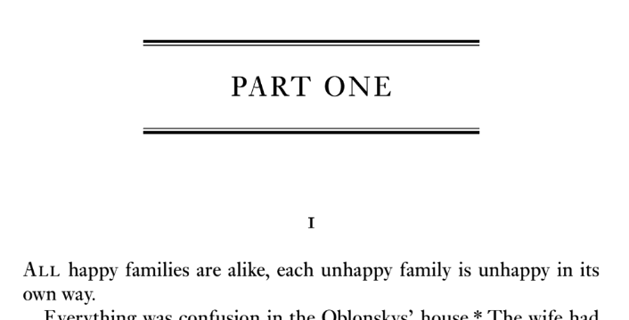
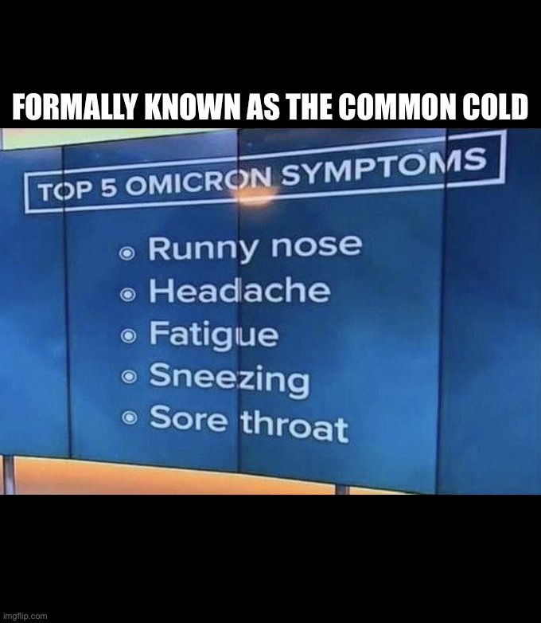
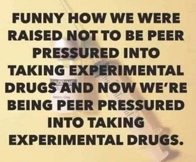
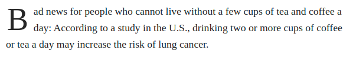
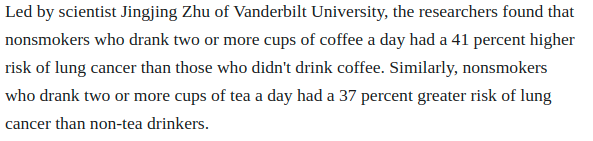
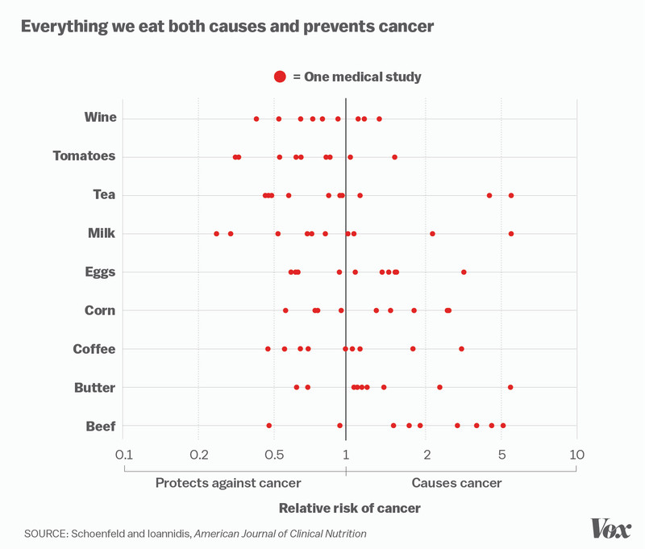

```{r setup, include=FALSE}
knitr::opts_chunk$set(echo = FALSE)
```

# Unscientific Evidence


## Objectives

### 1) What makes for "unscientific" evidence?

### 2) What are some examples of "unscientific" evidence?

### 3) **Objective**:

- **identify** unscientific evidence
- explain **why** it is unscientific

# Recap

## Scientific Evidence:

### <u>**Transparent procedures**</u>

### **Systematic use of evidence**

### **Test claim against alternatives**

### **Acknowledge uncertainty**

# Unscientific Evidence

# {.centered}



## Paraphrasing Tolstoi

### **All [instances of scientific evidence] is alike; each [instance of unscientific evidence] is [unscientific] in its own way.**

## Paraphrasing Tolstoi

Despite an infinite number of topics for research:

- **Scientific** evidence shares similarities in how it adheres to the four attributes.
- **Unscientific** evidence can fail to meet four criteria in many **different** ways.

# {.centered}

<iframe width="560" height="315" src="https://www.youtube.com/embed/aWCJz-qOOaw" frameborder="0" allow="accelerometer; autoplay; clipboard-write; encrypted-media; gyroscope; picture-in-picture" allowfullscreen></iframe>


## Let's discuss (in order)

1) **What is the guest's argument (claim)?**

2) **What is the primary evidence he offers to support it?**

3) **How does this evidence fail to meet the attributes (of scientific evidence)?**


## Unscientific Evidence: Personal experience

### **Appeals to personal experience**:

> A claim based on one's own personal (nonsystematic) observation or one's own reaction to an observation

## Unscientific Evidence: Personal experience

### Personal experience can be misleading:

- We **generalize too quickly** from a small number of cases (<strike>acknowledge uncertainty</strike>)

- Our exposure to the world may be **skewed** (<strike>systematic use of evidence</strike>)

- We **observe** the world **selectively** (<strike>consider alternatives</strike>; <strike>systematic use of evidence</strike>)

## Personal experience: Generalize too quickly

### Claim

"Masks don't help prevent COVID". 

### Evidence

"I went into a crowded store with an N95 mask and got COVID"

## Personal experience: Skewed Exposure

### Claim

"Biden fraudulently stole the election"

### Evidence

"Nobody I know voted for Biden."

## Selective Perception

### Claim

"Taking mass transit is more dangerous than driving."

### Evidence 

"Terrorist attacks and mass shootings have targeted mass transit"

## Selective Perception


## *Side note*

This does not mean:

- evidence from personal/lived experience is always wrong
- evidence from personal/lived experience cannot be important/informative

# {.centered}

<iframe width="560" height="315" src="https://www.youtube.com/embed/cJiil3IRo10?start=163" title="YouTube video player" frameborder="0" allow="accelerometer; autoplay; clipboard-write; encrypted-media; gyroscope; picture-in-picture" allowfullscreen></iframe>

## Let's discuss (in order)

1) **What is his main argument (claim)?**

2) **What is the primary evidence he offers to support it?**

3) **How does this evidence fail to meet the four attributes (of science)?**


## Evidence from common sense:

### **Appeal to common sense**

- argue that a **claim is true** because it is something "**everyone knows**" or "**just makes sense**"

## Unscientific Evidence: Common Sense

### Problems with common sense

- Often based on **analogy** emphasizing **superficial similarities** between **very different situations** (<strike>systematic use of evidence</strike>)

- Often common sense reasons **against** the claim (<strike>consider alternatives</strike>)

## False analogies



## False analogies




## False analogies


## Opposite claims possible

### Claim 


## Opposite claims possible

### Counterclaim


# {.centered}

<blockquote class="twitter-tweet"><p lang="en" dir="ltr">White House senior advisor doubles down on voter fraud claims: “Voter fraud is a serious problem in this country” <a href="https://t.co/DC6lVPQznz">pic.twitter.com/DC6lVPQznz</a></p>&mdash; ABC News (@ABC) <a href="https://twitter.com/ABC/status/830787890309369856?ref_src=twsrc%5Etfw">February 12, 2017</a></blockquote> <script async src="https://platform.twitter.com/widgets.js" charset="utf-8"></script>

## Let's discuss (in order)

1) **What is Miller's main argument (claim)?**

2) **What is the primary evidence he offers to support it?**

3) **How does this evidence fail to meet the four attributes (of science)?**

## What kind of claim is that?

### Appeal to authority

<br>

Arguing that claim is true **because** a person **with authority** says it is true.

## Problems with authority

1. Experts may be wrong/expertise irrelevant (<strike>Transparent Procedures</strike>)
2. Experts may have an agenda (<strike>Transparent Procedures</strike>)
3. We can "cherry pick" supportive experts (<strike>systematic use of evidence</strike>)
4. Experts can disagree (<strike>acknowledge uncertainty</strike>,<strike>consider alternatives</strike>)

## Expertise wrong/irrelevant

### Claim: 

> "As far as the cyber ... I don't think anybody knows it was Russia that broke into the DNC. I mean, it could be Russia, but it could also be China. It could also be lots of other people. ... So we have to get very, very tough on cyber and cyber warfare. It is — it is a huge problem. ... The security aspect of cyber is very, very tough. And maybe it's hardly doable." - Donald Trump

### Evidence:

> I have a son. He's 10 years old. He has computers. He is so good with these computers, it's unbelievable.

## Expertise wrong/irrelevant

### Claim: 

> There is a "hidden variable" that explains the apparent randomness in quantum mechanics.

### Evidence:

> "God does not play dice" - Albert Einstein


## Experts are motivated

### Claim:

> "You should take hydrocodone or oxycodone to manage your pain." 

### Evidence

> "I am a doctor."

>- Undisclosed: The maker of those drugs provides me free lunches; pays for my conference travel (see [here](https://onlinelibrary.wiley.com/doi/full/10.1111/add.14509))


## Cherry picking experts

### Claim:

> Fraud in 2020 Election

### Evidence

<blockquote class="twitter-tweet"><p lang="en" dir="ltr">Hot off press, new Lott study estimates 11,350 absentee votes lost to <a href="https://twitter.com/POTUS?ref_src=twsrc%5Etfw">@potus</a> Trump in Georgia. Another 289,000 &quot;excess (fraudulent) votes&quot; across GA, AZ, MI, NV, PA, WI. As promised this a.m. on Bannon&#39;s War Room. Postpone GA Cesspool election!! <a href="https://t.co/geqEhnKqCR">https://t.co/geqEhnKqCR</a></p>&mdash; Peter Navarro (@RealPNavarro) <a href="https://twitter.com/RealPNavarro/status/1343979253659004928?ref_src=twsrc%5Etfw">December 29, 2020</a></blockquote> <script async src="https://platform.twitter.com/widgets.js" charset="utf-8"></script> 

## Cherry picking experts

<blockquote class="twitter-tweet"><p lang="en" dir="ltr">In a recent paper @JohnLottJr purports to show evidence of fraud in GA and PA in the 2020 election. In a new paper, we (<a href="https://twitter.com/aeggers?ref_src=twsrc%5Etfw">@aeggers</a>, Haritz Garro, and me) show that Lott’s claims are based on a fatal flaw. Once corrected, there is no evidence for fraud. <a href="https://t.co/yVtTIdBC0Q">https://t.co/yVtTIdBC0Q</a> <a href="https://t.co/dYwQazZICj">pic.twitter.com/dYwQazZICj</a></p>&mdash; justingrimmer (@justingrimmer) <a href="https://twitter.com/justingrimmer/status/1346144084902072320?ref_src=twsrc%5Etfw">January 4, 2021</a></blockquote> <script async src="https://platform.twitter.com/widgets.js" charset="utf-8"></script> 

## Proliferating Authorities


## Proliferating Authorities

**What do we do when some experts say one thing, and others say another?**

- Without features of scientific evidence, no basis for distinguishing between experts.
- We can choose whatever expert/study we want (becomes theology)

## **claim** {.centered}

<h2> **You should drink less coffee or tea.** </h2>

# {.centered}

<h2>**Evidence**</h2>
<br>




# {.centered}

<h2>POLL</h2>


## 



---

### [Studies Show That You Should Come Into This Room Right Over Here, And That You Should Come Alone](https://the-toast.net/2015/06/24/studies-show-that-you-should-come-into-this-room-right-over-here-and-that-you-should-come-alone/)

> Recent studies suggest that it's very important that you come into this room right over here just now. Studies also suggest that it's equally important you do not waste time asking questions ... but just step this way through the door very quickly and by yourself, immediately. 
>
> The studies were conducted, and the evidence is conclusive: this room just over here is where you should go next, without anyone coming with you. Scientists did them, the studies. Which ones? Yes.
>
>The studies are all finished now, and you don’t need to see them. The studies suggested that it’s not important you see the studies at all, but it is important that you hurry along, quickly now, because time is of the essence. The studies say now is the best time for you to be alone in that room.

## Appeal to Authority

### Beware: 

- Appeals to the **authority** of "science"/"researchers"/"studies"
- This changes science into **magic**

Does not mean **distrust** scientists/experts, but instead...

- credentials may be useful, but cannot be the only basis of trust
- does their work have transparency, systematic evidence, consideration of alternatives, acknowledgement of uncertainty?
- what are the assumptions they make>

## Appeal to Authority

It is **reasonable** and **scientific** to interrogate the evidence and assumptions the are used to support a claim:

- ordinary people *should* ask questions, but need the skills to do so
- scientists *should* answer those questions, but need the skills to do so

## Conclusion:

1. **Many ways for claims to be unscientific**
2. **Comes down to not meeting four attributes of scientific evidence**
3. **You can recognize when this happens**

>- In this course, introduce you to common problems that arise when we present evidence for claims, possible solutions

