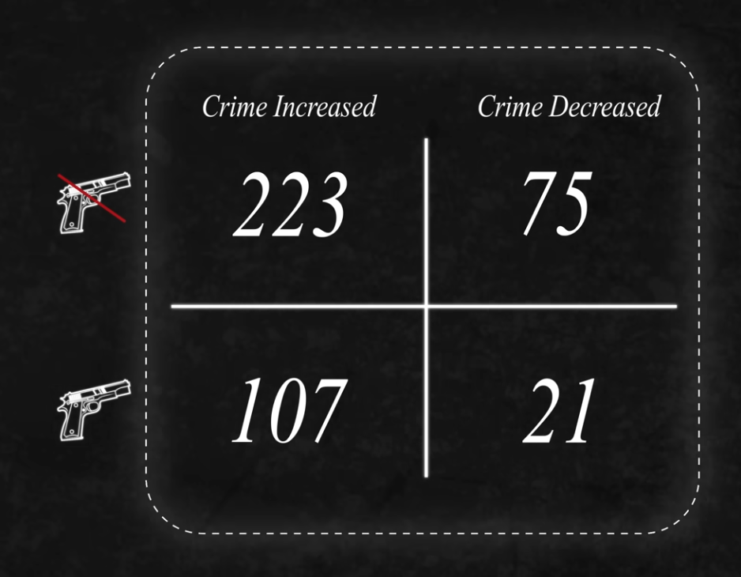
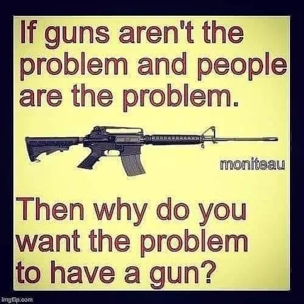

```{r setup, include=FALSE}
knitr::opts_chunk$set(echo = FALSE)
```

# What is Science?

## Plan for Today

1. Review

2. What claims can science test?

3. What is scientific evidence?

  - confirmation vs. falsification
  - weak severity requirement

  
# Recap


## Review

- Truth in politics is important
- What do we mean by "truth"?
    - **what** types of claims?
    - **how** do we know claims are true?


## Two Key definitions

### **claim**:

(For our purposes) a statement about what is **true** or **right**. 

- If you can add "is true" to the end or "it is true that" to the beginning of the statement without changing the meaning, it is a claim.

### Don't overthink this definition. It is as simple as it seems.

## Two Key definitions

### **basis**: 

(For our purposes) the basis for a claim is the ***reason* we should accept** the truth or validity of that claim. It includes 

- the **evidence** that is used to "prove" the claim is true 

- and the **warrant**: assumptions required for the evidence to be valid "proof"

colloquially, we refer to both parts as "evidence"


## Empirical or Normative? {.smaller}

(1) **Since 2023, 90,000 people have been laid off by U.S. employers attributing the cuts to AI adoption.**

(2) **The occupations most exposed to AI automation are concentrated in clerical, administrative, and customer-support roles.**

(3) **Tech industry executive: "Companies that refuse to use AI to cut labor costs will be left behind, and that's simply the cost of progress."**

(4) **Widespread AI adoption reduces bargaining power and job security for low-wage workers in customer service and data-entry roles.**

(5) **AI adoption has increased overall employment by creating more new jobs than it has displaced.**

(6) **Governments should heavily regulate or slow AI deployment in the workplace to protect existing jobs.**


## Empirical or Normative? {.smaller}


(1) **Since 2023, 90,000 people have been laid off by U.S. employers attributing the cuts to AI adoption.** (empirical)

(2) **The occupations most exposed to AI automation are concentrated in clerical, administrative, and customer-support roles.** (empirical)

(3) **Tech industry executive: "Companies that refuse to use AI to cut labor costs will be left behind, and that's simply the cost of progress."** (normative)

(4) **Widespread AI adoption reduces bargaining power and job security for low-wage workers in customer service and data-entry roles.** (empirical)

(5) **AI adoption has increased overall employment by creating more new jobs than it has displaced.** (empirical)

(6) **Governments should heavily regulate or slow AI deployment in the workplace to protect existing jobs.** (normative)

## Scientific Truth 

**scientific truth** *assumes*:

1. there is an **objective reality** (*noumena*) outside of our perceptions
2. we all *experience* the ***same*** objective reality with others 
3. this reality operates under consistent rules
4. we can only learn about this objective reality **through our sense experiences** (*phenomena*) as filtered through our minds.

>- All other assumptions, concepts, claims are open to challenge. 

## Scientific Truth

**Science** is distinct as a form of thought in that: 

#### (1) Only certain *claims* can be investigated 

<br>


#### (2) Has special rules for using evidence and making assumptions to evaluate claims

<br>


# Which claims?

## What is the best music?

Think, then write down...

- genre, artist, or song 

## What is the best music?

In groups, discuss your beliefs about the best music.

Discuss: how would you prove who is right... **scientifically**?

## Scientific Truth and Values

Normative claims always reach **beyond empirical experience**.

- thus, we cannot use our sense experiences (phenomena) to learn about them.

Only **empirical claims** can be judged using **scientific evidence**.


# What is makes evidence <br> "scientific"?

---

**What are key attributes of "scientific evidence"?**

(Respond with only a word or two)

---

<iframe width="560" height="315" src="https://www.youtube.com/embed/5T_KN8Ok718?si=gIyd3p_9eureVRoV" title="YouTube video player" frameborder="0" allow="accelerometer; autoplay; clipboard-write; encrypted-media; gyroscope; picture-in-picture; web-share" referrerpolicy="strict-origin-when-cross-origin" allowfullscreen></iframe>

---

>  "It is a vast domestic terror movement. With God as my witness, we are going to use every resource we have at the Department of Justice, Homeland Security, and throughout this government to identify, disrupt, dismantle and destroy these networks and make America safe again for the American people." - Steven Miller, White House Depute Chief of Staff

---

- [Center for Strategic and International Studies](https://www.csis.org/analysis/global-terrorism-threat-assessment-2024) found that between 2017 and 2022: "Violent far-right extremist have been responsible for 94 of the 108 terrorism fatalities (87 percent) in the United States in the past five years. This included 2022, when 18 of the 19 fatalities occurred during far-right terrorist attacks."

- [Cato Institute](https://www.alexnowrasteh.com/p/politically-motivated-violence-is) found that since 1975, of murders in terrorist attacks (excluding 9/11), 63 percent committed by right-wing, 10 percent by left-wing

>- Is this evidence persuasive? Why or why not?


## 2020 Election Fraud


## 2020 Election Fraud

"Storming of US Capitol on January 6, 2021 was justified."

Reasons:

$Claim:$ **"Presidential Election in Georgia was fraudulently stolen from Donald Trump"**. "counting of [absentee] ballots [in Fulton county - Atlanta] took place in secret after Republican Party observers were dismissed because they were advised that the tabulation center was shutting down for the night."


## 2020 Election Fraud

$Claim:$ **Presidential Election in Georgia was fraudulently stolen from Donald Trump** 

1. If the claim were true, **then** $\xrightarrow{implies}$ absentee ballots from precincts in Fulton County should be pro-Biden more than absentee ballots from neighboring voting precincts just across the county line in **other counties** (where tabulation did not allegedly take place is secret)

(Board)

## 2020 Election Fraud

$Claim:$ **Presidential Election in Georgia was fraudulently stolen from Donald Trump** 

1. If the claim were true, **then** $\xrightarrow{implies}$ absentee ballots from precincts in Fulton County should be pro-Biden more than absentee ballots from neighboring voting precincts just across the county line in **other counties** (where tabulation did not allegedly take place is secret)

2. Researcher found absentee ballots from Fulton county precincts were more pro-Biden than neighboring counties: [see here](https://papers.ssrn.com/sol3/papers.cfm?abstract_id=3756988)

3. Therefore, concludes: "Fraud in Georgia Election"


## 2020 Election Fraud


Is this evidence persuasive? Why or why not?


## An illustration


Imagine two groups of cities: Some passed restrictions on handgun purchasing and ownership; some did not. Then we counted number of cities where crime increased or decreased

---



Did gun control increase or decrease crime?

## An illustration

<iframe width="560" height="315" src="https://www.youtube.com/embed/zB_OApdxcno?si=pvCUx8Gqudl36Zns&amp;start=310" title="YouTube video player" frameborder="0" allow="accelerometer; autoplay; clipboard-write; encrypted-media; gyroscope; picture-in-picture; web-share" referrerpolicy="strict-origin-when-cross-origin" allowfullscreen></iframe>


## Confirmation Bias

We evaluate/interpret evidence in a way that aligns with our existing views...

- we look for evidence that supports our beliefs (b/c it feels good), discount/explain away evidence that does not.
- how can we avoid this limitation?


# Scientific Evidence

## Logic of inference

### **confirmation**

If we have an empirical claim, $C_1$ ($C$ for claim)

and, if $C_1$ (**claim**) were true, then it implies we should make certain empirical **observations** $O_1$

Confirmation says that

1. $C_1 \xrightarrow{implies}$ we see $O_1$

2. If we see $O_1$

3. Then, $C_1$ is true (or, more "likely" to be true)

## Confirmation

$C_1:$ **Presidential Election in Georgia was fraudulently stolen from Donald Trump** 

1. If $C_1$ were true, **then** $\xrightarrow{implies}$ $O_1:$ absentee ballots from precincts in Fulton County should be pro-Biden more than absentee ballots from neighboring voting precincts just across the county line in **other counties** (where tabulation did not allegedly take place is secret)

2. $O_1:$ Researcher finds absentee ballots from Fulton county precincts were more pro-Biden than neighboring counties.

3. Therefore, concludes: "Fraud in Georgia Election", $C_1$ is true


## Confirmation

Many reject **confirmation:** because **many different**, incompatible **claims** are **consistent with the same observed evidence**. We are prone to **confirmation bias.**

1. $(C_1, C_2, \ldots, C_k) \xrightarrow{imply}$ we see $O_1$

2. If we see $O_1$

3. Then, $C_1$ is *not proven*

<br>

>- Because we would observe $O_1$ if, e.g. $C_2$ were true and $C_1$ false.

## 2020 Election Fraud

$C_1:$ **Presidential Election in Georgia was fraudulently stolen from Donald Trump** 

<u>**Confirmation?**</u>

1. $C_1 \xrightarrow{implies}$ absentee ballots from precincts in Fulton County should be pro-Biden more than absentee ballots from neighboring voting precincts just across the county line in **other counties**

2. Researcher finds absentee ballots from Fulton county precincts were more pro-Biden than neighboring counties.

3. Therefore, "Fraud in Georgia Election"

---

- $C_1:$ **Presidential Election in Georgia was fraudulently stolen from Donald Trump**
- $C_2:$ **People select residence based on partisanship**
- $C_3:$ **People select residence based on racial composition of schools**   

1. $(C_1, C_2, C_3) \xrightarrow{imply}$: Absentee ballots in Fulton County more Pro-Biden than neighboring counties

2. Researcher finds absentee ballots from Fulton county precincts were more pro-Biden than neighboring counties.

3. Therefore, $C_1, C_2, or \ C_3$ could be true


## Falsification vs Confirmation

### **The difference**

**Confirmation** looks to see: is there evidence that the claim is **right**

**Falsification** looks to see: is there evidence that the claim is **wrong**

- we can fail to find evidence that would rule out the claim
- it never says "claim is correct", it says "we haven't rejected this, yet"


## Falsification

Logic of **falsification**: what is implication $O_1$ that we **should not see** if claim is true?

1. $C_1 \xrightarrow{implies}$ we do **not** see $O_1$
2. If we **see** $O_1$
3. Then, reject $C_1$

## Falsification

1. $C_1$ all swans are white $\xrightarrow{implies}$ we do not see black swans ($O_1$)
2. If we see $O_1$ (a black swan)
3. Then, reject $C_1$

>- Is it really so easy?

---

<iframe width="560" height="315" src="https://www.youtube.com/embed/7vrP8EplfP0" title="YouTube video player" frameborder="0" allow="accelerometer; autoplay; clipboard-write; encrypted-media; gyroscope; picture-in-picture" allowfullscreen></iframe>


## Falsification

It is hard to use falsification to disprove a claim in one test:

- the claim could be wrong
- the evidence could be flawed
- the assumptions for the evidence could be wrong


>- but it points us to good rules for scientific evidence

## Severity Requirement

**weak severity requirement:** 

> "one does not have evidence for a claim if nothing has been done to rule out the ways the claim may be false."

> "If data *x* agree with a claim C, but the method is ... guaranteed to find such agreement, and had little or no capability of finding flaws with C even if they exist, they we have **bad evidence, no test**"

(Mayo 2018)

If evidence fails to meet **weak severity requirement**, it is **not scientific**
(sniff test)


## Severity Requirement

Severity requirement comes from assumptions for scientific truth:

1. there is an **objective reality** (*noumena*) outside of our perceptions $\to$ must give reality opportunity to "push back" against our claim
2. we all *experience* the ***same*** objective reality with others $\to$ others need to be able to replicate
3. this reality operates under consistent rules
4. we can only learn about this objective reality **through our sense experiences** (*phenomena*) as filtered through our minds. $\to$ due to confirmation bias, flawed perception, must **actively** seek out where we may be wrong


## Evidence?

<iframe width="560" height="315" src="https://www.youtube.com/embed/akhXd0NVY3s" title="YouTube video player" frameborder="0" allow="accelerometer; autoplay; clipboard-write; encrypted-media; gyroscope; picture-in-picture" allowfullscreen></iframe>

## Evidence?


Does evidence meet weak severity requirement?

## Evidence?



## Evidence?


Does evidence meet weak severity requirement?

---

### [Studies Show That You Should Come Into This Room Right Over Here, And That You Should Come Alone](https://the-toast.net/2015/06/24/studies-show-that-you-should-come-into-this-room-right-over-here-and-that-you-should-come-alone/)

> Recent studies suggest that it's very important that you come into this room right over here just now. Studies also suggest that it's equally important you do not waste time asking questions ... but just step this way through the door very quickly and by yourself, immediately. 
>
> The studies were conducted, and the evidence is conclusive: this room just over here is where you should go next, without anyone coming with you. Scientists did them, the studies. Which ones? Yes.
>
>The studies are all finished now, and you don’t need to see them. The studies suggested that it’s not important you see the studies at all, but it is important that you hurry along, quickly now, because time is of the essence. The studies say now is the best time for you to be alone in that room.


---

Claim: ["US tariffs Worked, with little downside"](https://americancompass.org/the-tariff-tally/)

| Causal Link |  Evidence Cited | Evidence Ignored/Downplayed |
|---|---|---|
| **Investment** — tariffs should spur capital investment |  | Investment flat/mixed; blamed on AI boom, policy shifts, "instability" |
| **GDP Growth** — should hold up despite short-term costs | Cited 2.9% growth in last 3 quarters of 2025 | Excluded Q1 2025 (-0.3%, import front-loading); full-year growth (2.1%) below 2024 (2.8%) |
| **Manufacturing Jobs & Wages** — should rise with domestic demand | Cited late-2025 upticks in job openings, real wages | Manufacturing lost 88K jobs; wage uptick not tested against low-wage job losses |
| **Trade Deficit** — should shrink over time | Cited falling bilateral deficit with China | Overall deficit flat/record-high; China imports just shifted to other countries |

## Scientific Evidence

"scientific evidence":

- does not mean the evidence is without flaw; does not mean that the claim is true
- refers to **procedures** and **assumptions** involved in generating evidence
- evidence seriously **investigates whether** *claim* itself or the *assumptions* underpinning the evidence are **wrong**

"unscientific evidence":

- bad evidence does not mean claim is false.

# Conclusion

## Conclusion

Pursuit of scientific truth:

- limits us to **empirical** claims
- points us to pursue **falsification** rather than **confirmation**
- scientific evidence judged by **severity requirement**


Next time: 

How to use weak severity requirement.
How scientific evidence is relevant to power.


