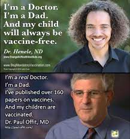
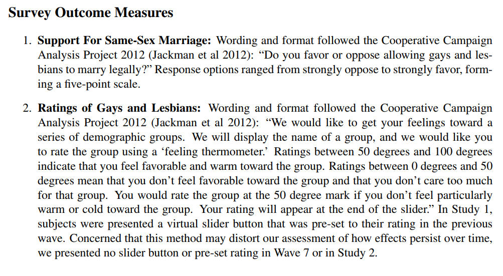

```{r setup, include=FALSE}
knitr::opts_chunk$set(echo = FALSE)
```

# What is Science?

## Plan for Today

1. Science can investigate claims tied to exercise of power

2. What are claims?

3. What makes evidence "scientific"?

# Recap

## Power and Justifications

Exercise of power over others involves giving **reasons** to behave differently.

- we can judge these reasons as "good" or "bad", procedurally.

---

<iframe width="560" height="315" src="https://www.youtube.com/embed/7D7InkvFaz8?si=bjZdGCAgUiPd8K8k" title="YouTube video player" frameborder="0" allow="accelerometer; autoplay; clipboard-write; encrypted-media; gyroscope; picture-in-picture; web-share" referrerpolicy="strict-origin-when-cross-origin" allowfullscreen></iframe>

## Weber on Science

Four insights about science:

1. science is a form of knowledge concerned with prediction
2. science (unlike theology) only assumes that we can know factual truths about objective world
3. science cannot answer questions of value
4. yet, science is not "value free"

## Science and Power

We argue that **science** can generate evidence regarding claims embedded in **justifications**/**reasons** given by power...

that are **independent** of power (without coercion, in principle)


## Science and Power

**Science** is distinct as a form of thought in that: 

#### (1) Only certain *claims* can be investigated 

<br>

*(next class)*

#### (2) Has special rules for using evidence and making assumptions to evaluate claims

<br>

*(today)*


# What are claims?

## Two Key definitions

### **claim**:

(For our purposes) a statement about what is **true** or **right**. 

- If you can add "is true" to the end or "it is true that" to the beginning of the statement without changing the meaning, it is a claim.

### Don't overthink this definition. It is as simple as it seems.

## Two Key definitions

### **basis**: 

(For our purposes) the basis for a claim is the ***reason* we should accept** the truth or validity of that claim. It includes 

- the **evidence** that is used to "prove" the claim is true 

- and the **warrant**: assumptions required for the evidence to be valid "proof"

colloquially, we refer to both parts as "evidence"

## An example:

### **claim**: "It rained last night."

### **basis**: "I looked outside and can see the street is wet."

<br>

What is the **evidence**? 

What are the **assumptions** linking that evidence to the claim? 

## Another example:

<iframe width="560" height="315" src="https://www.youtube.com/embed/cnw1ohwxQi4?si=BC3RMSk-iuwCG2Qo" title="YouTube video player" frameborder="0" allow="accelerometer; autoplay; clipboard-write; encrypted-media; gyroscope; picture-in-picture; web-share" referrerpolicy="strict-origin-when-cross-origin" allowfullscreen></iframe>

Claim? Evidence? Warrant/assumptions?

# What is makes evidence <br> "scientific"?

## Attributes of Scientific Evidence?

Go to [menti.com](https://www.menti.com/fknajkidk8) and enter the code $72 \ 07 \ 48 \ 3$ 

## Attributes of Scientific Evidence?

<div style='position: relative; padding-bottom: 56.25%; padding-top: 35px; height: 0; overflow: hidden;'><iframe sandbox='allow-scripts allow-same-origin' allowfullscreen='true' allowtransparency='true' frameborder='0' height='315' src='https://www.mentimeter.com/embed/e6bab70316b70b6bc7e3c34baf856c7f/4e6f3e3deed9' style='position: absolute; top: 0; left: 0; width: 100%; height: 100%;' width='420'></iframe></div>

# Scientific Evidence

---

<iframe width="560" height="315" src="https://www.youtube.com/embed/r3kEo26z9sE?si=QneC_90gZlleT5Mb" title="YouTube video player" frameborder="0" allow="accelerometer; autoplay; clipboard-write; encrypted-media; gyroscope; picture-in-picture; web-share" referrerpolicy="strict-origin-when-cross-origin" allowfullscreen></iframe>

>- Is the evidence "scientific"? How so?

## Severity Requirement

**(weak) severity requirement:** 

> "one does not have evidence for a claim if nothing has been done to rule out the ways the claim may be false."

> "If data *x* agree with a claim C, but the method is ... guaranteed to find such agreement, and had little or no capability of finding flaws with C even if they exist, they we have bad evidence, no test"

(Mayo 2018)

## Severity Requirement

Link to Weber's criteria:

1. science is a form of knowledge concerned with prediction
2. science (unlike theology) only assumes that we can know factual truths about objective world

<br>

If evidence fails to meet **(weak) severity requirement**, it is **not scientific**

# {.centered}


## Paraphrasing Tolstoi

### **All [instances of scientific evidence] are alike; each [instance of unscientific evidence] is [unscientific] in its own way.**

## Paraphrasing Tolstoi

Despite an infinite number of topics for research:

- **Unscientific** evidence can fail to meet severity requirement in many **different** ways.
- **Scientific** evidence shares similarities in how it adheres to severity requirement.


## Evidence?

> "The senseless murder of Laken Riley by Jose Ibarra, who had no business being in this country, was another wakeup call as Americans experience an illegal alien crime wave because of Joe Biden's open border and local sanctuary city policies..." - Rep. Mike Collins (R), Georgia

Does evidence meet severity requirement?

## Evidence?


Does evidence meet severity requirement?

## Evidence?


## Evidence?



Does evidence meet severity requirement?

---

### [Studies Show That You Should Come Into This Room Right Over Here, And That You Should Come Alone](https://the-toast.net/2015/06/24/studies-show-that-you-should-come-into-this-room-right-over-here-and-that-you-should-come-alone/)

> Recent studies suggest that it's very important that you come into this room right over here just now. Studies also suggest that it's equally important you do not waste time asking questions ... but just step this way through the door very quickly and by yourself, immediately. 
>
> The studies were conducted, and the evidence is conclusive: this room just over here is where you should go next, without anyone coming with you. Scientists did them, the studies. Which ones? Yes.
>
>The studies are all finished now, and you don’t need to see them. The studies suggested that it’s not important you see the studies at all, but it is important that you hurry along, quickly now, because time is of the essence. The studies say now is the best time for you to be alone in that room.

## Scientific Evidence

Mayo (2018) also gives us:

**(strong) Severity Requirement**:

> "We have evidence for a claim C just to the extent it survives a stringent scrutiny. If C passes a test that was highly capable of finding flaws or discrepancies from C, and yet none or few are found, then the passing result, x, is evidence for C"

>- evidence is scientific to extent it survives stringent scrutiny
>- we have interrogated whether evidence is sensitive to the possibly flawed **warrants**/**assumptions**

## Scientific Evidence

"scientific evidence":

- does not mean the evidence is without flaw; does not mean that the claim is true
- refers to **procedures** and **assumptions** involved in generating evidence
- evidence part of an on-going conversation in which claims and evidence for claims are challenged, challenges investigated

"unscientific evidence":

- bad evidence does not mean claim is false.

## Attributes of Scientific Evidence:

Strong Severity Requirement points to four attributes of scientific evidence:

1. **Systematic use of evidence**

2. **Transparent procedures**

3. **Acknowledgement of uncertainty**

4. **Consider alternatives**

## Illustrative Example

Prejudice a group of people is the result of a lack of meaningful contact with members of that group.

*Does inter-group contact reduce prejudice?*

Are efforts to **change the minds** of opponents same-sex marriage through a short conversation **more successful** when those conversations are with gay (rather than heterosexual) canvassers?

## Illustrative Example

### 2014 paper in *Science*: 

Researchers conducted an experiment to answer this question:


## Transparent procedures 

### How did you arrive at your conclusion?

- What data / observations did you use?
- What comparisons did you make?
- What choices as a researcher did you make, and why?

### Why?

- Others can know the **assumptions** required to find result
- Others can challenge your choices/assumptions
- Others can replicate your work (objectivity)

## Transparent procedures 

Treatments:


## Transparent procedures 

Who was treated?


## Transparent procedures 

How did they get treated?


## Transparent procedures 

What were the survey questions?




## Consider alternatives 

### Test claim against other competing claims

- Whichever claim "survives" many different tests is best

### Why?

- Openness to being wrong (no assumption above challenge)
- Evidence consistent with **different** assumptions (objectivity)
- One piece of evidence can be consistent with many claims; Best claim generates most useful predictions


## Consider alternatives 

**Could it be that people who are less prejudiced more open to making gay friends and acquaintances?**

>- Randomized experiment where contact controlled by researchers

## Consider alternatives 

**Could it be any effect is simply from having someone come to the door?**

<br>

>- Control group with "recycling canvasser" addresses this concern

## Consider alternatives 

**What if gay canvassers are different than straight in *other* ways?**

<br>

- More articulate? More motivated? More attractive? $\to$ more persuasive

>- Authors control or test for these differences, but find none

## Systematic Use of Evidence 

### When we make observations, we have...

- Clear rules for **what** we observe
- Clear rules for **how** we observe
- Clear rules for **comparison** of observations
- Avoid "cherry-picking"

### Why?

- Cherry picking assumes a truth, picks data to support it (not severe)
- Systematic rules allows others to investigate for themselves
    - No "secret sauce": (objectivity, enables challenging assumptions)

## Systematic use of evidence:

**What was the sample?**


## Systematic use of evidence:

**What were the comparisons?**


## Acknowledge uncertainty

### Limitations of finding:

- What questions remain unanswered after the study (what didn't it tell us)?
- What **assumptions** were made that might not be true?

### How certain or precise are the answers? 

(directly tied to assumptions we make about evidence)

- Acknowledge possibility of results being driven by chance
- Acknowledge possibility of spurious relationships


## Acknowledge uncertainty

**Results have confidence intervals**


## Acknowledge uncertainty

**Results leave questions**

<br>

- **Why were indirect effects larger for gay canvassers?**
- **Would this work for other identity groups?**


## Poll

### **Which of these four do you think is the most important part of scientific evidence?**

Go to [menti.com](https://www.menti.com/2d1vgtctsx) and enter the code $4139 \  2801$ 

---

<div style='position: relative; padding-bottom: 56.25%; padding-top: 35px; height: 0; overflow: hidden;'><iframe sandbox='allow-scripts allow-same-origin allow-presentation' allowfullscreen='true' allowtransparency='true' frameborder='0' height='315' src='https://www.mentimeter.com/app/presentation/70f9c33dca6f09e27e05c38db082b82a/embed' style='position: absolute; top: 0; left: 0; width: 100%; height: 100%;' width='420'></iframe></div>


## Results:

### Canvassing for same-sex marriage (compared to recycling) **reduced prejudice**

<br> 

### Reductions in prejudice **larger** and **last longer** with **gay-identified canvassers**

# Do you believe these results? 

Poll:

- **NO**: no hands
- **YES**: one hand
- **HELP!**: two hands


---


## How was he caught?


## What of these is most important?

### **Systematic use of evidence**

### **Transparent procedures**

### **Acknowledge uncertainty**

### **Test claim against alternatives**

## Conclusion:

### <u>**Transparent procedures**</u>

### **Systematic use of evidence**

### **Acknowledge uncertainty**

### **Test claim against alternatives**

## Appendix

For the story of the fraud and replication, listen [here](https://www.thisamericanlife.org/584/for-your-reconsideration)