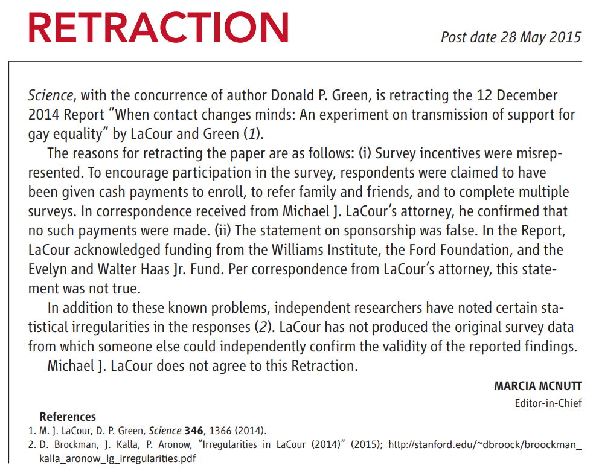

```{r setup, include=FALSE}
knitr::opts_chunk$set(echo = FALSE)
```

# What is Science?

## Plan for Today

1. Review

2. What is scientific evidence?

  - confirmation vs. falsification
  - weak severity requirement
  - attributes of scientific evidence
  
  
# Recap


## Review

- Truth in politics is important
- What do we mean by "truth"?
    - **what** types of claims?
    - **how** do we know claims are true?


## Two Key definitions

### **claim**:

(For our purposes) a statement about what is **true** or **right**. 

- If you can add "is true" to the end or "it is true that" to the beginning of the statement without changing the meaning, it is a claim.

### Don't overthink this definition. It is as simple as it seems.

## Two Key definitions

### **basis**: 

(For our purposes) the basis for a claim is the ***reason* we should accept** the truth or validity of that claim. It includes 

- the **evidence** that is used to "prove" the claim is true 

- and the **warrant**: assumptions required for the evidence to be valid "proof"

colloquially, we refer to both parts as "evidence"


## Empirical or Normative?

(1) **About 1.1 million refugees entered Germany during 2015.**

(2) **The vast majority of these refugees came from Syria and other parts of the Middle East.**

(3) **Alexander Gauland: "we don’t like the values of Islam based on sharia [law] that are not compatible with our Basic Law." **

(4) **Large waves of immigration reduce employment and social services for low-income native Germans.**

(5) **This influx in refugees *increased* violent crime.**

(6) **Germany should admit far fewer refugees/immigrants.**


## Empirical or Normative?


(1) **About 1.1 million refugees entered Germany during 2015.** (empirical)

(2) **The vast majority of these refugees came from Syria and other parts of the Middle East.** (empirical)

(3) **Alexander Gauland: "we don’t like the values of Islam based on sharia [law] that are not compatible with our Basic Law."** (normative)

(4) **Large waves of immigration reduce employment and social services for low-income native Germans.** (empirical)

(5) **This influx in refugees *increased* violent crime.** (empirical)

(6) **Germany should admit far fewer refugees/immigrants.** (normative)


## Scientific Truth

**scientific truth** *assumes*:

1. there is an **objective reality** (*noumena*) outside of our perceptions
2. we all *experience* the ***same*** objective reality with others 
3. this reality operates under consistent rules
4. we can only learn about this objective reality **through our sense experiences** (*phenomena*) as filtered through our minds.

>- All other assumptions, concepts, claims are open to challenge. 

## Scientific Truth

**Science** is distinct as a form of thought in that: 

#### (1) Only certain *claims* can be investigated 

<br>

*(last class)*: only **empirical claims** can be tested through science. **normative claims** cannot.


#### (2) Has special rules for using evidence and making assumptions to evaluate claims

<br>

*(today)*


# What is makes evidence <br> "scientific"?

## Attributes of Scientific Evidence?

Go to [menti.com](https://www.menti.com/fknajkidk8) and enter the code $4826 \ 6654$ 

## Attributes of Scientific Evidence?

<div style='position: relative; padding-bottom: 56.25%; padding-top: 35px; height: 0; overflow: hidden;'><iframe sandbox='allow-scripts allow-same-origin' allowfullscreen='true' allowtransparency='true' frameborder='0' height='315' src='https://www.mentimeter.com/embed/e6bab70316b70b6bc7e3c34baf856c7f/4e6f3e3deed9' style='position: absolute; top: 0; left: 0; width: 100%; height: 100%;' width='420'></iframe></div>

---

<iframe width="560" height="315" src="https://www.youtube.com/embed/5T_KN8Ok718?si=gIyd3p_9eureVRoV" title="YouTube video player" frameborder="0" allow="accelerometer; autoplay; clipboard-write; encrypted-media; gyroscope; picture-in-picture; web-share" referrerpolicy="strict-origin-when-cross-origin" allowfullscreen></iframe>

---

>  "It is a vast domestic terror movement. With God as my witness, we are going to use every resource we have at the Department of Justice, Homeland Security, and throughout this government to identify, disrupt, dismantle and destroy these networks and make America safe again for the American people." - Steven Miller, White House Depute Chief of Staff

---

- [Center for Strategic and International Studies](https://www.csis.org/analysis/global-terrorism-threat-assessment-2024) found that between 2017 and 2022: "Violent far-right extremist have been responsible for 94 of the 108 terrorism fatalities (87 percent) in the United States in the past five years. This included 2022, when 18 of the 19 fatalities occurred during far-right terrorist attacks."

- [Cato Institute](https://www.alexnowrasteh.com/p/politically-motivated-violence-is) found that since 1975, of murders in terrorist attacks (excluding 9/11), 63 percent committed by right-wing, 10 percent by left-wing

>- What would help you know whether this evidence is "scientific"?


## 2020 Election Fraud


## 2020 Election Fraud

"Storming of US Capitol on January 6, 2021 was justified."

Reasons:

$Claim:$ **"Presidential Election in Georgia was fraudulently stolen from Donald Trump"**. "counting of [absentee] ballots [in Fulton county - Atlanta] took place in secret after Republican Party observers were dismissed because they were advised that the tabulation center was shutting down for the night."

>- Whether claim is correct or not should be very important: was Jan. 6 protest justified? Or was criminal prosecution justified?


## 2020 Election Fraud

$Claim:$ **Presidential Election in Georgia was fraudulently stolen from Donald Trump** 

1. If the claim were true, **then** $\xrightarrow{implies}$ absentee ballots from precincts in Fulton County should be pro-Biden more than absentee ballots from neighboring voting precincts just across the county line in **other counties** (where tabulation did not allegedly take place is secret)

(Board)

## 2020 Election Fraud

$Claim:$ **Presidential Election in Georgia was fraudulently stolen from Donald Trump** 

1. If the claim were true, **then** $\xrightarrow{implies}$ absentee ballots from precincts in Fulton County should be pro-Biden more than absentee ballots from neighboring voting precincts just across the county line in **other counties** (where tabulation did not allegedly take place is secret)

2. Researcher finds absentee ballots from Fulton county precincts were more pro-Biden than neighboring counties: [see here](https://papers.ssrn.com/sol3/papers.cfm?abstract_id=3756988)

3. Therefore, concludes: "Fraud in Georgia Election"


## 2020 Election Fraud

**DISCUSS**

Is this scientific evidence of voting fraud? Why or why not?


## An illustration


Imagine two groups of cities: Some passed restrictions on handgun purchasing and ownership; some did not. Then we counted number of cities where crime increased or decreased

---


Did gun control increase or decrease crime?

## An illustration

<iframe width="560" height="315" src="https://www.youtube.com/embed/zB_OApdxcno?si=pvCUx8Gqudl36Zns&amp;start=310" title="YouTube video player" frameborder="0" allow="accelerometer; autoplay; clipboard-write; encrypted-media; gyroscope; picture-in-picture; web-share" referrerpolicy="strict-origin-when-cross-origin" allowfullscreen></iframe>


## Confirmation Bias

Our ability to evaluate and interpret evidence about claims is influenced by a desire to draw conclusions that align with our views.


# Scientific Evidence

## Logic of inference

### **confirmation**

If we have an empirical claim, $H_1$ ($H$ for hypothesis)

and, if $H_1$ (**claim**) were true, then it implies we should make certain empirical **observations** $O_1$

Confirmation says that

1. $H_1 \xrightarrow{implies}$ we see $O_1$

2. If we see $O_1$

3. Then, $H_1$ is true (or, more "likely" to be true)

## Confirmation

$H_1:$ **Presidential Election in Georgia was fraudulently stolen from Donald Trump** 

1. If $H_1$ were true, **then** $\xrightarrow{implies}$ $O_1:$ absentee ballots from precincts in Fulton County should be pro-Biden more than absentee ballots from neighboring voting precincts just across the county line in **other counties** (where tabulation did not allegedly take place is secret)

2. $O_1:$ Researcher finds absentee ballots from Fulton county precincts were more pro-Biden than neighboring counties.

3. Therefore, concludes: "Fraud in Georgia Election", $H_1$ is true


## Confirmation

Many reject **confirmation** because **many different**, incompatible **claims** are **consistent with the same observed evidence**. We are prone to **confirmation bias.**

1. $(H_1, H_2, \ldots, H_k) \xrightarrow{imply}$ we see $O_1$

2. If we see $O_1$

3. Then, $H_1$ is *not proven*

<br>

>- Because we would observe $O_1$ if, e.g. $H_2$ were true and $H_1$ false.

## 2020 Election Fraud

$H_1:$ **Presidential Election in Georgia was fraudulently stolen from Donald Trump** 

<u>**Confirmation?**</u>

1. $H_1 \xrightarrow{implies}$ absentee ballots from precincts in Fulton County should be pro-Biden more than absentee ballots from neighboring voting precincts just across the county line in **other counties**

2. Researcher finds absentee ballots from Fulton county precincts were more pro-Biden than neighboring counties.

3. Therefore, "Fraud in Georgia Election"

## 2020 Election Fraud

- $H_1:$ **Presidential Election in Georgia was fraudulently stolen from Donald Trump**
- $H_2:$ **People select residence based on partisanship**
- $H_3:$ **People select residence based on racial composition of schools**   

1. $(H_1, H_2, H_3) \xrightarrow{imply}$: Absentee ballots in Fulton County more Pro-Biden than neighboring counties

2. Researcher finds absentee ballots from Fulton county precincts were more pro-Biden than neighboring counties.

3. Therefore, $H_1, H_2, or H_3$ could be valid


## Falsification vs Confirmation

### **The difference**

**Confirmation** looks to see: is there evidence that the claim is **right**

**Falsification** looks to see: is there evidence that the claim is **wrong**

- we can fail to find evidence that would rule out the claim
- it never says "claim is correct", it says "we haven't rejected this, yet"


## Falsification

Logic of **falsification**: what is implication $O_1$ that we **should not see** if claim is true?

1. $H_1 \xrightarrow{implies}$ we do not see $O_1$
2. If we see $O_1$
3. Then, reject $H_1$


(board)

## Falsification

1. $H_1$ all swans are white $\xrightarrow{implies}$ we do not see black swans ($O_1$)
2. If we see $O_1$ (a black swan)
3. Then, reject $H_1$

>- Is it really so easy?

---

<iframe width="560" height="315" src="https://www.youtube.com/embed/7vrP8EplfP0" title="YouTube video player" frameborder="0" allow="accelerometer; autoplay; clipboard-write; encrypted-media; gyroscope; picture-in-picture" allowfullscreen></iframe>


## Severity Requirement

**weak severity requirement:** 

> "one does not have evidence for a claim if nothing has been done to rule out the ways the claim may be false."

> "If data *x* agree with a claim C, but the method is ... guaranteed to find such agreement, and had little or no capability of finding flaws with C even if they exist, they we have bad evidence, no test"

(Mayo 2018)

<br>

If evidence fails to meet **weak severity requirement**, it is **not scientific**


## Evidence?

<iframe width="560" height="315" src="https://www.youtube.com/embed/akhXd0NVY3s" title="YouTube video player" frameborder="0" allow="accelerometer; autoplay; clipboard-write; encrypted-media; gyroscope; picture-in-picture" allowfullscreen></iframe>

## Evidence?


Does evidence meet severity requirement?

## Evidence?


## Evidence?


Does evidence meet severity requirement?

---

### [Studies Show That You Should Come Into This Room Right Over Here, And That You Should Come Alone](https://the-toast.net/2015/06/24/studies-show-that-you-should-come-into-this-room-right-over-here-and-that-you-should-come-alone/)

> Recent studies suggest that it's very important that you come into this room right over here just now. Studies also suggest that it's equally important you do not waste time asking questions ... but just step this way through the door very quickly and by yourself, immediately. 
>
> The studies were conducted, and the evidence is conclusive: this room just over here is where you should go next, without anyone coming with you. Scientists did them, the studies. Which ones? Yes.
>
>The studies are all finished now, and you don’t need to see them. The studies suggested that it’s not important you see the studies at all, but it is important that you hurry along, quickly now, because time is of the essence. The studies say now is the best time for you to be alone in that room.


---

<iframe src="https://truthsocial.com/@realDonaldTrump/115049974697549520/embed" class="truthsocial-embed" style="max-width: 100%; border: 0" width="600" allowfullscreen="allowfullscreen"></iframe><script src="https://truthsocial.com/embed.js" async="async"></script>

---

Mayo (2018) says: "there is no logical inconsistency with invoking a hypothesis from *conspiracy*: all these instruments conspire to produce results as if H were true but in fact H is false"

This is the "rigged" hypothesis: Something else other than H actually explains the data and that the data appears to align with H.

>- This isn't the logic of falsification! One can **always** invoke the conspiracy, even if it is wrong. It fails the **weak severity** requirement.


## Scientific Evidence

Mayo (2018) also gives us:

**(strong) Severity Requirement**:

> "We have evidence for a claim C just to the extent it survives a stringent scrutiny. If C passes a test that was highly capable of finding flaws or discrepancies from C, and yet none or few are found, then the passing result, x, is evidence for C"

>- evidence is scientific to extent it survives stringent scrutiny
>- we have interrogated whether evidence is sensitive to the possibly flawed **warrants**/**assumptions**

## Scientific Evidence

Severity requirement comes from assumptions for scientific truth:

1. there is an **objective reality** (*noumena*) outside of our perceptions $\to$ must give reality opportunity to "push back" against our claim
2. we all *experience* the ***same*** objective reality with others $\to$ others need to be able to replicate
3. this reality operates under consistent rules
4. we can only learn about this objective reality **through our sense experiences** (*phenomena*) as filtered through our minds. $\to$ due to confirmation bias, flawed perception, must **actively** seek out where we may be wrong


## Scientific Evidence

"scientific evidence":

- does not mean the evidence is without flaw; does not mean that the claim is true
- refers to **procedures** and **assumptions** involved in generating evidence
- evidence seriously investigates whether claim itself or the assumptions underpinning the evidence are wrong

"unscientific evidence":

- bad evidence does not mean claim is false.


## Attributes of Scientific Evidence:

**severity** implies that we need:

1. **Systematic use of evidence**: did we use evidence/procedures that stack the deck in favor of supporting/rejecting the claim?
2. **Acknowledgement of uncertainty**: could evidence arise by chance even if claim is false?
3. **Consideration of alternatives**: could the claim be false and we see the evidence for *other reasons*?

## Attributes of Scientific Evidence:

To be able to assess **severity** of evidence, we need

**Transparent Procedures**

> "How much and how correctly would we *think* if we did not think as it were in community with others to whom we *communicate* our thoughts, and who communicate theirs with us!" - Kant, *What Does it Mean to Orient Oneself in Thinking*

# Conclusion

## Conclusion

Pursuit of scientific truth:

- points us to pursue **falsification** rather than **confirmation**
- evidence judged by **severity requirement**
- requires transparency and community engagement

## Conclusion

To know whether evidence meets weak or strong **severity** requirements, we need to know..

- **what** kind of claims we are dealing with
- **how** and **why** evidence may lead us to make the **wrong judgment** of a claim
- **assumptions** that permit evidence to support or reject a claim

# Extra Material

## Illustrative Example

Prejudice a group of people is the result of a lack of meaningful contact with members of that group.

*Does inter-group contact reduce prejudice?*

Are efforts to **change the minds** of opponents same-sex marriage through a short conversation **more successful** when those conversations are with gay (rather than heterosexual) canvassers?

## Illustrative Example

### 2014 paper in *Science*: 

Researchers conducted an experiment to answer this question:


## Transparent procedures 

### How did you arrive at your conclusion?

- What data / observations did you use?
- What comparisons did you make?
- What choices as a researcher did you make, and why?

### Why?

- Others can know the **assumptions** required to find result
- Others can challenge your choices/assumptions
- Others can replicate your work (objectivity)

## Transparent procedures 

Treatments:


## Transparent procedures 

Who was treated?


## Transparent procedures 

How did they get treated?


## Transparent procedures 

What were the survey questions?


## Consider alternatives 

### Test claim against other competing claims

- Whichever claim "survives" many different tests is best

### Why?

- Openness to being wrong (no assumption above challenge)
- Evidence consistent with **different** assumptions (objectivity)
- One piece of evidence can be consistent with many claims; Best claim generates most useful predictions


## Consider alternatives 

**Could it be that people who are less prejudiced more open to making gay friends and acquaintances?**

>- Randomized experiment where contact controlled by researchers

## Consider alternatives 

**Could it be any effect is simply from having someone come to the door?**

<br>

>- Control group with "recycling canvasser" addresses this concern

## Consider alternatives 

**What if gay canvassers are different than straight in *other* ways?**

<br>

- More articulate? More motivated? More attractive? $\to$ more persuasive

>- Authors control or test for these differences, but find none

## Systematic Use of Evidence 

### When we make observations, we have...

- Clear rules for **what** we observe
- Clear rules for **how** we observe
- Clear rules for **comparison** of observations
- Avoid "cherry-picking"

### Why?

- Cherry picking assumes a truth, picks data to support it (not severe)
- Systematic rules allows others to investigate for themselves
    - No "secret sauce": (objectivity, enables challenging assumptions)

## Systematic use of evidence:

**What was the sample?**


## Systematic use of evidence:

**What were the comparisons?**


## Acknowledge uncertainty

### Limitations of finding:

- What questions remain unanswered after the study (what didn't it tell us)?
- What **assumptions** were made that might not be true?

### How certain or precise are the answers? 

(directly tied to assumptions we make about evidence)

- Acknowledge possibility of results being driven by chance
- Acknowledge possibility of spurious relationships


## Acknowledge uncertainty

**Results have confidence intervals**


## Acknowledge uncertainty

**Results leave questions**

<br>

- **Why were indirect effects larger for gay canvassers?**
- **Would this work for other identity groups?**


## Poll

### **Which of these four do you think is the most important part of scientific evidence?**

Go to [menti.com](https://www.menti.com/2d1vgtctsx) and enter the code $4139 \  2801$ 

---

<div style='position: relative; padding-bottom: 56.25%; padding-top: 35px; height: 0; overflow: hidden;'><iframe sandbox='allow-scripts allow-same-origin allow-presentation' allowfullscreen='true' allowtransparency='true' frameborder='0' height='315' src='https://www.mentimeter.com/app/presentation/70f9c33dca6f09e27e05c38db082b82a/embed' style='position: absolute; top: 0; left: 0; width: 100%; height: 100%;' width='420'></iframe></div>


## Results:

### Canvassing for same-sex marriage (compared to recycling) **reduced prejudice**

<br> 

### Reductions in prejudice **larger** and **last longer** with **gay-identified canvassers**

# Do you believe these results? 

Poll:

- **NO**: no hands
- **YES**: one hand
- **HELP!**: two hands


---



## How was he caught?


## What of these is most important?

### **Systematic use of evidence**

### **Transparent procedures**

### **Acknowledge uncertainty**

### **Test claim against alternatives**

## Conclusion:

### <u>**Transparent procedures**</u>

### **Systematic use of evidence**

### **Acknowledge uncertainty**

### **Test claim against alternatives**

## Appendix

For the story of the fraud and replication, listen [here](https://www.thisamericanlife.org/584/for-your-reconsideration)