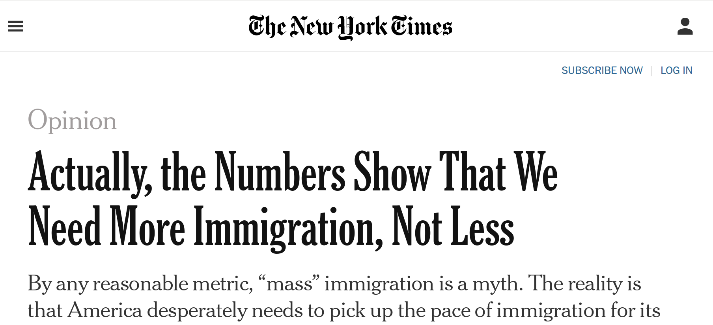

```{r setup, include=FALSE}
knitr::opts_chunk$set(echo = FALSE)
```

# Varieties of Claims

## Plan for Today

### 1) **Normative vs. Empirical Claims**

### 2) **Two Varieties of Normative Claims**

### 3) **Normative Claims and Science**

### 4) **Admin**

- Group Projects/Homework

# Recap

## Science and Evidence

**Science** is distinct as a form of thought in that: 

#### (1) Only certain *claims* can be investigated 

<br>

*today*

#### (2) Has special rules for using evidence and making assumptions to evaluate claims

<br>

*(previous class)*

## Science and Evidence

**claims** are statements amount truth or validity.

the **basis** (reason to accept a claim) is composed of:

- **evidence**: data/information/etc.
- **warrant**: assumptions that permit evidence to "count"

## Science and Evidence

**scientific evidence:** is evidence that meets **weak severity requirement**. Or, the procedures for evidence could find the claim to be wrong.

evidence is more persuasive if it meets **strong severity requirement**: the evidence procedures are very capable of finding evidence to be wrong.

strong severity implies: testing assumptions in the warrant; employing evidence using **different plausible** assumptions in the warrant; using evidence procedures that make **weaker** (more easily defended) assumptions.

## Science and Claims

What kinds of claims can we investigate?

# An Example

---



An attempt to motivate people to behave differently. An attempt to exercise power. Access to media outlets enables power.

## An Example:

#### **(1) US is not experiencing (comparatively) high levels of immigration**

- Lebanon (4.4 million people) has had more than 1 million refugees in less than 10 years (>25%)
- American (325 million people) has 44 million immigrants (13.7 percent)
- Rate of immigration to US has slowed over the past 10 years 

#### **(2) High immigration rates do not lead to political instability.**

- Canada and Australia have populations that are 20 and 28 percent foreign-born, but no major political problems

## An Example:

#### **(3) New immigrants are employed at high rates.**

- Unemployment among immigrants is lower than native-born Americans
- not a burden on state provision of social services

#### **(4) Lower immigration slows economic growth**
 
- Fertility rates among native-born Americans are dropping
- Because of that, future workforce will be smaller, productivity will be less, growth will slow

#### **(5) America *should* admit 1 million more immigrants per year**

- So growth rates can remain high

## An Example:

Which of these five claims could be **supported** or **rejected** using scientific evidence?

Head to [menti.com](https://www.menti.com/r4u72nwspr) and use code $2498 \ 5905$

Select all that apply.

--- 

<div style='position: relative; padding-bottom: 56.25%; padding-top: 35px; height: 0; overflow: hidden;'><iframe sandbox='allow-scripts allow-same-origin allow-presentation' allowfullscreen='true' allowtransparency='true' frameborder='0' height='315' src='https://www.mentimeter.com/app/presentation/23149ae32d2bb8656aa7276cab9785dc/embed' style='position: absolute; top: 0; left: 0; width: 100%; height: 100%;' width='420'></iframe></div>

---

### **"Actually, the Numbers [Don't] Show That"**

$\checkmark$ if science could test:

(1) US is not experiencing high levels of immigration $\checkmark$

(2) High immigration rates do not lead to political instability $\checkmark$

(3) New immigrants are employed at high rates $\checkmark$

(4) Lower immigration slows economic growth $\checkmark$

(5) **America *should* admit 1 million more immigrants per year** 

### Even if 1-4 are true, what must we to **assume** to conclude that (5) is **true**?

--- 

### **"Actually, the Numbers [Don't] Show That"**

<br>

**"America *should* admit 1 million more immigrants per year"**

### Even if 1-4 are true: we need to assume that **economic growth** is **desirable** to conclude that (5) is true.

## Varieties of Claims

### **Which varieties of claims/questions can be addressed with science?**

### Three dimensions

1. **Empirical vs. Normative**
2. **Varieties** of empirical and **normative claims/questions**
3. Falsifiable vs. unfalsifiable

## Empirical Claims

#### **empirical claim**:

<br>

is a claim about **what is/exists** or **how things that exist affect each other**. 

<br>

The **basis**/evidence for empirical claims

- consists of **observation** of the world.
- **no assumption** about what is good/desirable. 

## Normative Claims

#### **normative claim**:

<br>

is a claim about **what is desirable or undesirable**. 

- assert what **should or should not** be.
- "should" implied by the language of "right"/"wrong"
- "should" implied by "too much", "enough", or "not enough" of something.
- "should" implied by standards for what is "better"/"worse"

The basis/evidence for a normative claim:

- **must assume** a **value** about what is desirable/undesirable


## Which are empirical? Normative?

(1) **US is not experiencing high levels of immigration**

(2) **High immigration rates do not lead to political instability**

(3) **New immigrants are employed at high rates**

(4) **Lower immigration slows economic growth**

(5) **America *should* admit 1 million more immigrants per year** 

# Empirical Claims

## Descriptive claims:

### **descriptive claims:**

claims about what exists (or has existed/will exist) in the world: 

- **what phenomena exist** (what kinds of things exist?)
- **what is the type of a specific phenomenon** (what is this thing?)
- **amount/frequency of phenomena** (how much of something is there?)
- **relative amount/frequency of phenomena across different places/times** (how much of something is there here vs. there/now vs. then?)
- **what patterns are there in the shared appearance/non-appearance of different phenomena** (does this thing usually appear together with that other thing?)


## Causal claims:

### **causal claims**:

are claims about the how one phenomena ($X$) affects or causes another phenomena ($Y$). Causal claims state that $X$ **acts on** $Y$ in some way, not merely that they appear together in some pattern:

- the **effect** that one thing or event has on another thing (effects of causes)
- the **cause** of some event or thing in the world (causes of effects)
- the *conditions* under which some thing or event *happens* (causes of effects)
- the *process* through which one thing affects another (causes of effects)


## Causal or Descriptive?

(1) US is not experiencing high levels of immigration 

(2) High immigration rates do not lead to political instability 

(3) New immigrants are employed at high rates 

(4) Lower immigration slows economic growth 

(5) America *should* admit 1 million more immigrants per year


# Normative Claims

## Normative Claims:

#### **value judgments**:

<br>

are normative claims that

- state what goal or ideal is "right" or "good" 
- or provide criteria/rules for judging what is "better" or "worse".

<br>

#### **They are not:**

- empirical claims for which the evidence is **invalid or missing**
- empirical claims that we can't persuade someone to drop in the face of better evidence

## Flat Earth!


## Flat Earth?


---

<smaller>
"Vancouver is a city on the edge. It seems politicians and the police are unable, unwilling or incapable of stopping what has turned into a version of Dante's Hell on the Downtown Eastside — illicit drug sales, open drug use, the stolen property bazaar, garbage, weapons, assaults, rape.

Vancouver no longer has a public health crisis that can be solved by needle exchanges, supervised injection sites, a naloxone-carting population, and pharmaceuticals substituted for illicit drugs. It is going to take more to solve the housing crisis by repurposing older hotels and simply putting roofs over people’s heads — a lot more.

Solving it requires bold leadership and a willingness to go beyond what has been done in the past, using evidence-based solutions that are in the best interests of all residents. Everyone deserves to feel safe, protected and respected, regardless of which neighbourhood they live in."</smaller>

- Editorial in the [Vancouver Sun](https://vancouversun.com/news/daphne-bramham-vancouver-needs-compassionate-solutions-to-street-chaos)


## Prescriptive Claims

#### **prescriptive claims**: 

<br>

are normative claims that assert what kinds of actions **should** be taken 

- hint: like a doctor or pharmacist, it *prescribes* a course of action. 
- overlap with justifications/reasons given by power.

The basis for a prescriptive claim includes 

- evidence supporting an **empirical** claim about the consequences of some action (**causal claim**)
- an assumption that some **value judgment** is correct.

## Revisit our Example

$(5)$ America *should* admit 1 million more immigrants per year.

### **Value judgment? Prescriptive Claim?**

## Revisit our Starting Example

#### **(5) America *should* admit 1 million more immigrants per year**

This is a **prescriptive claim**:

For it to be true...

(1) What value judgments must we assume to be true?

(2) What empirical claims must be true?


## Revisit our Starting Example

#### **(5) America *should* admit 1 million more immigrants per year**

<br>

**scientific evidence cannot "prove" this claim**

even if we evidence that is **very capable** of finding any **flaws** in claim that increasing immigration increases economic growth... (strong severity)

people who value **cultural/ethnic homogeneity** more than **economic growth** can't be persuaded

# Science and Claims

## Science and Claims

### **Empirical claims:** can be evaluated using science

- only need to assume that there is an objective world that we share
- other assumptions about how we provide evidence of that objective world open to question

### **Normative claims:** cannot (fully) be evaluated using science

- **value judgments** cannot be evaluated with science
- **prescriptive claims** can *partially* be evaluated with science

# Another Example

## Another Example

You and your friends win a large sum of money in a lottery

You and your friends **agree**: you should aim to **do the most good** by donating the money.

<br>

You consider some options...

---

<iframe width="560" height="315" src="https://www.youtube.com/embed/JMUw4Ndpbdw" title="YouTube video player" frameborder="0" allow="accelerometer; autoplay; clipboard-write; encrypted-media; gyroscope; picture-in-picture; web-share" allowfullscreen></iframe>

---

<iframe width="560" height="315" src="https://www.youtube.com/embed/YRRgfr0tA6o" title="YouTube video player" frameborder="0" allow="accelerometer; autoplay; clipboard-write; encrypted-media; gyroscope; picture-in-picture; web-share" allowfullscreen></iframe>

---

<iframe width="560" height="315" src="https://www.youtube.com/embed/64z9-m6wEw0" title="YouTube video player" frameborder="0" allow="accelerometer; autoplay; clipboard-write; encrypted-media; gyroscope; picture-in-picture; web-share" allowfullscreen></iframe>

## Another Example

Which should you donate to?

- Option 1: Make-a-Wish (more Batkid, pls)
- Option 2: Mosquito Nets
- Option 3: Direct transfer of cash to impoverished people

[Menti.com](https://www.menti.com/uh2xjvyxwh) and use code $8949 \ 1391$

---

<div style='position: relative; padding-bottom: 56.25%; padding-top: 35px; height: 0; overflow: hidden;'><iframe sandbox='allow-scripts allow-same-origin allow-presentation' allowfullscreen='true' allowtransparency='true' frameborder='0' height='315' src='https://www.mentimeter.com/app/presentation/3b3ec5cd7f92c79506bca1a4c6cb2e5f/embed' style='position: absolute; top: 0; left: 0; width: 100%; height: 100%;' width='420'></iframe></div>

## Can science solve our problem? 

Peter Singer and effective altruists say yes!

- we can evaluate which of these does the most good!

> "Saving a child's life has to be better than fulfilling a child’s wish to be Batkid."

## Can science solve our problem? {.build}

### Empirical Evidence

- Malaria kills ~500k per year
- Half of global population possibly exposed
- Mosquito nets reduce likelihood of exposure
- For each 100 to 1000 nets, 1 death prevented
- Cost of mosquito nets is low
- Cash transfers are expensive, effects on mortality unclear
- Batchildren encourage vigilante justice

### **What should you do?**

### **Malaria nets!**

## Can science solve our problem?

But wait, your friend says: experiments show that directly giving cash

- benefits the health, education, and life choices of children
- empowers women to be financially independent, escape abuse
- improve mental health

### **What should you do?**

## Can science solve our problem?

If **you value** minimizing suffering, but **your friend values** maximizing individual freedom...

then science cannot help us, because the disagreement is rooted in **value judgements**

##  Another Example

**"We should donate money for mosquito nets"** is a prescriptive claim.

<br>

- Scientific evidence for empirical claim that "Mosquito nets (A) prevent malaria (B)" 
    - NOT enough to conclude that does not imply "we should do (A)": it depends on how we **value** B
- if we also accept **value judgement** that it reducing suffering is more important than maximizing freedom (or coolness)
    - THEN we can accept the prescriptive claim
    
Need to accept the **causal** (empirical) claim that $A \to B$ AND a value judgment that $B$ is good.
    
##  Another Example

Science is still be helpful!

- If we assume less mortality is good (B) (a value judgment)
- What if science shows: mosquito nets don't prevent malaria deaths. (empirical evidence)
- "A does/does not cause B" is informative!


## Conclusion:

Empirical vs Normative Claims

- scientifically evaluate **empirical claims**, not **normative claims**
- **prescriptive claims** include **empirical claims** in their **basis** 


## Admin

1. Group Projects:

- groups assigned within tutorials; on Canvas tomorrow.
- group project assignment 1/group contract available on Friday morning

2. Homework 1:

- assignment becomes available on Friday morning
- can start over the weekend; we cover more relevant material on Monday

