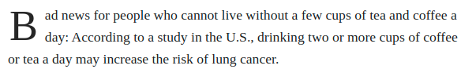
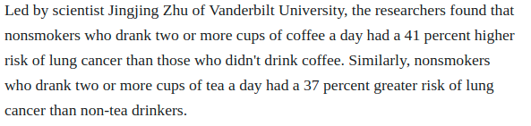

```{r setup, include=FALSE}
knitr::opts_chunk$set(echo = FALSE)
```

# Varieties of Claims

## Plan for Today

### 1) **Recap**

### 2) **Normative vs. Empirical Claims**

### 3) **Two Varieties of Normative Claims**

### 4) **Claims and Science**

<br>

open `menti.com`

# Recap

## Unscientific Evidence:

**Fails in some way to:**:

1. Use **transparent procedures**
2. Use **evidence systematically**
3. Consider **alternative explanations**
4. **Acknowledge uncertainty**

## **claim** {.centered}

<h2> **You should drink less coffee.** </h2>

# {.centered}

<h2>**Evidence**</h2>
<br>




# {.centered}

<h2>Is this scientific evidence?</h2>

## Appeal to Authority

### Beware: 

- Appeals to the **authority** of "science"/"researchers"/"studies"
- This changes science into **magic**

## Transparency/Alternatives


## Worst case scenario:

### [Studies Show That You Should Come Into This Room Right Over Here, And That You Should Come Alone](https://the-toast.net/2015/06/24/studies-show-that-you-should-come-into-this-room-right-over-here-and-that-you-should-come-alone/)

> Recent studies suggest that it's very important that you come into this room right over here just now. Studies also suggest that it's equally important you do not waste time asking questions ... but just step this way through the door very quickly and by yourself, immediately. 

> The studies were conducted, and the evidence is conclusive: this room just over here is where you should go next, without anyone coming with you. Scientists did them, the studies. Which ones? Yes.


# Varieties of Claims

## An Example


## An Example:

#### **(1) US is not experiencing mass immigration**

- Lebanon (4.4 million people) has had more than 1 million refugees in less than 10 years (>25%)
- American (325 million people) has 44 million immigrants (13.7 percent)
- Rate of immigration to US has slowed over the past 10 years 

#### **(2) High immigration rates do not lead to instability.**

- Canada and Australia have populations that are 20 and 28 percent foreign-born, but no major political problems

## An Example:

#### **(3) US labor market can absorb immigrants**

- Unemployment among immigrants is lower than native-born Americans

#### **(4) Lack of immigration will slow US economic growth**
 
- Fertility rates among native-born Americans are dropping
- Because of that, future workforce will be smaller, productivity will be less, growth will slow

#### **(5) America *should* admit 1 million more immigrants per year**

- So growth rates can remain high

## menti.com code 44 98 12

<div style='position: relative; padding-bottom: 56.25%; padding-top: 35px; height: 0; overflow: hidden;'><iframe sandbox='allow-scripts allow-same-origin' allowfullscreen='true' allowtransparency='true' frameborder='0' height='315' src='https://www.mentimeter.com/embed/23149ae32d2bb8656aa7276cab9785dc/8f665fa55928' style='position: absolute; top: 0; left: 0; width: 100%; height: 100%;' width='420'></iframe></div>

--- 

### **"Actually, the Numbers [Don't] Show That"**

<br>

(1) US is not experiencing mass immigration $\checkmark$

(2) High immigration rates do not lead to instability $\checkmark$

(3) US labor market can absorb immigrants $\checkmark$

(4) Lack of immigration will slow US economic growth $\checkmark$

(5) **America *should* admit 1 million more immigrants per year** 

### Even if 1-4 are true, what must we to **assume** to conclude that (5) is **true**?

--- 

### **"Actually, the Numbers [Don't] Show That"**

<br>

**"America *should* admit 1 million more immigrants per year"**

### Even if 1-4 are true: we need to assume that **economic growth** is **desirable** to conclude that (5) is true.

>- And **more desirable** than ethnic homogeneity.

## Varieties of Claims

### **Which varieties of claims/questions can be addressed with science?**

### Three dimensions

1. **Empirical vs. Normative**
2. **Varieties** of empirical and **normative claims/questions**
3. Falsifiable vs. unfalsifiable

## Empirical Claims

#### **empirical claim**:

<br>

is a claim about **what is/exists** or **how things that exist affect each other**. 

<br>

The **basis**/evidence for empirical claims

- consists of **observation** of the world.
- **no assumption** about what is good/desirable. 

## Normative Claims

#### **normative claim**:

<br>

is a claim about **what is desirable or undesirable**. 

- assert what **should or should not** be. 
- "should" implied by the language of "right"/"wrong" 
- "should" implied by "too much", "enough", or "not enough" of something.
- "should" implied by standards for what is "better"/"worse"

The basis/evidence for a normative claim:

- **must assume** a **value judgment** about what is desirable/undesirable


## Which are empirical? Normative?

(1) **US is not experiencing mass immigration** 

(2) **High immigration rates do not lead to instability**

(3) **US labor market can absorb immigrants** 

(4) **Lack of immigration will slow US economic growth**

(5) **America *should* admit 1 million more immigrants per year** 

# Normative Claims

## Normative Claims:

#### **value judgments**: 

<br>

are normative claims that

- state what goal or ideal is "right" or "good" 
- or provide criteria/rules for judging what is "better" or "worse".

<br>

#### **They are not:**

- empirical claims for which the evidence is **flawed**
- empirical claims that we can't persuade someone to drop in the face of better evidence

## Flat Earth!


## Flat Earth?


## Royals in Canada?

> Bill Kostiuk, of Alliston, Ont., said **it would be "an honour and a privilege" to have Harry and Meghan living in Canada. "They do so much for charitable organizations and they seem to inspire the younger generation in a very positive way."**

- [CBC News](https://www.cbc.ca/news/canada/prince-harry-meghan-canada-1.5425611)

What value judgments does Bill make?

## Prescriptive Claims

#### **prescriptive claims**: 

<br>

are normative claims that assert what kinds of actions **should** be taken 

- hint: like a doctor or pharmacist, it *prescribes* a course of action. 

The basis/evidence for a prescriptive claim includes 

- an **empirical** claim about the consequences of some action
- an assumption that some **value judgment** is correct.

## Revisit our Example

$(5)$ America *should* admit 1 million more immigrants per year.

### **Value judgment? Prescriptive Claim?**

## Revisit our Starting Example

#### **(5) America *should* admit 1 million more immigrants per year**

This is a **prescriptive claim**:

For it to be true...

(1) What empirical claims must be true?

(2) What value judgments must we assume to be true?


## Revisit our Starting Example

#### **(5) America *should* admit 1 million more immigrants per year**

This is a **prescriptive claim**:

#### **Evidence will not "prove" this claim to everyone**

e.g. people who oppose immigration to achieve cultural homogeneity value **cultural homogeneity** more than **economic growth**.

# Science and Claims

## Science and Claims

### **Empirical claims:** can be evaluated using science

- only need to assume that there is an objective world that we share
- other assumptions about how we provide evidence of that objective world open to question
- science is about prediction

### **Normative claims:** cannot (fully) be evaluated using science

- **value judgments** cannot be evaluated with science
- **prescriptive claims** can only partially be evaluated with science
- Science cannot tell us **how to live**

# Another Example

## Another example

You and your friend win a sum of money in a lottery

You and your friend **agree**: we should aim to **alleviate the most human suffering**.

### You disagree on whether:

(1) Should we donate mosquito nets to stop malaria?

(2) Should we give money directly to impoverished people?


## code 37 10 18

<div style='position: relative; padding-bottom: 56.25%; padding-top: 35px; height: 0; overflow: hidden;'><iframe sandbox='allow-scripts allow-same-origin' allowfullscreen='true' allowtransparency='true' frameborder='0' height='315' src='https://www.mentimeter.com/embed/3b3ec5cd7f92c79506bca1a4c6cb2e5f/42e45f43c40a' style='position: absolute; top: 0; left: 0; width: 100%; height: 100%;' width='420'></iframe></div>


# Can science solve <br> our problem?

## Another example {.build}

### Empirical Evidence

- Malaria kills ~500k per year
- Half of global population possibly exposed
- Mosquito nets reduce likelihood of exposure
- For each 100 to 1000 nets, 1 death prevented
- Cost of mosquito nets is low
- Cash transfers are expensive, effects on mortality unclear
- Sums must be very large to affect mortality

### **What should you do?**

### **Malaria nets!**

## Another example

What if **you value** minimizing suffering, but **your friend values** maximizing individual autonomy?

(1) Should we donate mosquito nets to stop malaria?

(2) Should we give money directly to impoverished people?


### **Does the scientific evidence resolve your dispute?**

##  Another example (Summary)

### "Mosquito nets (A) prevent malaria (B)"

- Scientific Evidence that "A causes B" does not imply "we should do A"

- Depends on how we **value** B

### But...

- We assume less malaria is good (B) (a value judgment)
- What if science shows: mosquito nets don't prevent malaria. (empirical evidence)
- "A does/does not cause B" is informative!


## Conclusion:

1. Empirical vs Normative Claims
2. Value Judgements
3. Prescriptive Claims


