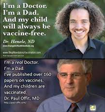
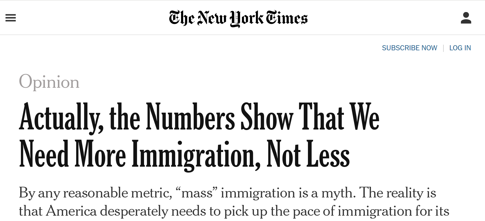

```{r setup, include=FALSE}
knitr::opts_chunk$set(echo = FALSE)
```


# Science and Checking Reasons

## Outline

- Recap
- How to use weak severity
- Scientific Evidence and Diagnostic Frames
- Scientific Evidence and Prescriptive Claims
- Outline of Remainder of the Course

# Recap

## Why do we care about truth?

One main argument is:

Exercise of power involves someone else motivating us with reasons to do or think something else.

---

<iframe width="560" height="315" src="https://www.youtube.com/embed/5T_KN8Ok718?si=gIyd3p_9eureVRoV" title="YouTube video player" frameborder="0" allow="accelerometer; autoplay; clipboard-write; encrypted-media; gyroscope; picture-in-picture; web-share" referrerpolicy="strict-origin-when-cross-origin" allowfullscreen></iframe>

## Reasons

The reasons given to use greater enforcement powers involve claims:

- "most political violence is perpetrated by the left"
- "rhetoric  from left-leaning organzations led to the assassination"
- "political violence is illegitimate"
- "US government should use investigations to target organizations producing the rhetoric that leads to violence"


## Reasons

Some of these reasons are **empirical** claims; some are **normative claims**

- **diagnostic frames**: there is a "problem" to be fixed. 
- **prescriptive claims**: there is a "solution" we should use. 

## Science and Reasons

Scientific Evidence can only be used with **empirical** claims:

- "most political violence is perpetrated by the left"
- "rhetoric from left-leaning organzations led to the assassination"

>- How do we check for scientific evidence?
>- Is this useful?

# Scientific Evidence?

## Probing Claims

When we are given reasons to do something (e.g. accept the use of police powers to target political rivals) 

- claims diagnosing a **problem**
- claims **prescribing** a solution 

involve value judgments. But they also involve empirical claims.

>- We want to look at whether the evidence for the empirical claims was capable of showing those claims to be wrong
>- We want evidence that has thoroughly checked whether the claim is wrong.

## Severity and Good Reasons

If the evidence we are given to accept power over us **would always** support the claims, even if the claims are false, we are not **free**. Bad evidence $\to$ Bad reasons

## Severity Requirement

**weak severity requirement:** 

> "one does not have evidence for a claim if nothing has been done to rule out the ways the claim may be false."

> "If data *x* agree with a claim C, but the method is ... guaranteed to find such agreement, and had little or no capability of finding flaws with C even if they exist, they we have **bad evidence, no test**"

(Mayo 2018)

If evidence fails to meet **weak severity requirement**, it is **not scientific**
(sniff test)

## Severity Requirement

What leads evidence to not meet the bar of *weak severity*? 

Common reasons are: 

- Lack of transparency
- Unsystematic use of evidence (cherry picking)
- Failure to consider alternative stories (e.g., this evidence ALWAYS can be found)

---

<iframe width="560" height="315" src="https://www.youtube.com/embed/akhXd0NVY3s" title="YouTube video player" frameborder="0" allow="accelerometer; autoplay; clipboard-write; encrypted-media; gyroscope; picture-in-picture" allowfullscreen></iframe>

What is the claim? What is the evidence? Meet weak severity?

## Evidence?


What is the claim? What is the evidence? Meet weak severity?

## Evidence?


---

<blockquote class="twitter-tweet"><p lang="en" dir="ltr">White House senior advisor doubles down on voter fraud claims: “Voter fraud is a serious problem in this country” <a href="https://t.co/DC6lVPQznz">pic.twitter.com/DC6lVPQznz</a></p>&mdash; ABC News (@ABC) <a href="https://twitter.com/ABC/status/830787890309369856?ref_src=twsrc%5Etfw">February 12, 2017</a></blockquote> <script async src="https://platform.twitter.com/widgets.js" charset="utf-8"></script>

What is the claim? What is the evidence? Meet weak severity?


## Evidence?



What is the claim? What is the evidence? Meet weak severity?

## Evidence? {.smaller}

[Studies Show That You Should Come Into This Room Right Over Here, And That You Should Come Alone](https://the-toast.net/2015/06/24/studies-show-that-you-should-come-into-this-room-right-over-here-and-that-you-should-come-alone/)

> Recent studies suggest that it's very important that you come into this room right over here just now. Studies also suggest that it's equally important you do not waste time asking questions ... but just step this way through the door very quickly and by yourself, immediately. 
>
> The studies were conducted, and the evidence is conclusive: this room just over here is where you should go next, without anyone coming with you. Scientists did them, the studies. Which ones? Yes.
>
>The studies are all finished now, and you don’t need to see them. The studies suggested that it’s not important you see the studies at all, but it is important that you hurry along, quickly now, because time is of the essence. The studies say now is the best time for you to be alone in that room.


---

Claim: ["US tariffs Worked, with little downside"](https://americancompass.org/the-tariff-tally/)

| Causal Link |  Evidence Used | Evidence Ignored/Downplayed |
|---|---|---|
| **Investment** — tariffs should spur capital investment |  | Investment flat/mixed; blamed on AI boom, policy shifts, "instability" |
| **GDP Growth** — should hold up despite short-term costs | Cited 2.9% growth in last 3 quarters of 2025 | Excluded Q1 2025 (-0.3%, import front-loading); full-year growth (2.1%) below 2024 (2.8%) |
| **Manufacturing Jobs & Wages** — should rise with domestic demand | Cited late-2025 upticks in job openings, real wages | Manufacturing lost 88K jobs; wage uptick not tested against low-wage job losses |
| **Trade Deficit** — should shrink over time | Cited falling bilateral deficit with China | Overall deficit flat/record-high; China imports just shifted to other countries |

## Scientific Evidence

"scientific evidence":

- does not mean the evidence is without flaw; does not mean that the claim is true
- refers to **procedures** and **assumptions** involved in generating evidence
- evidence seriously **investigates whether** *claim* itself or the *assumptions* underpinning the evidence are **wrong**

"unscientific evidence":

- bad evidence does not mean claim is false.

## Scientific Evidence

Mayo (2018) also gives us:

***strong* severity sequirement**:

> "We have evidence for a claim C just to the extent it survives a stringent scrutiny. If C passes a test that was highly capable of finding flaws or discrepancies from C, and yet none or few are found, then the passing result, x, is evidence for C"

>- evidence is **scientific** to extent it survives stringent scrutiny
>- we have checked whether evidence relies on flawed **assumptions**
>- considered whether evidence supports OTHER rival claims

# Science and Diagnostic Frames

## Science and Diagnostic Frames

Claims that there is a "problem" involve a **value judgment** and **descriptive claims**

- "political violence is bad" (a **value judgment**)
- "political left is perpetrating political violence"

## Science and Diagnostic Frames

Evaluating **descriptive claims** are relevant to "diagnostic frames":

- How much political violence is there, really? (Compared to other violence)
- How much political violence is committed by the left? (As opposed to other groups)

>- When people tell us there is a **problem**, there is a value judgement about what is good or bad. We can use scientific evidence to check whether this "problem" is real 

## Severity and Descriptive Claims:

Where can evidence for descriptive claims go wrong?

>- How do we define what we are trying to observe? (What is "political violence"? Who is a "leftist"?) Can that definition be used objectively? 
>- What will we observe that correspond to these definitions? (What could we observe that counts as "political violence"?)
>- How/What procedure will we use to actually observe these things?
>- What could go wrong at each stage that would lead us to incorrectly conclude the claim is right (wrong)?


# Science and Prescriptive Claims

---



An attempt to motivate people to behave differently. An attempt to exercise power. Access to media outlets enables power.

## An Example:

#### **(1) US is not experiencing (comparatively) high levels of immigration**

- Lebanon (4.4 million people) has had more than 1 million refugees in less than 10 years (>25%)
- American (325 million people) has 44 million immigrants (13.7 percent)
- Rate of immigration to US has slowed over the past 10 years 

#### **(2) High immigration rates do not lead to political instability.**

- Canada and Australia have populations that are 20 and 28 percent foreign-born, but no major political problems

## An Example:

#### **(3) New immigrants are employed at high rates.**

- Unemployment among immigrants is lower than native-born Americans
- not a burden on state provision of social services

#### **(4) Lower immigration slows economic growth**
 
- Fertility rates among native-born Americans are dropping
- Because of that, future workforce will be smaller, productivity will be less, growth will slow

#### **(5) America *should* admit 1 million more immigrants per year**

- So growth rates can remain high

---

### **"Actually, the Numbers [Don't] Show That"**

$\checkmark$ if science could test:

(1) US is not experiencing high levels of immigration $\checkmark$

(2) High immigration rates do not lead to political instability $\checkmark$

(3) New immigrants are employed at high rates $\checkmark$

(4) Lower immigration slows economic growth $\checkmark$

(5) **America *should* admit 1 million more immigrants per year** 

### Even if 1-4 are true, what must we to **assume** to conclude that (5) is **true**?


## Prescriptive Claims

#### **prescriptive claims**: 

are normative claims that assert what kinds of actions **should** be taken 

- hint: like a doctor or pharmacist, it *prescribes* a course of action. 
- overlap with justifications/reasons given by power.

The basis for a prescriptive claim includes 

- evidence supporting an **empirical** claim about the consequences of some action (**causal claim**)
- an assumption that some **value judgment** is correct.


## Revisit our Starting Example

#### **(5) America *should* admit 1 million more immigrants per year**

This is a **prescriptive claim**:

For it to be true...

(1) What value judgments must we assume to be true?

(2) What empirical claims must be true?

--- 

### **"Actually, the Numbers [Don't] Show That"**

<br>

**"America *should* admit 1 million more immigrants per year"**

### Even if 1-4 are true: we need to assume that **economic growth** is **desirable** to conclude that (5) is true.

---

#### **(5) America *should* admit 1 million more immigrants per year**

<br>

**scientific evidence cannot "prove" this claim**

even if we evidence that is **very capable** of finding any **flaws** in claim that increasing immigration increases economic growth... (strong severity)

people who value **cultural/ethnic homogeneity** more than **economic growth** can't be persuaded


# Another Example

## Another Example

You and your friends win a large sum of money in a lottery

You and your friends **agree**: you want to **do the most good** by donating the money.

<br>

You consider some options...

---

<iframe width="560" height="315" src="https://www.youtube.com/embed/JMUw4Ndpbdw" title="YouTube video player" frameborder="0" allow="accelerometer; autoplay; clipboard-write; encrypted-media; gyroscope; picture-in-picture; web-share" allowfullscreen></iframe>

---

<iframe width="560" height="315" src="https://www.youtube.com/embed/YRRgfr0tA6o" title="YouTube video player" frameborder="0" allow="accelerometer; autoplay; clipboard-write; encrypted-media; gyroscope; picture-in-picture; web-share" allowfullscreen></iframe>

---

<iframe width="560" height="315" src="https://www.youtube.com/embed/64z9-m6wEw0" title="YouTube video player" frameborder="0" allow="accelerometer; autoplay; clipboard-write; encrypted-media; gyroscope; picture-in-picture; web-share" allowfullscreen></iframe>

## Another Example

Which should you donate to?

- Option 1: Make-a-Wish (more Batkid, pls)
- Option 2: Mosquito Nets
- Option 3: Direct transfer of cash to impoverished people

## Can science solve our problem? 

Peter Singer and effective altruists say yes!

- we can evaluate which of these does the most good!

> "Saving a child's life has to be better than fulfilling a child’s wish to be Batkid."

## Can science solve our problem? {.build}

### Empirical Evidence

- Malaria kills ~500k per year
- Half of global population possibly exposed
- Mosquito nets reduce likelihood of exposure
- For each 100 to 1000 nets, 1 death prevented
- Cost of mosquito nets is low
- Cash transfers are expensive, effects on mortality unclear
- Batchildren encourage vigilante justice

### **What should you do?**

### **Malaria nets!**

## Can science solve our problem?

But wait, your friend says: experiments show that directly giving cash

- benefits the health, education, and life choices of children
- empowers women to be financially independent, escape abuse
- improve mental health

### **What should you do?**

## Can science solve our problem?

If **you value** minimizing suffering, but **your friend values** maximizing individual freedom...

then science cannot help us, because the disagreement is rooted in **value judgements**

##  Another Example

**"We should donate money for mosquito nets"** is a prescriptive claim.

- Scientific evidence for empirical claim that "Mosquito nets (A) prevent malaria (B)" 
    - NOT enough to conclude that does not imply "we should do (A)": it depends on how we **value** B
- if we also accept **value judgement** that it reducing suffering is more important than maximizing freedom (or coolness)
    - THEN we can accept the prescriptive claim
    
Need to accept the **causal** (empirical) claim that $A \to B$ AND a value judgment that $B$ is good.
    
##  Another Example

Science is still be helpful!

- If we assume less mortality is good (B) (a value judgment)
- What if science shows: mosquito nets don't prevent malaria deaths. (empirical evidence)
- "A does/does not cause B" is informative!

## Severity and Causal Claims:

Where can evidence for causal claims go wrong?

>- What is causality?
>- When and why might the relationship (correlation) between factors **not** be the result of causation
>- What comparisons can we make to provide evidence of causation?
>- What do these comparisons **assume** to count as evidence of causation?
>- Is it possible that the evidence we are using could show a relationship that is not causal?

# Conclusion

## Conclusion

Learning to recognize what evidence is capable of proving claims wrong:

- how and why could evidence **find support for a claim** even if the **claim is wrong**
- what **assumptions** permit evidence to able to find claims to be wrong (when they are wrong)

