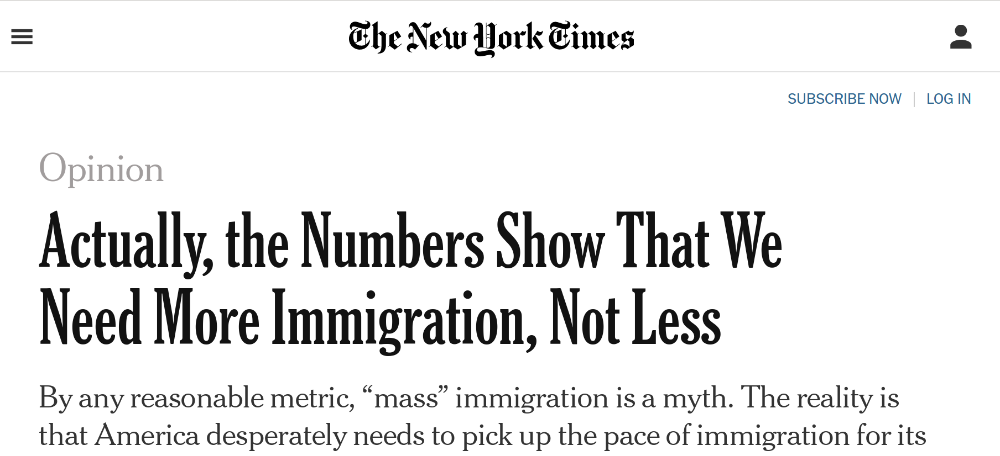

```{r setup, include=FALSE}
knitr::opts_chunk$set(echo = FALSE)
```

# What can Science do?

## Plan for Today

### 1) Claims and Questions

### 2) Normative vs. Empirical

### 3) Varieties of Claims/Questions


# Recap

## Claims and Questions

### In addition to **claims**...

### ... we consider *questions* that can be answered with a claim.

Different kinds of questions correspond to different kinds of claims (as answers).

# An Example

## An Example




## An Example:

#### **(1) US is not experiencing mass immigration**

- Lebanon (4.4 million people) has had more than 1 million refugees in less than 10 years (>25%)
- American (325 million people) has 44 million immigrants (13.7 percent)
- Rate of immigration to US has slowed over the past 10 years 

#### **(2) High immigration rates do not lead to instability.**

- Canada and Australia have populations that are 20 and 28 percent foreign-born, but no major political problems

## An Example:

#### **(3) Immigration has not produced too much supply in the US labor market**

- Unemployment among immigrants is lower than native-born Americans

#### **(4) Lack of immigration will slow US economic growth**
 
- Fertility rates among native-born Americans are dropping
- Because of that, future workforce will be smaller, productivity will be less, growth will slow

#### **(5) America *should* admit 1 million more immigrants per year**

- So growth rates can remain high

## An example

### **Which claims can be validated with science?** Why?

(1) US is not experiencing mass immigration

(2) High immigration rates do not lead to instability.

(3) Immigration has not produced too much supply in the US labor market

(4) Lack of immigration will slow US economic growth

(5) America *should* admit 1 million more immigrants per year

## **"Actually, the Numbers Don't Show This:"**

"America *should* admit 1 million more immigrants per year"

### Even if 1 through 4 are true, what else do we need to **assume** to conclude that (5) is true?

>- We must assume that economic growth is **desirable**.

# Varieties of Claims

## Varieties of Claims

### **Which varieties of claims/questions can be address with science?**

### Three dimensions

1. Empirical vs. Normative
2. Varieties of empirical and normative claims
3. Falsifiable vs. unfalsifiable

## Varieties of Claims

### **Which varieties of claims/questions can be address with science?**

### Today

1. **Empirical vs. Normative**
2. **Varieties** of empirical and **normative claims/questions**
3. Falsifiable vs. unfalsifiable


## Empirical Claims/Questions

#### **empirical claim**:

> is a claim for which the **basis** consists of **observation** of the world and **no value judgment** about what is desirable. Empirical claims assert **what is or exists** or **what relationships occur between things that exist**.


#### **empirical questions**: 

> are questions that can only be answered by an **empirical claim**


## Normative Claims/Questions

#### **normative claim**:

> is a claim about **what is desirable or undesirable** or a claim for which the basis **assumes** a **value judgment** about what is desirable/undesirable. Normative claims assert what **should or should not** be. The "should" is sometimes implied by the language of "right" and "wrong" or suggestions that there is "too much", "enough", or "not enough" of something.

#### **normative questions**:

> Questions about what ought to be or what should be done. They can only be answered by a normative claim and require some kind of **value judgment**

## Value Judgments

#### **value judgments**: 

> a kind of normative claim that directly states what goal or ideal is "right" or provides rules for judging which things are better or worse.


#### They are not:

- empirical claims for which the evidence is false or unsubstantiated
- empirical claims that we can't persuade someone to drop in the face of better evidence

#### Also not:

**prescriptive claims** (defined shortly) about what we **ought to do**.


## Flat Earth!


## Flat Earth?


## Prescriptive Claims

#### **prescriptive claims**: 

> a kind of normative claim that asserts what kinds of actions should be taken (think: like a doctor or pharmacist, it *prescribes*). The basis for a prescriptive claim includes **both** some kind of observation of the world **and** assumes some **value judgment**.

## Revisit our Example

### **Empirical or normative claims?**

(1) US is not experiencing mass immigration

(2) High immigration rates do not lead to instability. 

(3) Immigration has not produced too much supply in the US labor market

(4) Lack of immigration will slow US economic growth 

(5) America *should* admit 1 million more immigrants per year 


## Revisit our Example

(1) US is not experiencing mass immigration (**empirical**)

(2) High immigration rates do not lead to instability. (**empirical**)

(3) Immigration has not produced too much supply in the US labor market (**empirical**)

(4) Lack of immigration will slow US economic growth (**empirical**)

(5) America *should* admit 1 million more immigrants per year (**normative**)

### Is $(5)$ a **prescriptive claim** or **value judgment**? Why?

## Science evaluates *Empirical* claims

### **Empirical claims:** can be evaluated using science

>- we will meet the varieties soon enough

### **Normative claims:** cannot (fully) be evaluated using science

- **value judgments** cannot be evaluated with science
- **prescriptive claims** can, in part, by evaluated with science

## Why can't science answer normative claims?

Can't science tell us what to do?

It could tell us what we should do to:

- grow the economy
- live longer, be healthier
- alleviate poverty
- reverse climate change

# Interlude

## What is the best music? {.build}

### Either a genre or criteria for judging the best...


### How would we judge this **scientifically**?

## Another example

You and your friend win a sum of money in a lottery

You and your friend agree: we should spend the unearned money to alleviate the most human suffering.

### You disagree on whether:

(1) Should we donate mosquito nets to stop malaria?

(2) Should we give money directly to impoverished people?

### Can science resolve the problem?

## Another example {.build}

### Scientific Evidence

- Malaria kills ~500k per year
- Half of global population possibly exposed
- Mosquito nets reduce likelihood of exposure
- For each 100 to 1000 nets, 1 death prevented
- Cost of mosquito nets is low
- Cash transfers are expensive, effects on mortality mixed
- Sums must be very large to affect mortality

### **What should you do?**

### **Malaria nets!**

## Another example

### BUT...

What if **you value** minimizing suffering, but **your friend values** maximizing individual autonomy?

### Does the scientific evidence resolve your dispute?

>- NO! For prescriptive claims, science can only address *how* we get to our desired outcome, not which value judgment is right.


##  Another example (Summary)

### "Mosquito nets (A) prevent malaria (B)"

- "A causes B" $\not\to$ "we should do A"

- Depends on how we **value** B

### But...

- Assuming less malaria is good (B), resources are finite
- What if mosquite nets don't prevent malaria?
- "A does not cause B" is informative!


## Revisit our Starting Example

#### **(5) America *should* admit 1 million more immigrants per year**

#### **We can accept this claim if:**

(1) the empirical claims made are true, **and** 

(2)  **we value** economic growth over something else 

#### **Evidence will not "prove" this claim to everyone**

e.g. people who oppose immigration to preserve racial homogeneity

