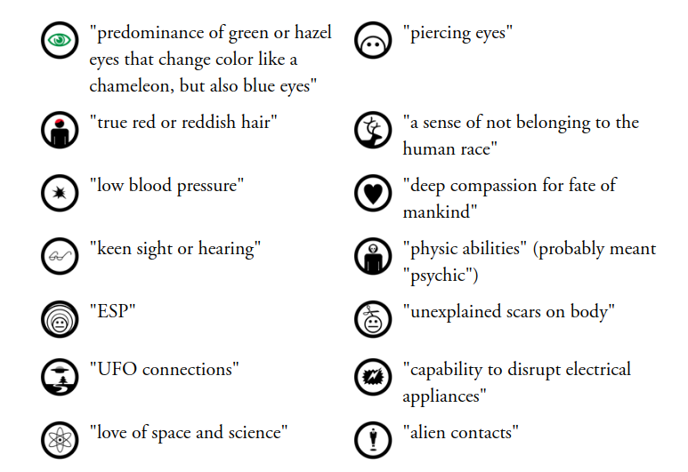
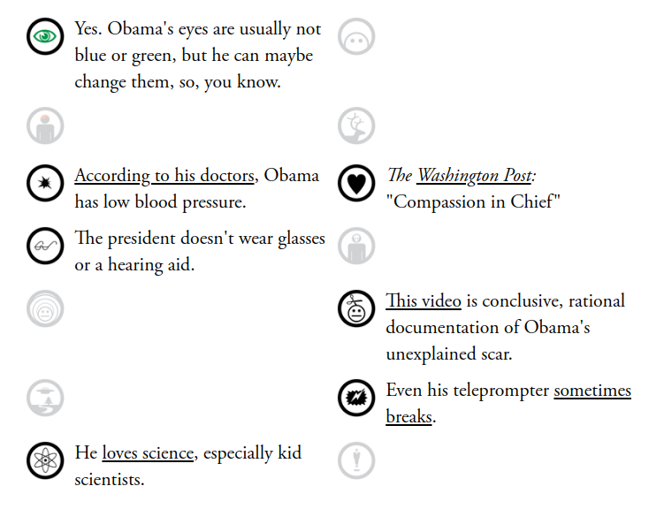
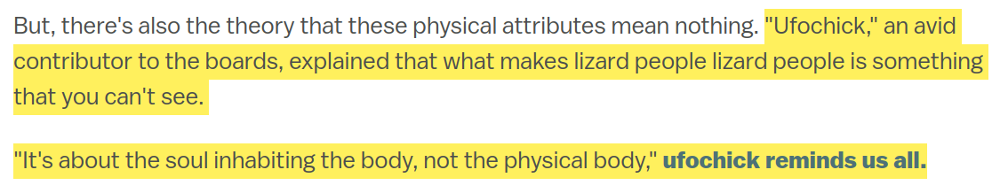

```{r setup, include=FALSE}
knitr::opts_chunk$set(echo = FALSE)
```

# Varieties of Claims

## Plan for Today

### 1) Recap: Normative vs. Empirical claims

### 2) Empirical Claims: causal vs. descriptive

### 3) Falsification

# Recap

## AfD Arguments

(1) **About 1.1 million refugees entered Germany during 2015.**

(2) **The vast majority of these refugees came from Syria and other parts of the Middle East.**

(3) **Alexander Gauland: "we don't like the values of Islam based on sharia [law] that are not compatible with our Basic Law."**

(4) **Large waves of immigration reduce employment and social services for low-income native Germans.**

(5) **This influx in refugees *increased* violent crime.**

(6) **Germany should admit far fewer refugees/immigrants.**

## Empirical or Normative?

(1) **About 1.1 million refugees entered Germany during 2015.**

(2) **The vast majority of these refugees came from Syria and other parts of the Middle East.**

(3) **Alexander Gauland: "we don’t like the values of Islam based on sharia [law] that are not compatible with our Basic Law." **

(4) **Large waves of immigration reduce employment and social services for low-income native Germans.**

(5) **This influx in refugees *increased* violent crime.**

(6) **Germany should admit far fewer refugees/immigrants.**


## Empirical or Normative?


(1) **About 1.1 million refugees entered Germany during 2015.** (empirical)

(2) **The vast majority of these refugees came from Syria and other parts of the Middle East.** (empirical)

(3) **Alexander Gauland: "we don’t like the values of Islam based on sharia [law] that are not compatible with our Basic Law." ** (normative)

(4) **Large waves of immigration reduce employment and social services for low-income native Germans.** (empirical)

(5) **This influx in refugees *increased* violent crime.** (empirical)

(6) **Germany should admit far fewer refugees/immigrants.** (normative)


# Varieties of <br> Empirical Claims

## Varieties of Claims

### **Which varieties of claims/questions can be addressed with science?**

### Two dimensions

1. Empirical vs. Normative
2. **Varieties of empirical** and normative claims/questions

## Some empirical claims

1. **In 2023, Canada had 0.72 firearms homicides per 100K while the US had 5.22 per 100K.**

2. **The United States has more assault weapons per capita and more mass shooting victims than Canada**

3. **Canada has fewer firearms deaths per capita than the US because Canada has stricter gun laws.**

4. **Americans use guns in self-defense about 2.3 million times per year.**

5. **People who openly carry a firearm are less likely to be victims of crimes**

6. **Making it easier to legally carry a concealed firearm increases firearms deaths.**

## Descriptive claims:

### **descriptive claims:**

claims about what exists (or has existed/will exist) in the world: 

- **what phenomena exist** (what kinds of things exist?)
- **what is the type of a specific phenomenon** (what is this thing?)
- **amount/frequency of phenomena** (how much of something is there?)
- **relative amount/frequency of phenomena across different places/times** (how much of something is there here vs. there/now vs. then?)
- **what patterns are there in the shared appearance/non-appearance of different phenomena** (does this thing usually appear together with that other thing?)

## Which of these are descriptive?

(1) **About 1.1 million refugees entered Germany during 2015.** 

(2) **The vast majority of these refugees came from Syria and other parts of the Middle East.** 

(4) **Large waves of immigration reduce employment and social services for low-income native Germans.**

(5) **This influx in refugees *increased* violent crime.**


## Which of these are descriptive?

(1) **About 1.1 million refugees entered Germany during 2015.** (descriptive)

(2) **The vast majority of these refugees came from Syria and other parts of the Middle East.** (descriptive)

(4) **Large waves of immigration reduce employment and social services for low-income native Germans.**

(5) **This influx in refugees *increased* violent crime.**

## Causal claims:

### **causal claims**:

are claims about the how one phenomena ($X$) affects or causes another phenomena ($Y$). Causal claims state that $X$ **acts on** $Y$ in some way, not merely that they appear together in some pattern:

- the **effect** that one thing or event has on another thing (effects of causes)
- the **cause** of some event or thing in the world (causes of effects)
- the *conditions* under which some thing or event *happens* (causes of effects)
- the *process* through which one thing affects another (causes of effects)

## Which of these are causal?

(1) **About 1.1 million refugees entered Germany during 2015.** (descriptive)

(2) **The vast majority of these refugees came from Syria and other parts of the Middle East.** (descriptive)

(4) **Large waves of immigration reduce employment and social services for low-income native Germans.** (causal)

(5) **This influx in refugees *increased* violent crime.** (causal)

## **How to recognize causal claims** 

(compared to descriptive claims)

### Causal claims include some kind of  **causal verb (or phrase)**. E.g.:

-  (non-exhaustive list): "causes", "influences","makes happen", "increases", "decreases", "results in", "was necessary for", etc.
- can always be restated as a phrase with a verb, subject, and some object, where subject is the cause and object (or one of the objects) is the affected thing.
- can always be restated as a phrase like "$X$ causes $Y$ to change in some way" or "$Y$ changes in some way because of $X$"

## Causal or Descriptive?

1. **In 2023, Canada had 0.72 firearms homicides per 100K while the US had 5.22 per 100K.**

2. **The United States has more assault weapons per capita and more mass shooting victims than Canada**

3. **Canada has fewer firearms deaths per capita than the US because Canada has stricter gun laws.**

4. **Americans use guns in self-defense about 2.3 million times per year.**

5. **People who openly carry a firearm are less likely to be victims of crimes**

6. **Making it easier to legally carry a concealed firearm increases firearms deaths.**

## Causal or Descriptive?

1. In 2023, Canada had 0.72 firearms homicides per 100K while the US had 5.22 per 100K.

2. The United States has more assault weapons per capita and more mass shooting victims than Canada

3. **Canada has fewer firearms deaths per capita than the US because Canada has stricter gun laws. (causal)**

4. Americans use guns in self-defense about 2.3 million times per year.

5. People who openly carry a firearm are less likely to be victims of crimes

6. **Making it easier to legally carry a concealed firearm increases firearms deaths. (causal)**

##  **How to recognize causal claims** 

(compared to descriptive claims)

### Causal claims always imply: *if* we could directly **manipulate** one thing ($X$), then we would see something else ($Y$) change


## Turn these into causal claims:

$1$. **In 2023, Canada had 0.72 firearms homicides per 100K while the US had 5.22 per 100K.**

$2$. **The United States has more assault weapons per capita and more mass shooting victims than Canada**

$4$. **Americans use guns in self-defense about 2.3 million times per year.**

$5$. **People who openly carry a firearm are less likely to be victims of crimes**

# Falsification

## How does evidence help?

We want to know whether we should accept descriptive/causal claims:

- they are embedded in a prescriptive claim
- they are part of a justification/reason to act some way (power)

How do we move from **evidence** to **inference** about a claim?

## Logic of inference

**valid** vs **sound** arguments:

1. Claim $C$: All swans are white.
2. $S$ is a swan but is black.
3. Therefore, $C$ is false.

logic *valid* if, when premises (1) are true, then conclusion (3) must be true.

## Logic of inference

**valid** argument?

1. Claim $C$: All swans are white.
2. $S$ is a swan.
3. Therefore, $S$ is white

---


## Logic of inference

**valid** vs **sound** arguments:

1. Claim $C$: All swans are white.
2. $S$ is a swan.
3. Therefore, $S$ is white

>- logic may be **valid** but **unsound**. The **premises** may be **false**.

## Logic of inference

### **confirmation**/**verification**

If we had an empirical claim, $H_1$ ($H$ for hypothesis)

and, if $H_1$ (**claim**) were true, then it implies we should make certain empirical **observations** $O_1$

Confirmation says that

1. $H_1 \xrightarrow{implies}$ we see $O_1$

2. If we see $O_1$

3. Then, $H_1$ is true (or, more "likely" to be true)

## Confirmation

Many people reject **confirmation** because **many different**, incompatible **claims** are **consistent with the same observed evidence**

1. $(H_1, H_2, \ldots, H_k) \xrightarrow{imply}$ we see $O_1$

2. If we see $O_1$

3. Then, $H_1$ is *not proven*

<br>

>- Because we would observe $O_1$ if, e.g. $H_2$ were true and $H_1$ false.

## Falsification vs Confirmation


### **The difference**

**Confirmation** looks to see: is there evidence that the claim is **right**

**Falsification** looks to see: is there evidence that the claim is **wrong**

- it never says "claim is correct", it says "we haven't rejected this, yet"

## Example (Lott 2021)

$H_1:$ **Presidential Election in Georgia was fraudulently stolen from Donald Trump**. Allegedly: "counting of [absentee] ballots [in Fulton county] took place in secret after Republican Party observers were dismissed because they were advised that the tabulation center was shutting down for the night."

<u>**Confirmation**</u>

1. $H_1 \xrightarrow{implies}$ absentee ballots from precincts on Fulton side of county line more pro-Biden more than absentee ballots in precincts on non-Fulton side of county line.

## Example (Lott 2021)

$H_1:$ **Presidential Election in Georgia was fraudulently stolen from Donald Trump** 

<u>**Confirmation?**</u>

1. $H_1 \xrightarrow{implies}$ absentee ballots from precincts on Fulton side of county line more pro-Biden more than absentee ballots in precincts on non-Fulton side of county line.

2. Researcher finds absentee ballots in Fulton county broke more for Biden than neighboring counties: [see here](https://papers.ssrn.com/sol3/papers.cfm?abstract_id=3756988)

3. Therefore, "Fraud in Georgia Election"

## Example (Lott 2021)

- $H_1:$ **Presidential Election in Georgia was fraudulently stolen from Donald Trump**
- $H_2:$ **People select residence based on partisanship**
- $H_3:$ **People select residence based on racial composition of schools**   

1. $(H_1, H_2, H_3) \xrightarrow{imply}$: Absentee ballots in Fulton side of county line more Pro-Biden than on other side of county line

2. Researcher finds absentee ballots in Fulton county broke more for Biden than neighboring counties [see here](https://papers.ssrn.com/sol3/papers.cfm?abstract_id=3756988)

3. Therefor, $H_1, H_2, or H_3$ could be valid

## Example (Georgia 2018)

1. $H_1$: voter suppression handed Republicans 2018 governor election in Georgia.

2. Documented evidence of "voter [roll] purges, registration applications put on hold, Election Day troubles at predominantly nonwhite voting precincts, and problems with voters’ absentee and provisional ballots."

3. Therefore, $H_1$, voter suppression "stole" election

>- Same problems apply! Presence of voting restrictions does not mean they affected outcome.

## Falsification

Logic of **falsification**: what are implication $O_1$ that we **should not see** if claim is true?

1. $H_1 \xrightarrow{implies}$ we do not see $O_1$
2. If we see $O_1$
3. Then, reject $H_1$

## Falsification

1. $H_1$ all swans are white $\xrightarrow{implies}$ we do not see black swans ($O_1$)
2. If we see $O_1$ (a black swan)
3. Then, reject $H_1$

>- Is it really so easy?

## Example (Lott 2021)

$H_1:$ **Presidential Election in Georgia was fraudulently stolen from Donald Trump** 

<u>**Falsification?**</u>

1. $H_1 \xrightarrow{implies}$ absentee ballots from precincts on Fulton side of county line more pro-Biden more than absentee ballots in precincts on non-Fulton side of county line $\xrightarrow{implies}$ should **not** observe no difference in vote choice in neighboring precints

2. Researchers find no difference in absentee ballots in Fulton county than neighboring counties

3. Therefore, "Fraud in Georgia Election" **falsified**?

>- Not so fast.

## Falsification is hard

*  Election fraud claims involve multiple possible pathways of fraud (**auxiliary claims**)
    - theory linking fraud to expected observation in vote patterns may be wrong, even if fraud is true
    - absence of evidence may not be evidence of absence
    - ruling out one path doesn't rule them all out
* Data collection and tests for vote differences require **assumptions**

## Example (Lott 2021)

$H_1:$ **Presidential Election in Georgia was fraudulently stolen from Donald Trump** 

<u>**Falsification?**</u>

1. $H_1 \xrightarrow{implies}$ absentee ballots from precincts on Fulton side of county line more pro-Biden more than absentee ballots in precincts on non-Fulton side of county line $\xrightarrow{implies}$ should **not** observe no difference in vote choice in neighboring precints

2. Researchers find no difference in absentee ballots in Fulton county than neighboring counties

3. Therefore, "Fraud in Georgia Election" **or** absentee vote logic **or** statistical test assumptions **or** data sources are wrong.

## Falsification

Falsification as a logic of evidence seems to embody **severity** requirements.

But in real-world, theory and evidence are too complex to admit simple falsifications.

# 

<iframe width="560" height="315" src="https://www.youtube.com/embed/7vrP8EplfP0" title="YouTube video player" frameborder="0" allow="accelerometer; autoplay; clipboard-write; encrypted-media; gyroscope; picture-in-picture" allowfullscreen></iframe>

## Example: Lizard People


$H_1$: **World leaders are actually lizard people who seek to dominate humans**
 
## Lizard People: Confirmation

$H_1 \xrightarrow{implies} O_1$: **World leaders exhibit lizard traits** 



## Lizard People: Confirmation

We observe $O_1$:



## Lizard People: Confirmation

$O_1 \to H_1$: **Bow down before your lizard overlords**


## Lizard People: Falsification?

How would we **falsify** this?

1. $H_1$: **World leaders are actually lizard people who seek to dominate humans** $\to \ not \ O_?$

2. If we see $O_?$ 

3. $not \ H_1$

What, if we observed it, would prove "lizard people" wrong?

## Lizard People: Falsification?
 



## Falsification vs. Conspiracy:

Mayo (2018) says: "there is no logical inconsistency with invoking a hypothesis from *conspiracy*: all these instruments conspire to produce results as if H were true but in fact H is false"

This is the "rigged" hypothesis: Something else other than H actually explains the data and that the data appears to align with H.

>- This isn't the logic of falsification! One can **always** invoke the conspiracy, even if it is wrong. It fails the **weak severity** requirement.

## Falsification and Evidence:

Even if falsification isn't **easy** or **simple**:

- we can attempt to falsify our **auxiliary claims** (theories linking theory to empirical predictions?)
- we can attempt to falsify our test **assumptions** (do the assumptions required for this test hold in the relevant context?)

## Conclusion

We see science as investigating empirical claims in such a way that leaves assumptions open to challenge:

- We want tests that meet **weak severity** requirement
- We only want to accept claims if the tests have probed the ways in which claim could be wrong (**strong severity**)

## Conclusion

Going forward, we examine evidence for:

- Descriptive claims
- Causal claims

We will learn..

- assumptions involved in common forms of evidence
- ways in which those assumptions can be violated
- what it would look like to check those assumptions.

## Conclusion

With these tools: better able to assess...

- Is this evidence capable of showing claim to be wrong?
- Does this evidence attempt to probe ways in which its assumptions are wrong?
- Is this claim severely tested?


