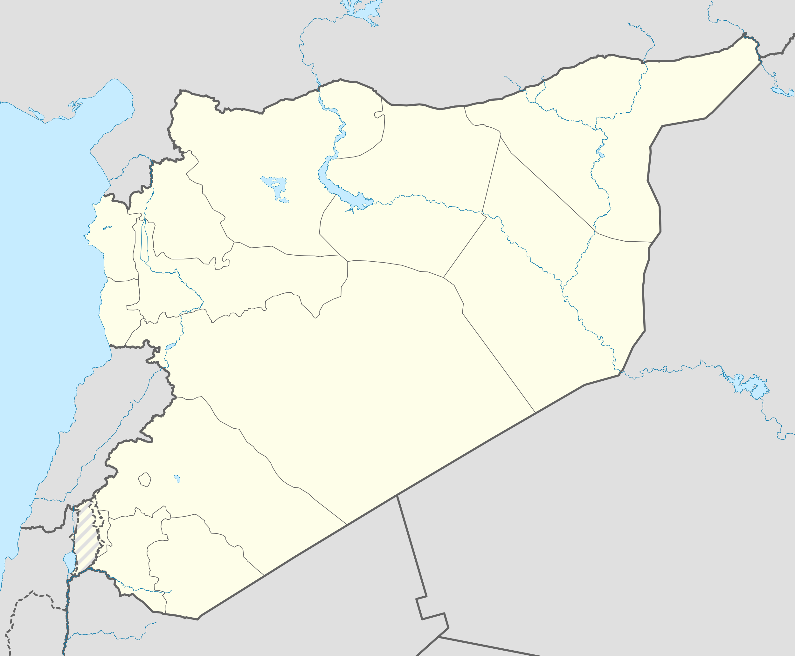

```{r setup, include=FALSE}
knitr::opts_chunk$set(echo = FALSE)
```

# Evaluating Descriptive Claims

## Outline

- Assignments
- Evaluating Descriptive Claims
- Concepts

## Assignments:

Assignment 1
    
- Recognize when people are attempting to motivate you to do something (look at your actual news/information sources)
- Recognize what **kinds** of claims they are using
- **Show us** you know can distinguish between claims
- Don't quote a claim directly; paraphrase it to make the claim more clear.
    

## Assignments:

Group Project
    
- Revise your topic, if needed, based on TA feedback
- Causal claim that is linked to the prescriptive claim for your topic
- Must be able to  "test" the causal claim by surveying students in our class
- You need to be able to measure the "cause" and the "effect" with survey questions
- Students in the class must differ in how much of the "cause" they are exposed to


## Objectives

### (1) **types** of descriptive claims $\to$ diagnostic frames

### (2) Toolbox: How to judge is descriptive claim correct or not?

### (3) What are concepts?

- when are concepts suitable for scientific evidence?
- when do concepts fail weak severity?


# Descriptive Claims


## Descriptive Claims:

### **descriptive claims:**

claims about what exists (or has existed/will exist) in the world: 

- **what phenomena exist** (what kinds of things exist?)
- **what is the type of a specific phenomenon** (what is this thing?)
- **amount/frequency of phenomena** (how much of something is there?)
- **relative amount/frequency of phenomena across different places/times** (how much of something is there here vs. there/now vs. then?)
- **what patterns are there in the shared appearance/non-appearance of different phenomena** (does this thing usually appear together with that other thing?)


## Descriptive Claims: Varieties

(1) **"Democracy is a type of political regime."**

(2) **"Russia is a democracy."**

(3) **"58% of countries worldwide are democracies."**

(4) **"Countries in Western Europe are more democratic than those in Eastern Europe."**

(5) **"Countries around the world have become less democratic since 2016."**

## Descriptive Claims:

Why do we care about using science to assess descriptive claims?

>- **they are often claims about whether there is a problem, what is the nature of the problem** (diagnostic framing)
>- **claims about relevance of a particular value judgment**
>- **evaluating causal claims requires us to evaluate descriptive claims**


## Example

<iframe width="560" height="315" src="https://www.youtube.com/embed/qeWBy9qFwUc?si=r9amwChhBEs-f--I" title="YouTube video player" frameborder="0" allow="accelerometer; autoplay; clipboard-write; encrypted-media; gyroscope; picture-in-picture; web-share" referrerpolicy="strict-origin-when-cross-origin" allowfullscreen></iframe>


## Example

<iframe width="560" height="315" src="https://www.youtube.com/embed/NVpJs1Zf97Q?si=elSdiHNhomQRSIWV" title="YouTube video player" frameborder="0" allow="accelerometer; autoplay; clipboard-write; encrypted-media; gyroscope; picture-in-picture; web-share" referrerpolicy="strict-origin-when-cross-origin" allowfullscreen></iframe>


## Example


<iframe width="560" height="315" src="https://www.youtube.com/embed/arxKu6LWgiA" title="YouTube video player" frameborder="0" allow="accelerometer; autoplay; clipboard-write; encrypted-media; gyroscope; picture-in-picture; web-share" referrerpolicy="strict-origin-when-cross-origin" allowfullscreen></iframe>

## Example

**How can we decide which claim about "threat to democracy" is right?**

## Descriptive Claims:


## Descriptive Claims:


## Descriptive Claims:


**"Countries around the world have become less democratic since 2016."**


## Descriptive Claims: Evaluation

What would you want to know before you could judge whether this claim was correct or incorrect?

> **"Countries around the world have become less democratic since 2016."**

## Descriptive Claims: Evaluation

We need a toolbox for scientific evidence:

- tools to judge the **severity** of evidence (is this evidence capable of finding the claim to be wrong)
- tools for identifying what can go wrong with evidence (so we can know whether these risks have been addressed)

You can use these tools when deciding whether to accept claims, or when making your own claims


## Descriptive Claims: Evaluation

When we evaluate evidence for descriptive claims, we want to think about **severity**

- can the evidence actually show claims to be wrong?

or conversely...

- what are the ways in which evidence may erroneously lead us to accept claims that are false?


## Our "Toolbox"

### **Concepts**: 

define our terms in a way that is **transparent** and can be used **systematically**. If concepts are opaque or idiosyncratic $\to$ STOP! 

### **Variables**:

translate concepts into something that we can (in principle) **observe**. If variables do not correspond to the concept / correspond to *other* concepts $\to$ STOP!

### **Measurement**:

devise **transparent** and **systematic** procedures with known **uncertainty** to observe those attributes of specific cases. If measurement procedure is opaque, likely to suffer from bias, or has high degree of uncertainty $\to$ STOP!  

## Evaluating Descriptive Claims: 

A useful definition:

In social science we discuss "cases", not in the legal sense, but in this sense: 

#### **case**: 

> a specific individual, organization, entity, event, or action, existing in a specific time and place.

We are often interested in identifying what general categories this specific **case** belongs to, what is its "type". Or measuring **attributes** of that case. (How much of something it has, e.g.)

## Cases

(1) "Democracy is a type of political regime."

(2) **"Russia is a democracy."**

(3) **"58% of countries worldwide are democracies."**

(4) **"Countries in Western Europe are more democratic than those in Eastern Europe."**

(5) **"Countries around the world have become less democratic since 2016."**


# Concepts

## Concepts

At a general level:

**concepts**: abstract or general categories that we (humans) apply to particular cases/instances. They **abstract** away from the highly **particular**, complex, and often **unique** features of reality.

Our thought and our language is rooted in concepts!

>- concepts are labels with definitions


## What is a chair?

How would you define what a "chair" is?

## What is a chair?


## What is a chair?


## What is a chair?


## What is a chair?


## What is a chair?


## What is a chair?


## What is a chair?


Ludwig Wittgenstein, *Philosophical Investigations*

## What is a chair?

Takeaway: definitions/concepts are...

1. **incomplete**: they don't perfectly give us rules to cover all possible situations
2. **about family resemblances**: there isn't one unique element of "chairness" that all chairs share, but they are somehow related
3. **homogenizing**: concepts lump together diverse things into one category

>- But can't we develop fully precise concepts without these problems?

---

### *On Exactitude in Science*

>  "... In that Empire, the Art of Cartography attained such Perfection that the map of a single Province occupied the entirety of a City, and the map of the Empire, the entirety of a Province. In time, those Unconscionable Maps no longer satisfied, and the Cartographers Guilds struck a Map of the Empire whose size was that of the Empire, and which coincided point for point with it. The following Generations, who were not so fond of the Study of Cartography as their Forebears had been, **saw that that vast Map was Useless**, and not without some Pitilessness was it, that they delivered it up to the Inclemencies of Sun and Winters. In the Deserts of the West, still today, there are Tattered Ruins of that Map, inhabited by Animals and Beggars; in all the Land there is no other Relic of the Disciplines of Geography." 

- Jorge Luis Borges

## Concepts

### Why do we need them?

Without concepts/abstraction:

- all experiences we have are **unique**
- we cannot anticipate **regularities**/**similarities**/**patterns** in the world
- we cannot **predict** what will happen next

## Concepts

### But... abstraction comes at a price

Our concepts may abstract too much, with possibly bad consequences.

- Forests
- Boundaries of countries

## {.centering}


## Conceptual Limits {.centered}



## Conceptual Limits {.centered}


## Concepts

... **are imperfect abstractions from reality**, but we need them.

<br>

**How do we develop scientific concepts?**


## Concepts and Science

If I claim...

**"Countries around the world have become less democratic since 2016."**

<br>

And I tell you that my definition of "democracy" is"

**"I know democracy when I see it"**

<br> 

Can this be "scientific evidence"?

## Concepts and Science

If I claim...

**"Countries around the world have become less democratic since 2016."**

<br>

And I tell you that my definition of "democracy" is"

**"A democracy is country where leaders are chosen by free and fair elections and everyone is  equal before the law, or the country is the United States."**

<br> 

Can this be "scientific evidence"?

## Concepts and Science

If I claim...

**"Countries around the world have become less democratic since 2016."**

<br>

And I tell you that my definition of "democracy" is"

**"A democracy is a country where the leader implements the Will of the People."**

<br> 

Can this be "scientific evidence"?


## Concepts and Science:

Building on our insights about/criteria for science:

#### (1) Concepts need to be **transparent**: 

clear and accessible definition. Even if we disagree over the label, we can all assess whether a case meets the definition.

#### (2) Concepts must be formulated to be used **systematically**

Science is about systematic evidence. Cannot define concepts that include loopholes for one case. Definitions must be tied to attributes that are observable

#### (3) Concepts should be tied to prediction (not strictly necessary to evaluate claims)

science is fundamentally about prediction, finding regularities. Concepts that do not bring together cases that have some shared behavior/action do not help us understand. 


## Concepts and Science:

If concepts are **not** systematic, **not** transparent...

evidence may not be able to show claims are wrong (fails weak severity)...

- if person making claims won't even define terms
- if definitions appeal to loopholes (cherry picking to get desired answer)
- if definitions do not appeal to observable traits (how can someone replicate evidence for themselves?)

---

#### **concepts**:

are **abstract** or **general** categories that we apply to **particular** cases using a set of rules/criteria that determine membership in the category.

For concepts to be useful in testing claims scientifically... 

- defining traits **must be something we can all observe** (empirical). (e.g., democracy cannot be defined by an ethereal 'Democratic Spirit')
- the traits are **about what it means to be** in this category. "To be a democracy is to have $x,y,z$ traits."

For concepts to be useful in building theories (not our focus):

- traits are **relevant to predicting** how cases described by the concept affect other things or are affected by other things. **Relevant** to ordinary use of the word

## An example:

**erythrocracy**: 

>- definition: a state in which the flag/color for the ruler is red
>- defining trait is **observable**
>- traits tell us what it **"means to be"** erythrocracy
>- but, fairly useless concept when it comes to **prediction**...

>- Nevertheless, could test claims about whether erythrocracies are different in some way

---

Countries with flags that are $50\%$ red:


## An example: Democracy?

Claim: **Countries around the world have become less democratic since 2016.**

>- How do we define "democracy"? 
>- What definition is Trump using?
>- What definition is Schumer using?

## An example: Democracy?

Claim: **Countries around the world have become less democratic since 2016.**

Answer: No, the number of democratic states has not changed since 2016.

>- Of 193 UN member states, **9 were democratic in 2016** and are all still democratic today

---


```{r, echo = F, warning = F, message = F}
require(ggplot2)
require(data.table)

d1 = data.table(year = 2000:2022, democracies = 9)

ggplot(d1, aes(x = year, y = democracies)) +
  geom_line() + 
  xlab('Year') +
  ylab('# of Democracies') +
  ggtitle("Democracy Over Time") +
  theme_bw() +
  ylim(0,20) +
  geom_vline(xintercept = 2016, color = 'red')

```

## An example: Democracy? {.build}

**Countries around the world have become less democratic since 2016.**

- **country**: a sovereign state that is recognized by the United Nations
- **democracy**: a state that has "democracy" or "democratic" in its chosen, formal name.

## An example: Democracy?

- *People's Democratic Republic of Algeria*
- *Democratic Republic of the Congo*
- **Democratic Republic of Timor-Leste**
- *Federal Democratic Republic of Ethiopia*
- Democratic People's Republic of Korea
- Lao People's Democratic Republic
- **Federal Democratic Republic of Nepal**
- **Democratic Republic of São Tomé and Príncipe**
- **Democratic Socialist Republic of Sri Lanka**

## An Example: Democracy?

### a (minimalist) definition of **democracy**:

#### A democracy is a government in which political decisions are made by people who acquire power through  competitive elections, the results of which are respected (losers leave office).

---

```{r, echo = F, warning = F, message = F}
require(ggplot2)
require(data.table)

d2 = fread("./mindem_scores.csv")

ggplot(d2, aes(x = year, y = democracy*100)) +
  geom_line() + 
  xlab('Year') +
  ylab('Democratic Countries (%)') +
  ggtitle("Democracy Over Time:\nMinimal Democracy") +
  theme_bw() +
  #ylim(0,100) +
  geom_vline(xintercept = 2016, color = 'red')

```


## An Example: Democracy?

### V Dem definition of **democracy**:

Countries where elections are free, fair, and reoccurring; elected officials wield political power de facto; suffrage is universal; political parties and candidates can form freely and compete; and the environment around elections make for a reasonably level playing field with speech, media, and civil society freedom; there are constraints on the executive by the legislature and the judiciary, and the rule of law ensuring respect for civil liberties.

---

```{r, echo = F, warning = F, message = F}
require(ggplot2)
require(data.table)

d3 = fread("./vdem.csv")

ggplot(d3[Year >= 2000], aes(x = Year, y = ldi)) +
  geom_line() + 
  xlab('Year') +
  ylab('Average Liberal Democracy Score') +
  ggtitle("Democracy Over Time:\nVarieties of Democracy") +
  theme_bw() +
  #ylim(0,12) +
  geom_vline(xintercept = 2016, color = 'red')

```


[data description](https://v-dem.net/documents/38/V-Dem_Codebook_v14.pdf)

---

**"Countries around the world have become less democratic since 2016."**

**Different concepts** lead to different variables, different measures, different answers.

Even if we **disagree** that these are definitions of "democracy", we can still **evaluate the claim** using these definitions.

>- What if we defined democracy as "I know it when I see it"?
>- What if we defined democracy as "Countries where the government enacts the general will"?

## Scientific Concepts: An Example

Which definition of "democracy" is right?

1. **Kim Jong Un's: "a state with 'democratic' in its name."**

2. **Minimal: "government in which political decisions are made by people who acquire power through competitive elections, the results of which are respected."**

3. **Freedom House**

4. **Varieties of Democracy**

## Scientific Concepts: An Example {.centered}

From the perspective of evaluating descriptive claims, scientifically...


## Scientific Concepts: An Example

Which definition of "democracy" is right?

Each definition could be used in scientific evidence

- defining traits are about "what it is to be a democracy"
- traits are observable
- though, not all definitions relevant to prediction (elaborate)

**Choice** of which definition ought to be labeled **"democracy"** reflects **value judgment** and common usage

- e.g., from the perspective of physics, the name "electron" is not relevant to how we define the properties electrons.

## Concepts and Science:

### Insight:

Depending on the questions we ask, values we espouse, etc., there are many **different definitions** for the same words. 

**Even if we disagree with <u>definition</u> for a specific word**, good scientific concepts can be understood and used by others regardless of whether they agree with our definitions.

## Concepts and Science:

Kim Jong Un may insist that "a state with 'democratic' in its name" is a "democracy".

But the point of contention is the term "democracy"

### a definition of **regime type 1.a**:

#### **regime type 1.a** is a government in which political decisions are made by people who acquire power through  competitive elections, the results of which are respected (losers leave office).

## Concepts and Science:

Kim Jong-un would have to **accept** that the **Democratic People's Republic of Korea** does not meet this definition empirically:

<br>

> "a government in which political decisions are made by people who acquire power through competitive elections, the results of which are respected (losers leave office)."

<br>

**even if he rejected that this is the definition of "democracy"**

## Concepts:

1. **To evaluate descriptive claims, we need to define concepts**
2. **Scientific concepts are systematic definitions about what relevant and observable traits makes something an "X".**
3. **Scientific concepts are "objective" in the sense they *can be used* even if we disagree with them**

    - "subjective" in that value judgements may make us prefer one definition of a word over another.
