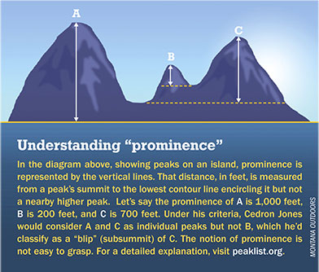
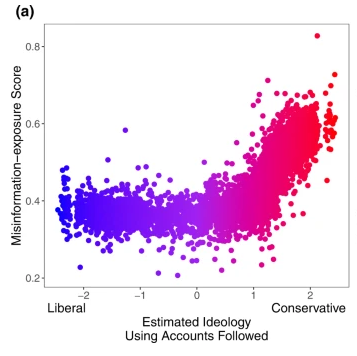

```{r setup, include=FALSE}
knitr::opts_chunk$set(echo = FALSE)
```


## Objectives

### (1) **Concept Review**

### (2) **Evaluating Descriptive Claims**

### (3) **Variables**


- **Validity**


# Misinformation

## What is the "Problem"?


>- How do we know that misinformation is widespread?

## Need to use our tools:

### **Concepts**: 

define our terms in a way that is **transparent** and can be used **systematically**. If concepts are opaque or idiosyncratic $\to$ STOP! 

### **Variables**:

translate concepts into something that we can (in principle) **observe**. If variables do not correspond to the concept / correspond to *other* concepts $\to$ STOP!

### **Measurement**:

devise **transparent** and **systematic** procedures with known **uncertainty** to observe those attributes of specific cases. If measurement procedure is opaque, likely to suffer from bias, or has high degree of uncertainty $\to$ STOP!  

## Defining Misinformation:

What is **misinformation**?

What is **disinformation**?


## Defining Misinformation:


"Misinformation is know it when I see it":

>- If I want to show that misinformation has gotten worse... no transparent and systematic definition let's me label content in line with my claim $\to$ fails weak severity


## Defining Misinformation:


"Misinformation is factually inaccurate information OR whatever is on social media":

>- If I want to show that misinformation has gotten worse... absence of systematic definition (loophole for social media) leads me to find more misinformation whenever there is more social media (even if social media content were truthful) $\to$ fails weak severity

## Defining Misinformation:

concepts must be **transparent**, **systematic**, and about **observable** traits

What is **misinformation**?

>- false/factually inaccurate information that may be shared intentionally or unintentionally

What is **disinformation**?

>- intentional dissemination of known false/factually inaccurate information

## How is misinformation observable?

How can we **observe** misinformation in a way that lets us evaluate whether:

"Misinformation has become more widespread in the past decade."

How can we **observe** disinformation in a way that lets us evaluate whether:

"Disinformation has become more widespread in the past decade."

<br>

>- this points us toward **variables**


# Variables <br> and Measures

## Variables and Measures:

### **variable**(s):

A **measurable property** of cases that corresponds to a **concept** or part of a concept and can *potentially* take on different **values** across cases and time (it *vari*es across cases).

- something we could observe **in principle**
- Chosen to indicate membership in category/presence of attribute (concepts)
- Variables take on values for cases at a specific point in time
- *Vari*ation across **cases** and/or over **time**.
- General (e.g., "fraction of shared news that is false", not "fraction of shared news on Facebook in Canada in 2024 that was false.")

## Variables and Measures:

### **measure**(s)

A **procedure** for determining the *value* a variable takes for **specific cases** based on **observation**.

- Measures are proposed to determine the **value** a variable takes for some cases
- They are always for some specific cases we want to know about (e.g., a procedure for estimating the fraction of shared news on Facebook in Canada in 2024 that was false.)

## A Trivial Example:

### **A descriptive question:**

What is the tallest mountain on the North Shore?

### **We need to:**

- define a the concept of "tall"
- create a variable that matches that definition and is observable
- develop a procedure to obtain **values** of that variable for mountains on the North Shore

---


## Concept to Measurement: 

### Concept: tallness (of a mountain)

Elevation (distance from peak to sea level)


### $\xrightarrow{}$ Variable: 

Vertical distance in meters from mean sea level to the top of the peak

### $\xrightarrow{}$  Measure:

Use difference in barometric pressure at Burrard Inlet and peak to calculate difference in elevation

##  Concept to Measurement:



Are you going to climb the mountain? Prominence might be a better concept of height.

## Concept to Measurement:

### Concept: tallness (of a mountain)

the elevation of a summit relative to the highest point to which one must descend before reascending to a higher summit

### $\xrightarrow{}$  Variable: 

Vertical distance in meters from top of the peak to lowest contour line surrounding it and no other higher peaks.

### $\xrightarrow{}$ Measure:

Satellites using radar interferometry create topographical maps; computer algorithm to find lowest contour

## Concept to Measurement:

Different concepts $\to$ different variables

<br>

Different variables $\to$ different measures

<br>

Different Answer:

- Using elevation from sea level, West Lion is taller
- Using prominence, Seymour is taller.


# Variables


## Variables: Example 1

Claim: "Canadian exposure to misinformation has increased in recent years."

Concept: **exposure to misinformation** 

Variable: Proportion of people who believe it is harder to distinguish between true and false information now compared to three years ago  (Statistics Canada Report in 2023)

Measure: Ask a sample of Canadians to indicate their belief that distinguishing true vs. false information  has gotten "harder", "easier", or "unchanged"

>- Does it fit with "exposure to misinformation"? What kinds of **values** does this variable take?

## Variables: Example 2

Claim: "Canadian exposure to misinformation has increased in recent years."

Concept: **exposure to misinformation** 

Variable: Proportion of people who believe it is harder to distinguish between true and false information now compared to three years ago  (Statistics Canada Report in 2023)

Measure: Ask a sample of Canadians to indicate their belief that distinguishing true vs. false information  has gotten "harder", "easier", or "unchanged"

>- Does this variable fit with "exposure to misinformation"? What kinds of **values** does this variable take?

## Variables: Example 2

Claim: "Conservative Twitter/X users are exposed to more misinformation."

Concept: **exposure to misinformation**

Variable: The average falseness of messages by elite (e.g., politicians, bureaucrats, famous personalities, advocacy groups, and media organizations) X users followed by a person, weighted by the number of Tweets made by each elite.

>- Does this variable fit with "exposure to misinformation"? Are there other concepts/variables we need here? 

[Check your "exposure to misinformation" here!](https://misinfoexpose.com/)

## Variables: Example 2

Variables for one concept may depend on other concepts and their variables:


**exposure to misinformation**: variable requires:

- concept and variable for whether a message is "misinformation"
- concept and variable for "exposure"

## Variables: Example 2

Claim: "Conservative Twitter/X users are exposed to more misinformation."

Concept: **falseness of a message**

Variable: rating of a statement on a scale of (True, Mostly True, Half True, Mostly False, False, Pants on Fire)

Measure: Ratings of Fact-checked statements on [PolitiFact.com. Methodology Here.](https://www.politifact.com/article/2018/feb/12/principles-truth-o-meter-politifacts-methodology-i/)

>- Does this variable fit with "falseness of a message"? What kinds of **values** does this variable take?

## Variables: Example 2

Claim: "Conservative Twitter/X users are exposed to more misinformation."

Concept: **message exposure**

Variable: Number of tweets posted by "elite" (e.g., politicians, bureaucrats, famous personalities, advocacy groups, and media organizations) accounts followed by the user

>- Does this variable fit with "message exposure"? What kinds of **values** does this variable take?

## Variables: Example 2

Claim: "Conservative Twitter/X users are exposed to more misinformation."

Concept: **political ideology**

Variable: A score between -1 (liberal) to 1 (conservative) based on the accounts a user follows on Twitter (assuming that they are more likely to follow accounts with similar political views, less like to follow accounts with dissimilar views)

>- Does this variable fit with **political ideology**? What kinds of **values** does this variable take?


## Variables: Examples

Two issues:

- different variables take on different kinds of values $\to$ depending on the claim, variables with different **levels of measurement** are appropriate 

- variables may not capture the concept $\to$ variables lack **validity**


# Levels of Measurement

## Variables

The **kinds** of **values** taken by a variable is called its **level of measurement**

#### Four **levels of measurement**

<br>

- **Nominal**
- **Ordinal**
- **Interval**
- **Ratio**

#### Not to be confused with **measures**

## Levels of measurement: <u>nominal</u>

**nominal** levels of measurement: 

- place cases into **unranked** categories
- discrete groups based on presence/absence of attribute(s)
- no category is "more" or "less" than another
- categories are exhaustive (every case can fit in a category)
    - sometimes we just have "other"

### Examples:

- Religion
- Partisan affiliation
- Regime type (e.g. minimalist democracy vs non-democracy)
- Misinformation/Not Misinformation

## Levels of measurement: <u>ordinal</u>

**ordinal** levels of measurement 

- place cases into categories that are ranked
- may have a number attached (or not)
- Cases can be said to have **more** or **less** of something
- Intervals between categories **not meaningful**
- **relative** levels, **not absolute** levels

### Examples:

- Degree of falseness
- Test score percentiles
- Ideology (very liberal, somewhat liberal, neither, somewhat conservative, very conservative)
- Level of democracy

## Levels of measurement: <u>interval</u>

**interval** levels of measurement 

- assign cases **numbers** that **rank** the cases 
- have intervals between values are meaningful and consistent (1 unit change is the same size each time)
- difference in values indicates **how much** more or less of something case has from another
- no meaningful zero point, so ratios not meaningful

### Examples

- Year (but not years since some event)
- Temperature (in Celsius, but not Kelvin)
- Date of first COVID-19 vaccination
- ideological score 

## Levels of measurement: <u>ratio</u>

**ratio** levels of measurement 

- assign cases **numbers** that **rank** the cases
- have **intervals** that are **meaningful** and consistent
- difference in values indicates **how much** more or less
- **zero indicates absence**
- ratios meaningful (something can be twice as much as something else)

### Examples

- Time since some event
- Counts of events
- Rates (unemployment, language spoken, political party preference)

## Example: Gun Violence

What is the level of measurement?

1. Cause of death
1. Number of gun deaths
3. Change over time in number of gun deaths
5. Proportion of all murders that involve guns
6. Strictness of gun ownership regulations
7. Year in which a country bans assault weapons

Discuss with your neighbors

## Example: Gun Violence

What is the level of measurement?

1. Cause of death? (**nominal**)
1. Number of gun deaths? (**ratio**)
3. Change over time in number of gun deaths (**ratio**)
5. Proportion of all murders that involve guns (**ratio**)
6. Strictness of gun ownership regulations (**ordinal**)
7. Year in which a country bans assault weapons (**interval**)

---

### **descriptive claims:**

claims about what exists (or has existed/will exist) in the world: 

- what kinds of things exist? (**nominal**)
- what is the **type** of this case? (**nominal**)
- how much of something is there? (**ordinal**, **interval**, **ratio**)
- how much of something is there here vs. there/now vs. then? (ordinal, interval , **ratio**)
- what patterns are there in the co-occurrence of different phenomena (all)


# Validity

## Variables can fail:

Even if we develop a concept that is transparent and systematic...

### **variables may not correspond to the concept**

This may mean...

- at best: what we observe is potentially irrelevant.
- at worst: regardless of measurement procedure, we are going to find claim to be true, even when it is not (fails weak severity)

We have to develop variables that better match the concepts in the claim.

## Variable Trouble: Validity

**validity**:  Degree of "fit" between a variables the concept the variable is intended to capture.

- When a variable  "captures" or "maps onto" the concept we are interested in, then we say they have "validity"
- When a variable "captures" or "maps onto" other concepts we are not interested in, then we say they lack "validity"
- **Sometimes** lack of validity$\to$ consistently make incorrect conclusions
- How to know we are talking about validity problems?: **even if** we are able to  **perfectly observe** (**measure**) something, it doesn't match the concept from the claim.

## Variable Trouble: Validity

"Country X isn't the most politically corrupt"

**Concept**: <u>Political Corruption</u> or "the use of power by government officials for illegitimate private gain"

**Variable**: Fraction of political officeholders in a place prosecuted for corruption

**Measure**: Match criminal court defendants in corruption prosecutions to list of politicians.

### Does this variable have **validity**? (Does it correspond *only* to the intended concept?)

---

"Country X isn't the most politically corrupt"

**Concept**: <u>Political Corruption</u> or "the use of power by government officials for illegitimate private gain"

**Variable**: Fraction of political officeholders in a place prosecuted for corruption

**Measure**: Match criminal court defendants in corruption prosecutions to list of politicians.

### Problems

- Places with lots of corruption do not prosecute corruption
- Places with low corruption successfully prosecute corruption
- Places low corruption have stricter corruption laws.
- Yet **measure** will give correct values for the **variable**

---

"Country X isn't the most politically corrupt"

**Concept**: <u>Political Corruption</u> or "the use of power by government officials for illegitimate private gain"

**Variable**: Fraction of political officeholders in a place prosecuted for corruption

**Measure**: Match criminal court defendants in corruption prosecutions to list of politicians.

### Fails Weak Severity:

If problems are real: Country $X$ will not be found "most corrupt" even when it is. (Claim will not be found to be wrong even when it is wrong)


## Variable Trouble: Weak Severity

Claim: "The risk of being a victim of a violent crime is less in Canada than the United States"

Variable: Number of violent crimes

>- Does using this variable permit us to find the claim wrong?

## Misinformation: Example 1


Stats Canada found that in 2023: 43% of Canadians said "it was becoming more difficult that it was three years earlier to distinguish between true and false information"

Can we conclude that "misinformation is getting worse"?

## Misinformation: Example 1

Claim: "Canadian exposure to misinformation has increased in recent years."

Concept: **exposure to misinformation** 

Variable: Proportion of people who believe it is harder to distinguish between true and false information now compared to three years ago  (Statistics Canada Report in 2023)

Measure: Ask a sample of Canadians to indicate their belief that distinguishing true vs. false information  has gotten "harder", "easier", or "unchanged"

>- Does this variable lack **validity**? Could it lead us to accept the claim even when its wrong?


## Misinformation: Example 2

[Measuring exposure to misinformation from political elites on Twitter](https://www.nature.com/articles/s41467-022-34769-6)





## Misinformation: Example 2

Claim: "Conservative Twitter/X users are exposed to more misinformation."

Concept: **falseness of a message**

Variable: rating of fact-checked statements on a scale of (True, Mostly True, Half True, Mostly False, False, Pants on Fire)

Measure: Ratings of Fact-checked statements on [PolitiFact.com. Methodology Here.](https://www.politifact.com/article/2018/feb/12/principles-truth-o-meter-politifacts-methodology-i/)

>- Does this variable lack **validity**? Could it lead us to accept the claim even when its wrong?

## Misinformation: Example 2

Claim: "Conservative Twitter/X users are exposed to more misinformation."

Concept: **message exposure**

Variable: Number of tweets posted by "elite" (e.g., politicians, bureaucrats, famous personalities, advocacy groups, and media organizations) accounts followed by the user

>- Does this variable lack **validity**? Could it lead us to accept the claim even when its wrong?

## Misinformation: Example 2

Claim: "Conservative Twitter/X users are exposed to more misinformation."

Concept: **exposure to misinformation**

Variable: The average falseness of fact-checked statements by elite (e.g., politicians, bureaucrats, famous personalities, advocacy groups, and media organizations) X users followed by a person, weighted by the number of Tweets made by each elite.

>- Does this variable lack **validity**? Could it lead us to accept the claim even when its wrong?


## Misinformation: Example 2

Claim: "Conservative Twitter/X users are exposed to more misinformation."

Concept: **political ideology**

Variable: A score between -1 (liberal) to 1 (conservative) based on the accounts a user follows on Twitter (assuming that they are more likely to follow accounts with similar political views, less like to follow accounts with dissimilar views)

>- Does this variable lack **validity**? Could it lead us to accept the claim even when its wrong?

## Validity and Strong Severity

It is not enough to just *imagine* that there might be a validity problem:

- either we have strong reasons to think there are obvious problems
- or we need to suggest what we should observe that would rule out the validity concern
- evidence where possible problems with validity are taken seriously and ruled out with other evidence is **stronger** (survived more attempts to find errors)

## Conclusion

1. Distinguish between Variables and Measures

- **variables** are what we **could observe** about cases that matches the concept
- **measures** are procedures to find values of variables for specific cases (data collection)
  
2. Variables:

- different levels of measurement 
- variables may lack **validity**: even if data perfectly captures what we want to observe, our conclusions are flawed
- lack of validity *may* lead to failure to meet weak severity
