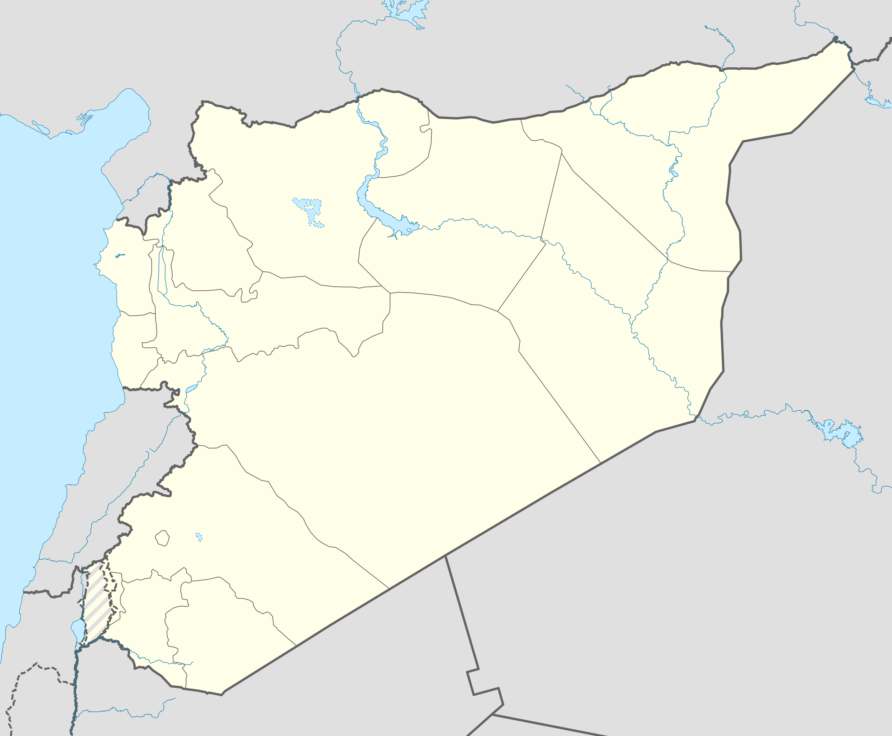
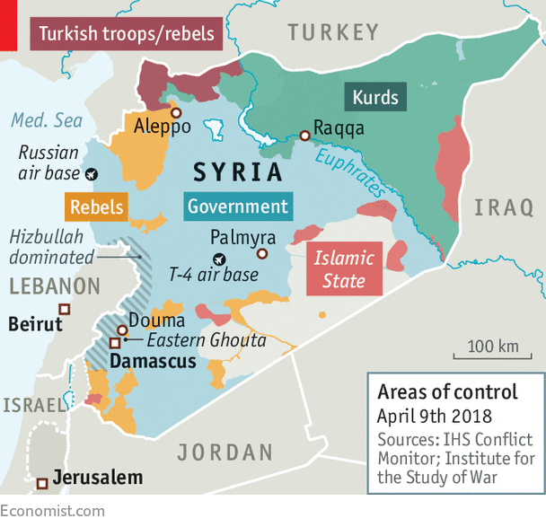
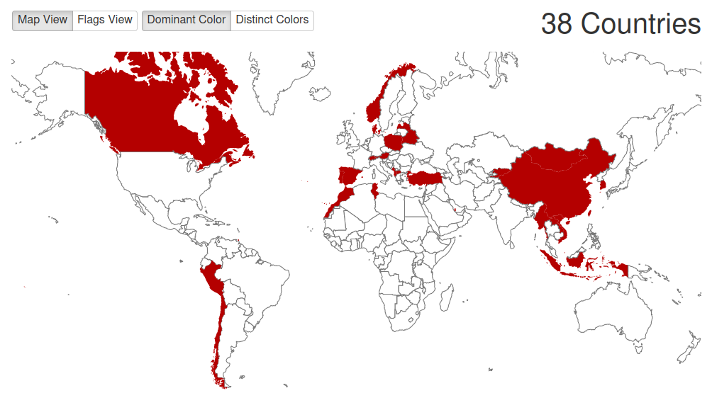

```{r setup, include=FALSE}
knitr::opts_chunk$set(echo = FALSE)
```

# Evaluating Descriptive Claims

## Return to in-person

1. Lecture

  - in person, in Buchanan A101. Recordings, but no live streaming.
  - recordings to capture mic, slides (maybe more??)

2. Tutorials

  - each tutorial will decide: in person, on Zoom, or hybrid 
  - if choice is not unanimous: hybrid. In person but Zoom on.

3. Exams

  - Only fair option is to make Midterm on Canvas at the same time.
  - Can take it at home or in lecture hall. Everyone can use open notes.
  - Final also online, but likely asynchronous on Canvas.


## Assignments:

- Homework 1: 

    - Recognize/come up with different types of claims; be able to explain how they are related to each other
    - Don't quote a claim directly; paraphrase it to make the claim more clear.
    
- Survey Activity:

    - What is this project?
    - Should not take more than 30 minutes to 1 hour in total
    - Groups assigned

## Objectives

### (1) Review **types** of descriptive claims

### (2) How to judge: is descriptive claims correct or not?

### (3) What are concepts? How do we make them?


# Descriptive Claims


## Descriptive claims:

### **descriptive claims:**

claims about what exists (or has existed/will exist) in the world: 

- **what phenomena exist** (what kinds of things exist?)
- **what is the type of a specific phenomenon** (what is this thing?)
- **amount/frequency of phenomena** (how much of something is there?)
- **relative amount/frequency of phenomena across different places/times** (how much of something is there here vs. there/now vs. then?)
- **what patterns are there in the shared appearance/non-appearance of different phenomena** (does this thing usually appear together with that other thing?)

## Descriptive Claims: Varieties

(1) **"Democracy is a type of political regime."**

(2) **"Russia is a democracy."**

(3) **"58% of countries worldwide are democracies."**

(4) **"Countries in Western Europe are more democratic than those in Eastern Europe."**

(5) **"Democracies have been backsliding (becoming less democratic) since 2016."**


## Descriptive Claims: Evaluation

What would you want to know before you could judge whether this claim was correct or incorrect?

> **"Democracies have been backsliding (becoming less democratic) since 2016"**

#


## Descriptive Claims: Evaluation

### **Concepts**: 

define our terms in a way that is **transparent** and can be used **systematically**. If concepts are opaque or idiosyncratic $\to$ STOP! 

### **Variables**:

translate concepts into something that we can (in principle) **observe**. If variables do not correspond to the concept or correspond to *other* concepts $\to$ STOP!

### **Measurement**:

devise **transparent** and **systematic** procedures with known **uncertainty** to observe those attributes of specific cases. If measurement procedure is opaque, likely to suffer from bias, or has high degree of uncertainty $\to$ STOP!  

## Evaluating Descriptive Claims: 

A useful definition:

In social science we discuss "cases", not in the legal sense, but in this sense: 

#### **case**: 

> a specific individual, organization, entity, event, or action, existing in a specific time and place.

We are often interested in identifying what general categories this specific **case** belongs to, what is its "type". Or measuring **attributes** of that case. (How much of something it has, e.g.)

## Cases

(1) **"Democracy is a type of political regime."**

(2) **"Russia is a democracy."**

(3) **"58% of countries worldwide are democracies."**

(4) **"Countries in Western Europe are more democratic than those in Eastern Europe."**

(5) **"Democracies have been backsliding (becoming less democratic) since 2016."**


# Concepts

## Concepts

At a general level:

**concepts**: abstract or general categories that we (humans) apply to particular cases/instances. They **abstract** away from the highly **particular**, complex, and often **unique** features of reality.

Our thought and our language is rooted in concepts!

---

### *On Exactitude in Science*

>  "... In that Empire, the Art of Cartography attained such Perfection that the map of a single Province occupied the entirety of a City, and the map of the Empire, the entirety of a Province. In time, those Unconscionable Maps no longer satisfied, and the Cartographers Guilds struck a Map of the Empire whose size was that of the Empire, and which coincided point for point with it. The following Generations, who were not so fond of the Study of Cartography as their Forebears had been, **saw that that vast Map was Useless**, and not without some Pitilessness was it, that they delivered it up to the Inclemencies of Sun and Winters. In the Deserts of the West, still today, there are Tattered Ruins of that Map, inhabited by Animals and Beggars; in all the Land there is no other Relic of the Disciplines of Geography." 

- Jorge Luis Borges

## Concepts

### Why do we need them?

Without concepts/abstraction:

- all experiences we have are totally **unique**
- we cannot anticipate **regularities**/**similarities** in the world
- we cannot **predict** what will happen next
- we cannot function/act
- communication is difficult (this, that)

## Concepts

### But... abstraction comes at a price

For example:

- What is a "chair"?
- Forests
- Proper names of countries: e.g. "Syria"

## {.centering}


## Conceptual Limits {.centered}



## Conceptual Limits {.centered}




## Concepts

... **are imperfect abstractions from reality**, but we need them.

<br>

**How do we develop scientific concepts?**

## Concepts and Science:

Building on our insights about/criteria for science:

#### (1) Concepts need to be **transparent**: 

clear and accessible definition. Even if we disagree over the label, we can all assess whether a case meets the definition.

#### (2) Concepts must be formulated to be used **systematically**

Science is about systematic evidence. Cannot define concepts that include loopholes for one case. Definitions must be tied to attributes that are observable

#### (3) Concepts must be tied to prediction (note)

science is fundamentally about prediction, finding regularities. Concepts that do not bring together cases that have some shared behavior/action do not help us understand. 

---

#### **concepts**:

are **abstract** or **general** categories that we apply to **particular** cases using  a set of rules/criteria that determine membership in the category.

For concepts to be useful in testing claims scientifically... 

- defining traits **must be something we can all observe** (empirical). (e.g., democracy cannot be defined by an ethereal 'Democratic Spirit')
- the traits are **about what it means to be** in this category. "To be a democracy is to have $x,y,z$ traits."

For concepts to be useful in building theories (not our focus):

- traits are **relevant to predicting** how cases described by the concept affect other things or are affected by other things. **Relevant** to ordinary use of the word

## An example:

**erythrocracy**: 

>- definition: a state in which the flag for the ruling government is red
>- defining trait is **observable**
>- traits tell us what it **"means to be"** erythrocracy
>- but, fairly useless concept when it comes to **prediction**...

>- Nevertheless, could test claims about whether erythrocracies are different in some way

---

Countries with flags that are $50\%$ red:



## An example: Democracy?

**How many democratic states are there in the world today?**

>- Of 193 UN member states, **9 are democratic**

## An example: Democracy? {.build}

**How many democratic states are there in the world today?**

- **state**: a sovereign state that is recognized by the United Nations
- **democracy**: a state that has "democracy" or "democratic" in its chosen, formal name.

## An example: Democracy?

- *People's Democratic Republic of Algeria*
- *Democratic Republic of the Congo*
- **Democratic Republic of Timor-Leste**
- *Federal Democratic Republic of Ethiopia*
- Democratic People's Republic of Korea
- Lao People's Democratic Republic
- **Federal Democratic Republic of Nepal**
- **Democratic Republic of São Tomé and Príncipe**
- **Democratic Socialist Republic of Sri Lanka**

## An Example: Democracy?

### a (minimalist) definition of **democracy**:

#### A democracy is a government in which political decisions are made by people who acquire power through  competitive elections, the results of which are respected (losers leave office).

## You decide...

What are key traits capture **what it means** to be a **democracy**

https://www.menti.com/4za6mdj52c

## 

<div style='position: relative; padding-bottom: 56.25%; padding-top: 35px; height: 0; overflow: hidden;'><iframe sandbox='allow-scripts allow-same-origin' allowfullscreen='true' allowtransparency='true' frameborder='0' height='315' src='https://www.mentimeter.com/embed/78807a14e09486e6c1c5cd89d1deeef9/c3dd405145eb' style='position: absolute; top: 0; left: 0; width: 100%; height: 100%;' width='420'></iframe></div>

#

## Scientific Concepts: An Example

Which definition of "democracy" is the right concept?

1. **Kim Jong Un's: "a state with 'democratic' in its name."**

2. **Minimal: "government in which political decisions are made by people who acquire power through competitive elections, the results of which are respected."**

3. **Our class definition**

poll

## Scientific Concepts: An Example {.centered}

In two senses:


## Scientific Concepts: An Example

Which definition of "democracy" is the right concept?

Each definition could be used in scientific evidence

- defining traits are about "what it is to be a democracy"
- traits are observable
- though, not all definitions relevant to prediction (elaborate)

Choice of which definition ought to be labeled "democracy" reflects value judgment and common usage

## Concepts and Science:

### Insight:

Depending on the questions we ask, values we espouse, etc., there are many **different definitions** for the same words. 

**Even if we disagree with <u>definition</u> for a specific word**, good scientific concepts can be understood and used by others regardless of whether they agree with our definitions.

## Concepts and Science:

Kim Jong Un may insist that "a state with 'democratic' in its name" is a "democracy".

But the point of contention is the term "democracy"

### a definition of **regime type 1.a**:

#### **regime type 1.a** is a government in which political decisions are made by people who acquire power through  competitive elections, the results of which are respected (losers leave office).

## Concepts and Science:

Kim Jong-un would have to **accept** that the **Democratic People's Republic of Korea** does not meet this definition empirically:

<br>

> "a government in which political decisions are made by people who acquire power through competitive elections, the results of which are respected (losers leave office)."

<br>

**even if he rejected that this is the definition of "democracy"**

## Concepts:


1. **Concepts are *abstractions* from reality**
2. **To answer descriptive claims, we need to define concepts**
3. **Scientific concepts are about what relevant and observable traits makes something an "X".**
4. **Scientific concepts are "objective" in the sense they can be used even if we disagree with them**

    - "subjective" in that value judgements may make us prefer one definition of a word over another.
