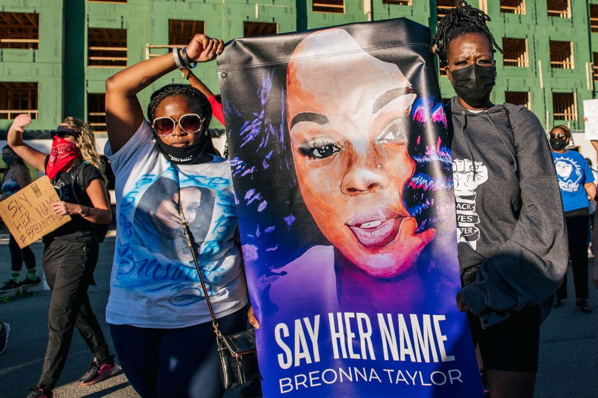
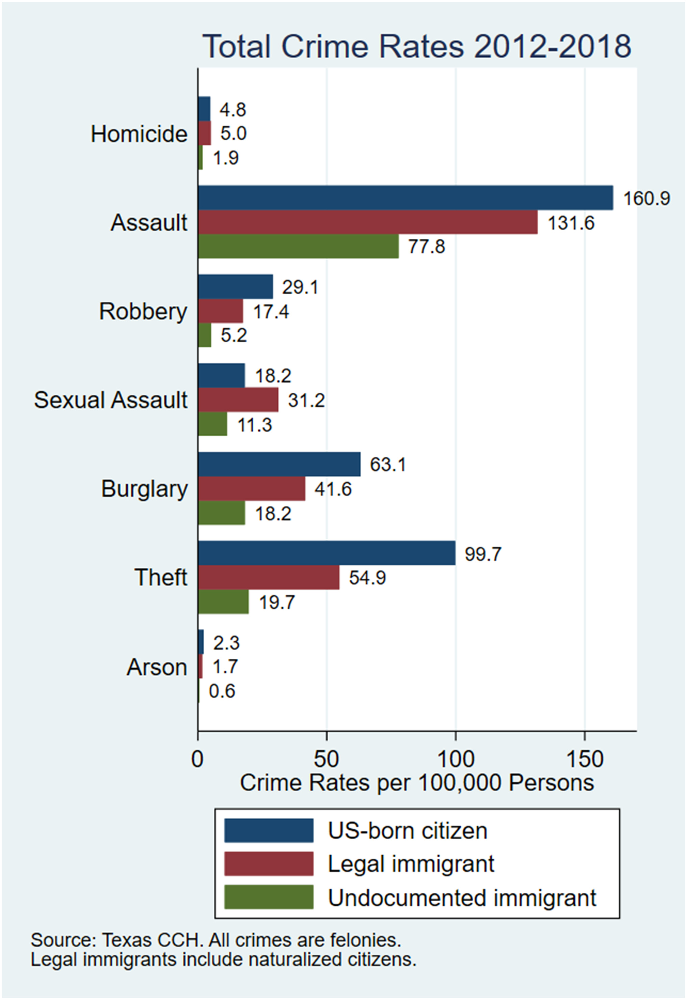
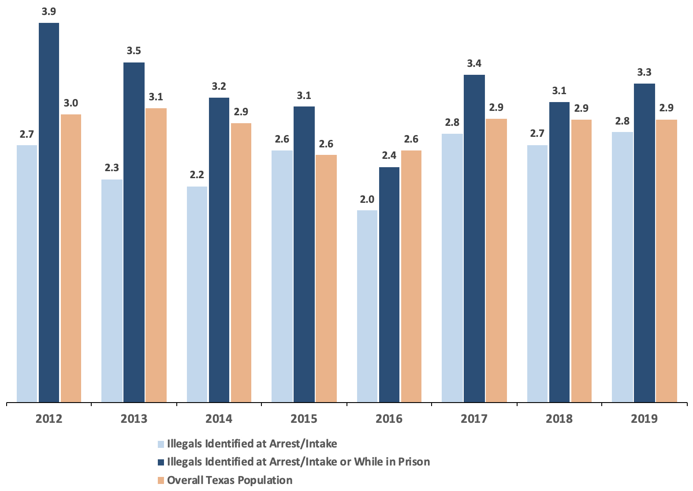
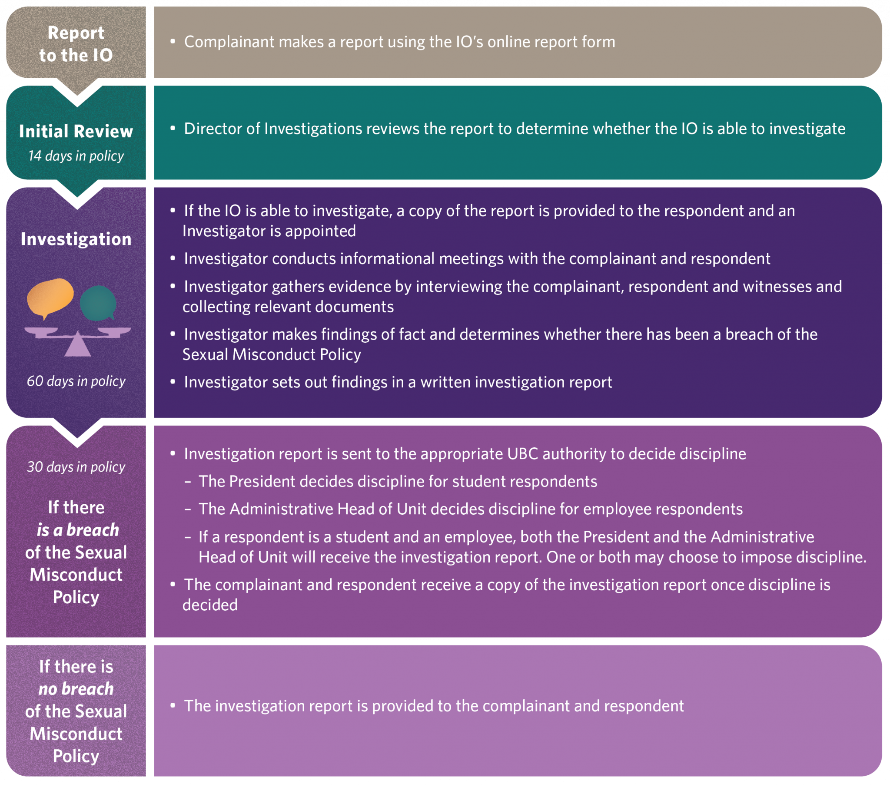
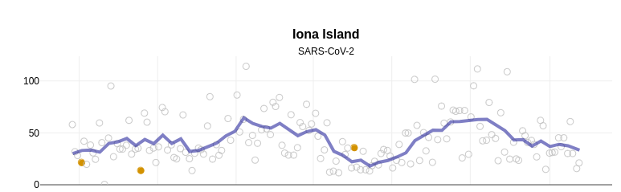
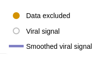

```{r setup, include=FALSE}
knitr::opts_chunk$set(echo = FALSE)
require(stringr)
require(data.table)
require(ggplot2)
require(magrittr)
```


<script type="text/x-mathjax-config">
MathJax.Hub.Config({
TeX: {extensions: ["cancel.js"]}
});
</script> 

## Objectives

### (1) **Recap**

- Evaluating Descriptive Claims
- Variables vs. Measures
- Validity


### (2) **Validity**

- recognizing it
- examples

### (3) **Measurement Error**

- **Bias**
- **Random**


# Examples


---

### In 2020



---

### In 2024


---

### Two "diagnostic claims"

1. "There is racial bias in the use of police violence against Black Americans."
2. "There is widespread violence perpetrated by illegal immigrants."


- Activists point to **highly publicized events** as **evidence** for their claims.

>- Are these individual deaths compelling evidence for the descriptive claims? Why/Why not?

---

### Severity and Evidence for Descriptive Claims

We want our evidence to:

- be *capable* of showing claim to be wrong (*weak* severity)
- stand up to multiple checks on where it could be wrong (*strong* severity): 
- pass "severe" tests that can EASILY find claim to be wrong.


We want to be sensitive to:

- what properties of evidence $\to$ absence of *weak* severity
- what are the multiple failure points that we can check $\to$ *strong* severity

---

### Descriptive Claim 

**Concepts not transparent/systematic** $\xrightarrow{\xcancel{weak \ severity}}$

Variable does not map onto concept **(lack of validity)** $\xrightarrow{\xcancel{weak \ severity}}$

Procedure does not return the true values **(measurement error)** $\xrightarrow{\xcancel{weak \ severity}}$ 

## Variables and Measures:

### **variable**(s):

A **measurable property** of cases that corresponds to a **concept** or part of a concept and can *potentially* take on different **values** across cases and time (it *vari*es across cases).

- something we could observe **in principle**
- Chosen to indicate membership in category/presence of attribute (concepts)
- Variables take on values for cases at a specific point in time
- *Vari*ation across **cases** and/or over **time**.
- General (e.g., "fraction of shared news that is false", not "fraction of shared news on Facebook in Canada in 2024 that was false.")

## Variables and Measures:

### **measure**(s)

A **procedure** for determining the *value* a variable takes for **specific cases** based on **observation**.

- Measures are proposed to determine the **value** a variable takes for some cases
- They are always for some specific cases we want to know about (e.g., a procedure for estimating the fraction of shared news on Facebook in Canada in 2024 that was false.)


## Validity

**validity** is the extent to which variable (what we hope to **observe**) matches the concept:

**lack of validity**  arises when:

- what we **observe** in the variable is partly or wholly due to a **different** concept than intended
  
    - lack of validity involves an explanation for **why** cases would take values on a variable that is due to something other than the concept.

- what we **observe** in the variable is only **partially** captures the concept 

    - lack of validity involves an explanation for **why** important part of concept does not influence the values we would observe 


## Variable Trouble: Validity


"Country X isn't the most politically corrupt"

**Concept**: <u>Political Corruption</u> or "the use of power by government officials for illegitimate private gain"

**Variable**: Fraction of political officeholders in a place prosecuted for corruption

**Measure**: Match criminal court defendants in corruption prosecutions to list of politicians.


## Variable Trouble: Weak Severity

"The risk of being a victim of a violent crime is less in Canada than the United States"

**Concept**: <u>risk of violent crime</u> "likelihood of experiencing a crime that involves a threat or damage to one's body"

**Variable**: Number of violent crimes

**Measure**: Tabulations of violent crimes created by police agencies


---

<blockquote class="twitter-tweet"><p lang="en" dir="ltr">For every 10,000 black people arrested for violent crime, 3 are killed<br><br>For every 10,000 white people arrested for violent crime, 4 are killed<br><br>I&#39;m going to keep tweeting this until someone can explain to me how this is possible if there is truly pervasive racial bias in policing</p>&mdash; Leonydus Johnson (leave/me/alone) (@LeonydusJohnson) <a href="https://twitter.com/LeonydusJohnson/status/1267466345844740098?ref_src=twsrc%5Etfw">June 1, 2020</a></blockquote> <script async src="https://platform.twitter.com/widgets.js" charset="utf-8"></script> 

## Validity

**Claim**: "Racial bias in policing is not pervasive" 

**Concept**: racial bias in policing defined as racial disparity in police use of force *in excess* of "reasonable" considerations such as "objective threat" posed by suspect

**Variable**: difference by race in number of people killed by police per persons arrested for violent crimes

**Measure**: count press-reported police-shootings by race, FBI data on arrests by crime-type and race

### Discuss: Does this variable have **validity**?


# Board

## Validity

**Claim**: "Racial bias in policing is not pervasive" 

**Concept**: racial bias in policing defined as racial disparity in police use of force *in excess* of "reasonable" considerations such as "objective threat" posed by suspect

**Variable**: difference by race in number of people killed by police per persons arrested for violent crimes

**Measure**: count press-reported police-shootings by race, FBI data on arrests by crime-type and race


Even if we perfectly measure violent crime arrests by race, does variable match concept?

## Validity

**Claim**: "Racial bias in policing against Black Americans is not pervasive." 

**Concept**: racial bias in policing defined as racial disparity in police use of force *in excess* of "reasonable" considerations such as "objective threat" posed by suspect

**Variable**: difference by race in number of people killed by police per persons arrested for violent crimes


If our **alternative story** of **how this variable is generated** (how are values produced) is correct, then fail weak severity: variable cannot show claim to be wrong


---

### Board

Variable "overlaps" multiple concepts.

1) Average propensity for violent crime

2) Racial bias in arrests/charges 


## Validity

**Claim**: "Illegal immigrants commit murder at higher rates" 

**Concept**: "illegal immigrant", "murder"

**Variable**: correlation between fraction of people in a city who are undocumented immigrants, fraction of people in a city who are murderers

**Measure**: Pew Research [estimate of undocumented migrants](http://www.pewhispanic.org/2016/09/20/methodology-10/), FBI data on murders per capita


---

undocumented and murderers in US cities (each dot is a city)

```{r include = T, echo = F, message=F, warning=F}

require(data.table)
require(ggplot2)
d = fread("./migrant_crime.csv")
d[, murder_pct := murder_rate/100000*100]
d[, undocumented_pct := undocumented_pct*100]
ggplot(d, aes(x = undocumented_pct, y = murder_pct)) +
  geom_point() + 
  geom_smooth(method = 'lm', se = F) +
  xlab("Undocumented Percent") +
  ylab("Murderer Percent") +
  theme_bw() +
  ggtitle("Evidence against Undocumented Migrants as Murderers?")
```

>- Assume we correctly count undocumented migrants and murders: Does this have validity?

---

One common **type** of validity problem:

### Ecological Inference and [Ecological Fallacy](https://www.youtube.com/watch?v=yavcwYS9qc0)

**ecological inference**: using correlations of attributes at **aggregate** levels (e.g. country, province, city) to making inferences about **individual** behaviors. (undocumented migrants in a city, murderers in a city)

- If **assumptions correct**, this *can* work: if behaviors (murder) of individuals of different "types" (undocumented migrants, everyone else) are the same across contexts (proportion of people that are undocumented migrants)


---

One common **type** of validity problem:

### Ecological Inference and [Ecological Fallacy](https://www.youtube.com/watch?v=yavcwYS9qc0)


**ecological fallacy**

- even if we have **perfect data** on aggregate variables (e.g. undocumented migrants, murders), aggregate patterns $\to$ incorrect conclusions about individual patterns
- relationship between these attributes look different at **individual** vs **aggregate** level, because individual behaviors differ across and within cities/provinces/countries 

---


```{r include = T, echo = F, message=F, warning=F}

require(data.table)
require(ggplot2)
d = fread("./migrant_crime.csv")
d[, murder_pct := murder_rate/100000*100]
d[, undocumented_pct := undocumented_pct*100]
ggplot(d, aes(x = undocumented_pct, y = murder_pct)) +
  geom_point() + 
  geom_smooth(method = 'lm', se = F) +
  xlab("Undocumented Percent") +
  ylab("Murderer Percent") +
  theme_bw() +
  ggtitle("Evidence against Undocumented Migrants as Murderers?")
```

>- What are some possible stories for "what could go wrong" with this variable?

## Validity

**lack of validity**:

- requires a **story** about why what we would see as values of the **variable** are the result of something **other** than the concept we are interested in.
- just because we have a story about why variable lacks validity does not mean we are right: $\to$ must collect new evidence capable of seeing if this story is false.
- just because variable lacks validity does not **necessarily** mean absence of **weak severity**


# Example

---

### Undocumented Migrants and Murder

[Light et al 2020](https://doi.org/10.1073/pnas.2014704117)  investigate claim: "undocumented migrants are prone to violent crime"

**concepts**: undocumented, violent criminals

**variable**: conviction rates for violent crime (homicide, assault, robbery, sexual assault) for US-born citizens, legal immigrants, undocumented immigrants

**measure**: individual crimes listed in arrests in the Texas Computerized Criminal History database, individual immigration status as determined by DHS and ICE using biometrics database, numbers of undocumented migrants using Census data

---



---

Not the end of the story: [Kennedy et al](https://cis.org/Report/Misuse-Texas-Data-Understates-Illegal-Immigrant-Criminality) at Center for Immigration Studies dispute these findings:


Complaints focus on:

- how does Texas identify undocumented migrants in arrest and prison records?
- how do DHS/ICE identify undocumented migrants?

---

[Kennedy et al](https://cis.org/Report/Misuse-Texas-Data-Understates-Illegal-Immigrant-Criminality), argue:

- It takes time for undocumented immigrants in custody to be identified. 

    - $\to$ **undercounting** of arrested undocumented
    - $\to$ more **undercounting** in recently arrested

- Only people in custody for longer periods of time for serious crimes likely to be thoroughly checked:

    - $\to$ undercounting is lower/minimal for **homicide convictions**
    - $\to$ need to use DHS **and** Texas prison (TDCJ) checks on migration status


>- Are Kennedy et al pointing to a **lack of validity** in the "undocumented" variable?

---




>- Argue that by "fixing" measurement procedures, conclusions reversed.
>- This is a claim about **measurement error**

## Measurement Error

#### **Validity** is about link between **variable** and **concept**

<hr style="height:8px; visibility:hidden;" />

#### **Measurement Error** is about link between **measure** and **variable**.

<hr style="height:8px; visibility:hidden;" />


# Measurement Error

## Measurement Error

### **measurement error**

is a **difference** between the **observed** value of a variable for a case (produced by the **measure**ment procedure) and the **true** value of the variable for that case.

$$\mathrm{Value}_{observed} - \mathrm{Value}_{true} \neq 0 \xrightarrow{then} \mathrm{measurement \ error}$$

If what we observe is **different** from the true value for a case (difference is not 0), then there is measurement **ERROR**


## Measurement Error

What is the incidence of sexual misconduct [defined here](https://universitycounsel.ubc.ca/files/2024/10/Sexual-Misconduct-Policy_SC17.pdf) at UBC?

Let's say a **variable** is the number of breaches of Sexual Misconduct Policy in a given year.

**Measure**: Reporting from the UBC Investigations Office.

---



## Measurement Error

What is the incidence of sexual misconduct [defined here](https://universitycounsel.ubc.ca/files/2024/10/Sexual-Misconduct-Policy_SC17.pdf) at UBC?

Let's say a **variable** is the number of breaches of Sexual Misconduct Policy in a given year.

**Measure**: Reporting from the [UBC Investigations Office](https://io.ubc.ca/).

That implies $13$ incidents in 2024-2025 Academic Year (last available data). 

39 reports $\to$ 21 investigations $\to$ 19 completed investigations $\to$ 13 breaches found

>- Is this observed value **too high**? **too low**? **correct**? Why?


## Measurement Error

$$\mathrm{Sexual \ Misconduct }_{observed} - \mathrm{Sexual \ Misconduct}_{true} \neq 0$$

$$\xrightarrow{then} \mathrm{measurement \ error}$$

>- Most likely $\mathrm{Sexual \ Misconduct }_{observed} - \mathrm{Sexual \ Misconduct}_{true} < 0$

---

### Two varieties of **measurement error**

- **bias**/**systematic measurement error**
- **random measurement error**

Differ in the patterns of $\mathrm{Value}_{observed} - \mathrm{Value}_{true}$ that we see.

Measures may suffer from **both**.

## Measurement Error: Bias

**bias** or **systematic measurement error**: error produced when our measurement procedure obtains values that are, **on average**, too high or too low (or incorrectly labelled) compared to the truth. 

- Key phrase is **"on average"**: error is not a one-off fluke, will happen **systematically** even if you repeat the measurement procedure.
- can have an *upward* (observed value too high) or *downward* (observed value too low) bias
- can occur for nominal/categorical values: e.g., systematically misclassifying undocumented migrants as legal
- **not** "politically" biased
- bias might not be the same for all cases or different across subgroups
    - example: economic evaluations and partisanship in surveys


## Measurement Error

[Kennedy et al](https://cis.org/Report/Misuse-Texas-Data-Understates-Illegal-Immigrant-Criminality) argue that [Light et al](https://doi.org/10.1073/pnas.2014704117)'s measurement procedures lead to, on average:

$$\mathrm{Migrant \ Homicide \ Rate }_{observed} - \mathrm{Migrant \ Homicide \ Rate}_{true} < 0$$

$$\xrightarrow{then} \mathrm{measurement \ bias}$$

Though, this debate over measurement isn't over.


---


bias different in different subgroups


## Measurement Error: Random

**random measurement error**: errors that occur due to *random* features of measurement process or phenomenon. So even if observed values are sometimes wrong, they are, **on average**, correct

- Due to chance, we get values that are too high or too low
- There is no tilt one way or another (no bias): "noise"
- **random** here means: errors **unrelated** to true value; errors **equally likely** to be over- or under- estimate.
- In aggregate, values that are "too high" are balanced out by values that are "too low" compared to the truth

## Measurement Error: Random

**Variable**: relative change in COVID-19 infections

**Measure**: "Composite wastewater influent is collected over a 24-hour period from wastewater treatment plants (WWTPs). Samples are collected 2-3x per week at each WWTP and are transported by the BCCDC PHL for analysis. Wastewater samples are concentrated by ultracentrifugal filtration, nucleic acids extracted and SARS-CoV-2 envelope gene (E gene) is detected by real-time quantitative polymerase chain reaction (RT-qPCR)."

## Measurement Error: Random





## Measurement Error: Random

Day-to-day variation in:

- wastewater volume (e.g. rain, snowmelt, showering, dishwashing)
- fecal matter (e.g. diet, exercise, other diseases)

can lead to errors in measurement, but these errors...

- *probably* unrelated to amount of true rate of COVID infections
- *probably* equally likely to lead to over and under count
- likely cancel out in the long run.

## Conclusion:

### **Lack of Validity**:

- story for why what we would observe does not match concept (unrelated to data-collection procedures)
- may or may not lead to failing weak severity
- ecological inference/fallacy is a common problem

### **Measurement Error**

- **observed** values differ from **true** values of the variable
- **Bias**/systematic measurement error
- **Random** measurement error


