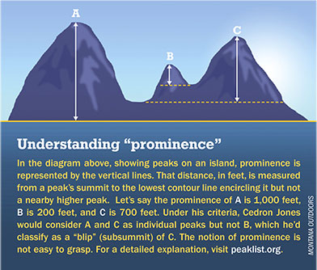
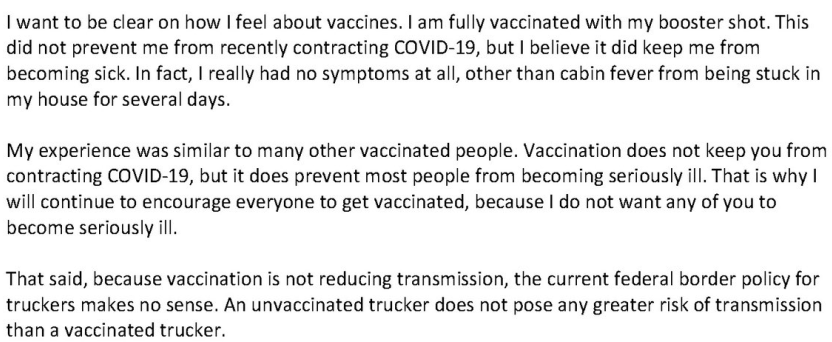
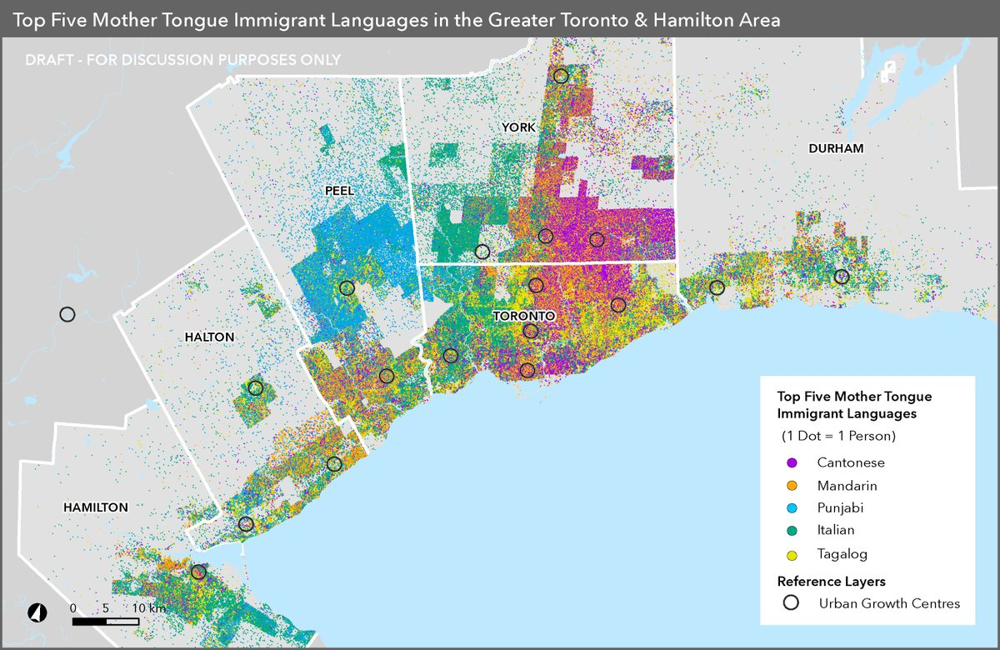

```{r setup, include=FALSE}
knitr::opts_chunk$set(echo = FALSE)
```


## Objectives

### (1) **Evaluating Descriptive Claims**

### (2) **Variables**

- **Levels of Measurement**
- **Validity**


# Evaluating Descriptive Claims

---

### Question/Claim $\xrightarrow{}$

### **Concept**

- transparent **definition**; which **observable** traits makes something an "X" $\xrightarrow{}$


### **Variable**(s)

- **observable** properties of cases that correspond to the concept $\xrightarrow{}$

### **Measure**(s)

- **procedure** to find the **values** variables take for *specific* cases  $\xrightarrow{}$

### "Answer"

---

### Question/Claim

**$\not\xrightarrow{}$ Concepts not transparent/not well formulated**

### **Concept** 

**$\not\xrightarrow{}$ Variable does not map onto concept**

### **Variables**

**$\not\xrightarrow{}$ Procedure does not return the true value**

### **Measure**(s)

$\not\xrightarrow{}$

### "Answer"

# Variables <br> and Measures

## Variables and Measures:

### **variable**(s):

A **measurable property** of a case that corresponds to a **concept** or part of a concept and can *potentially* take on different **values** across cases and time (it *vari*es across cases).

- something we could observe **in principle**
- Chosen to indicate membership in category/presence of attribute (concepts)
- Variables take on values for each case at a specific point in time
- *Vari*ation across **cases** or over **time**.
- General (e.g., "number of COVID-19 deaths", not "number of COVID-19 deaths in BC since March 2020")

## Variables and Measures:

### **measure**(s)

A **procedure** for determining the *value* a variable takes for **specific cases** based on **observation**.

- Measures are proposed to determine the **value** a variable takes for some cases
- They are always for some specific cases we want to know about (e.g., a procedure for estimating COVID-19 deaths in BC since March 2020)


## A Trivial Example:

### **A descriptive question:**

What is the tallest mountain on the North Shore?

### **We need to:**

- define a the concept of "tall"/"height"
- create a variable that matches that definition and is observable
- develop a procedure to obtain values of that variable for mountains on the North Shore

---


## Concept to Measurement: 

### Concept: Height (of a mountain)

Elevation of peak above sea level


### $\xrightarrow{}$ Variable: 

Vertical distance in meters from sea level to the top of the peak

 
### $\xrightarrow{}$  Measure:

Use difference in barometric pressure at Burrard Inlet and peak to calculate difference in elevation

##  Concept to Measurement:



Are you going to climb the mountain? Prominence might be a better concept of height.


## Concept to Measurement:

### Concept: Height (of a mountain)

Prominence of peak compared to nearby mountains

### $\xrightarrow{}$  Variable: 

Vertical distance in meters from top of the peak to lowest contour line surrounding it and no other higher peaks.

  
### $\xrightarrow{}$ Measure:

Satellites using radar interferometry create topographical maps; computer algorithm to find lowest contour

## Concept to Measurement:

Different concepts $\to$ different variables

<br>

Different variables $\to$ different measures

<br>

Different Answer:

- Using elevation from sea level, West Lion is taller
- Using prominence, Seymour is taller.


[Plug for North Shore Mountains]

# Variables

## Variables

**variables**:

- take on **values** for each specific case at a specific point in time.
    - values vary between cases at the same point in time
    - values vary within cases at different points in time
- take different **kinds of values**


## Variables: Example:



## Variables: Example

**A question:** Is transmission of Omicron lower among vaccinated people than unvaccinated? (Setting aside whether vaccination **causes** a change in transmission)

**Concept:** Transmissibility of Omicron

**Variable**: Number of new COVID infections


---

If we were to go look at the vaccinated and unvaccinated in Saskatchewan and count the "Number of new COVID-19 infections" since the start of the Omicron wave in each group...

What kind of **values** could this variable take?


## Variables: Example

**Number of new COVID-19 infections per week:**

- integer
- must be greater or equal to $0$


**Can you think of different variables?**

- what values could they take?

## Variables: Example



## Variables: Example

"The first language learned by a person." (mother tongue)

This is a variable: what values does it take?

>- Categories
>- No numeric range
>- One language is not "higher"/"lower" than another.

## Variables

The kinds of **values** taken by a **variable** is called its **level of measurement**

#### Four **levels of measurement**

<br>

- **Nominal**
- **Ordinal**
- **Interval**
- **Ratio**

#### Not to be confused with **measures**

## Levels of measurement: <u>nominal</u>

**nominal** levels of measurement: 

- place cases into **unranked** categories
- discrete groups based on presence/absence of attribute(s)
- no category is "more" or "less" than another
- categories are exhaustive (every case can fit in a category)
    - sometimes we just have "other"

### Examples:

- Religion
- Pastisan affiliation
- Regime type (e.g. minimalist democracy vs non-democracy)
- Type of crime (e.g.  hate vs. economic vs. personal etc.)

## Levels of measurement: <u>ordinal</u>

**ordinal** levels of measurement 

- place cases into categories that are ranked
- may have a number attached (or not)
- Cases can be said to have **more** or **less** of something
- Intervals between categories **not meaningful**
- **relative** levels, **not absolute** levels

### Examples:

- University rankings
- Test score percentiles
- Ideology (very liberal, somewhat liberal, neither, somewhat conservative, very conservative)

## Levels of measurement: <u>interval</u>

**interval** levels of measurement 

- assign cases **numbers** that **rank** the cases 
- have intervals between values are meaningful and consistent (1 unit change is the same size each time)
- difference in values indicates **how much** more or less of something case has from another
- no meaningful zero point, so ratios not meaningful

### Examples

- Years (but not years since some event)
- Temperature (in Celsius, but not Kelvin)
- Date of first COVID-19 vaccination

## Levels of measurement: <u>ratio</u>

**ratio** levels of measurement 

- assign cases **numbers** that **rank** the cases
- have **intervals** that are **meaningful** and consistent
- difference in values indicates **how much** more or less
- **zero indicates absence**
- ratios meaningful (something can be twice as much as something else)

### Examples

- Years since some event
- Counts of events
- Rates (unemployment, language spoken, political party preference)


## Example: Gun Violence

What is the level of measurement?

1. Cause of death
1. Number of gun deaths
3. Change over time in number of gun deaths
5. Proportion of all murders that involve guns
6. Strictness of gun ownership regulations
7. Year in which a country bans assault weapons

POLL

## Example: Gun Violence

What is the level of measurement?

1. Cause of death? (**nominal**)
1. Number of gun deaths? (**ratio**)
3. Change over time in number of gun deaths (**ratio**)
5. Proportion of all murders that involve guns (**ratio**)
6. Strictness of gun ownership regulations (**ordinal**)
7. Year in which a country bans assault weapons (**interval**)


## Types of Variables

Variables also give values in **absolute** and **relative** units.

#### **absolute** values are counts given in raw **units**

Examples: dollar amounts, Number of events, Number of deaths

#### **relative** values are given in fractions or rates or ranks 

Examples:

- Units are fractional (GDP per capita, deaths/population, events/time)
- No units (ordinal rankings)

---

### **descriptive claims:**

claims about what exists (or has existed/will exist) in the world: 

- what kinds of things exist? (**nominal**)
- what is the **type** of this case? (**nominal**)
- how much of something is there? (**ordinal**, **interval**, absolute **ratio**)
- how much of something is there here vs. there/now vs. then? (ordinal, interval , relative **ratio**)
- what patterns are there in the shared appearance/non-appearance of different phenomena (depends)

## Types of Variables

Let's return to Premier Moe:
 
**Suppose we want to know whether Omicron transmission is lower among vaccinated than unvaccinated**

<br>

### **Which variable would be best?**

1. Number of COVID cases
2. Hospitalizations per 100,000
3. COVID cases per 100,000

POLL

## Variables: Example

**A question:** Is transmission of Omicron lower among vaccinated people than unvaccinated? (Setting aside whether vaccination **causes** a change in transmission)

**Concept:** Transmissibility of Omicron

**Variable**: Number of new COVID infections

**Measure**: Number of positive tests reported to Saskatchewan Health Authority among those (not) registered as vaccinated

>- "The new cases that we have in this province are roughly about the same in vaccinated and unvaccinated people here in Saskatchewan," Moe said earlier this week.

>- What could go wrong here?

# Validity

## Variables can fail:

Even if we develop a useful concept...

### **variables may not correspond to the concept**

## Variable Trouble: Validity

#### **validity**: 

- Degree of fit between a variables the concept the variable is intended to capture.
- When a variable  "captures" or "maps onto" the concept we are interested in, then we say they have "validity"
- When a variable "captures" or "maps onto" other concepts we are not interested in, then we say they lack "validity"
- If variable lacks validity, even if **measured perfectly**, we may not be able to evaluate the claim

## Variable Trouble: Validity

"Which country/province is most politically corrupt?"

**Concept**: <u>Political Corruption</u> or "the use of power by government officials for illegitimate private gain"

**Variable**: Fraction of politicians in a place prosecuted for corruption

**Measure**: Match criminal court defendants in corruption prosecutions to list of politicians.

### Does this variable have **validity**?

---

"Which country/province is most politically corrupt?"

**Concept**: <u>Political Corruption</u> or "the use of power by government officials for illegitimate private gain"

**Variable**: Fraction of politicians in a place prosecuted for corruption

**Measure**: Match criminal court defendants in corruption prosecutions to list of politicians.

### Problems

- Places with lots of corruption do not prosecute corruption
- Places with low corruption successfully prosecute corruption
- Places have different corruption laws.
- But the **measure** may give correct values for the **variable**

## Variable Trouble: Validity

<blockquote class="twitter-tweet"><p lang="en" dir="ltr">For every 10,000 black people arrested for violent crime, 3 are killed<br><br>For every 10,000 white people arrested for violent crime, 4 are killed<br><br>I&#39;m going to keep tweeting this until someone can explain to me how this is possible if there is truly pervasive racial bias in policing</p>&mdash; Leonydus Johnson (leave/me/alone) (@LeonydusJohnson) <a href="https://twitter.com/LeonydusJohnson/status/1267466345844740098?ref_src=twsrc%5Etfw">June 1, 2020</a></blockquote> <script async src="https://platform.twitter.com/widgets.js" charset="utf-8"></script> 


## Variable Trouble: Validity

**Claim**: "Racial bias in policing is not pervasive" 

**Concept**: racial bias in policing: disparity in police use of force in excess of "reasonable" considerations such as objective threat

**Variable**: number of people killed by police per persons arrested for violence crimes

**Measure**: count press-reported police-shootings, FBI report on arrests by crime-type

### Does this variable have **validity**?

## Objectives

1. Distinguish between Variables and Measures
2. Variables:

    - levels of measurement 
    - absolute/relative

3. Validity
  
    - what is it? 
    - why do variables not have it?
