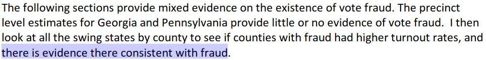
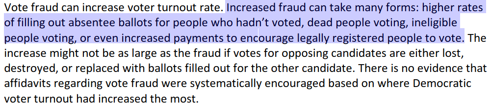
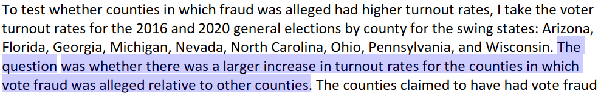
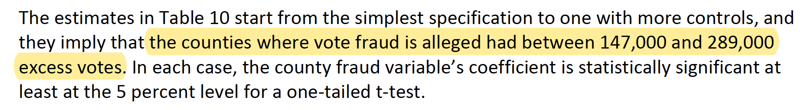
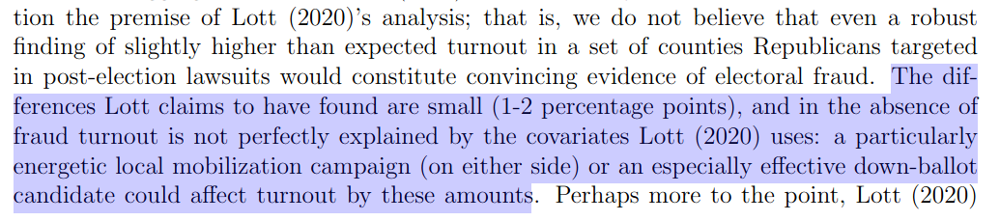
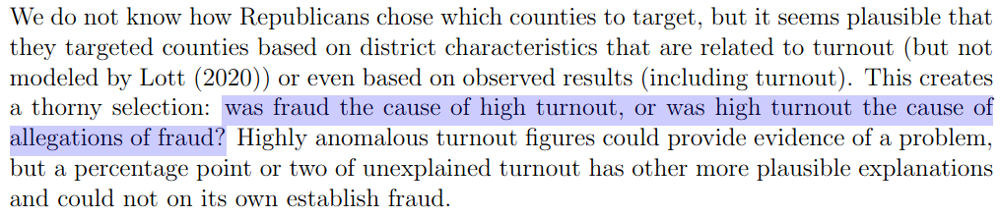
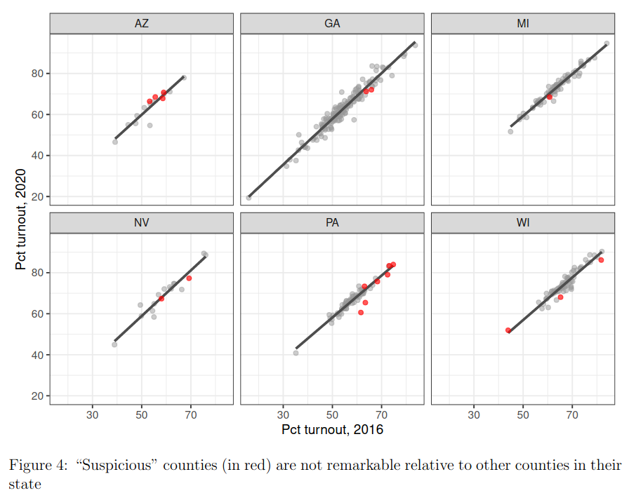
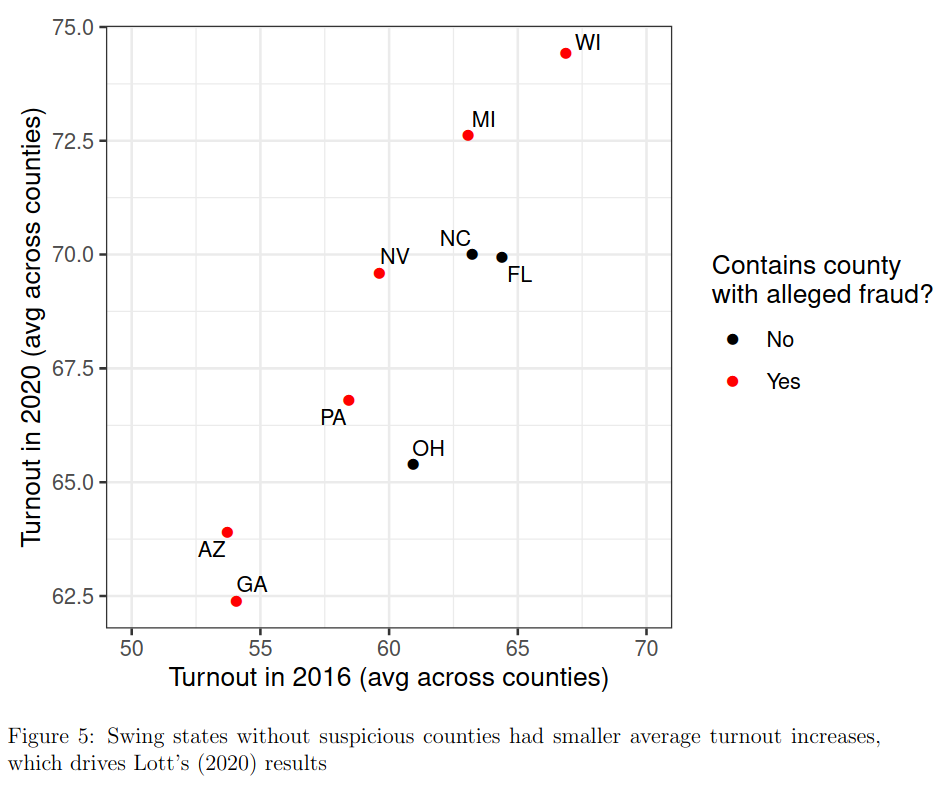

```{r setup, include=FALSE}
knitr::opts_chunk$set(echo = FALSE)
require(stringr)
require(data.table)
require(ggplot2)
require(magrittr)
```

## Objectives

### (1) **Recap**

- Evaluating Descriptive Claims
- Variables vs. Measures
- Levels of Measurement
- Validity

### (2) **Measurement Error**

- **Bias**
- **Random**

# Recap

---

### Question/Claim

**$\not\xrightarrow{}$ Concepts not scientific/irrelevant**

### **Concept** (and dimensions)

$\not\xrightarrow{}$ Variable does not map onto concept **(lack of validity)**

### **Variables**

$\not\xrightarrow{}$ Procedure does not return the true value **(measurement error)**

### **Measure**(s)

$\not\xrightarrow{}$

### "Answer"

---

Variables for "democracy": What are their levels of measurement?

**1**:  In each year, a country receives a "Polity Score" describing  the level of democracy ranging from -10 to +10, with -10 to -6 corresponding to autocracies, -5 to 5 corresponding to anocracies, and 6 to 10 to democracies.

 **2**. The year in which a country first became a democracy

 **3.** Fraction of adults who can are allowed to vote under suffrage rules

 **4.** 


## Levels of measurement: Practice

Variables for "democracy":

**1. Ordinal**

**2. Interval**

**3. Ratio**

**4. Nominal**


## Validity

<blockquote class="twitter-tweet"><p lang="en" dir="ltr">For every 10,000 black people arrested for violent crime, 3 are killed<br><br>For every 10,000 white people arrested for violent crime, 4 are killed<br><br>I&#39;m going to keep tweeting this until someone can explain to me how this is possible if there is truly pervasive racial bias in policing</p>&mdash; Leonydus Johnson (leave/me/alone) (@LeonydusJohnson) <a href="https://twitter.com/LeonydusJohnson/status/1267466345844740098?ref_src=twsrc%5Etfw">June 1, 2020</a></blockquote> <script async src="https://platform.twitter.com/widgets.js" charset="utf-8"></script> 

## Validity

**Claim**: "Racial bias in policing is not pervasive" 

**Concept**: racial bias in policing: disparity in police use of force in excess of "reasonable" considerations such as objective threat

**Variable**: difference by race in number of people killed by police per persons arrested for violent crimes

**Measure**: count press-reported police-shootings, FBI report on arrests by crime-type

### Does this variable have **validity**?


## Validity

**Claim**: "Racial bias in policing is not pervasive" 

**Concept**: racial bias in policing: disparity in police use of force in excess of "reasonable" considerations such as objective threat

**Variable**: difference by race in number of people killed during arrests for violent crimes

**Measure**: compile data on all (attempted and completed) arrests for violent crimes in the United States, including race of person arrested and police use of force

### Does this variable have **validity**?


## Validity

Whenever we can make the case that the variable---what we intend to observe---(before we EVER collect any data) does not match the concept, then there is a lack of validity

# Example

## Election Fraud

Question: "**Was there was extensive election fraud in the 2020 US Presidential Election?**" 

An Answer: 



[see here](https://papers.ssrn.com/sol3/papers.cfm?abstract_id=3756988)

## Election Fraud

**Concept**: election fraud: manipulations of votes or vote counting by changing the candidate or counting ineligible ballots




## Election Fraud

**Variable**: Abnormally high voter turnout in constituencies with fraud allegations (would result from higher rates of filling out absentee ballots for people who hadn't voted, dead people voting, ineligible people voting, or even payments to legally registered people for their votes)



## Election Fraud

**Measure**: Statistically significant difference in turnout (Number of votes cast divided by registered voters according to official election results in US 2020 Presidential election) between counties with fraud accusations vs. others. [see here](https://papers.ssrn.com/sol3/papers.cfm?abstract_id=3756988)



## Election Fraud:

**Discuss:**

$1$. What problems, if any, are there with the **variable**?

- Abnormally high voter turnout in constituencies with fraud allegations

$2$. What problems, if any, are there with the measure?

- statistically significant difference in turnout between counties with fraud accusations vs. others

## Variable Problems





[Eggers et al](https://www.dropbox.com/s/ps5oufevtka3nmf/Fraud.pdf?dl=0)

## Measure Problems



## Measure Problems




## Example: Problems

Problems with variables $\to$ lack of **validity**

- accusations of fraud follow turnout; other, legal reasons for higher turnout

Problems with measure $\to$ **measurement error**

- counties with alleged fraud *do not* have significantly higher turnout

## Example: Problems

Even if we found that there were actually statistically unlikely anomalies in places with fraud allegations (**no measurement error**)...

we would still fail to conclude that these observations definitively show fraud, because the variable lacks **VALIDITY** (it could correspond to something *other* than fraud)

# Measurement Error

## Digression: Histograms

[video explanation here](https://www.khanacademy.org/math/pre-algebra/pre-algebra-math-reasoning/pre-algebra-picture-bar-graphs/v/histograms)

```{r echo = F, warning=F, message=F}

bc_data = fread('./BCCDC_COVID19_Dashboard_Case_Details.csv')
bc_data[, age := str_extract(Age_Group, "\\d\\d$") %>% as.numeric %>% `-` (1)]
bc_data = bc_data[Reported_Date >= "2023-01-01"]

ggplot(bc_data, aes(x = age)) + geom_histogram(breaks = seq(0,90,10), col = "white") + theme_bw(base_size = 18) + ggtitle("Histogram of BC COVID Cases by Age\nSince Jan 1, 2023") + xlab("Age (Bins)") + ylab("Count (of COVID-19 Cases)")  +
    scale_x_continuous(breaks=seq(0,90,10)) +
    scale_y_continuous(breaks = seq(0,600,50))
```

---

About how many cases among people between 70 and 80?

About how many cases among people between 20 and 30?

```{r echo = F, warning=F, message=F}
ggplot(bc_data, aes(x = age)) + geom_histogram(breaks = seq(0,90,10), col = "white") + theme_bw(base_size = 18) + ggtitle("Histogram of BC COVID Cases by Age") + xlab("Age (Bins)") + ylab("Count (of COVID-19 Cases)")  +
    scale_x_continuous(breaks=seq(0,90,10)) +
    scale_y_continuous(breaks = seq(0,600,50))
```

## Measurement Error

#### **Validity** is about link between **variable** and **concept**

<hr style="height:8px; visibility:hidden;" />

#### **Measurement Error** is about link between **measure** and **variable**.

<hr style="height:8px; visibility:hidden;" />


## Measurement Error

What is the severity of the COVID pandemic in BC today?

Let's say a **variable** for the pandemic severity is active cases per 100k people.

**Measure**: In the week ending January 28, BC CDC reported $293$ active cases. Those are the number of people who have tested positive, excluding those who died, [recovered](http://www.bccdc.ca/resource-gallery/Documents/Guidelines%20and%20Forms/Guidelines%20and%20Manuals/Epid/CD%20Manual/Chapter%201%20-%20CDC/2019-nCoV-Interim_Guidelines.pdf), or could not be found for followup. 

That implies $5.8$ active cases per 100k.

>- Is this observed value **too high**? **too low**? **correct**? Why?

## Measurement Error

What is the severity of the COVID pandemic in BC today?

Let's say a **variable** for the pandemic severity is the hospitalization rate among those infected with COVID-19.

**Measure**: In the week ending January 28, BC CDC reported $293$ active cases and $73$ new admissions to the hospital for COVID.

That implies a hospitalization rate of ~25%.

>- Is this observed value **too high**? **too low**? **correct**? Why?

## Measurement Error

### **measurement error**

is a **difference** between the **observed** value of a variable for a case (produced by the **measure**ment procedure) and the **true** value of the variable for that case.

$$\mathrm{Value}_{observed} - \mathrm{Value}_{true} \neq 0 \xrightarrow{then} \mathrm{measurement \ error}$$

If what we observe is **different** from the true value for a case (difference is not 0), then there is measurement **ERROR**

## Measurement Error

$$\mathrm{Active \ Cases }_{observed} - \mathrm{Active \ Cases}_{true} \neq 0$$

$$\xrightarrow{then} \mathrm{measurement \ error}$$

---

### Two varieties of **measurement error**

- **bias**/**systematic measurement error**
- **random measurement error**

Differ in the patterns of $\mathrm{Value}_{observed} - \mathrm{Value}_{true}$ that we see.

Measures may suffer from **both**.

## Measurement Error: Bias

**bias** or **systematic measurement error**: error produced when our measurement procedure obtains values that are, **on average**, too high or too low (or, incorrect) compared to the truth. 

- Key phrase is "on average": error is not a one-off fluke, will happen **systematically** even if you repeat the measurement procedure.
- can have an *upward* (observed value too high) or *downward* (observed value too low) bias
- **not** "politically" biased
- bias might not be the same for all cases or different across subgroups
    - example: economic evaluations and partisanship in surveys

---


## Measurement Error: Random

**random measurement error**: errors that occur due to *random* features of measurement process or phenomenon. So even if observed values are sometimes wrong, they are, **on average**, correct

- Due to chance, we get values that are too high or too low
- May be lots of idiosyncratic errors
- There is no tilt one way or another (no bias)
- In aggregate, values that are "too high" are balanced out by values that are "too low" compared to the truth

## Measurement Error: Random

**Variable**: relative change in COVID-19 infections

**Measure**: "Composite wastewater influent is collected over a 24-hour period from wastewater treatment plants (WWTPs). Samples are collected 2-3x per week at each WWTP and are transported by the BCCDC PHL for analysis. Wastewater samples are concentrated by ultracentrifugal filtration, nucleic acids extracted and SARS-CoV-2 envelope gene (E gene) is detected by real-time quantitative polymerase chain reaction (RT-qPCR)."

## Measurement Error: Random


## Measurement Error: Random

Day-to-day variation in:

- wastewater volume (e.g. rain, snowmelt, showering)
- fecal matter (e.g. diet, exercise, other diseases)

can lead to errors in measurement, but these errors likely cancel out.

## Practice

```{r, echo = F, message=F}
require(ggplot2)
n = 10000
x1 = rnorm(n, 0, 0.5) + 1
x2 = rnorm(n, 0, 3)
x3 = rnorm(n, -7, 3)
plot_data = data.frame(Measure = rep(paste0("X",1:3), each = n), value = c(x1, x2, x3))
xlims = range(c(x1,x2, x3))
ggplot(plot_data, aes(value, fill = Measure)) + 
  geom_histogram(bins = 100, alpha = 0.5, position = 'identity') +
  labs(title = 'Measurement error for\ndifferent measures of variable X') + xlab("Observed Value X - True Value X") + ylab("# of Cases") + 
  theme_bw() +
  geom_vline(xintercept = 0, colour = 'red')
```

Go to [menti.com/](https://www.menti.com/) and enter the code $3484 \ 7512$

---

<div style='position: relative; padding-bottom: 56.25%; padding-top: 35px; height: 0; overflow: hidden;'><iframe sandbox='allow-scripts allow-same-origin allow-presentation' allowfullscreen='true' allowtransparency='true' frameborder='0' height='315' src='https://www.mentimeter.com/embed/69e188f2c79c30b9ccf182ae7859563a/e5831669bcd0' style='position: absolute; top: 0; left: 0; width: 100%; height: 100%;' width='420'></iframe></div>


## Conclusion:

### (2) **Measurement Error**

1. **Bias**/systematic measurement error
2. **Random** measurement error

- What is "bias"?
- How do you recognize these?
- We can have both.


