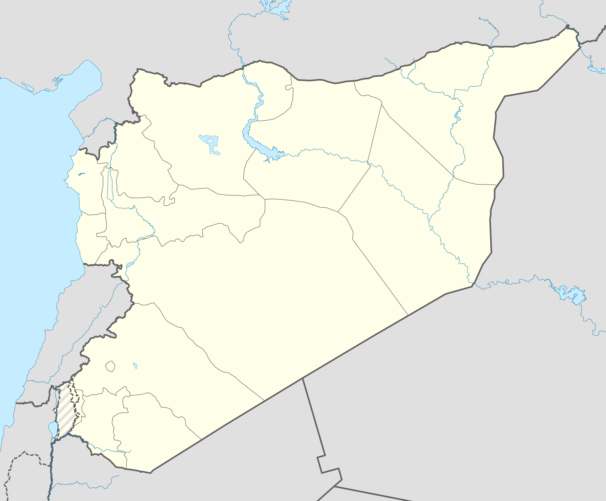

```{r setup, include=FALSE}
knitr::opts_chunk$set(echo = FALSE)
```

# Evaluating Descriptive Claims

## Plan for Today:

### (1) Introduction to Descriptive Claims

### (2) Review **types** of descriptive claims

### (3) First step in evaluation: concepts


# Module Roadmap

## Module Roadmap

#### (1) Descriptive claims: varieties and link to causal claims

#### (2) Concepts and Why we need them

#### (3) From concepts to observable traits (Variables)

#### (4) Making measurements


# Descriptive Claims

## Descriptive Claims: Varieties

#### (1) "Russia is a democracy."

#### (2) "58% of countries worldwide are democracies."

#### (3) "Countries in Western Europe are more democratic than those in Eastern Europe."

#### (4) "Democracies have been backsliding (becoming less democratic) since the election of Donald Trump"

>- What is the **first** thing we need to know to begin evaluating these claims?


## Descriptive Claims: Varieties

#### (1) "Russia is a democracy."

#### (2) "58% of countries worldwide are democracies."

#### (3) "Countries in Western Europe are more democratic than those in Eastern Europe."

#### (4) "Democracies have been backsliding (becoming less democratic) since the election of Donald Trump"


### We need to know what it is **to be** a "democracy" or **to be** "democratic".

## Descriptive Claims and Causal Claims

#### "The election of Donald Trump led countries around the world to become less democratic."

>- To evaluate this causal claim, we need to answer some descriptive claims (more on this later) and some definitions.

## Evaluating Descriptive Claims: 

### First step:

#### We need to be able to classify phenomena/things/events into types.


## Evaluating Descriptive Claims: 

A useful definition:

In social science we discuss "cases", not in the legal sense, but in this sense: 

#### **case**: 

> a specific individual, organization, entity, event, or action, existing in a specific time and place.

We are often interested in identifying what general categories this specific **case** belongs to, what is its "type".

# Concepts

## Concepts

At a general level:

**concepts**: abstract or general categories that we (humans) apply to particular cases/instances. They **abstract** away from the highly specific, complex, and often unique features of reality.

>- this definition is incomplete, more to come

Our thought and our language is rooted in concepts!

## Concepts

### Abstraction comes at a price

For example:

- "Chairs"
- Proper names of people
- Proper names of countries: e.g. "Syria"

## Conceptual Limits {.centered}



## Conceptual Limits {.centered}


## Concepts

### Why do we need them?

Without concepts:

- all experiences we have are unique, **sui generis**
- we cannot anticipate **regularities** in the world
- we cannot **predict** what will happen next
- we cannot function/act

## Concepts

### Why do we need them?

>  "... In that Empire, the Art of Cartography attained such Perfection that the map of a single Province occupied the entirety of a City, and the map of the Empire, the entirety of a Province. In time, those Unconscionable Maps no longer satisfied, and the Cartographers Guilds struck a Map of the Empire whose size was that of the Empire, and which coincided point for point with it. The following Generations, who were not so fond of the Study of Cartography as their Forebears had been, saw that that vast Map was Useless, and not without some Pitilessness was it, that they delivered it up to the Inclemencies of Sun and Winters. In the Deserts of the West, still today, there are Tattered Ruins of that Map, inhabited by Animals and Beggars; in all the Land there is no other Relic of the Disciplines of Geography." - Jorge Luis Borges

## Concepts

### Imperfect Abstractions of Reality

Even though concepts are imperfect abstractions from reality, but we are forced to use them.

### How do we come up with concepts and their definitions?

## An example: Democracy? {.build}

### What is a "democracy"?

### Were/are these democracies?

- German Democratic Republic (East Germany)
- Democratic People's Republic of Korea (North Korea)
- Lao People's Democratic Republic

### We need some scientific guidance

## Concepts and Science:

Building on our insights about/criteria for science:

#### (1) Concepts need to be transparent: 

clear and accessible definition/formulation. even if we disagree over the label, we can all use the concept

#### (2) Concepts must be formulated to be used consistently

science is about systematic evidence. cannot define concepts around one case, must be tied to attributes that are observable

#### (3) Concepts must be tied to prediction

science is fundamentally about prediction, finding regularities. concepts that do not bring together cases that have some shared behavior/action do not help us understand. 


## Concepts and Science:

#### **concepts**:

are abstract or general categories that we apply to particular cases/instances using with a set of rules/criteria that determine membership in the category. The rules/criteria that determine membership are:

- **observable**: defining traits in a concept must be rooted in some objective, empirical standard. (e.g., democracy cannot be defined by an ethereal 'Democratic Spirit')
- **ontological**: the traits we use for a concept are about what mean **to be** in this category. "To be a democracy is to have $x,y,z$ traits."
- **causal**: in the sense that the traits are thought important to how the concept is involved in causing effects, as effect of causes, or is part of a causal process. (i.e. traits relevant to prediction)


## Concepts and Science:

### Key Implication:

Depending on the kinds of questions we are interested in, we may have different concepts, different definitions. 

- Follows from Weber's insight that the questions science addresses are not "objectively" valid

BUT, good scientific concepts can be understood and used by others regardless of whether they agree on what questions are interesting.

## Concepts: Example

### **minimalist definition of democracy**:

#### Democracy is just a system in which rulers are selected by competitive elections
