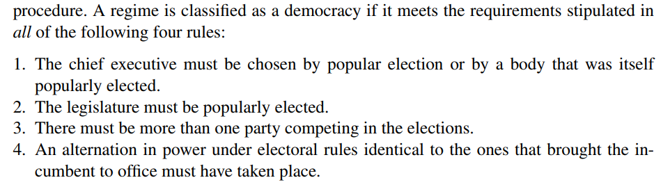
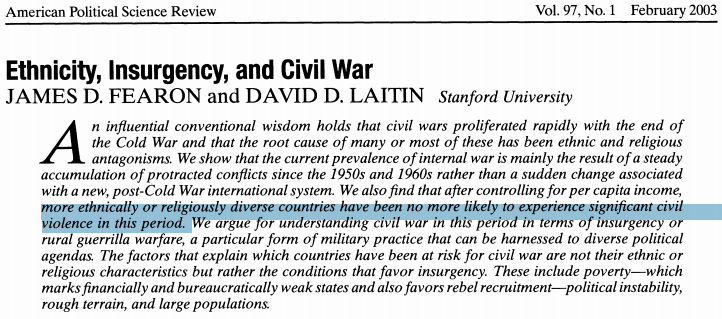
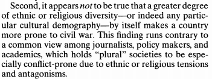
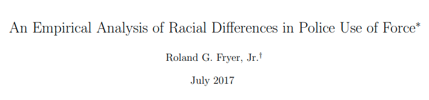

```{r setup, include=FALSE}
knitr::opts_chunk$set(echo = FALSE)
require(haven)
require(data.table)
require(ggplot2)
require(magrittr)
```

## Objectives

### (1) **Recap**

- Evaluating Descriptive Claims
- Variables vs. Measures
- Levels of Measurement
- Validity

### (2) **Measurement Error**

- **Bias**
- **Random**
- **Sources** and **Solutions**


# Recap

---

### Question/Claim $\xrightarrow{}$

### **Concept**

- transparent **definition** of what relevant and observable traits makes something an "X" $\xrightarrow{}$


### **Variable**(s)

- **observable** properties of cases that correspond to the concept $\xrightarrow{}$

### **Measure**(s)

- **procedure** to find the values variables take for *specific* cases  $\xrightarrow{}$

### "Answer"

---

### Question/Claim

**$\not\xrightarrow{}$ Concepts not scientific/irrelevant**

### **Concept** (and dimensions)

$\not\xrightarrow{}$ Variable does not map onto concept **(lack of validity)**

### **Variables**

$\not\xrightarrow{}$ Procedure does not return the true value **(measurement error)**

### **Measure**(s)

$\not\xrightarrow{}$

### "Answer"

---

Variables for "democracy":

**1**:  In each year, a country receives a "Polity Score" describing  the level of democracy ranging from -10 to +10, with -10 to -6 corresponding to autocracies, -5 to 5 corresponding to anocracies, and 6 to 10 to democracies.

 **2**. The year in which a country first became a democracy

 **3.** Fraction of adults who can are allowed to vote under suffrage rules

 **4** 


## menti.com code 45 41 37

**1.**:  In each year, a country receives a "Polity Score" describing  the level of democracy ranging from -10 to +10, with -10 to -6 corresponding to autocracies, -5 to 5 corresponding to anocracies, and 6 to 10 to democracies.

 **2.**. The year in which a country first became a democracy

 **3.** Fraction of adults who can are allowed to vote under suffrage rules

 **4.** 


---

<div style='position: relative; padding-bottom: 56.25%; padding-top: 35px; height: 0; overflow: hidden;'><iframe sandbox='allow-scripts allow-same-origin' allowfullscreen='true' allowtransparency='true' frameborder='0' height='315' src='https://www.mentimeter.com/embed/90330b58745b7e5efc15d7136178350f/e6c7038b62d3' style='position: absolute; top: 0; left: 0; width: 100%; height: 100%;' width='420'></iframe></div>


## Levels of measurement: Practice

Variables for "democracy":

**1. Ordinal**

**2. Interval**

**3. Ratio**

**4. Nominal**

# Example

## A question

> **Are countries with greater ethnic diversity more prone to experience civil war?**

## An answer



## Example

### **A concept**

**Ethnic diversity**: "having an ethnic majority and a significant ethnic minority"

## Example

"Ethno-linguistic fractionalization" or "ELF"

### $$ELF = 1 - \sum_{i=1}^{G} p_i^2$$ 

Where $p_i$ is fraction of population belonging to ethnic group $i$ out of $G$ total ethnic groups.

<br>

**Equivalent to the probability that any two randomly selected individuals belong to different ethnic groups**

## Example

Number and size of ethnic groups by country comes from the *Atlas Narodov Mira*:
  
- Soviet anthropological reference from 1964 
- Group categories and counts collected by Soviet anthropologists
- lists ethnic/language groups in each country
- lists the size of these groups

## Example

```{r echo = F, warning=F, message=F}
fl = read_dta("./repdata.dta") %>% as.data.table
fl = fl[, list(yrs_war = sum(war)), by = list(cname, ethfrac)]

ggplot(fl, aes(x = ethfrac, y = yrs_war, label = cname)) + geom_point() + geom_smooth(method = 'lm', fullrange = T, se = F) +
  geom_text(aes(label=ifelse(yrs_war>0,as.character(cname),'')),hjust=0,vjust=0) +
  xlab("Ethno-linguistic Fractionalization") + ylab("Years of Civil War") + theme_bw() +
  ggtitle("Years of Civil War by ELF Score")
```

## Example

**Weakly positive pattern, indistinguishable from random noise**:



## Example:

**In small groups:**

1. What is the variable (for ethnic diversity)?
2. What is the measure (for ethnic diversity)?
3. What problems, if any, are there with the variable?
4. What problems, if any, are there with the measure?

## Example: Problems

### Variable:

- Country A: Group 1 50%, Group 2 50%
    - $ELF = 0.5$
- Country B: Group 1 66.6%, Group 2 16.6%, Group 3 16.6%
    - $ELF = 0.5$
- Different dimensions of ethnicity (e.g. language, religion, race, caste, tribe)


## Example: Problems

### Measure:

Soviet anthropologists: 

- Are group sizes from 1964 correct?
    - Syrian civil war and Iraqi refugees
- Which dimension of ethnicity did they choose in each country?
- Distinct ethnic groups treated as the same, unified ethnic groups treated as different
    - e.g. in Rwanda Hutus and Tutsis coded as one ethnic group.

## Example: Problems

Problems with variables $\to$ lack of **validity**

Problems with measure $\to$ **measurement error**

# Measurement Error

## Measurement Error

#### **Validity** is about link between **variable** and **concept**

<hr style="height:8px; visibility:hidden;" />

#### **Measurement Error** is about link between **measure** and **variable**.

<hr style="height:8px; visibility:hidden;" />

## Measurement Error

### **measurement error**

is a **difference** between the **true** value of a variable for a case and the **observed value** of the variable for that case produced by the measurement procedure.

$$\mathrm{Value}_{observed} - \mathrm{Value}_{true} \neq 0 \xrightarrow{then} \mathrm{measurement \ error}$$

## Digression:

```{r echo = F, warning=F, message=F}

ggplot(fl, aes(x = ethfrac)) + geom_histogram(breaks = seq(-0.0125,1.0125,0.025), col = "white") + theme_bw(base_size = 18) + ggtitle("Histogram of Country ELF Scores") + xlab("Ethno-linguistic Fractionalization (Bins)") + ylab("Count (of countries)") +
    scale_y_continuous(breaks=c(0,2,4,6,8,10,12))

```

---

How many countries have $ELF \approx 0.5$?

How many countries have $ELF \approx 0.75$?

```{r echo = F, warning=F, message=F}

ggplot(fl, aes(x = ethfrac)) + geom_histogram(breaks = seq(-0.0125,1.0125,0.025), col = "white") + theme_bw() + ggtitle("Histogram of Country ELF Scores") + xlab("Ethno-linguistic Fractionalization (Bins)") + ylab("Count (of countries)") +
    scale_y_continuous(breaks=c(0,2,4,6,8,10,12))

```

---

## Measurement Error

### Two varieties of **measurement error**

- **bias**/**systematic measurement error**
- **random measurement error**

Differ in the pattern of $\mathrm{Value}_{observed} - \mathrm{Value}_{true}$ that we see.

## Measurement Error: Bias

**bias** or **systematic measurement error**: error produced when our measurement procedure obtains values that are, **on average**, too high or too low (or, incorrect) compared to the truth. 

- Key phrase is "on average": error is not a one-off fluke, will happen **systematically** even if you repeat the measurement procedure.
- can have an *upward* (observed value too high) or *downward* (observed value too low) bias
- **not** "politically" biased
- bias might not be the same for all cases or different across subgroups
    - example: economic evaluations and partisanship in surveys

---


## Measurement Error: Random

**random measurement error**: errors that occur due to *random* features of measurement process or phenomenon and the values that we measure are, **on average**, correct

- Due to chance, we get values that are too high or too low
- May be lots of errors
- There is no systematic tilt one way or another (no bias)
- In aggregate, values that are "too high" are balanced out by values that are "too low" compared to the truth


## menti.com 17 17 28

```{r, echo = F, message=F}
require(ggplot2)
n = 10000
x1 = rnorm(n, 0, 0.5) + 1
x2 = rnorm(n, 0, 3)
x3 = rnorm(n, -7, 3)
plot_data = data.frame(Measure = rep(paste0("X",1:3), each = n), value = c(x1, x2, x3))
xlims = range(c(x1,x2, x3))
ggplot(plot_data, aes(value, fill = Measure)) + 
  geom_histogram(bins = 100, alpha = 0.5, position = 'identity') +
  labs(title = 'Different measures of X') + xlab("Observed X - True X") + ylab("Frequency") + 
  theme_bw() +
  geom_vline(xintercept = 0, colour = 'red')
```

---

<div style='position: relative; padding-bottom: 56.25%; padding-top: 35px; height: 0; overflow: hidden;'><iframe sandbox='allow-scripts allow-same-origin' allowfullscreen='true' allowtransparency='true' frameborder='0' height='315' src='https://www.mentimeter.com/embed/69e188f2c79c30b9ccf182ae7859563a/e5831669bcd0' style='position: absolute; top: 0; left: 0; width: 100%; height: 100%;' width='420'></iframe></div>

# Example

## Racial Bias in Police Shootings

### **Is police violence in the US racially biased against African Americans?**

### What is "racial bias"?

<br>

**"Disparate treatment of a racial group in *otherwise identical situations*"** (i.e. "statistcal discrimination")

- if African Americans treated identically to white Americans by police in otherwise identical situations, no racial bias.
- Key feature of "identical situations" is "objective threat to the police officer"

## Racial Bias in Police Shootings



data comes from Houston police reports of events

> "arrests codes in which lethal force is more likely to be justified: attempted capital murder of a public safety officer, aggravated assault on a public safety officer, resisting arrest, evading arrest, and interfering in arrest"

## Racial Bias in Police Shootings

**concept: "objective threat" to the officer**

### **Variable:**

"the level of physically-threatening behavior exhibited by a suspect"

### **Measure:**

undergraduate research assistants code threatening behavior by suspects given in **police reports**

## Racial Bias in Police Shootings

**Findings**:

- In comparable interactions, Houston police department used lethal force against African Americans *less* or the *as often* as they did against Whites.

In small groups:

Do you believe this result?

- Do you believe the validity of the measure (of objective threat?) Why or why not?
- Do you believe the measure? Why or why not?

# Measurement Error

## Systematic Measurement Error/Bias

### Sources

**($1$) Researcher subjectivity/interpretation**
    - Researcher systematically over-weights, under-weights dimension of concept


## Systematic Measurement Error/Bias

### Political Knowledge

Expert interviewers assess "political knowledge". Might overweight language skills in measure of political knowledge

$\xrightarrow{Downward \ Bias}$ political knowledge of people who have less grasp of language of interview

## Systematic Measurement Error/Bias

### Sources

**($2$) Obstacles to observation** 

- **social norms** may discourage revelation of information; downward bias in "undesirable" phenomena
    - e.g. survey measure of racism or drug use $\xrightarrow{}$ **social desirability bias**
- **incentives to hide/misrepresent**: political actors have strategic reasons to conceal information from each other
    - e.g. states may present their military capacity to be better than it is (upward bias)
    - e.g. wealthy people may present themselves as less wealthy to avoid negative attention (downward bias)

## Random Measurement Error

### Sources

- Imperfect memory (survey/interviews)
- "Random" changes in mood/concerns (for surveys)
    - e.g. rain might make you more angry and support government less
- Sampling errors (e.g., national statistics from **random samples**)
- Researcher interpretation 
    - e.g. random differences in classifying cases (like flipping a coin when you can't tell how to classify case)
    

## Bias: Solutions?

1. Researcher subjectivity:
    
    - More precise, clear rules for measurement procedure
    
2. Obstacles to observation:

    - Social norms: Protect anonymity, subtler measurement
    - Incentives to hide/misrepresent: use private records, behavior not statements, interview after incentives gone

## Bias: Solutions?

#### **Repeating measurement does not help**

Instead:

- Improve the measurement procedure
- Use **multiple** measures with different (independent) problems:
    - Upward bias in measure 1 may be balanced by downward bias in measure 2
    - Ideally, measures from entirely different sources
    
    
## Random Error: Solutions?

If truly random: errors **cancel out** with many trials

### Solutions

- Repeat measure for lots of cases/individuals
- Repeat measure for same case at multiple points in time
- Have multiple researchers apply measure to same case

## Conclusion:

### **Measurement Error**

- Distinct from validity problems
- **Bias**
- **Random**
- **Sources** and **Solutions**
