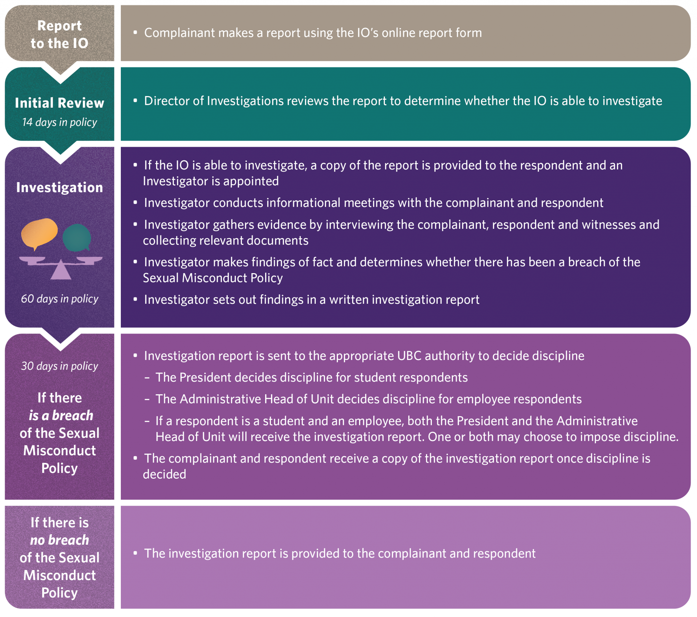
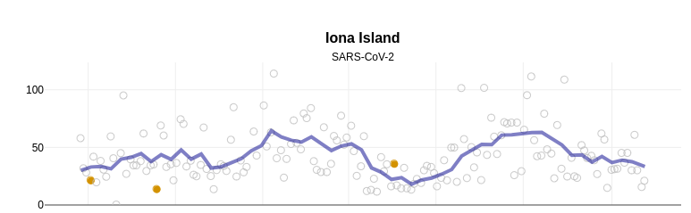
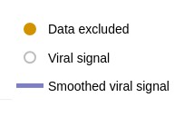

```{r setup, include=FALSE}
knitr::opts_chunk$set(echo = FALSE)
require(stringr)
require(data.table)
require(ggplot2)
require(magrittr)
```

<script type="text/x-mathjax-config">
MathJax.Hub.Config({
TeX: {extensions: ["cancel.js"]}
});
</script> 

## Objectives

### (1) **Measurement Error**

- What is it?
- Histograms
- **bias**/**systematic error**
- **random** measurement error

# Example

## Undocumented Migrants and Crime

[Light et al 2020](https://doi.org/10.1073/pnas.2014704117)  investigate claim: "undocumented migrants are prone to violent crime"

**concepts**: undocumented, violent criminals

**variable**: conviction rates for violent crime (homicide, assault, robbery, sexual assault) for US-born citizens, legal immigrants, undocumented immigrants

**measure**: individual crimes listed in arrests in the Texas Computerized Criminal History database, individual immigration status as determined by DHS and ICE using biometrics database, numbers of undocumented migrants using Census data

---


## Undocumented Migrants and Crime

Not the end of the story: [Kennedy et al](https://cis.org/Report/Misuse-Texas-Data-Understates-Illegal-Immigrant-Criminality) at Center for Immigration Studies dispute these findings:


Complaints focus on:

- how does Texas identify undocumented migrants in arrest and prison records?
- how do DHS/ICE identify undocumented migrants?

---

[Kennedy et al](https://cis.org/Report/Misuse-Texas-Data-Understates-Illegal-Immigrant-Criminality), argue:

- It takes time for undocumented immigrants in custody to be identified. 

    - $\to$ **undercounting** of arrested undocumented
    - $\to$ more undercounting in *recently* arrested

- Only people in custody for longer periods of time for serious crimes likely to be thoroughly checked:

    - $\to$ undercounting is lower/minimal for **homicide convictions**
    - $\to$ need to use DHS **and** Texas prison (TDCJ) checks on migration status


## Undocumented Migrants and Crime


>- By "fixing" measurement procedures, conclusions reversed.
>- This is a claim about **measurement error**

## Measurement Error

#### **Validity** is about link between **variable** and **concept**

<hr style="height:8px; visibility:hidden;" />

#### **Measurement Error** is about link between **measure** and **variable**.

<hr style="height:8px; visibility:hidden;" />

## Goals

You should be able to:
  
1. Recognize the **type** of measurement error (bias vs random) from the pattern of errors
2. Tell **stories** about why a specific measure might produce bias or random error
3. Judge whether an error's **direction** and **magnitude** affect the severity of evidence for a claim

# Measurement Error

## Measurement Error

### **measurement error**

is a **difference** between the **observed** value of a variable for a case (produced by the **measure**ment procedure) and the **true** value of the variable for that case.

$$\mathrm{Value}_{observed} - \mathrm{Value}_{true} \neq 0 \xrightarrow{then} \mathrm{measurement \ error}$$

If what we observe is **different** from the true value for a case (difference is not 0), then there is measurement **ERROR**


## Measurement Error

What is the incidence of sexual misconduct [defined here](https://universitycounsel.ubc.ca/files/2024/10/Sexual-Misconduct-Policy_SC17.pdf) at UBC?

Let's say a **variable** is the number of breaches of Sexual Misconduct Policy in a given year.

**Measure**: Reporting from the UBC Investigations Office.

---



## Measurement Error

What is the incidence of sexual misconduct [defined here](https://universitycounsel.ubc.ca/files/2024/10/Sexual-Misconduct-Policy_SC17.pdf) at UBC?

Let's say a **variable** is the number of breaches of Sexual Misconduct Policy in a given year.

**Measure**: Reporting from the [UBC Investigations Office](https://io.ubc.ca/).

That implies $15$ incidents in 2025-2026 Academic Year (last available data). 

45 reports $\to$ 26 investigations $\to$ 20 completed investigations $\to$ 15 breaches found

>- Is this observed value **too high**? **too low**? **correct**? Why?


## Measurement Error

$$\mathrm{Sexual \ Misconduct }_{observed} - \mathrm{Sexual \ Misconduct}_{true} \neq 0$$

$$\xrightarrow{then} \mathrm{measurement \ error}$$

>- Most likely $\mathrm{Sexual \ Misconduct }_{observed} - \mathrm{Sexual \ Misconduct}_{true} < 0$

---

### Two varieties of **measurement error**

- **bias**/**systematic measurement error**
- **random measurement error**

Differ in the patterns of $\mathrm{Value}_{observed} - \mathrm{Value}_{true}$ that we see.

Measures may suffer from **both**.

## Measurement Error: Bias

**bias** or **systematic measurement error**: error produced when our measurement procedure obtains values that are, **on average**, too high or too low (or incorrectly labelled) compared to the truth. 

- Key phrase is **"on average"**: error is not a one-off fluke, will happen **systematically** even if you repeat the measurement procedure.
- can have an *upward* (observed value too high) or *downward* (observed value too low) bias
- can occur for nominal/categorical values: e.g., systematically misclassifying undocumented migrants as legal
- **not** "politically" biased


## Measurement Error: Bias

[Kennedy et al](https://cis.org/Report/Misuse-Texas-Data-Understates-Illegal-Immigrant-Criminality) argue that [Light et al](https://doi.org/10.1073/pnas.2014704117)'s measurement procedures lead to, on average:

$$\mathrm{Migrant \ Homicide \ Rate }_{observed} - \mathrm{Migrant \ Homicide \ Rate}_{true} < 0$$

$$\xrightarrow{then} \mathrm{measurement \ bias}$$


## Measurement Error: Bias


bias different in different subgroups


## Measurement Error: Random

**random measurement error**: errors that occur due to *random* features of measurement process or phenomenon. So even if observed values are sometimes wrong, they are, **on average**, correct

- Due to chance, we get values that are too high or too low
- There is no tilt one way or another (no bias): "noise"
- **random** here means: errors **unrelated** to true value; errors **equally likely** to be over- or under- estimate.
- In aggregate, values that are "too high" are balanced out by values that are "too low" compared to the truth

## Measurement Error: Random

**Variable**: incidence of COVID-19 infections

**Measure**: "Composite wastewater influent is collected over a 24-hour period from wastewater treatment plants (WWTPs). Samples are collected 2-3x per week at each WWTP and are transported by the BCCDC PHL for analysis. Wastewater samples are concentrated by ultracentrifugal filtration, nucleic acids extracted and SARS-CoV-2 envelope gene (E gene) is detected by real-time quantitative polymerase chain reaction (RT-qPCR)."

## Measurement Error: Random





## Measurement Error: Random

Day-to-day variation in:

- wastewater volume (e.g. rain, snowmelt, showering, dishwashing)
- fecal matter (e.g. diet, exercise, other diseases)

can lead to errors in measurement, but these errors...

- *probably* unrelated to amount of true rate of COVID infections
- *probably* equally likely to lead to over and under count
- likely cancel out in the long run.


## Digression: Histograms

[video explanation here](https://www.khanacademy.org/math/pre-algebra/pre-algebra-math-reasoning/pre-algebra-picture-bar-graphs/v/histograms)

```{r echo = F, warning=F, message=F}

bc_data = fread('./BCCDC_COVID19_Dashboard_Case_Details.csv')
bc_data[, age := str_extract(Age_Group, "\\d\\d$") %>% as.numeric %>% `-` (1)]

ggplot(bc_data, aes(x = age)) + geom_histogram(breaks = seq(0,90,10), col = "white") + theme_bw(base_size = 18) + ggtitle("Histogram of BC COVID Cases by Age \n Through February, 2023") + xlab("Age (Bins)") + ylab("Count (of COVID-19 Cases)")  +
    scale_x_continuous(breaks=seq(0,90,10)) +
    scale_y_continuous(breaks = seq(0,80000,10000))
```

---

About how many cases among people between 70 and 80?

About how many cases among people between 20 and 30?

```{r echo = F, warning=F, message=F}
ggplot(bc_data, aes(x = age)) + geom_histogram(breaks = seq(0,90,10), col = "white") + theme_bw(base_size = 18) + ggtitle("Histogram of BC COVID Cases by Age") + xlab("Age (Bins)") + ylab("Count (of COVID-19 Cases)")  +
    scale_x_continuous(breaks=seq(0,90,10)) +
    scale_y_continuous(breaks = seq(0,80000,10000))
```

---

Histograms of **measurement errors** for many cases help us tell us what **type** of measurement error

- we can pretend we are omniscient/have "gold standard" data and compared "observed" and against "true" values.
- different patterns $\to$ random error vs bias

---

### Practice

```{r, echo = F, message=F}
require(ggplot2)
n = 10000
x1 = rnorm(n, 0, 0.5) + 1
x2 = rnorm(n, 0, 3)
x3 = rnorm(n, -7, 3)
plot_data = data.frame(Measure = rep(paste0("X",1:3), each = n), value = c(x1, x2, x3))
xlims = range(c(x1,x2, x3))
ggplot(plot_data, aes(value, fill = Measure)) + 
  geom_histogram(bins = 100, alpha = 0.5, position = 'identity') +
  labs(title = 'Measurement error for\ndifferent measures of variable X') + xlab("Observed Value X - True Value X") + ylab("# of Cases") + 
  theme_bw() +
  geom_vline(xintercept = 0, colour = 'red') +
  geom_text(aes(x=-0.5, label="No Error", y=2000), colour="red", angle=90, size = 4, fontface = "plain") 
```


# Can we measure that?

## Descriptive Claim

Something relevant to politics today

## Variable


## Measure


## Measurement Error


# How do we know there is error?

## How Do We Know There Is Error?

We only observe what we observe, so how do we know a procedure misses the **true** value?

1. **Compare** with known quantities or a better procedure (e.g., comparing scales). This lets us test directly for error and bias.
2. **Understand the process** that generates the data, including its limitations and incentives. 
    - this is often our only option, because we usually don't *know* for sure whether there bias or random error is present.

>- Understand kinds of reasons measurement errors arise (different stories)


## Why bias happens:

Measurement Bias arises from observations  made by and of people:

- humans involved in observation process may have mis-perceptions
- humans who are being observed have motives/incentives to mis-represent things
- humans use measurement tools for purposes other than intended
- available measurement tool prone to over/under-count


## Why bias happens:

**($1$) Subjectivity/Perspective**: Researcher/data collector systematically perceives and evaluates cases incorrectly

Examples:

- Resume experiments show HR professionals exhibit gender, racial bias in evaluating "professionalism" for job
- Perceptions of "objective threat" written in police reports
- Little and Meng (2024) on democracy scores.

## Why bias happens:

**($2$) Motives/Incentives to mis-represent**: beyond researchers, people *generating* the data

- **social norms** may discourage revelation of information; downward bias in "undesirable" phenomena
    - e.g. survey measure of racism or drug use $\xrightarrow{}$ **social desirability bias**
- **incentives to hide/misrepresent**: political actors have strategic reasons to conceal information from each other
    - e.g. police use-of-force encounter reports 
    - e.g. wealthy people may misrepresent assets to avoid taxation (downward bias)
    
## Example: Gender Bias in Politics

Consider the following statement: "Men are naturally better leaders than women." Do you...

<ol type="A">
  <li>Strongly disagree</li>
  <li>Disagree</li>
  <li>Neither agree nor disagree</li>
  <li>Agree</li>
  <li>Strongly agree</li>
</ol>

## Example: Gender Bias in Politics

[Chen et al (2023)](https://doi.org/10.1017/S0008423922000890) ask this of sample of Canadians in 2018. They find that $15.5$ percent of Canadians agreed with this statement.

>- Do you believe this measurement has bias? Why or why not?
>- What do you think the *direction* of the bias would be?

## Example: Gender Bias in Politics

**List experiment**: *How many* statements do you agree with?

1. Cooperation between politicians and parties produces better public policy.
2. Recreational marijuana consumption should be legalized.
3. When necessary for public safety, police should have access to cell phone records without a warrant.
4. All politicians can be trusted to spend the public's money wisely.

>- Random subset also include the sexist statement

## Example: Gender Bias in Politics

[Chen et al (2023)](https://doi.org/10.1017/S0008423922000890):

$20.1$ percent agreed that "Men are naturally better leaders than women", when counting how many items they agreed with.


## Example: Immigration

When discussing crime rates for natural-born citizens, legal immigrants, and undocumented immigrants, need to get the **number of undocumented immigrants**.

Why might it be difficult to correctly count?


## Why bias happens:

**($3$) Use of data beyond its intended purposes**: without knowing how data is produced, unanticipated errors can arise.


- Example: crime rates for undocumented migrants in Texas.


---

[Kennedy et al](https://cis.org/Report/Misuse-Texas-Data-Understates-Illegal-Immigrant-Criminality), argue:

- It takes time for undocumented immigrants in custody to be identified. 

    - $\to$ **undercounting** of arrested undocumented
    - $\to$ more **undercounting** in recently arrested

- Only people in custody for longer periods of time for serious crimes likely to be thoroughly checked:

    - $\to$ undercounting is lower/minimal for **homicide convictions**
    - $\to$ need to use ICE **and** Texas prison (TDCJ) checks on migration status

---

[Alex Nowsrateh](https://www.alexnowrasteh.com/p/illegal-immigrants-have-a-low-homicide) shows that these conclusions came from misunderstanding of the Texas data:

- people labelled as undocumented by ICE **also** labeled as undocumented by TDCJ
- some people labelled as undocumented by DHS later **discovered to be legal** by TDCJ

Kennedy et al takes **count** of all incidents where people labelled as undocumented from ICE or TDCJ. May **double count** individuals.

---

> "We can supply the number uniquely identified by TDCJ (Prison category) and the total number of Illegals identified through PEP (*this can include illegals also identified by TDCJ*). Please note, if someone was uniquely identified through TDCJ, but at a later time is identified through PEP, the individual would no longer be in the Prison category and would reflect the PEP identification" [emphasis added].


---


## Why Random Measurement Error?

- Imperfect memory (survey/interviews)
- Mistakes (mis-click on a survey)
- "Arbitrary" changes in mood/concerns (for surveys)
    - e.g. rain might make you more angry and support government less
- Researcher interpretation 
    - e.g. random differences in classifying cases (like flipping a coin when you can't tell how to classify case)

Anything  that is (a) **unrelated** to the actual values for cases, and (b) may **equally** over-/under-estimate. Unless the error is literally generated by e.g. rolling dice, we only *assume*/*argue* that it is random
    
    
# Conclusion

## What Do We Do About It?

Measurement error is everywhere, but we can still say something about descriptive claims.

Need to know: 

1. **Type**: some types of error are tolerable for some claims
2. **Direction**: if the bias works against the claim, we can still evaluate it with **weak severity**
3. **Magnitude**: small errors may be irrelevant to **weak severity**
    
    
## Conclusion:

**Measurement Error**

- know how to recognize both types
- what are the sources of these errors
- when are they a problem/not (next class)


