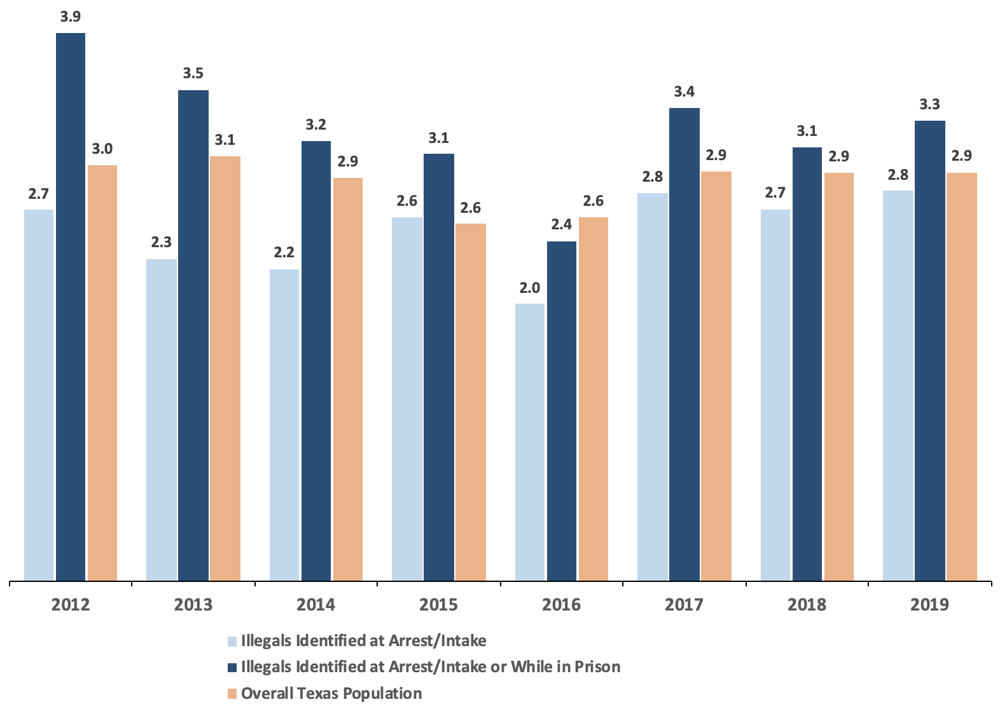

```{r setup, include=FALSE}
knitr::opts_chunk$set(echo = FALSE)
require(stringr)
require(data.table)
require(ggplot2)
require(magrittr)
```

<script type="text/x-mathjax-config">
MathJax.Hub.Config({
TeX: {extensions: ["cancel.js"]}
});
</script> 

## Objectives

### (1) **Measurement Error**

- What is it?
- Histograms
- **bias**/**systematic error**
- **random** measurement error

# Example

---

### Undocumented Migrants and Murder

[Light et al 2020](https://doi.org/10.1073/pnas.2014704117)  investigate claim: "undocumented migrants are prone to violent crime"

**concepts**: undocumented, violent criminals

**variable**: conviction rates for violent crime (homicide, assault, robbery, sexual assault) for US-born citizens, legal immigrants, undocumented immigrants

**measure**: individual crimes listed in arrests in the Texas Computerized Criminal History database, individual immigration status as determined by DHS and ICE using biometrics database, numbers of undocumented migrants using Census data

---


---

Not the end of the story: [Kennedy et al](https://cis.org/Report/Misuse-Texas-Data-Understates-Illegal-Immigrant-Criminality) at Center for Immigration Studies dispute these findings:


Complaints focus on:

- how does Texas identify undocumented migrants in arrest and prison records?
- how do DHS/ICE identify undocumented migrants?

---

[Kennedy et al](https://cis.org/Report/Misuse-Texas-Data-Understates-Illegal-Immigrant-Criminality), argue:

- It takes time for undocumented immigrants in custody to be identified. 

    - $\to$ **undercounting** of arrested undocumented
    - $\to$ more **undercounting** in recently arrested

- Only people in custody for longer periods of time for serious crimes likely to be thoroughly checked:

    - $\to$ undercounting is lower/minimal for **homicide convictions**
    - $\to$ need to use DHS **and** Texas prison (TDCJ) checks on migration status


>- Are Kennedy et al pointing to a **lack of validity** in the "undocumented" variable?

---




>- Argue that by "fixing" measurement procedures, conclusions reversed.
>- This is a claim about **measurement error**

## Measurement Error

#### **Validity** is about link between **variable** and **concept**

<hr style="height:8px; visibility:hidden;" />

#### **Measurement Error** is about link between **measure** and **variable**.

<hr style="height:8px; visibility:hidden;" />

# Measurement Error

## Measurement Error

### **measurement error**

is a **difference** between the **observed** value of a variable for a case (produced by the **measure**ment procedure) and the **true** value of the variable for that case.

$$\mathrm{Value}_{observed} - \mathrm{Value}_{true} \neq 0 \xrightarrow{then} \mathrm{measurement \ error}$$

If what we observe is **different** from the true value for a case (difference is not 0), then there is measurement **ERROR**

(note: we don't usually *know* the true value!)

## Measurement Error

Kennedy et al are saying that using the incorrect procedures leads to:

$$\mathrm{Migrant \ Crime \ Rate}_{observed} < \mathrm{Migrant \ Crime \ Rate}_{true} \\\xrightarrow{then} \\ \mathrm{measurement \ error}$$


## Measurement Error

What is the incidence of sexual misconduct [defined here](https://universitycounsel.ubc.ca/files/2024/10/Sexual-Misconduct-Policy_SC17.pdf) at UBC?

Let's say a **variable** is the number of breaches of Sexual Misconduct Policy in a given year.

**Measure**: Reporting from the UBC Investigations Office.

---


## Measurement Error

What is the incidence of sexual misconduct [defined here](https://universitycounsel.ubc.ca/files/2024/10/Sexual-Misconduct-Policy_SC17.pdf) at UBC?

Let's say a **variable** is the number of breaches of Sexual Misconduct Policy in a given year.

**Measure**: Reporting from the [UBC Investigations Office](https://io.ubc.ca/).

That implies $13$ incidents in 2024-2025 Academic Year (last available data). 

39 reports $\to$ 21 investigations $\to$ 19 completed investigations $\to$ 13 breaches found

>- Is this observed value **too high**? **too low**? **correct**? Why?


## Measurement Error

$$\mathrm{Sexual \ Misconduct }_{observed} - \mathrm{Sexual \ Misconduct}_{true} \neq 0$$

$$\xrightarrow{then} \mathrm{measurement \ error}$$

>- Most likely $\mathrm{Sexual \ Misconduct }_{observed} - \mathrm{Sexual \ Misconduct}_{true} < 0$

---

### Two varieties of **measurement error**

- **bias**/**systematic measurement error**
- **random measurement error**

Different the patterns of $\mathrm{Value}_{observed} - \mathrm{Value}_{true}$ that we see.

Different implications for severity of evidence.

Measures may suffer from **both**.

## Types of Measurement Error

1. We have definitions for **what** these two types of errors are
2. But there are **many** reasons **why** these errors can arise
3. Similar validity, concerns about measurement error involves a **story** about how the data we collect records the **wrong values**
4. Severe testing involves **checking out** these stories
5. Measurement error may or may not be a problem for **weak severity**

## Types of Measurement Error

You need to:

1. Recognize two types of measurement error, by definition/attributes
2. Recognize/tell stories about why these errors might arise for a **specific** measure
3. Identify whether a specific story about measurement error affects the severity of evidence for a claim

## Measurement Error: Bias

**bias** or **systematic measurement error**: error produced when our measurement procedure obtains values that are, **on average**, too high or too low (or incorrectly labelled) compared to the truth. 

- Key phrase is **"on average"**: error is not a one-off fluke, will happen **systematically** even if you repeat the measurement procedure.
- can have an *upward* (observed value too high) or *downward* (observed value too low) bias
- can occur for nominal/categorical values: e.g., systematically misclassifying undocumented migrants as legal
- **not** "politically" biased
- bias might not be the same for all cases/ may differ across subgroups


## Measurement Error: Bias

[Kennedy et al](https://cis.org/Report/Misuse-Texas-Data-Understates-Illegal-Immigrant-Criminality) argue that [Light et al](https://doi.org/10.1073/pnas.2014704117)'s measurement procedures lead to, on average:

$$\mathrm{Migrant \ Homicide \ Rate }_{observed} - \mathrm{Migrant \ Homicide \ Rate}_{true} < 0$$

$$\xrightarrow{then} \mathrm{measurement \ bias}$$

---


bias different in different subgroups

## Measurement Error: Random

**random measurement error**: errors that occur due to *random* features of measurement process. Even if observed values are sometimes wrong, they are, **on average**, correct

- Due to chance, we get values that are too high or too low
- There is no tilt one way or another (no bias): errors are only "noise"
- **random** here means: errors **unrelated** to true value; errors **equally likely** to be over- or under- estimate.
- In aggregate, values that are "too high" are balanced out by values that are "too low" compared to the truth

## Measurement Error: Random

**Variable**: relative change in COVID-19 infections

**Measure**: "Composite wastewater influent is collected over a 24-hour period from wastewater treatment plants (WWTPs). Samples are collected 2-3x per week at each WWTP and are transported by the BCCDC PHL for analysis. Wastewater samples are concentrated by ultracentrifugal filtration, nucleic acids extracted and SARS-CoV-2 envelope gene (E gene) is detected by real-time quantitative polymerase chain reaction (RT-qPCR)."

## Measurement Error: Random


## Measurement Error: Random

Day-to-day variation in:

- wastewater volume (e.g. rain, snowmelt, showering, dishwashing)
- fecal matter (e.g. diet, exercise, other diseases)

can lead to errors in measurement, but these errors...

- *probably* unrelated to amount of true rate of COVID infections
- *probably* equally likely to lead to over and under count
- likely cancel out in the long run.

## Measurement Error: Bias vs Random Errors

We don't usually **know** for sure whether measurement errors are **bias** or **random**:

- either we need to test for bias (against a better data collection process)
- or we need to know more about the **process** creating the data we observe


## Digression: Histograms

[video explanation here](https://www.khanacademy.org/math/pre-algebra/pre-algebra-math-reasoning/pre-algebra-picture-bar-graphs/v/histograms)

```{r echo = F, warning=F, message=F}

bc_data = fread('./BCCDC_COVID19_Dashboard_Case_Details.csv')
bc_data[, age := str_extract(Age_Group, "\\d\\d$") %>% as.numeric %>% `-` (1)]

ggplot(bc_data, aes(x = age)) + geom_histogram(breaks = seq(0,90,10), col = "white") + theme_bw(base_size = 18) + ggtitle("Histogram of BC COVID Cases by Age \n Through February, 2023") + xlab("Age (Bins)") + ylab("Count (of COVID-19 Cases)")  +
    scale_x_continuous(breaks=seq(0,90,10)) +
    scale_y_continuous(breaks = seq(0,80000,10000))
```

---

About how many cases among people between 70 and 80?

About how many cases among people between 20 and 30?

```{r echo = F, warning=F, message=F}
ggplot(bc_data, aes(x = age)) + geom_histogram(breaks = seq(0,90,10), col = "white") + theme_bw(base_size = 18) + ggtitle("Histogram of BC COVID Cases by Age") + xlab("Age (Bins)") + ylab("Count (of COVID-19 Cases)")  +
    scale_x_continuous(breaks=seq(0,90,10)) +
    scale_y_continuous(breaks = seq(0,80000,10000))
```

---

Histograms of **measurement errors** for many cases help us tell us what **type** of measurement error

- we can pretend we are omniscient/have "gold standard" data and compared "observed" and against "true" values.

---

### Practice

```{r, echo = F, message=F}
require(ggplot2)
n = 10000
x1 = rnorm(n, 0, 0.5) + 1
x2 = rnorm(n, 0, 3)
x3 = rnorm(n, -7, 3)
plot_data = data.frame(Measure = rep(paste0("X",1:3), each = n), value = c(x1, x2, x3))
xlims = range(c(x1,x2, x3))
ggplot(plot_data, aes(value, fill = Measure)) + 
  geom_histogram(bins = 100, alpha = 0.5, position = 'identity') +
  labs(title = 'Measurement error for\ndifferent measures of variable X') + xlab("Observed Value X - True Value X") + ylab("# of Cases") + 
  theme_bw() +
  geom_vline(xintercept = 0, colour = 'red')
```


## How do we know...

...if there is measurement error?

We only observe what we observe, how do we know procedure does not return the **true** value?

1. comparison with known quantities or better measurement procedures (e.g., comparing scales)
2. we understand **process** of observation to identify limitations and incentives that might lead to errors.

## What do we do...

...if there is measurement error?

Measurement error is everywhere. Does not mean we can say nothing about descriptive claims.

1. Depending on the descriptive claim, some types of measurement error are tolerable.
2. Depending on the **direction** of the measurement error, we may still be able to evaluate claims with **weak severity**
3. Depending on the **magnitude** of the measurement error, errors may be irrelevant to **weak severity**

## Goals:

1. Understand **reasons** measurement error occurs, so we can recognize it.
2. Know what the **pattern** of errors are: so we can identify the **type**, **direction** (if biased), and  **magnitude** of the error.
3. Guidelines for how errors affect evidence for claims.


## Example: Facebook and Hate Crime

### [**Mueller and Schwarz (2021)**](https://doi.org/10.1093/jeea/jvaa045) ask:

<br>

#### **Do hate-crimes occur more frequently at times when there is more social-media hate speech?**

<br>

- Are there higher levels of **anti-refugee** violence in weeks with more social media anti-refugee hate speech?
- Address this question in the context of Germany (2015-2017)

## Example: Facebook and Hate Crime

Need two concepts/variables/measures:

1. Anti-refugee violence
2. Anti-refugee rhetoric on Facebook

<br>

For each one, what are possible kinds of measurement error?

## Example: Facebook and Hate Crime

**concept**: Anti-refugee Violence

<br>

**variable**: Number of attacks against refugee persons and property

<br>

**measure**: (for each week)

<br>


## Example: Facebook and Hate Crime

**concept**: Anti-refugee speech on social media

<br>

**variable**: Number of anti-refugee posts on Facebook per week

<br>

**measure**:

<br>


## Example: Facebook and Hate Crime

Example Facebook posts:

<br>


<br>


---

What pattern do we see here between anti-refugee Facebook posts and anti-refugee violence over time?


---

Could the sources of measurement error we lead us to observe shared trends between anti-refugee posts and anti-refugee violence when they in fact don't?


# Why measurement error?

## Why bias happens:

Measurement Bias arises from observations  made by and of people:

- humans involved in observation process may have mis-perceptions
- humans who are being observed have motives/incentives to mis-represent things
- humans use measurement tools for purposes other than intended

## Systematic Measurement Error/Bias

### Causes

**($1$) Subjectivity/Perspective**: Researcher/data collector systematically perceives and evaluates cases incorrectly

Examples:

- Resume experiments show HR professionals exhibit gender, racial bias in evaluating "professionalism" for job
- Perceptions of "objective threat" written in police reports
- Little and Meng (2024) on democracy scores.

---

### Systematic Measurement Error/Bias Causes

**($2$) Motives/Incentives to mis-represent**: beyond researchers, people *generating* the data

- **social norms** may discourage revelation of information; downward bias in "undesirable" phenomena
    - e.g. survey measure of racism or drug use $\xrightarrow{}$ **social desirability bias**
    - e.g. values in society about what is important/interesting affects news reporting
- **incentives to hide/misrepresent**: political actors have strategic reasons to conceal information from each other
    - e.g. police use-of-force encounter reports on "objective threat" of black suspects [(Fryer 2019)](https://scholar.harvard.edu/files/fryer/files/empirical_analysis_tables_figures.pdf) (upward bias)
    - e.g. wealthy people may misrepresent assets to avoid taxation (downward bias)
    
## Example: Immigration

If we surveyed Canadians and asked them:
    
**"And would you oppose stopping all immigration into Canada?"**

They can choose "oppose", "support", "neither support nor oppose"

> **Do you think this survey response would suffer from measurement bias?**

>- What **direction** of measurement bias?

## Example: Immigration

**List experiments**


(board)

## Example: Immigration

**List experiments** in US vs Canada


How many people are **opposed** to **stopping** immigration?

## Example: Immigration

When discussing crime rates for natural-born citizens, legal immigrants, and undocumented immigrants, need to get the **number of undocumented immigrants**.

Why might it be difficult to correctly count?


## Systematic Measurement Error/Bias

### Causes

**($3$) Use of data beyond its intended purposes**: without knowing how data is produced, unanticipated errors can arise.


- Example: crime rates for undocumented migrants in Texas.


---

[Kennedy et al](https://cis.org/Report/Misuse-Texas-Data-Understates-Illegal-Immigrant-Criminality), argue:

- It takes time for undocumented immigrants in custody to be identified. 

    - $\to$ **undercounting** of arrested undocumented
    - $\to$ more **undercounting** in recently arrested

- Only people in custody for longer periods of time for serious crimes likely to be thoroughly checked:

    - $\to$ undercounting is lower/minimal for **homicide convictions**
    - $\to$ need to use DHS **and** Texas prison (TDCJ) checks on migration status

---


>- Argue that "fixing" measurement problems, conclusions reversed.

---

[Alex Nowsrateh](https://www.alexnowrasteh.com/p/illegal-immigrants-have-a-low-homicide) shows that these conclusions came from misunderstanding of the Texas data:

- people labelled as undocumented by DHS also labeled as undocumented by TDCJ
- some people labelled as undocumented by DHS later discovered to be legal by TDCJ

Kennedy et al takes **count** of all incidents where people labelled as undocumented from DHS and TDCJ. May **double count** individuals.

---

> "We can supply the number uniquely identified by TDCJ (Prison category) and the total number of Illegals identified through PEP (*this can include illegals also identified by TDCJ*). Please note, if someone was uniquely identified through TDCJ, but at a later time is identified through PEP, the individual would no longer be in the Prison category and would reflect the PEP identification" [emphasis added].


---


## Random Measurement Error

### Causes

- Imperfect memory (survey/interviews)
- Mistakes (mis-click on a survey)
- "Arbitrary" changes in mood/concerns (for surveys)
    - e.g. rain might make you more angry and support government less
- Researcher interpretation 
    - e.g. random differences in classifying cases (like flipping a coin when you can't tell how to classify case)

Anything  that is **unrelated** to the actual values for the cases we want to observe and may **equally** over-/under-estimate. Unless the error is literally generated by e.g. rolling dice, we only *assume*/*argue* that it is random
    
## If errors, then...

1. We need to distinguish between **random** and **systematic** errors. Does the **source** of the error suggest a **systematic** direction to the error?

2. Is the **magnitude** of the error likely to be large or small? Is it possible to assess how wrong it could be?

3. If the error is a **bias**, what is the systematic pattern that is produced? (upward?, downward?)
    
These answers can inform us whether measurement error affects whether evidence has weak severity. (next lecture)

## If errors, then...


    
## Conclusion:

**Measurement Error**

- know how to recognize both types
- what are the sources of these errors
- when are they a problem/not (next class)


