```{r setup, include=FALSE}
knitr::opts_chunk$set(echo = FALSE)
require(magrittr)
require(kableExtra)
require(knitr)
require(ggplot2)
require(gtools)
require(dagR)
require(data.table)
require(MASS)
```
<style>
.forceBreak { -webkit-column-break-after: always; break-after: column; }
h3, h4 {font-weight: bold;
        color: #515151;}
</style>

# Testing Causal Theories

## Recap {.build}

### Causal Theory

- Concepts $\xrightarrow{}$ Variables
    - Independent (Cause) and Dependent (Outcome) Variables
- Direction of effect
- Causal logic

## Testing

### Based on causal theory:

**hypotheses**: a statement about what *we should expect to observe* if a causal claim is true. (Also could call this *empirical prediction*)


## Testing {.build}

Causal theory may generate several hypotheses:

- based on main causal claim
- based on steps in causal logic

### What are hypotheses for causal claims?

Presence of cause and presence of effect. Absence of cause and absence of effect.

Higher/lower levels of X (cause) appear Higher/lower levels of Y (outcome).

# Examples

## Economic growth and democracy

Claim:

#### Higher rates of economic growth cause democratization to be more likely

## Economic growth and democracy

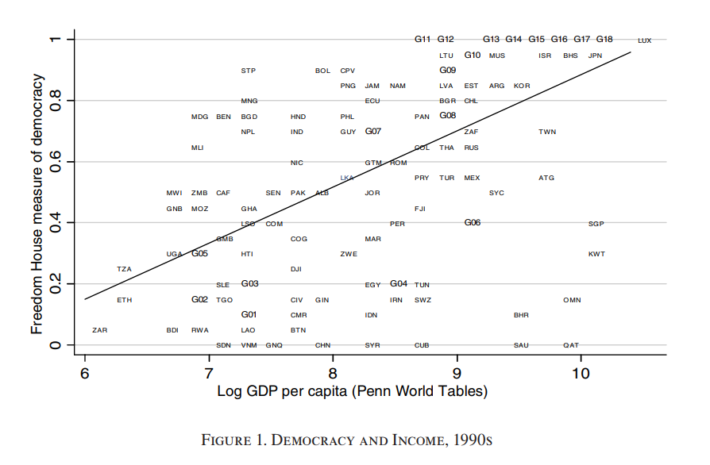

## Firearms and crime

Claim:

#### Higher rates of firearms ownership cause crime to be less likely

## Firearms and crime

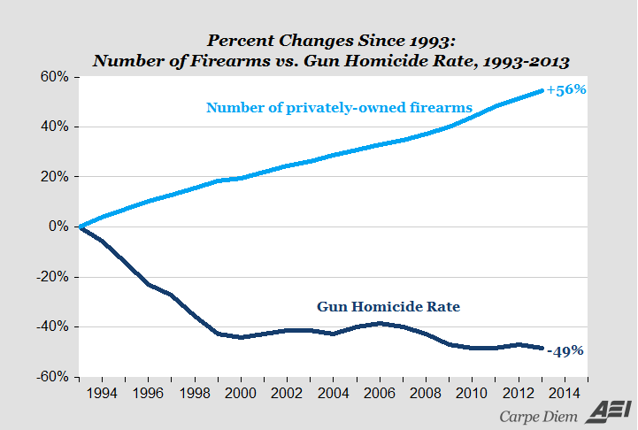

## Economic growth and Civil War

Claim: 

#### Lower rates of economic growth cause civil war to be more likely

## Economic growth and Civil War

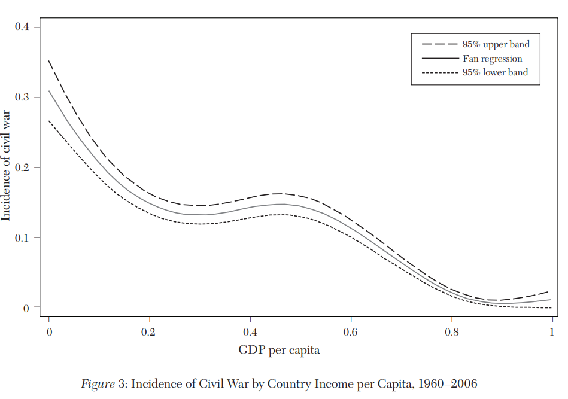

## Nick Cage and Drownings:

Claim:

#### Higher rates of Nick Cage films cause a higher rate of drowning deaths? 

## Nick Cage and Drownings:

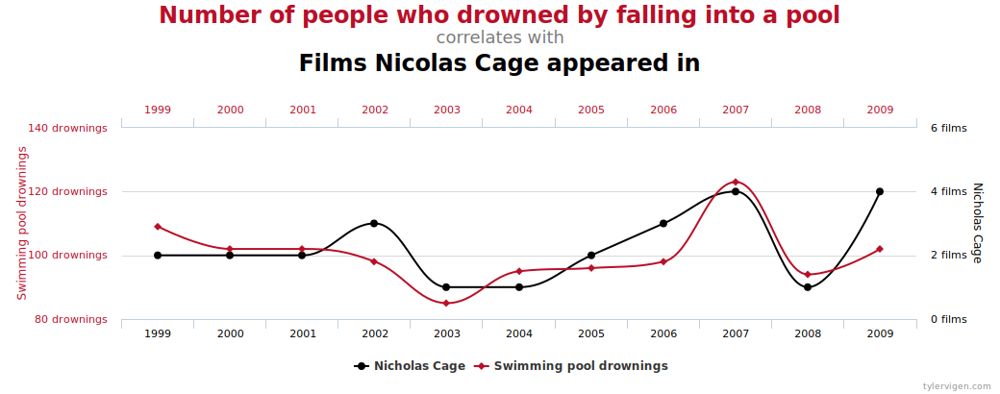

## Not enough

Maybe we've been lead astray.

## Counterfactual Causality

### Claim:

X causes Y.

### Implies:

If X does not happen then Y would not happen

## Our examples as counterfactuals:

1. If economy had grown less (more), countries would have been less (more) democratic
2. If there were more (fewer) guns, there would be less (more) crime.
3. If there were more (less) economic growth, civil would be less (more) likely
4. If Nick Cage were in fewer (more) films, fewer (more) people would die by drowning

## Thinking Counterfactually

### Claim

X causes Y

### Implies

If claim is true, then in **one case** with some level of X and some level of Y:

If that case had a **different** level of X, then the level of Y would have been **different**.

## How do we observe this?

1. We can't make the same country have less economic growth and see if it doesn't democratize
2. We can't make the US gun ownership rate not change in the past and see if crime stays high
3. We can't make the same country have more economic growth to see if it prevents civil war
4. We can't unmake (or unsee) Ghost Rider 2 to see if fewer people would have died in 2012

## Fundamental Problem of Causal Inference

We never can observe a case under the counterfactual condition: we can only observe a case under one (the factual) condition.

## Let's see this in action:

We want to test whether $X$ causes higher $Y$.

For sake of simplicity, imagine a situation with $5$ cases. 

Each observation is indexed by $i$.

$X_i:$ value of cause $X$ for case $i$. $1$ for cause is present, $0$ for cause is absent

$Y_i:$ The outcome (dependent variable) for $i$

## What we can see

| i | $Y_i$ | $X_i$ |
|---|---------|--------|
| 1 | 6 | 1 |
| 2 | 2 | 0 | 
| 3 | 8| 1 | 
| 4 | 4 | 0 |
| 5 | 6 | 1 |

## Evidence for the claim? {.build}

Take average of $Y$ for $X = 1$ and for $X = 0$ and take the difference:

(1) $$\frac{6 + 8 + 6}{3} - \frac{2 + 4}{2}$$

(2) $$ \frac{20}{3} - \frac{6}{2}$$

(3) $$ \frac{20}{3} - \frac{9}{3} = \frac{11}{3}$$

### Having $X$ seems to mean higher $Y$

## Let's not get too excited

Fundamental Problem of Causal Inference:

- We don't know what cases would have looked like if they had the **other** value of $X$.
- That is: we don't know what they would look like under the counterfactual.

## We can imagine though

Counterfactual causality means that every case has a value for the outcome that it **would take** under the factual and counterfactual conditions. We call these **potential outcomes**

## We can imagine though

We want to test whether $X$ causes higher $Y$.

For sake of simplicity, imagine a situation with $5$ cases. 

Each observation is indexed by $i$.

$X_i:$ value of cause $X$ for case $i$. $1$ for cause is present, $0$ for cause is absent

$Y_i^0:$ The outcome (dependent variable) for $i$ when $X_i = 0$

$Y_i^1:$ The outcome (dependent variable) for $i$ when $X_i = 1$

## If we saw the potential outcomes:

| i | $Y_i^0$ | $Y_i^1$ | $Y_i^1 - Y_i^0$ |
|---|---------|--------|-----------------|
| 1 | 6 | 6 | 0 |
| 2 | 2 | 2 | 0 |
| 3 | 8 | 8 | 0 |
| 4 | 4 | 4 | 0 |
| 5 | 6 | 6 | 0 |

## Did our test work?

### Our test: compare $Y$ for $X = 1$ and $X = 0$

We found that $Y$ was $\frac{11}{3}$ higher when $X = 1$

### Truth: $Y_i^1 - Y_i^0$ 

The truth is the average difference for each case between condtion with $X$ and condition without $X$

Truth is that there is **no difference**

## But can only see *factual* outcome

**fundamental problem of causal inference**:

| i | $Y_i^0$ | $Y_i^1$ | $Y_i^1 - Y_i^0$ |
|---|---------|--------|-----------------|
| 1 | ? | 6 | ? |
| 2 | 2 | ? | ? |
| 3 | ?| 8 | ? |
| 4 | 4 | ? | ? |
| 5 | ? | 6 | ? |

## What good is this?

- We can't trust comparing higher/lower levels of X and Y
- We can't observe cases in counterfactual condition

So, we still have fundamental problem of causal inference.

Can we learn **anything** about causality?

## Causal claims and Hypotheses {.build}

### We started with this:

1. Higher/lower levels of X (cause) appear with Higher/lower levels of Y (outcome).

### But we need something else:

2. Comparison between cases that are very similar (next best thing to seeing case under both cause, absence of cause)

### Why?

if causes deterministic: cases that have exact same set of causes acting on them behave exactly the same. 

## Mill's Method of Difference

Claim: $X$ is cause of $Y$

$A,B,C$ are other possible causes of $Y$.

|  | **Case 1** | **Case 2** |
|-------|------------|------------|
| **X** | 1 | 0 |
| **A** | **1** | **1** |
| **B** | **0** | **0** |
| **C** | **1** | **1** |
| **Y** | 1 | 0 |

## Mill's Method of Difference

|  | **Case 1** | **Case 2** |
|-------|------------|------------|
| **X** | **1** | **0** |
| **A** | 1 | 1 |
| **B** | 0 | 0 |
| **C** | 1 | 1 |
| **Y** | **1** | **0** |

## Mill's Method of Difference

### Problem!

|  | **Case 1** | **Case 2** |
|-------|------------|------------|
| **X** | **1** | **0** |
| **A** | 1 | 1 |
| **B** | 0 | 0 |
| **C** | 1 | 1 |
| **Y** | **1** | **1** |

## Mill's Method of Difference

### Problem!

|  | **Case 1** | **Case 2** |
|-------|------------|------------|
| **X** | **1** | **0** |
| **A** | 1 | 1 |
| **B** | **1** | **0** |
| **C** | 1 | 1 |
| **Y** | 1 | 0 |


## Comparative Method:

If causal claim that $X \rightarrow Y$, then:

We generate **empirical prediction**:

> If we observe **two cases** to be the same in all relevant respects except for value of $X$, then we should observe that the two cases differ in the value of $Y$

This **empirical prediction** based on a causal claim is called **comparative method** or **method of difference** (via John Stuart Mill)

## Difficulty:

What are the **relevant similarities**?  How many things need to be the same? How do we identify them?

## Difficulty:

1. Society is complex, humans and our institutions have lots of possible attributes, exposure to lots of different causes
2. We might not know all possible causes
3. Very difficult to actually measure all of these causes
4. Even if we did, might not find case that is exactly the same

## Worst Case Scenario:

### Claim:

$X \rightarrow Y$

but also the case that $\lbrace W_1, W_2, \ldots, W_\infty \rbrace \rightarrow Y$

### if true

1. We can't observe all $W_1, W_2, \ldots, W_\infty$
2. Unlikely to find cases that are the same on all $\mathbf{W}$

## What do we do? {.build}

We've been trying to find a factual case $j$ that can be a counterfactual for the factual case $i$: identical on all attributes except the cause $X$. 

### But, we've had a devil of a time doing it.

Why? No reason to assume any case is exactly like another. 

## What do we do? {.build}

Maybe we've been doing this wrong.

Instead of finding counterfactual for each case $i$...

### ... what if we looked for counterfactuals *on average*?

## Solving the FPCI

The fundamental problem of causal inference states we can't observe both $Y_i^1$ (outcome when exposed to cause) and and $Y_i^0$ (outcome when not exposed to cause) for a given $i$. 

But we can get around this if we look at many cases $i \in \lbrace 1 \ldots n \rbrace$ and take the average. 

## How?

We cannot know each individual causal effect: $\tau_i = Y_i^1 - Y_i^0$

But the **average causal effect** is the average of all individual causal effects:

$ACE = \frac{1}{n}\sum\limits_i^n{\tau_i}$

So it is also equal to this:

$ACE = \frac{1}{n}\sum\limits_i^n (Y_i^1 - Y_i^0)$

## How?

Which means it can be the difference between the averages of both potential outcomes:

$ACE = \Big( \frac{1}{n}\sum\limits_i^n Y_i^1 \Big) - \Big( \frac{1}{n}\sum\limits_i^n Y_i^0 \Big)$

## How?

But does this help us?

$ACE = \Big( \frac{1}{n}\sum\limits_i^n Y_i^1 \Big) - \Big( \frac{1}{n}\sum\limits_i^n Y_i^0 \Big)$

- $\frac{1}{n}\sum\limits_i^n Y_i^1$ is the average over all cases of the potential outcome when the cause is present.
- $\frac{1}{n}\sum\limits_i^n Y_i^0$ is the average over all cases of the potential outcome when the cause is absent.
- The FPIC means that for any case, we only observe $Y_i^1$ or $Y_i^0$, not both.

## How?

At best we can observe:

1. $\frac{1}{n}\sum\limits_i^n (Y_i^1 | X_i = 1)$: The average of $Y$ when $X$ is present for the cases where $X$ is actually present
2. $\frac{1}{n}\sum\limits_i^n (Y_i^0 | X_i = 0)$: The average of $Y$ when $X$ is absent for the cases where $X$ is actually absent

And we know from above that this can go wrong:

## 

| i | $Y_i^0$ | $Y_i^1$ | $Y_i^1 - Y_i^0$ |
|---|---------|--------|-----------------|
| 1 | ? | 6 | ? |
| 2 | 2 | ? | ? |
| 3 | ?| 8 | ? |
| 4 | 4 | ? | ? |
| 5 | ? | 6 | ? |

##

Take average for $X = 1$ and for $X = 0$ and take the difference:

(1) $$ \frac{6 + 8 + 6}{3} - \frac{2 + 4}{2}$$

(2) $$ \frac{20}{3} - \frac{6}{2}$$

(3) $$ \frac{20}{3} - \frac{9}{3} = \frac{11}{3}$$

## 

True effect is $0$ !

| i | $Y_i^0$ | $Y_i^1$ | $Y_i^1 - Y_i^0$ |
|---|---------|--------|-----------------|
| 1 | 6 | 6 | 0 |
| 2 | 2 | 2 | 0 |
| 3 | 8 | 8 | 0 |
| 4 | 4 | 4 | 0 |
| 5 | 6 | 6 | 0 |

## What do we need?

1. If the average outcome for cases with cause $X$ were similar to what the average outcome **would be** in the presence of $X$ for cases **without** $X$.
2. If the average outcome for cases without $X$ were similar to what the average outcome **would be** in the absence of $X$ for cases **with** $X$ 

Then: 

- $\frac{1}{n}\sum\limits_i^n (Y_i^1|X_i = 1) = \frac{1}{n}\sum\limits_i^n (Y_i^1)$
- $\frac{1}{n}\sum\limits_i^n (Y_i^0|X_i = 0) = \frac{1}{n}\sum\limits_i^n (Y_i^0)$

## What do we need?

### That'd be great! 

But we don't **know** the counterfactual outcomes, so how can we ensure they are similar?

## How?

Wait... 

### Didn't we just see a problem like this?

- We had a **population** we want to describe, but it was too large to observe every case
- We wanted a **sample** that looked like the population

### Random Sampling

A procedure that let us get a sample such that:

- Mean of sample is unbiased estimate of mean of population

## What do we need? {.build}

### If we *randomly* sampled

Some cases to get $X$ and some cases to not get $X$

#### Then...

1. The average $Y^1$ for cases with $X$ would be a sample of the average counterfactual $Y^1$ for cases without $X$
2. The average $Y^0$ for cases without $X$ would be a sample of the average counterfactual $Y^0$ for cases with $X$.

#### AND

$ACE = \frac{1}{n}\sum\limits_i^n (Y_i^1 | X_i = 1) - \frac{1}{n}\sum\limits_i^n (Y_i^0 | X_i = 0)$

All of which **is observable** because it is **factual**

## What is this miraculous procedure? {.build}

If you haven't guessed it:

This is the precise logic of a **randomized experiment**.

### It works because:

All cases have equal chance of being exposed to cause.

## Recap:

### Testing causal theories

We need to generate **emprirical predictions** or **hypotheses** about what we will observe if the causal theory is correct

## Recap:

### Testing causal theories

Causality implies a counterfactual.

Empirical Predictions for causal theories are that:

1. When we change the level of the independent variable (cause) for a specific case
2. The change in the level of the independent variable results in change in dependent variable (outcome)


## Recap:

### Testing causal theories

But we can't change the level of the independent variable for a case:

**Fundamental Problem of Causal Inference**: key part empirical prediction about causal theory is **never observable**

## Recap: {.build}

### Testing causal theories

**Fundamental Problem of Causal Inference** is solvable when 

1. we look at groups of cases in aggregate
2. we randomly sample cases to get exposed to the cause/not

### An experiment

## How do experiments work?

### Randomly assigning exposure to cause

"Treatment" and "Control" group have same potential outcomes

**because** they are two random samples from the same population

- Treatment group factual outcomes are same as counterfactual outcomes for Control
- Control group factual outcomes are same as counterfactual outcomes for Treatment


## How do experiments work?

Best way to understand is to do it!

# Take out writing tools

## Let's work through it

We have this table of potential outcomes:

| i | $Y_i^0$ | $Y_i^1$ | $Y_i^1 - Y_i^0$ |
|---|---------|--------|-----------------|
| 1 | 5 | 9 | 4 |
| 2 | 4 | 8 | 4 |
| 3 | 3 | 7 | 4 |
| 4 | 2 | 6 | 4 |

## Let's work through it

Could be: effect of campaign ad on campaign contributions:


| i | (\$) without ad | (\$) with ad | (\$) with - (\$) without |
|---|---------|--------|-----------------|
| 1 | 5 | 9 | 4 |
| 2 | 4 | 8 | 4 |
| 3 | 3 | 7 | 4 |
| 4 | 2 | 6 | 4 |


## Let's work through it

What the true average causal effect?

| i | $Y_i^0$ | $Y_i^1$ | $Y_i^1 - Y_i^0$ |
|---|---------|--------|-----------------|
| 1 | 5 | 9 | 4 |
| 2 | 4 | 8 | 4 |
| 3 | 3 | 7 | 4 |
| 4 | 2 | 6 | 4 |


## Let's work through it


$$\frac{4 + 4 + 4 + 4}{4} = 4$$


## Let's work through it

Let's run a randomized experiment:

- We will put 2 people in treatment (see the campaign ad)
- We will put 2 people in control (don't see the ad)

When we do this at random:

- we are choosing one possible partition of the sample 
- there are several possible partitions into Treatment/Control
- each possible partition is equally likely

## Let's work through it

Write down all possible treatment groups of size $2$ (e.g. (1,2)) 

| i | $Y_i^0$ | $Y_i^1$ | $Y_i^1 - Y_i^0$ |
|---|---------|--------|-----------------|
| 1 | 5 | 9 | 4 |
| 2 | 4 | 8 | 4 |
| 3 | 3 | 7 | 4 |
| 4 | 2 | 6 | 4 |

## Let's work through it

All possible treatment groups

```{r, echo = F}
assign = t(combn(1:4, 2))

kable(as.data.frame(assign))

```

## Let's work through it

Calculate the average $Y^1$ (\$ with ad) for every possible treatment (ad) group

| i | $Y_i^0$ | $Y_i^1$ | $Y_i^1 - Y_i^0$ |
|---|---------|--------|-----------------|
| 1 | 5 | **9** | 4 |
| 2 | 4 | **8** | 4 |
| 3 | 3 | **7** | 4 |
| 4 | 2 | **6** | 4 |

## Let's work through it

Calculate the average $Y^0$ (\$ with ad) for every corresponding control (no ad) group

| i | $Y_i^0$ | $Y_i^1$ | $Y_i^1 - Y_i^0$ |
|---|---------|--------|-----------------|
| 1 | **5** | 9 | 4 |
| 2 | **4** | 8 | 4 |
| 3 | **3** | 7 | 4 |
| 4 | **2** | 6 | 4 |

## Let's work through it


```{r, echo = F}

po_table = data.frame(i = 1:4, y0 = 5:2, y1 = 9:6)
assign = t(combn(1:4, 2))

effects = data.frame(T_Group = paste(assign[,1], assign[,2], sep = ","),
           Y_1 = apply(assign, 1, function(x) mean(po_table$y1[x]) ),
           Y_0 = apply(assign, 1, function(x) mean(po_table$y0[-x]) )
           )

kable(effects)
```

## Let's work through it

Calculate the average causal effect for every possible experiment ((\$) ad - (\$) no ad) or $Y^1 - Y^0$

```{r, echo = F}
kable(effects)
```

## Let's work through it

```{r, echo = F}
effects$ACE = effects$Y_1 - effects$Y_0

kable(effects)
```

## Let's work through it

What is the average effect across all possible experiments?

```{r, echo = F}

kable(effects)
```

## Let's work through it


$$\frac{6 + 5 + 4 + 4 + 3 + 2}{6} = 4$$

## Let's work through it

```{r, echo =F}

hist(effects$ACE, xlab = "Estimated Causal Effects", main = "Outcomes of All Possible Experiments",
     breaks = seq(1.5, 6.5,1))
abline(v = 4, lwd = 4)

```

## Let's work through it

Why does this work?

If you wanted: 

- you can compare $Y^1$ for the treatment groups and $Y^1$ for the control to see if they are the same
- you can compare $Y^0$ for the control groups and $Y^0$ for the treatment to see if they are the same

## Let's work through it

```{r, echo =F, include = F}
effects$Y_1_0 = apply(assign, 1, function(x) mean(po_table$y1[-x]) )
effects$Y_0_1 = apply(assign, 1, function(x) mean(po_table$y0[x]))
```

Average of $Y^1$ for treated groups (factual outcome): `r mean(effects$Y_1)`

Average of $Y^1$ for control groups (counterfactual outcome): `r mean(effects$Y_1_0)`

#### 

Average of $Y^0$ for control groups (factual outcome): `r mean(effects$Y_0)`

Average of $Y^0$ for treated groups (counterfactual outcome): `r mean(effects$Y_0_1)`


## Randomized Experiments: {.build}

Using random assignment to treatment and control:

- Lets us have two samples that are, on average, counterfactuals for each other
- Lets us address FPCI at aggregate, not individual level

## Randomized Experiments: {.build}

### What happens when we fail to randomize?

1 and 2 always get treated, 3 and 4 never do.

| i | $Y_i^0$ | $Y_i^1$ | $Y_i^1 - Y_i^0$ | $X_i$
|---|---------|--------|-----------------|--|
| 1 | 5 | 9 | 4 |1|
| 2 | 4 | 8 | 4 |1|
| 3 | 3 | 7 | 4 |0|
| 4 | 2 | 6 | 4 |0|

## Randomized Experiments: {.build}

### What happens when we fail to randomize?

$$\frac{9+8}{2} - \frac{3+2}{2} = \frac{12}{2} \neq 4$$

## Randomized Experiments: {.build}

We can imagine cases with different potential outcomes have different attributes:

| i | $Y_i^0$ | $Y_i^1$ | $Y_i^1 - Y_i^0$ | $X_i$ | $W_i$ |
|---|---------|--------|-----------------|--|--|
| 1 | 5 | 9 | 4 |1|**1**|
| 2 | 4 | 8 | 4 |1|**1**|
| 3 | 3 | 7 | 4 |0|**0**|
| 4 | 2 | 6 | 4 |0|**0**|

## Randomized Experiments: {.build}

Presence of $W$ is fine if: $W$ unrelated to cause $X$

| i | $Y_i^0$ | $Y_i^1$ | $Y_i^1 - Y_i^0$ | $X_i$ | $W_i$ |
|---|---------|--------|-----------------|--|--|
| 1 | 3 | 7 | 4 |1|**1**|
| 2 | 2 | 6 | 4 |1|**0**|
| 3 | 3 | 7 | 4 |0|**1**|
| 4 | 2 | 6 | 4 |0|**0**|

## Randomized Experiments: {.build}

Presence of $W$ is fine if: $W$ unrelated to outcome $Y$

| i | $Y_i^0$ | $Y_i^1$ | $Y_i^1 - Y_i^0$ | $X_i$ | $W_i$ |
|---|---------|--------|-----------------|--|--|
| 1 | 3 | 7 | 4 |1|**1**|
| 2 | 2 | 6 | 4 |1|**1**|
| 3 | 3 | 7 | 4 |0|**0**|
| 4 | 2 | 6 | 4 |0|**0**|

## Randomized Experiments: {.build}

Randomization ensures that, on average, no relationship between $X$ and $W$.

### But things can go wrong

## Problems with Experiments:

### Internal Validity

A study has **internal validity** when the causal effect of $X$ on $Y$ it finds is not biased (systematically incorrect).

### Threats to internal validity

1. **Selection Bias**
2. **Non-excludability**
3. **Systematic Measurement Error**

## Threats to Internal Validity

### Selection Bias:

**selection bias**: When cases that receive a "treatment" or "cause" have different potential outcomes from those that do not.

## Threats to Internal Validity

### Selection Bias:

Consider this experiment:

- We want to evaluate the effect of emergency housing assistance on homelessness prevention.
- We give assistance to the first 100 people to show up and compare them to the second 100 people.

### Problem?

- People with greater need OR better resources/capabilities show up first
- Different needs or different resources probably related to propensity to become homeless
- Exposure to treatment related to other factors that might affect outcome!

## Threats to Internal Validity

### Non-excludability

**non-excludability** occurs when the treatment in an experiment bundles multiple different treatments

## Threats to Internal Validity

### Non-excludability

Does an apple a day keep the doctor away?

- Some people assigned to eat apples, some are not.
- To ensure people eat apples, we remind them every day to eat apples and give them a financial incentive to eat it.

### Problem?

- Are the effects we see due to apples? To being reminded every day? To being paid?
- Lots of differences between treatment and control. 

## Threats to Internal Validity

### Systematic Measurement Error

**systematic measurement error**: error produced when our measurement procedure obtains scores that are, on average, too high or too low.


## Threats to Internal Validity

### Systematic Measurement Error

We randomly assign some people to be shamed into voting (we remind them of their past voting record)

We measure whether people exposed to this treatment have higher **self-reported** voting rates

### Problem?

- If we see a difference between treatment and control, is it due to actual differences in voting?
- Or is it due to people who are shamed self-reporting differently?
- Treatment affects results of measurement procedures $\rightarrow$ measurement bias
- **Only** a problem **when** measurement bias is **related to treatment**

## Experiments:

### Randomization of cause

- Allows us to actually observe a counter-factual
- Directly tests causal theory
    - Allows us to see whether the change in $Y$ due to $X$ is in the right direction
    - Allows us to see whether $Y$ changes due to $X$ relative to the counterfactual.
    
### Problems are solvable

- Selection bias, non-excludability, measurement bias all solvable
- Better design of experiment

## Experiments: {.build}

One conclusion: only do experiments.

### But that could be a problem...

## Problems with Experiments:

### External Validity

**external validity** is the degree to which the causal relationship we find in a study matches the causal relationship and the context identified in a causal theory

- Study has **external validity** if the relationship found can generalize to all the cases to which our causal theory applies
    - If our study suffers from **sampling bias**, then our study may lack external validity
- Study has **external validity** if the cause in the study is the same as the cause in our causal theory
    - If our independent variable/cause in the study lacks **validity** then our study may lack external validity


## External Validity:

Broockman and Kalla (2015): Does perspective taking change minds about minority groups?

Sample

- Invite tens of thousands of people to join a survey
- Of the ~1500 that respond, randomly assign in two groups

Treatment

- One group gets canvasser for transgender rights
- Other gets canvasser for recycling

Outcome

- Survey responses on attitudes about transgender people, their rights

## Problems with Experiments: {.build}

### External Validity:

Broockman and Kalla (2015)

Sample

- **Invite tens of thousands** of people to join a survey
- **Of the ~1500 that respond**, randomly assign in two groups

### Problem:

- Will the effect of talking with canvasser hold for vast majority who won't join a survey?
- Sample in the experiment not the same as the population implied by the causal theory.

## Problems with Experiments:

### External Validity:

Does exposure to partisan media change people's political attitudes and make them more extreme? (E.g. Fox News, Breitbart)

Sample: Randomly chosen group of US adults

Treatment:

- Randomly exposed to 2 hours of partisan news or non-partisan movie

Outcome:

- Survey questions about political leaning, attitudes about key political issues

## Problems with Experiments:

### External Validity:

Treatment:

- Randomly **exposed to 2 hours** of partisan news or non-partisan movie

### Problem:

- Is this short treatment the same as years of exposure on cable TV or internet news consumption?
- If we find no effect of 2 hours of watching, does this mean that emergence of partisan news didn't cause change in Americans' political attitudes?
- Cause we can manipulate in experiment not the same as cause in causal theory

## Problems with Experiments:

### Always a Trade-off:

More **internal validity** (unbiased calculation of causal effect) comes at the cost in **external validity** (relevance of study sample or cause to the causal theory)

### Why?

Many relevant contexts for causal theories and interesting causes cannot or should not be manipulated at random:

- What causes democratization?
- What causes war or ethnic violence?
- What causes economic growth?
- Why were civil rights extended to oppressed minority groups?

## Experiments, visually:

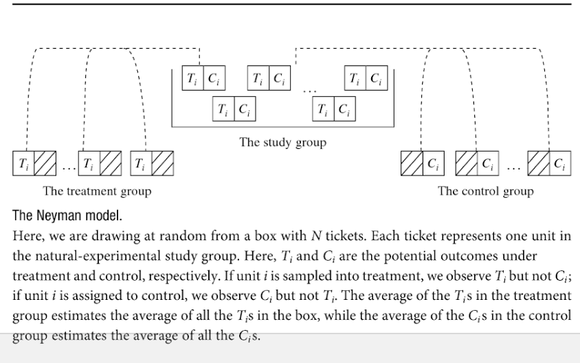
    
## Problems with Experiments:

### We can't use experiments to text many causal theories

### What approaches can we use instead?

1. Comparative Method
2. Correlation

### Aren't they flawed?

Yes, but now that we know how and why experiments work, we can make these better.

## Comparative Method:

If causal claim that $X \rightarrow Y$, then:

We generate **empirical prediction**:

> If we observe **two cases** to be the same in all relevant respects except for value of $X$, then we should observe that the two cases differ in the value of $Y$

This **empirical prediction** based on a causal claim is called **comparative method** or **method of difference** (via John Stuart Mill)


## What do we know now?

1. We don't need cases to be **identical** on **all** attributes
2. They need to be the **identical** on attributes related to both **cause** ($X$) and **outcome** ($Y$)
    - In short: identical on factors that affect $Y$ and are related to or affect $X$

<!-- ## Examples: -->

## Example:

### Question:

What causes states to create laws designed to exclude and dominate people based on race?

### Causal claim:

Attempts to resolve conflicts within the dominant (more powerful) racial group in a society lead to the creation of a legal regime that excludes other groups.

## Example

### What are *other* possible causes that could be related?

1. Some dominant groups more prone to in-fighting and exclusion?
    - Maybe colonizing groups. diverse backgrounds $\rightarrow$ in-fighting
    - Colonizers $\rightarrow$ more likely to use legal exclusion
2. Some relationships between dominant and oppressed groups more prone to in-fighting and exclusion?
    - Slavery $\rightarrow$ conflicting interests within dominant group (owners, non-owners)
    - Slavery $\rightarrow$ provides a framework to continue legal discrimination in the future

## Example

### What are *other* possible causes that could be related?

3. Legal exclusion more popular at some times rather than others:
    - Racial exclusion easily justified in some eras
    - Exclusion not seen as acceptable today, so other methods used
    
## Example

|  | **In-fighting** (cause, X) | **Exclusion** (effect, Y) |
|-------|------------|------------|
| **Dominant group** | Settler Colonials from<br>diverse so more<br>divided | Settler Colonials<br>more likely to legally<br>exclude the colonized  |
| **Form of Domination** | Slavery creates conflict<br>b/t owners and non-owners | Slavery is legal category<br>basis for legal exclusion |
| **Timing** | Newly created states<br>may have infighting<br>bc rules are new | Racial exclusion<br>more "acceptable"" in<br>19th and 20th c. |

## Example

### Comparison

|  | **United States** | **Brazil** |
|-------|------------|------------|
| **White In-fighting** | **YES** | **NO** |
| **Dominant group** | White Europeans | White Europeans |
| **Settler Colonialism** | Yes | Yes |
| **Form of Domination** | Slavery | Slavery |
| **Era** | 1860s-1960s | 1880s-1960s |
| **Legal Discrimination** | **YES** | **NO** |

## Example {.build}

### Question:

What causes the spread of **cholera**?

### Causal claim:

Contaminated water causes cholera outbreaks

### Obvious?

To us, but not in mid-19th century England

## Example

### Background

19th Century London saw repeated outbreaks of cholera, with mass death

- Dominant view was that "miasmas" or bad air caused diseases like cholera

### A novel idea...

No theory of germs, but

- John Snow, MD didn't buy into "miasmas"
- Published an essay *On the Mode of Communication of Cholera* in 1849
- Suggested that polluted water was means of communication


## ... but poorly received

<iframe width=100% src="https://www.youtube.com/embed/d44LyYL3GkY?autoplay=0" frameborder="0" allowfullscreen></iframe>

## 

<iframe width=100% src="https://www.youtube.com/embed/JKQrJk9iKOg?start=49&end=58&autoplay=0" frameborder="0" allowfullscreen></iframe>

## 


## What to compare?

If the **cause** or $X$ is exposure to contaminated water, are there other factors **related** to water supply and also could cause cholera?

1. Two Locations:
    - Water supply is determined by where you are. One might have contamination, the other not.
    - But "miasma" is a gas and also in a place. Could be related to water supply.
    - Miasmas might cause cholera
2. Tome times:
    - Water supply contamination might occur at one specific time, not the other.
    - But miasmas might come and go and be related to water quality change
    - Miasmas might cause cholera

## What comparison?

Comparing water quality and cholera in:

- two **different** areas
- or in the same area at **different** times 

would not rule out **miasma** as explanation for cholera.

- Miasma might be related to water quality across places
- Miasma might be related to water quality across time
- Miasma could cause cholera

## Broad Street Pump Outbreak (1854)

In August 1854: Soho area of London hit by cholera

- 500+ deaths in the immediate area of Cambrdige Street and Broad Street
- Snow suspects it is related to Broad Street Pump

## Broad Street Pump Outbreak (1854)


## Broad Street Pump Outbreak (1854)

Near the outbreak

|  | **Brewers** | **Broad St. Residents** |
|-------|------------|------------|
| **Water Source** | **Brewery Well**/<br>**Beer** | **Pump** |
| **Location** | Near pump | Near pump |
| **Miasmas?** | Yes? | Yes? |
| **Timing** |  Aug. 1854 |  Aug. 1854 |
| **Cholera** | **No** | **Yes** |


## Broad Street Pump Outbreak (1854)

Far from outbreak 

|  | **Lady and Niece** | **Non-Soho Residents** |
|-------|------------|------------|
| **Water Source** | **Broad Street Pump** | **Another Pump** |
| **Location** | Far from Broad St. | Far from Broad St. |
| **Miasmas?** | No | No |
| **Timing** |  Aug. 1854 |  Aug. 1854 |
| **Cholera** | **Yes** | **No** |

## Conjunctural Causation:

### Recall:

**conjunctural causation**: when effect depends on combination of causes

**multiple necessary conditions**: effect occurs when only in presence of more than one cause

- Plant growth requires water **and** sunlight
- Cholera transmission requires both the bacteria **and** water

### Comparative method

- Can help us see when there are multiple **necessary conditions**

## Broad Street Pump Outbreak (1854)

|  | **Brewers** | **Broad St. Residents** |
|-------|------------|------------|
| **Cholera Bacteria** | **Yes** | **Yes** |
| **In Water Source** | **No** | **Yes** |
| **Location** | Near pump | Near pump |
| **Miasmas?** | Yes? | Yes? |
| **Timing** | Aug. 1854 | Aug. 1854 |
| **Cholera** | **No** | **Yes** |

## Correlation

### Can be **clue** to causality

### Empirical Prediction

If $X \rightarrow Y$ or $X$ causes $Y$, then $X$ and $Y$ will be correlated

### Why?

If $X$ causes $Y$, a shift in $X$ implies a change in the value of $Y$

- So values of $X$ and $Y$ should move together in the direction stated by the causal theory


## Correlation

### What is it?

**correlation**: an association or relationship between the values taken by two variables (X and Y)

### Contrast to comparative method

**correlation**:

- look for patterns across **many** cases, rather than two or a few
- look at correlation **across units** at the same time
- look at correlation **across time** in the same units


## Correlation

### What is it?

**correlation**: also has specific **mathematical** definition (you don't need to memorize):

$$r = \frac{\sum_{i}^n (x_i - \bar{x})(y_i - \bar{y})}{\sqrt{\sum_i^n(x_i - \bar{x})^2}\sqrt{\sum_i^n (y_i - \bar{y})^2}}$$

## Correlation

### What is it?

**mathematically**: correlation is the degree of **linear** association between $X$ and $Y$

- Takes values between $-1$ and $1$
- Values close to $1$ or $-1$ suggest **high** degree of *linear* association
- Values close to $0$ suggest **low** degree of *linear* association
- Value of correlation does **not** tell us **how much** $Y$ changes with $X$


## Correlation

### What is it?

**negative correlation**: (correlation $< 0$) values of $X$ and $Y$ move in opposite direction:

- higher values of $X$ appear with lower values of $Y$
- lower values of $X$ appear with higher values of $Y$

**positive correlation**: (correlation $> 0$) values of $X$ and $Y$ move in same direction:

- higher values of $X$ appear with higher values of $Y$
- lower values of $X$ appear with lower values of $Y$

## Correlation


## Correlation

```{r, echo = F}

x = rnorm(100)
y = 1.5*x + rnorm(100)

plot(x, y, main = 'Positive Correlation')

```

## Correlation

```{r, echo = F}

x = rnorm(100)
y = -1.5*x + rnorm(100)

plot(x, y, main = 'Negative Correlation')

```

## Correlation

- It is possible to see **perfect correlation** but small change in $Y$ across $X$

- It is possible to see **low correlation** but large change in $Y$ across $X$

- It is possible to see **perfect nonlinear relationship** between $X$ and $Y$ with $0$ correlation


## Correlation:

**weak correlation**: values for $X$ and $Y$ do not cluster along line

**strong correlation**: values for $X$ and $Y$ cluster strongly along a line

**strength of correlation** unrelated to the **slope** of line describing $X,Y$ relationship

## Correlation

```{r, echo = F}

x = rnorm(100)
y = 1.5*x + rnorm(100, sd = 5)
lims = range(y)
plot(x, y, main = 'Weak Positive Correlation', ylim = lims)

```

## Correlation

```{r, echo = F}

x = rnorm(100)
y = 0.5*x + rnorm(100, sd = 0.1)

plot(x, y, main = 'Strong Positive Correlation', ylim = lims)

```


## Correlation as test

### Causal Theory

Higher gun ownership rates cause higher rates of firearm homicide


### Expected correlation:

If theory is correct: we expect **positive correlation** between gun ownership rate and firearms homicides

## Correlation Test: across units

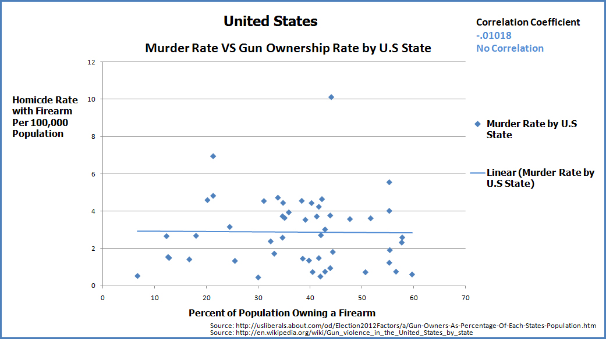


## From Theory to Evidence

1. Identify Phenomenon we want to explain
    - Why does it happen?
2. Develop **causal theory**
    - What is the **cause** and its effect?
    - What is the causal logic?
3. How would we know theory is right?
    - Formulate **hypothesis** about what we observe if theory is right
4. If $X \rightarrow Y$, variables should move together
    - Cause $X$ and outcome $Y$ are correlated


## From Theory to Evidence

(5) Test: 

    - measure $X$ and $Y$. Are they correlated?
    - If yes: evidence for theory
    - If no: evidence against theory
    
## From Theory to Evidence

### Identify a Phenomenon:

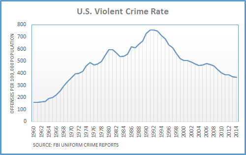

## From Theory to Evidence

### Identify a Phenomenon:

Why did US violent crime rates spike and then decline from the 1970s-1990s?

## From Theory to Evidence

### Develop a Causal Theory

Widespread use of and then ban on leaded gasoline caused increase and decline in crime

Leaded gasoline $\rightarrow$ Particulate lead in the air 

$\rightarrow$  children exposed to lead  $\rightarrow$ lead poisoning 

$\rightarrow$  education, aggression, inhibition problems 

$\rightarrow$ criminal behavior

## From Theory to Evidence

### Empirical Prediction

If theory is true: positive correlation between childhood lead exposure and adult criminality

If theory is true: birth cohorts with more lead exposure have higher criminality rates in adulthood

A **positive correlation** betwen lead exposure and crime rates

## From Theory to Evidence

### Correlation Test: across time (New Orleans)

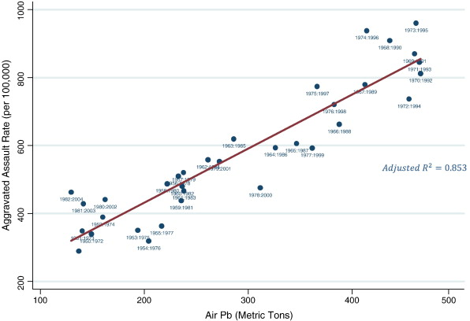

## From Theory to Evidence {.build}

### Does test support causal claim?

>- In this case, yes.
>- Doesn't **prove** causality, but is support for it

## Correlation

How do we know a correlation is valid?

### Two problems:

Variants of what we've seen before

- Random association
- Bias

## Correlation: Random association

How do we know a correlation is **systematic**?

- How do we know that it is not simply a pattern by random chance?
- Apparent patterns can be produced by pure randomness

## Correlation: Random association

<iframe width=100% src="https://www.youtube.com/embed/no_elVGGgW8?autoplay=0" frameborder="0" allowfullscreen></iframe>

## Correlation: Random association


## Correlation: Random association

If you look at enough possible sets of variables, you might find a strong correlation

- But it could have happened by chance!
- So a correlation might not be "real"

## Correlation: Random association

```{r, echo = F}
crime = fread('./crime.csv')
crime[, gun_ownership := as.numeric(gsub('%', '', gun_ownership))]

c = cor.test(crime$gun_ownership, crime$gun_murder_percapita)

plot(crime$gun_ownership, crime$gun_murder_percapita, xlab = "Gun Owners (%)", ylab = "Firearms Homicides Per Capita",
     main = 'Gun ownership and Gun Homicide')
abline(lm(gun_murder_percapita ~ gun_ownership, data=crime))
```


## Correlation: Random association

### How would we know...

... if the correlation we see is a random pattern or not?

## Random association: Statistics

Field of statistics investigates properties of **chance** events (stochastic processes):

- Probability theory tells us how likely events are to happen, given chance
- Can tell us how likely correlation of some value is to happen by chance


## Random association: Statistics

### How?

1. Compute correlation of $X$ and $Y$
2. How many **cases** do we have?
    - Patterns with many cases less likely to be random
    - Law of large numbers
3. Assign a probability that the correlation we see would have happened by chance


## Random association: Statistics

```{r, echo = F}
c= 0
counter = 0
while (c < 0.9) {
  x = rnorm(5)
  y = rnorm(5)
  c = cor(x,y)
  counter = counter + 1
}

plot(x,y, main = "5 observations, x and y unrelated")
text(mean(x) - sd(x),mean(y), labels = paste0("Correlation: ", round(c, 2)),pos =4 )

```

## Random association: Statistics

```{r, echo = F}
plot(x,y, main = "5 observations, x and y unrelated")
text(mean(x) - sd(x),mean(y), labels = paste0("Correlation: ", round(c, 2)), pos =4 )
text(mean(x) + sd(x),mean(y), labels = paste0("Tries: ", counter))
```


## Random association: Statistics

```{r, echo = F}
c= 0
counter = 0
while (c < 0.9) {
  x = rnorm(10)
  y = rnorm(10)
  c = cor(x,y)
  counter = counter + 1
}

plot(x,y, main = "10 observations, x and y unrelated")
text(mean(x) - sd(x),mean(y), labels = paste0("Correlation: ", round(c, 2)), pos =4)

```

## Random association: Statistics

```{r, echo = F}
plot(x,y, main = "10 observations, x and y unrelated")
text(mean(x) - sd(x),mean(y), labels = paste0("Correlation: ", round(c, 2)), pos =4)
text(mean(x) + sd(x),mean(y), labels = paste0("Tries: ", counter))
```

## Random association: Statistics

```{r, echo = F}
c= 0
counter = 0
while (c < 0.9) {
  x = rnorm(15)
  y = rnorm(15)
  c = cor(x,y)
  counter = counter + 1
}

plot(x,y, main = "15 observations, x and y unrelated")
text(mean(x) - sd(x),mean(y), labels = paste0("Correlation: ", round(c, 2)), pos =4)

```

## Random association: Statistics

```{r, echo = F}
plot(x,y, main = "15 observations, x and y unrelated")
text(mean(x) - sd(x),mean(y), labels = paste0("Correlation: ", round(c, 2)), pos =4)
text(mean(x) + sd(x),mean(y), labels = paste0("Tries: ", counter))
```

## Random association: Statistics

### More cases there are...

### ... and stronger the correlation is ...

### ... less likely pattern is by chance.

## Random association: Statistics

### Same $N$, Stronger correlation

```{r, echo = F}
par(mfrow = c(1,2))
a1 = mvrnorm(10, mu = c(0,0), Sigma = matrix(c(1,0.5,0.5,1), byrow = T, ncol = 2))
a2 = mvrnorm(10, mu = c(0,0), Sigma = matrix(c(1,0.9,0.9,1), byrow = T, ncol = 2))

plot(a1[,1], a1[,2], main = "Weak => Possibly random", xlab = 'x', ylab = 'y', xlim = range(rbind(a1,a2)), ylim = range(rbind(a1,a2)))
abline(lm(a1[,2] ~ a1[,1]))
plot(a2[,1], a2[,2], main = "Strong => Less likely to be random", xlab = 'x', ylab = 'y',
     xlim = range(rbind(a1,a2)), ylim = range(rbind(a1,a2)))
abline(lm(a2[,2] ~ a2[,1]))

```


## Random association: Statistics

### Same Correlation, More cases

```{r, echo = F}
par(mfrow = c(1,2))
b1 = mvrnorm(50, mu = c(0,0), Sigma = matrix(c(1,0.5,0.5,1), byrow = T, ncol = 2))
b2 = mvrnorm(500, mu = c(0,0), Sigma = matrix(c(1,0.5,0.5,1), byrow = T, ncol = 2))

plot(b1[,1], b1[,2], main = "Few => Possibly random", xlab = 'x', ylab = 'y',
     xlim = range(rbind(b1,b2)), ylim = range(rbind(b1,b2)))
abline(lm(b1[,2] ~ b1[,1]))
plot(b2[,1], b2[,2], main = "Many => Less likely to be random", xlab = 'x', ylab = 'y',
     xlim = range(rbind(b1,b2)), ylim = range(rbind(b1,b2)))
abline(lm(b2[,2] ~ b2[,1]))
par(mfrow = c(1,1))

```

## Random association: Statistics

**statistical significance**: 

> An indication of **how likely** correlation we observe could have happened purely by chance.

> **higher** degree of statistical significance indicates correlation is **less** likely to have happened by chance

## Random association: Statistics

$p$**value**:

> A numerical measure of **statistical significance**. Puts a number on how likely observed correlation would have occurred by chance, **assuming** the truth is $0$ correlation.

> It is a probability, so is between $0$ and $1$.

> **Lower** $p$-value indicates **greater** statistical significance

$p < 0.05$ often used as threshold for "significant" result. 

- but it is not a magic number
- Can observe $p < 0.05$ by chance ($\frac{1}{20}$)

## Random association: Statistics

$p$**value**:

Be wary of $p$-hacking:

- $p$ values become meaningless if we look at many associations, then only report the ones that are "significant".

### Why?

- We will see some low p-values by chance when we look at lots of associations

## Significant?


## Random association?

```{r, echo = F}
crime = fread('./crime.csv')
crime[, gun_ownership := as.numeric(gsub('%', '', gun_ownership))]

c = cor.test(crime$gun_ownership, crime$gun_murder_percapita)

plot(crime$gun_ownership, crime$gun_murder_percapita, xlab = "Gun Owners (%)", ylab = "Firearms Homicides Per Capita",
     main = 'Gun ownership and Gun Homicide')
abline(lm(gun_murder_percapita ~ gun_ownership, data=crime))
```


## Random association?

```{r, echo = F}
plot(crime$gun_ownership, crime$gun_murder_percapita, xlab = "Gun Owners (%)", ylab = "Firearms Homicides Per Capita",
     main = 'Gun ownership and Gun Homicide')
abline(lm(gun_murder_percapita ~ gun_ownership, data=crime))
text(10,10, paste0("Correlation: ", round(c$estimate, 2)), pos = 4)
text(10,7.5, paste0("p-value: ", round(c$p.value, 2)), pos = 4)

```

## Random association?

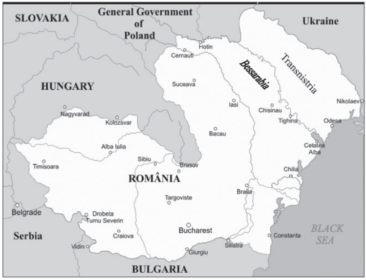

## Random association?

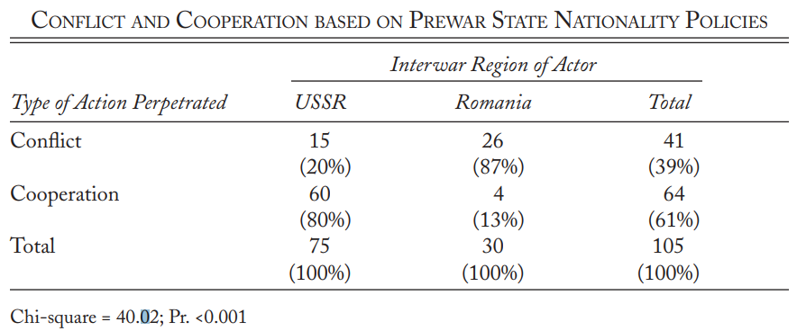

## Random association?

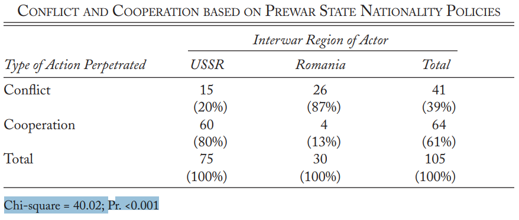

## Bigger Problems

### Problems with Correlation

1. Random association
    - Solution: Statistical significance
2. BIAS
    - or "confounding"
    - Not so easy!
    
    
## 


##

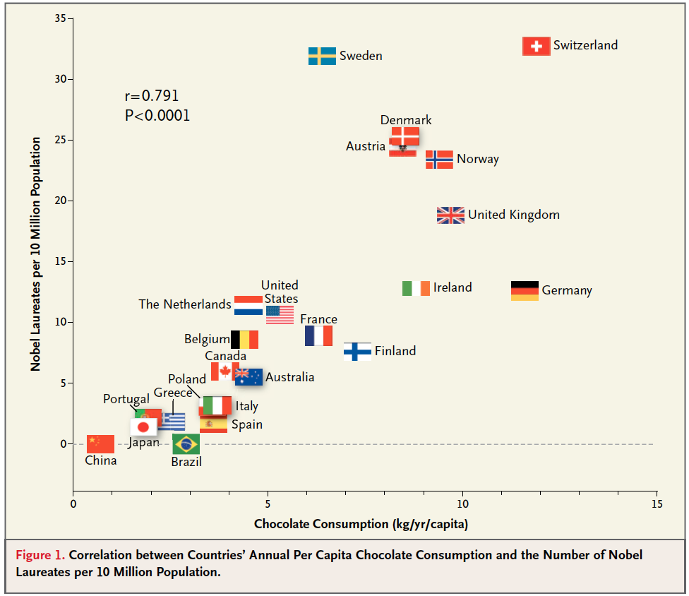

## What is happening?

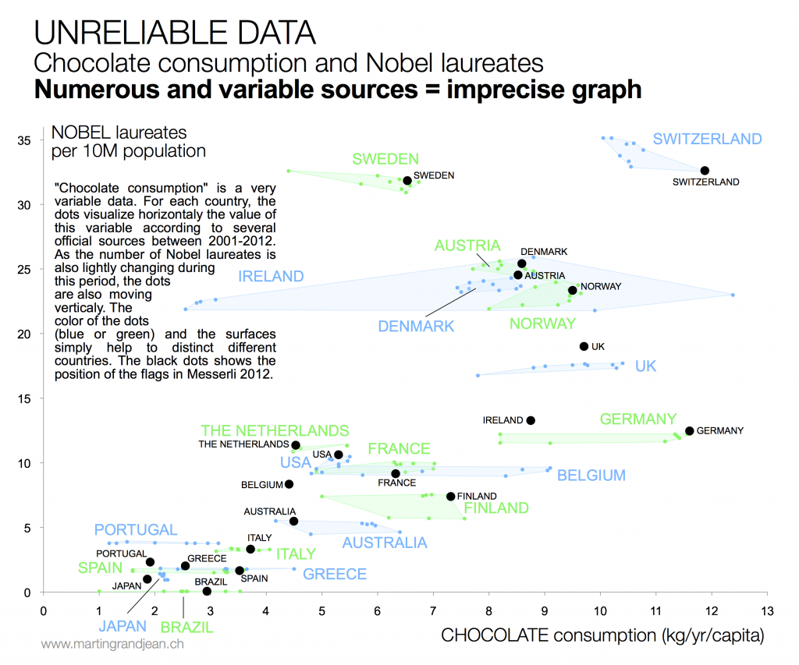

## What is happening?

**spurious correlation**:

> when two variables are correlated but the correlation is **not** the result of a causal relationship between those two variables

- Suggests at third or additional variables that affect them.

### Think about experiments:

- A situation where another factor is related to both $X$ and $Y$

## Spurious Correlation

```{r, echo = F}
dag <- dag.init(y.name = "", x.name = "", 
        covs = c(1),
        arcs = c(1, 0, 1,-1),
        symbols = c('X','Z','Y'))
invisible(dag.draw(dag, legend = F))
text(dag$x[2], dag$y[1] + 0.05, "Cause?")

```

## Spurious Correlation

```{r, echo = F}

invisible(dag.draw(add.arc(dag, arc = c(1,3), type = 1), legend = F, noxy=1))
text(dag$x[2], dag$y[1], "Correlation; Not causal!")

```

## Spurious Correlation


```{r, echo = F}
dag <- dag.init(y.name = "", x.name = "", 
        covs = c(1),
        arcs = c(1, 0, 1,-1),
        symbols = c('Chocolate','Wealth','Nobels'))
invisible(dag.draw(dag, legend = F))
text(dag$x[2], dag$y[1] + 0.05, "Cause?")

```

## Spurious Correlation

```{r, echo = F}

invisible(dag.draw(add.arc(dag, arc = c(1,3), type = 1), legend = F, noxy=1))
text(dag$x[2], dag$y[1], "Correlation; Not causal!")

```

## Spurious Correlation

```{r, echo = F}

invisible(dag.draw(add.arc(dag, arc = c(1,3), type = 1), legend = F, noxy=1))
text(mean(dag$x[1:2]), mean(dag$y[1:2]), "Causes\nIncrease")
text(mean(dag$x[2:3]), mean(dag$y[2:3]), "Causes\nIncrease")
text(dag$x[2], dag$y[1], "Positive Correlation")
```


## Spurious Correlation?

```{r, echo = F}
riots = fread('./IndiaElections.csv')
plot(riots$INC_voteshare, riots$COUNT_1yr, xlab = "INC Voteshare", ylab = "Hindu Muslim Riot (count)", main = "Riots and Secular Party Votes")
abline(lm(COUNT_1yr ~ INC_voteshare, riots), col = 'red', lwd = 2)
c = cor.test(riots$INC_voteshare, riots$COUNT_1yr)
text(.6, 6, paste0("Correlation: ", round(c$estimate, 2)), pos = 4)
text(.6, 5, paste0("P-value: ", round(c$p.value, 5)), pos = 4)

```


## Spurious Correlation
```{r, echo = F}
dag <- dag.init(y.name = "", x.name = "", 
        covs = c(1),
        arcs = c(1, 0, 1,-1),
        symbols = c('INC Votes','Religious Harmony','Riots'))
invisible(dag.draw(dag, legend = F))
text(dag$x[2], dag$y[1] + 0.05, "Cause?")

```

## Spurious Correlation

```{r, echo = F}

invisible(dag.draw(add.arc(dag, arc = c(1,3), type = 1), legend = F, noxy=1))
text(mean(dag$x[1:2]), mean(dag$y[1:2]), "Causes\nIncrease")
text(mean(dag$x[2:3]), mean(dag$y[2:3]), "Causes\nDecrease")
text(dag$x[2], dag$y[1], "Negative Correlation")
```


## Spurious Correlation?

Income growth and vote for incumbent party

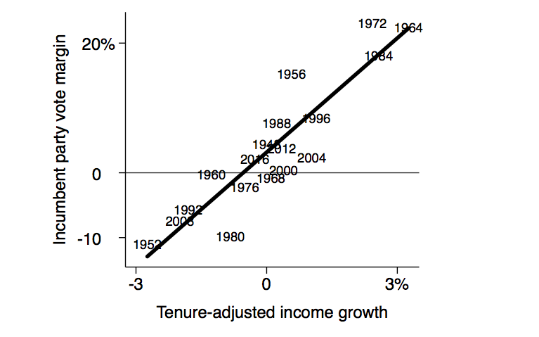

## Many possible causes

```{r, echo = F}
dag <- dag.init(y.name = "", x.name = "", 
        covs = c(1,1,1),
        arcs = c(1,-1,2,-1,3,-1),
        symbols = c('Income Growth','Campaign Spending', 'War Casuaties', 'Party Ideology' ,'Incumbent Vote (%)'))
invisible(dag.draw(dag, legend = F))
```

## Spurious Correlation?


## Spurious Correlation?

Even if correlation reflects **causal** link...

we may still see an imperfect correlation, because other factors cause outcome

### Recall...

This is similar to logic behind probabilistic causal claims

## Spurious Correlation?

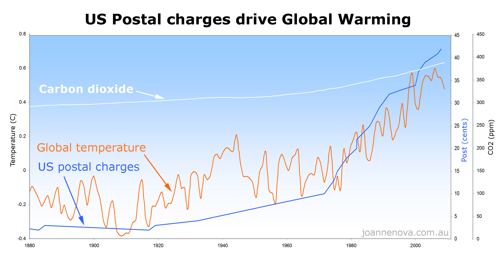

## Spurious Correlation?


```{r, echo = F}
dag <- dag.init(y.name = "", x.name = "", 
        covs = c(1),
        arcs = c(1, 0, 1,-1),
        symbols = c('Postal Charges','Economic Growth','Global Temp.'))
invisible(dag.draw(dag, legend = F))
text(dag$x[2], dag$y[1] + 0.05, "Cause?")

```


## Spurious Correlation?

```{r, echo = F}

invisible(dag.draw(add.arc(dag, arc = c(1,3), type = 1), legend = F, noxy=1))
text(mean(dag$x[1:2]), mean(dag$y[1:2]), "Causes\nIncrease")
text(mean(dag$x[2:3]), mean(dag$y[2:3]), "Causes\nIncrease")
text(dag$x[2], dag$y[1], "Positive Correlation")
```


## Spurious Correlations

Why does this happen so often?

- Causes often are "clustered" together
    - low income and low education
    - democracy and high national wealth
    - democratic institutions, liberal culture
    - consumer spending and scientific spending

As a result:

- $X$ and $Z$ cause $Y$, and $X$ often correlation with $Z$.


<!-- ## Beware Third Variables? -->

<!-- Antecedent -->
<!-- -define -->

<!-- Intervening -->
<!-- -define -->

<!-- ## Examples -->

<!-- which is which? -->

<!-- ## Reverse Causation -->

<!-- what is it? -->

<!-- ## Reverse Causation -->

<!-- examples -->

<!-- ## Reverse CAusation -->

<!-- why does it happen? -->

<!-- ##  -->

<!-- Summary: -->

<!-- correlation problem? -->

<!-- - spurious, third variable, bias? -->
<!-- - antecedent,  -->
<!-- - intervening -->
<!-- - reverse  -->

<!-- ## -->

<!-- Bias vs Random Association: -->

<!-- - we find a seeming pattern by chance -->
<!-- - we find a pattern that appears consistent and non-random but does not result from causal relationship $X \rightarrow Y$ -->


