```{r setup, include=FALSE}
knitr::opts_chunk$set(echo = FALSE)
require(magrittr)
require(kableExtra)
require(knitr)
require(ggplot2)
require(gtools)
require(dagR)
require(data.table)
require(MASS)
```
<style>
.forceBreak { -webkit-column-break-after: always; break-after: column; }
h3, h4 {font-weight: bold;
        color: #515151;}
</style>


# Midterm Grades

## Midterm performance:

Original Average $\approx 60$%

Similar across tutorial sections

## Midterm scaling:

$$ScaledPoints = (MidtermPoints - 27.4) \cdot 0.715 + 32.6$$
Original Average: $59.9$%
New Average: $70.9$%

## Homework Scaling:

It is possible

# From Correlation to Causality

## What is the problem? {.build}

### Correlation as clue to Causality

If $X \rightarrow Y$:

- Values of $X$ and $Y$ should move together
- Values of $X$ and $Y$ should be correlated
- This correlation should not be **by chance**

### A hiccup:

It is possible that  $X,Y$ are correlated, without causation


## What is the problem?

| i | $Y_i^0$ | $Y_i^1$ | $Y_i^1 - Y_i^0$ | $X_i$ | $W_i$ |
|---|---------|--------|-----------------|--|--|
| 1 | 5 | 9 | 4 |1|**1**|
| 2 | 4 | 8 | 4 |1|**1**|
| 3 | 3 | 7 | 4 |0|**0**|
| 4 | 2 | 6 | 4 |0|**0**|

## What is the problem?

True causal effect of $X$: $4$.

Apparent causal effect of $X$: 

$$\frac{9+8}{2} - \frac{3+2}{2} = \frac{12}{2} \neq 4$$

### Why?


## What is the problem?

| i | $Y_i^0$ | $Y_i^1$ | $Y_i^1 - Y_i^0$ | $X_i$ | $W_i$ |
|---|---------|--------|-----------------|--|--|
| 1 | 5 | 9 | 4 |1|**1**|
| 2 | 4 | 8 | 4 |1|**1**|
| 3 | 3 | 7 | 4 |0|**0**|
| 4 | 2 | 6 | 4 |0|**0**|

## What is the problem?

### $W$ is related to $X$ and $Y$

1. $X = 0$ when $W = 0$. $X = 1$ when $W = 1$
    - perfect correlation
2. $Y \approx 4.5$ when $W = 0$. $Y \approx 6.5$ when $W = 1$
    - partial correlation
  
### $X$ causes $Y$...

but $W$ makes effect of $X$ look too big

$W$ is a **confounding variable**
    
## What is the problem?

```{r, echo = F}
x = rep(0:1, each = 4)
w = rep(0:1, each = 4)
y = c(2,3,7,6,5,4,8,9)
par(mfrow = c(1,2))
plot(w,x)
abline(lm(x~w))
text(0.5,0.2, paste0("Correlation: ", round(cor(w,x),2)))
plot(w,y)
abline(lm(y~w))
text(0.5,3, paste0("Correlation: ", round(cor(w,y),2)))

```


## What is the problem?

```{r, echo = F}
par(mfrow = c(1,1))
dag <- dag.init(y.name = "", x.name = "", 
        covs = c(1),
        arcs = c(1, 0, 1,-1),
        symbols = c('X','W','Y'))
invisible(dag.draw(add.arc(dag, arc = c(1,3), type = 1), legend = F, noxy=2))
text(mean(dag$x[1:2]), mean(dag$y[1:2]), "Causes\nIncrease", pos = 2)
text(mean(dag$x[2:3]), mean(dag$y[2:3]), "Causes\nIncrease", pos = 4)
text(dag$x[2], dag$y[1], "Effect is biased upward!", pos = 1)

```

## What is the problem?

### Is peace keeping effective?

```{r, echo = F}
par(mfrow = c(1,1))
dag <- dag.init(y.name = "", x.name = "", 
        covs = c(1),
        arcs = c(1, 0, 1,-1),
        symbols = c('Peace\nKeeping','Intense\nViolence','Conflict\nResolved'))
invisible(dag.draw(add.arc(dag, arc = c(1,3), type = 1), legend = F, noxy=2))
text(mean(dag$x[1:2]), mean(dag$y[1:2]), "Causes\nIncrease", pos = 2)
text(mean(dag$x[2:3]), mean(dag$y[2:3]), "Causes\nDecrease", pos = 4)
text(dag$x[2], dag$y[1], "Effect is biased downward!", pos = 1)

```

## What is the problem?

### Restatement:

We observe $X,Y$ correlated...

- ... but additional factors $W_1 \ldots W_n$ affect $X$ and $Y$
- So correlation is biased.
    - Could be entirely spurious (no true causal effect of $X$ on $Y$)
    - Or different from true effect of $X$. Observed effect too big/too small
    - These other factors $W_1 \ldots W_n$ are called **confounding variables**


## What can we do?

**Comparative Method:**

If causal claim that $X \rightarrow Y$, then:

We generate **empirical prediction**:

> If we observe **two cases** to be the same in all relevant respects except for value of $X$, then we should observe that the two cases differ in the value of $Y$

1. We don't need cases to be **identical** on **all** attributes
2. They need to be the **identical** on attributes related to both **cause** ($X$) and **outcome** ($Y$)
    - In short: identical on factors that affect $Y$ and are related to or affect $X$

## What does comparative method do?

1. Examines whether $Y$ changes when $X$ changes
2. Within pairs of cases where **confounding** variables held constant

### Can we generalize this?

**Comparative method**

- Can address **confounding**
- *But* works with only a few cases, patterns by chance?

**Correlation**

- Correlation uses many cases, can judge statistical significance
- *But* does not address **confounding**/bias

## Solutions

Two approaches to make correlation work like the comparative method

1. **adjustment**-based
    - Identify possible **confounding** variables (e.g. $W$)
    - Measure these variables
    - explicitly **adjust** our correlation between $X$ and $Y$
    - "**conditioning**" on confounding variables
2. **design**-based
    - Carefully choose **cases** for comparison
    - **Structure of comparison** accounts for many or **all** confounding variables
    - Kind of comparison permits **unconditional** comparison, given assumptions.


## Solutions: Examples

### Design-based: 

An experiment is **design**-based solution:

- We **compare** a "treated" group to an "untreated" group 
- We test using **unadjusted** correlation of treatment and outcome in these groups
- We have **good reason** to believe that correlation implies causation:
    - Not because we **explicitly** identified and accounted for **confounding** variables
    - Because **design** (random assignment of treatment) eliminates confounding
    - Wouldn't work if we compared randomly assigned treatment group non-random control

## Solutions: Experiment

```{r, echo = F}
par(mfrow = c(1,2))
dag <- dag.init(y.name = "", x.name = "", 
        covs = c(1),
        arcs = c(1, 0, 1,-1),
        symbols = c('Peace\nKeeping','Intense\nViolence','Conflict\nResolved'))
invisible(dag.draw(add.arc(dag, arc = c(1,3), type = 1), legend = F, noxy=2))
text(mean(dag$x[1:2]), mean(dag$y[1:2]), "Causes\nIncrease", pos = 2)
text(mean(dag$x[2:3]), mean(dag$y[2:3]), "Causes\nDecrease", pos = 4)
text(dag$x[2], dag$y[1], "Effect is biased downward!", pos = 1)

dag <- dag.init(y.name = "", x.name = "", 
        covs = c(1),
        arcs = c(1,-1),
        symbols = c('Peace\nKeeping','Intense\nViolence','Conflict\nResolved'))
invisible(dag.draw(dag, legend = F, noxy=2))
```

## Solutions: Examples

### Adjustment-based: 

This extrapolates **comparative method** to correlation.

The goal is to:

1. observe **confounding variables**
2. examine the correlation of $X$ and $Y$...
3. holding confounding variables **constant**
    - *ceteris parabis*, "all else being equal"

**conditioning**: the process of holding other variables constant while looking at relationship between $X$ and $Y$.

- Remaining correlation between $X$ and $Y$ after conditioning on other variables **cannot** result from confounding by those variables


## Solutions: Examples

How to think about **adjustment**/**conditioning**:

It is **like**:

- **many** applications of comparative method simultaneously
- correlation of $X$ and $Y$ within groups where other variables $W_1 \ldots W_k$ are held constant
- Change in $X$ and $Y$ cannot be due to change in variables we condition on **because** these other variables are held constant

It is not this process **EXACTLY**, but similar

## Conditioning: Example

### Question

Does UN peace-keeping prevent re-occurrence of civil war?

### Causal Theory:

**Exposure** to UN **peace-keeping** at the end of a conflict causes countries to experience **longer periods** of **peace**

### Test?

Correlation is insufficient. Many variables may cause UN intervention AND ability to have durable peace

- Intensity of conflict (Deaths), Length of conflict, ethnic diversity, population, mountainous terrain, size of armed forces, democracy

## Conditioning: Example

### Test?

```{r, echo = F}
par(mfrow = c(1,1))
dag <- dag.init(y.name = "", x.name = "", 
        covs = c(1,1,1,1,1,1),
        arcs = c(1, 0, 1,-1,
                 2, 0, 2,-1,
                 3, 0, 3,-1,
                 4, 0, 4,-1,
                 5, 0, 5,-1,
                 6, 0, 6,-1),
        symbols = c('Peace\nKeeping',
                    'Intense\nViolence', "War Length", "Diversity", "Terrain", "Army Size", "Democracy",
                    'Durable\nPeace'))
invisible(dag.draw(dag, legend = F, noxy=2))
```

## Conditioning: Example

### Test

Look at correlation between Peacekeeping and Peace **within** groups of cases that have **same values** of:

- Violence, War length, Diversity, Terrain, Army Size, Democracy

**DOES NOT** eliminate the causal link between confounding variables and **peacekeeping** by design. We **adjust** our correlation to account for confounders.

----

Example (1)

|  | $Peace_i^{UN}$ | $Peace_i^{noUN}$ | $UN_i$ | $WarIntense_i$ | $Peace_i^{Obs}$ | $Effect_i$ |
|-----------|---------|---------|-------|-------|-------|----------|
| treated | 20 | 10 | 1 | 0 | $\mathbf{20}$ | 10 |
| treated | 20 | 10 | 1 | 0 | $\mathbf{20}$ | 10 |
| treated | 15 | 5 | 1 | 1 | $\mathbf{15}$ | 10 |
| untreated | 20 | 10 | 0 | 0 | $\mathbf{10}$ | 10 |
| untreated | 15 | 5 | 0 | 1 | $\mathbf{5}$ | 10 |
| untreated | 15 | 5 | 0 | 1 | $\mathbf{5}$ | 10 |

## Conditioning: Example

What is the **true** effect of peace-keeping?

$$\frac{10 + 10 + 10 + 10 + 10 + 10}{6} = 10$$

$10$ years more peace.

What is the effect we see with **unadjusted** or **unconditional** correlation?

(Average in peacekeeping - Average in no-peacekeeping)

----

Example (1)

|  | $Peace_i^{UN}$ | $Peace_i^{noUN}$ | $UN_i$ | $WarIntense_i$ | $Peace_i^{Obs}$ | $Effect_i$ |
|-----------|---------|---------|-------|-------|-------|----------|
| treated | 20 | 10 | 1 | 0 | $\mathbf{20}$ | 10 |
| treated | 20 | 10 | 1 | 0 | $\mathbf{20}$ | 10 |
| treated | 15 | 5 | 1 | 1 | $\mathbf{15}$ | 10 |
| untreated | 20 | 10 | 0 | 0 | $\mathbf{10}$ | 10 |
| untreated | 15 | 5 | 0 | 1 | $\mathbf{5}$ | 10 |
| untreated | 15 | 5 | 0 | 1 | $\mathbf{5}$ | 10 |

## Conditioning: Example

$$\frac{20 + 20 + 15}{3} - \frac{10 + 5 + 5}{3} = \frac{35}{3} \neq 10$$

We have upward **bias**: it looks like peace-keeping causes more peace than it does

### WHY?

---- 

|  | $Peace_i^{UN}$ | $Peace_i^{noUN}$ | $UN_i$ | $WarIntense_i$ | $Peace_i^{Obs}$ | $Effect_i$ |
|-----------|---------|---------|-------|-------|-------|----------|
| treated | 20 | 10 | $\mathbf{1}$ | $\mathbf{0}$ | 20 | 10 |
| treated | 20 | 10 | $\mathbf{1}$ | $\mathbf{0}$ | 20 | 10 |
| treated | 15 | 5 | 1 | 1 | 15 | 10 |
| untreated | 20 | 10 | $\mathbf{0}$ | $\mathbf{0}$ | 10 | 10 |
| untreated | 15 | 5 | 0 | 1 | 5 | 10 |
| untreated | 15 | 5 | 0 | 1 | 5 | 10 |

---- 

|  | $Peace_i^{UN}$ | $Peace_i^{noUN}$ | $UN_i$ | $WarIntense_i$ | $Peace_i^{Obs}$ | $Effect_i$ |
|-----------|---------|---------|-------|-------|-------|----------|
| treated | $\mathbf{20}$ | $\mathbf{10}$ | 1 | $\mathbf{0}$ | 20 | 10 |
| treated | $\mathbf{20}$ | $\mathbf{10}$ | 1 | $\mathbf{0}$ | 20 | 10 |
| treated | 15 | 5 | 1 | 1 | 15 | 10 |
| untreated | $\mathbf{20}$ | $\mathbf{10}$ | 0 | $\mathbf{0}$ | 10 | 10 |
| untreated | 15 | 5 | 0 | 1 | 5 | 10 |
| untreated | 15 | 5 | 0 | 1 | 5 | 10 |

## Conditioning: Example

### Unadjusted correlation BIASED because...

1. Intense wars $\xrightarrow{reduces}$ Peacekeeping
2. Intense wars $\xrightarrow{reduces}$ Durable Peace

Result?

>- Upward bias in effect of peacekeeping on durable peace

### Solution:

Conditioning! Calculate effect of peacekeeping where Intense War is $1$

----

|  | $Peace_i^{UN}$ | $Peace_i^{noUN}$ | $UN_i$ | $WarIntense_i$ | $Peace_i^{Obs}$ | $Effect_i$ |
|-----------|---------|---------|-------|-------|-------|----------|
| treated | 20 | 10 | 1 | 0 | 20 | 10 |
| treated | 20 | 10 | 1 | 0 | 20 | 10 |
| untreated | 20 | 10 | 0 | 0 | 10 | 10 |
| treated |  $\mathbf{15}$  |  $\mathbf{5}$  |  $\mathbf{1}$ | 1 | $\mathbf{15}$ | 10 |
| untreated |  $\mathbf{15}$  |  $\mathbf{5}$  | $\mathbf{0}$ | 1 | $\mathbf{5}$ | 10 |
| untreated |  $\mathbf{15}$  |  $\mathbf{5}$  | $\mathbf{0}$ | 1 | $\mathbf{5}$ | 10 |

## Conditioning: Examples

Effect of peacekeeping where war intensity is high (1):

$$\frac{15}{1} - \frac{5 + 5}{2} = \frac{10}{1} = 10$$


... and where war intensity is low (0)?

----

|  | $Peace_i^{UN}$ | $Peace_i^{noUN}$ | $UN_i$ | $WarIntense_i$ | $Peace_i^{Obs}$ | $Effect_i$ |
|-----------|---------|---------|-------|-------|-------|----------|
| treated | $\mathbf{20}$ | $\mathbf{10}$ | $\mathbf{1}$ | 0 | $\mathbf{20}$ | 10 |
| treated | $\mathbf{20}$ | $\mathbf{10}$ | $\mathbf{1}$ | 0 | $\mathbf{20}$ | 10 |
| untreated | $\mathbf{20}$ | $\mathbf{10}$ | $\mathbf{0}$ | 0 | $\mathbf{10}$ | 10 |
| treated | 15 | 5 | 1 | 1 | 15 | 10 |
| untreated | 15 | 5 | 0 | 1 | 5 | 10 |
| untreated | 15 | 5 | 0 | 1 | 5 | 10 |

## Conditioning: Examples

Effect of peacekeeping where war intensity is low (0):

$$\frac{20 + 20}{2} - \frac{10}{1} = \frac{10}{1} = 10$$

## Conditioning: Examples

Within the groups of cases defined by values of war intensity:

- Estimated effect of peacekeeping (compare cases with to without) retrieves the **true** effect
- **Conditioning** solved our problem of bias

Why does this work?

1. Within groups of cases with same values on confounder (war intensity ...
2. Potential outcomes (years of peace) with and without UN peacekeepers are **same** for "treated" and "untreated"
3. Same as: no other factor affects **both** UN peacekeeping ($X$) and peace ($Y$)

----

|  | $Peace_i^{UN}$ | $Peace_i^{noUN}$ | $UN_i$ | $WarIntense_i$ | $Peace_i^{Obs}$ | $Effect_i$ |
|-----------|---------|---------|-------|-------|-------|----------|
| treated | $\mathbf{20}$ | $\mathbf{10}$ | $\mathbf{1}$ | 0 | 20 | 10 |
| treated | $\mathbf{20}$ | $\mathbf{10}$ | $\mathbf{1}$ | 0 | 20 | 10 |
| treated | 15 | 5 | 1 | 1 | 15 | 10 |
| untreated | $\mathbf{20}$ | $\mathbf{10}$ | $\mathbf{0}$ | 0 | 10 | 10 |
| untreated | 15 | 5 | 0 | 1 | 5 | 10 |
| untreated | 15 | 5 | 0 | 1 | 5 | 10 |

----

|  | $Peace_i^{UN}$ | $Peace_i^{noUN}$ | $UN_i$ | $WarIntense_i$ | $Peace_i^{Obs}$ | $Effect_i$ |
|-----------|---------|---------|-------|-------|-------|----------|
| treated | 20 | 10 | 1 | 0 | 20 | 10 |
| treated | 20 | 10 | 1 | 0 | 20 | 10 |
| treated |  $\mathbf{15}$  |  $\mathbf{5}$  |  $\mathbf{1}$ | 1 | 15 | 10 |
| untreated | 20 | 10 | 0 | 0 | 10 | 10 |
| untreated |  $\mathbf{15}$  |  $\mathbf{5}$  | $\mathbf{0}$ | 1 | 5 | 10 |
| untreated |  $\mathbf{15}$  |  $\mathbf{5}$  | $\mathbf{0}$ | 1 | 5 | 10 |


## Conditioning in Action:

### Peace-keeping and peace

(Gilligan & Sergenti 2008)

Look at correlation of peacekeeping and peace after conflict:

- Matching countries on: intensity of conflict (Deaths), length of conflict, ethnic diversity, population, mountainous terrain, size of armed forces, democracy

### Is there an effect after conditioning?

## Conditioning in Action:

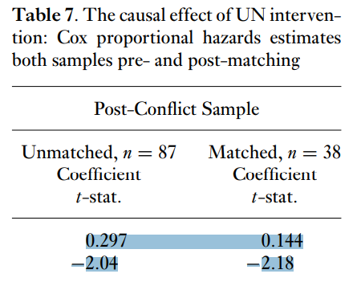

(Lower proportional hazards => war less likely)

## Conditioning in Action:

(Gilligan & Sergenti 2008)

**Conditioning** on other factors (holding them constant):

Peacekeeping makes war 85% less likely to re-emerge

## Conditioning in Action:

### Causal Claim

The presence of guns causes an increase in violent crame

### Causal Theory:

The **firearm ownership rate** causes an increase in the **violent crime rate**


## Conditioning in Action:

### Test

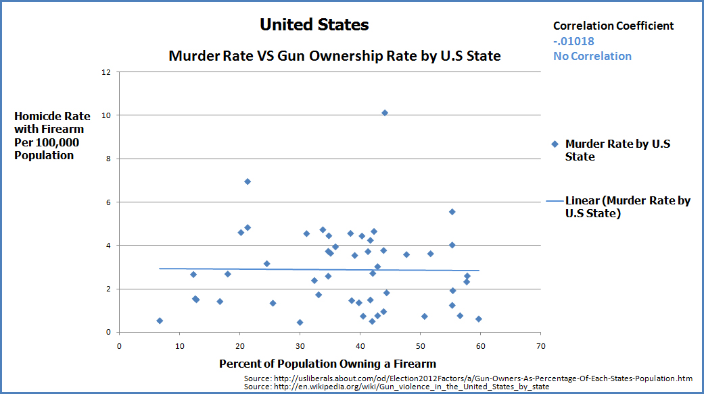

## Conditioning in Action:

### Test

Correlation between gun ownership and homicides is nearly $0$.

>- Does this mean no causal relationship?
>- Lots of possible sources of bias.

## Conditioning in Action:

### (Moore and Bergner 2016)

- Look at US counties
- Use "regression" to adjust correlation between guns and violent crime
- Adjust for possible confounders:
    - Region, urban/rural, population, poverty, ethnic diversity, unemployment, gender, poverty
    - "Holding these factors constant", "ceteris parabis"

## Conditioning in Action:

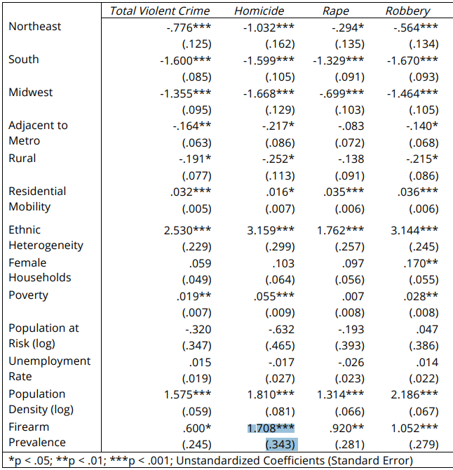


## Regression Tables:

1. **Dependent Variables**: column names (usually)
2. **Independent Variable**(s): row names (usually)
    - Includes our causal variable, and possible **confounding** variables
3. **effect size**: Number not in parentheses
    - This is a slope for variable: $Y = \mathbf{m} \cdot X + b$
    - How much $Y$ changes with one unit change in $X$
    - Change in $Y$ with change in $X$, **holding other variables constant**
4. Stars and (): uncertainty
    - Stars indicate $p$ values

## Regression Tables:

Buyer beware. Unless stated otherwise...

### ASSUMES LINEARITY IN ALL RELATIONSHIPS

## Conditioning in Action:


    
## Conditioning in Action:
    
### (Moore and Bergner 2016)

Holding county-attributes constant:

- Increased firearm presence **increases** violent crime

Unadjusted correlation between guns and homicide: **biased downward**


## Adjustment

### Limitations:

1. Typically only so many variables we can condition on:
    - mathematically constrained
    - just like comparative method, can't find similar cases
    - could prevent us from conditioning on all sources of bias
2. For adjustment/conditioning to work, we must
    - correctly **identify all** possible confounding variables
    - correctly **measure** confounding variables. (Even RANDOM measurement error is a problem)

Let's see what happens when this goes wrong...


----

|  | $Peace_i^{UN}$ | $Peace_i^{noUN}$ | $UN_i$ | $WarIntense_i$ | $Peace_i^{Obs}$ | $Effect_i$ |
|-----------|---------|---------|-------|-------|-------|----------|
| treated | 20 | 10 | 1 | 0 | 20 | 10 |
| treated | 20 | 10 | 1 | 0 | 20 | 10 |
| treated | 15 | 5 | 1 | 1 | 15 | 10 |
| untreated | 18 | 8 | 0 | 0 | 8 | 10 |
| untreated | 15 | 5 | 0 | 1 | 5 | 10 |
| untreated | 15 | 5 | 0 | 1 | 5 | 10 |

----

What is the true effect?

$$\frac{10 + 10 + 10 + 10 + 10 + 10}{6} = 10$$

----

What is the **unconditional** effect of UN peacekeeping?

|  | $Peace_i^{UN}$ | $Peace_i^{noUN}$ | $UN_i$ | $WarIntense_i$ | $Peace_i^{Obs}$ | $Effect_i$ |
|-----------|---------|---------|-------|-------|-------|----------|
| treated | 20 | 10 | $\mathbf{1}$ | 0 | $\mathbf{20}$ | 10 |
| treated | 20 | 10 | $\mathbf{1}$ | 0 | $\mathbf{20}$ | 10 |
| treated | 15 | 5 | $\mathbf{1}$ | 1 | $\mathbf{15}$ | 10 |
| untreated | 18 | 8 | 0 | 0 | 8 | 10 |
| untreated | 15 | 5 | 0 | 1 | 5 | 10 |
| untreated | 15 | 5 | 0 | 1 | 5 | 10 |

----

What is the **unconditional** effect of UN peacekeeping?

|  | $Peace_i^{UN}$ | $Peace_i^{noUN}$ | $UN_i$ | $WarIntense_i$ | $Peace_i^{Obs}$ | $Effect_i$ |
|-----------|---------|---------|-------|-------|-------|----------|
| treated | 20 | 10 | 1 | 0 | 20 | 10 |
| treated | 20 | 10 | 1 | 0 | 20 | 10 |
| treated | 15 | 5 | 1 | 1 | 15 | 10 |
| untreated | 18 | 8 | $\mathbf{0}$ | 0 | $\mathbf{8}$ | 10 |
| untreated | 15 | 5 | $\mathbf{0}$ | 1 | $\mathbf{5}$ | 10 |
| untreated | 15 | 5 | $\mathbf{0}$ | 1 | $\mathbf{5}$ | 10 |

----

What is the **unconditional** effect of UN peacekeeping?

$$\frac{20+20+15}{3} - \frac{8+5+5}{3} = \frac{37}{3} \neq 10$$

Let's try to condition on War Intensity

----

|  | $Peace_i^{UN}$ | $Peace_i^{noUN}$ | $UN_i$ | $WarIntense_i$ | $Peace_i^{Obs}$ | $Effect_i$ |
|-----------|---------|---------|-------|-------|-------|----------|
| treated | 20 | 10 | $\mathbf{1}$ | 0 | $\mathbf{20}$ | 10 |
| treated | 20 | 10 | $\mathbf{1}$ | 0 | $\mathbf{20}$ | 10 |
| untreated | 18 | 8 | $\mathbf{0}$ | 0 | $\mathbf{8}$ | 10 |
| treated | 15 | 5 | 1 | 1 | 15 | 10 |
| untreated | 15 | 5 | 0 | 1 | 5 | 10 |
| untreated | 15 | 5 | 0 | 1 | 5 | 10 |

----

|  | $Peace_i^{UN}$ | $Peace_i^{noUN}$ | $UN_i$ | $WarIntense_i$ | $Peace_i^{Obs}$ | $Effect_i$ |
|-----------|---------|---------|-------|-------|-------|----------|
| treated | 20 | 10 | 1| 0 | 20 | 10 |
| treated | 20 | 10 | 1 | 0 | 20 | 10 |
| untreated | 18 | 8 | 0 | 0 | 8 | 10 |
| treated | 15 | 5 | $\mathbf{1}$ | 1 | $\mathbf{15}$ | 10 |
| untreated | 15 | 5 | $\mathbf{0}$ | 1 | $\mathbf{5}$ | 10 |
| untreated | 15 | 5 | $\mathbf{0}$ | 1 | $\mathbf{5}$ | 10 |

----

When War Intensity is "low" (0):

$$\frac{20 + 20}{2} - \frac{8}{1} = 12 \neq 10$$

When War Intensity is "high" (1):

$$\frac{15}{1} - \frac{5+5}{2} =  10$$

We still have **bias** in the "low" war intensity group... why?

----

|  | $Peace_i^{UN}$ | $Peace_i^{noUN}$ | $UN_i$ | $WarIntense_i$ | $Peace_i^{Obs}$ | $Effect_i$ |
|-----------|---------|---------|-------|-------|-------|----------|
| treated | $\mathbf{20}$ | $\mathbf{10}$ | $\mathbf{1}$ | $\mathbf{0}$ | 20 | 10 |
| treated | $\mathbf{20}$ | $\mathbf{10}$ | $\mathbf{1}$ | $\mathbf{0}$ | 20 | 10 |
| untreated | $\mathbf{18}$ | $\mathbf{8}$ | $\mathbf{0}$ | $\mathbf{0}$ | 8 | 10 |
| treated | 15 | 5 | 1 | 1 | 15 | 10 |
| untreated | 15 | 5 | 0 | 1 | 5 | 10 |
| untreated | 15 | 5 | 0 | 1 | 5 | 10 |

## Why do we see bias...

... even after conditioning?

Within the "low" war intensity group:

- Countries with peacekeeping have different **potential outcomes** from countries **without** peacekeeping
    - That is: countries with and without peacekeeping in this group are **not** counterfactuals
    - **because** they differ on some other **confounding variable**
- Country with "low" war intensity and without peacekeeping
    - Is, for some reason, more likely to relapse into war
    - Possibly not selected for peacekeeping because of this

If we fail to condition on **all** confounding variables, still have bias

- But the most confounding variables we adjust/condition on, bias gets smaller

## Adjustment: Lessons

If we ...

1. ... can't think of **all** confounding variables
2. ... can't measure **all** confounding variables
4. ... can't find cases that **match** on all confounding variables
5. ... can think of more confounding variables than cases

... then adjustment/conditioning might not work

- and correlation between $X,Y$ might have **bias**

## Adjustment:

### In summary:

**Adjustment**/**conditioning**: adjusts correlation of $X$ (cause) and $Y$ (outcome) to account for confounding variables

- Examines correlation of $X,Y$ within groups that have same values for confounding variables
- Rules out these factors as sources of spurious correlation
- Essentially we assume: within these groups, cause $X$ is **as-if** randomly assigned 

This works... 

### IF (big "if")

- We correctly identify and measure **all** confounding variables
- We can never be certain this is true: we can only argue that we have done this
    
    
# Design-Based Solutions

## Design

**design-based** solutions to **spurious correlation** or **confounding**:

- Do **not** identify and measure all confounding variables
- Choose a comparison that eliminates effects of **many** known and **unknown** confounding variables

### Types of designs:

1. Comparison across cases **known to be similar** at same time
2. Comparison of **same case** across time
    - Sometimes called "interrupted time series"
3. Comparison of groups of cases with **as-if random** exposure to cause
    - "natural" experiments. Randomness without researcher manipulation
    
## Design: Similar Cases


Whether using correlation or comparative method:

- We can look at cases that we expect to be similar on many attributes (usually due to spatial and temporal proximity)
    - Compare provinces/states within countries, rather than different countries
    - Compare districts/towns within provinces rather than different provinces
    - Compares people within neighborhoods rather than across different areas
    
What does this do? Comparisons like this:

- Conditions on/eliminates **all confounding variable** that are the **same** across cases
    - e.g. all confounding variables at country, province, neighborhood-level

## Similar Cases: Example {.build}

### Minimum Wage Laws

Do minimum wage laws actually improve wages?

- Could cause employers to employ fewer people
- Or could cause wages to rise, without a change in who is employed

### Naive comparison:

Correlate unemployment with minimum wage laws across countries

### Any problems?

## Similar Cases

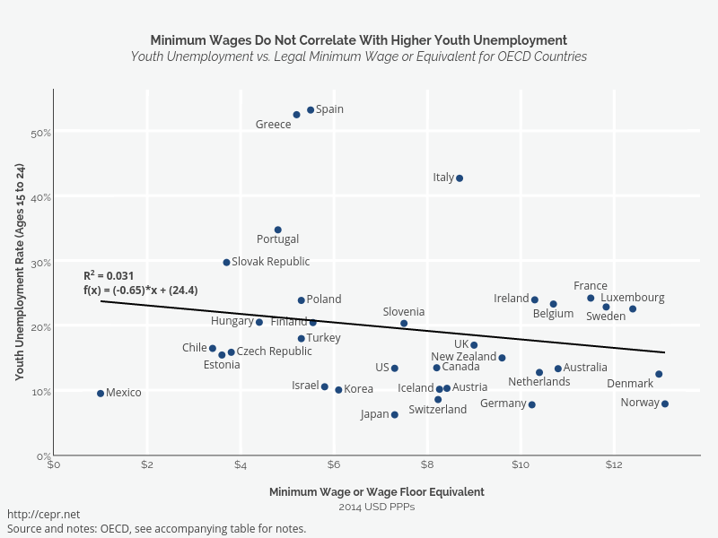

## Similar Cases: Example {.build}

Countries with different minimum wages likely differ in many ways:

- Political power of labor
- Unemployment insurance
- Health coverage
- Cultural/political institutions

### A better design?

Compare minimum-wage laws and unemployment **across provinces** within the same country

- Would keep **country-level** variables the same
- Fewer possible variables to condition/adjust for

## Similar Cases

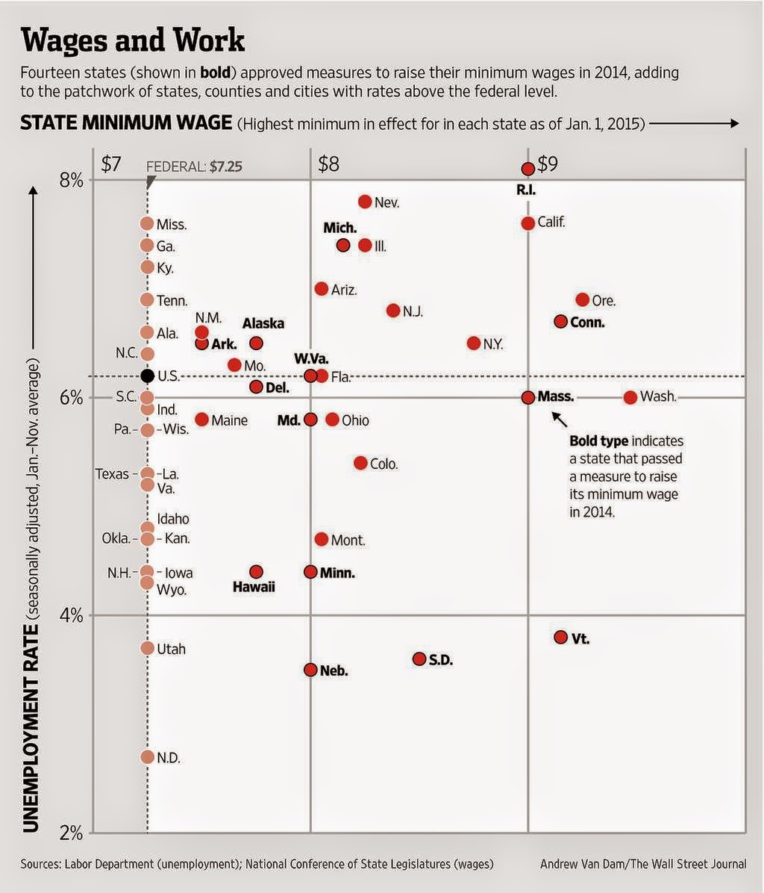

## Even better?

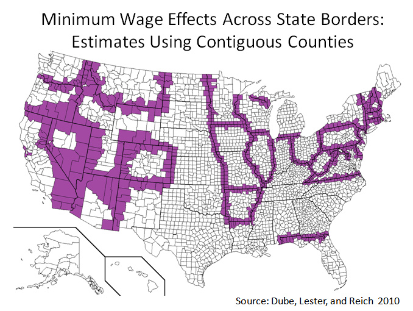

## Even better?

Compare minimum-wage laws and unemployment **across border-counties** within the same country, on the **same provincial border**

### Advantage?

Provinces/states might also differ from each other in many ways:

- Counties/districts on province/state borders probably similar in MORE ways
- **Fewer differences** between these counties, **except** for minimum wage law

## Similar Cases: Example

Does the structure of **race** in American cause African Americans to have lower income?

### Naive comparison:

Look at incomes of African Americans versus whites

### Problems:

Lots of historical causes of lower African American incomes, hard to find contemporary effects.

- Major problems are neighborhoods: access to resources (lack thereof) where you grow up. Too many factors to control for

## Similar Cases:

### One solution:

Economists at Stanford, Harvard, Census:

- Compare African American children and white children from families with 
    - same parental income, same family structure, **within the same census tracts**
- As adults, African American children have lower incomes than white.

**within neighborhood** comparison:

- Eliminates many confounding variables **without** measuring them directly and adjusting.

## Similar Cases: Example


## Similar Cases: Example

### Why two neighboring regions in Romania?

Similar historical background:

- Same experience under Russian Empire
- Same experience under Romanian/Nazi government

Similar historical context:

- Same exposure to ongoing war, genocide
- Same exposure to culture/events during WW2

Hard to match all of these attributes individually, choice of comparison helps
        

## Design:

If we extend logic of **similar cases**:

- Maybe the best approximate counter-factual for a case is... itself


### How can we compare a case to itself?

- Compare case to itself before and after cause changes
- Sometimes called "interrupted time-series"

## Design:

### Same Case over Time

What does comparison of case to itself do?

- Any **unchanging** attribute of case is held constant
- Eliminates all confounding variables that are constant for the case
    - All without identifying, measuring those variables

    
## Same Unit: Example

### Does speed enforcement reduce traffic fatalities?

### Naive comparison:

Correlate speed enforcement and fatalities across states 

### Problem?

- States are still probably different from each other in many ways

## Same Unit: Example

### A better comparison?

In 1956, Connecticut government responded to traffic deaths by increasing state police enforcement of speed limit and stronger fines/sentences

We can compare Connecticut pre- and post- "crackdown"

## Same Unit: Example

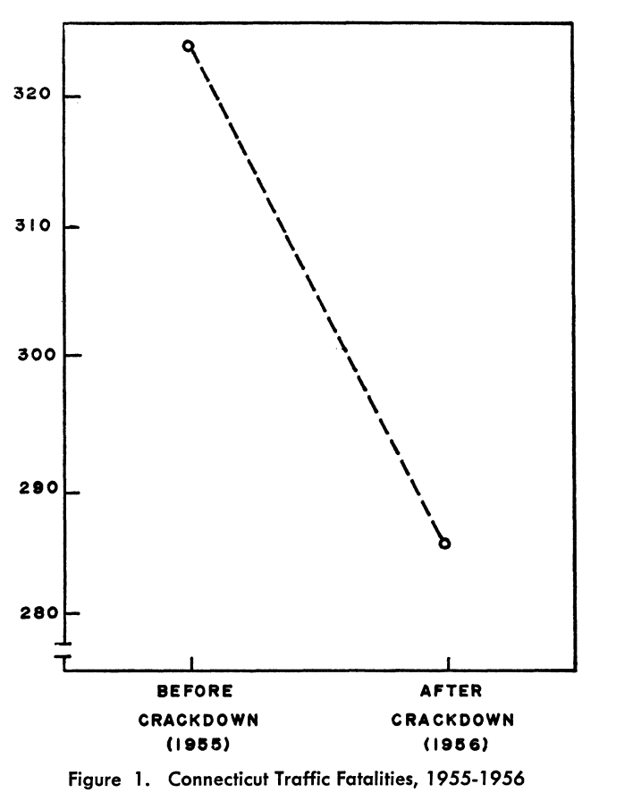

## Same Unit: Example

### Advantage:

- All unchanging attributes of CT accounted for

### Disadvantages:

- Other rapidly-changing attributes not accounted for (weather, safety of vehicles)
- Can't address long-term trends leading to decline in fatalities (road safety, medical procedures)
- Does crackdown change measurement, but not phenomenon? (Measurement bias)
- Is this change large or small compared to years with no change in the law?
- "Regression to the mean": 1955 was extreme year, expect 1956 to be lower

## Same Unit: Example

### How can we improve this?

- What was the trend in CT prior to law?
    - Was it going down/up
    - Was it stable/unstable?
- What were other states (without the law) doing?
    - Do they share major trends?
    - Only CT should see the effect.

## Same Unit: Example

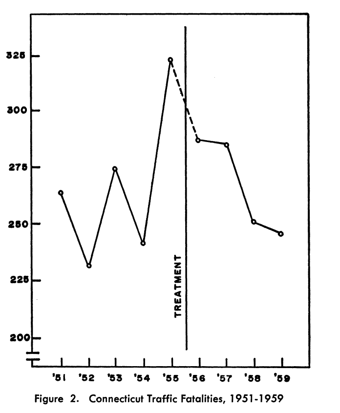

## Same Unit: Example

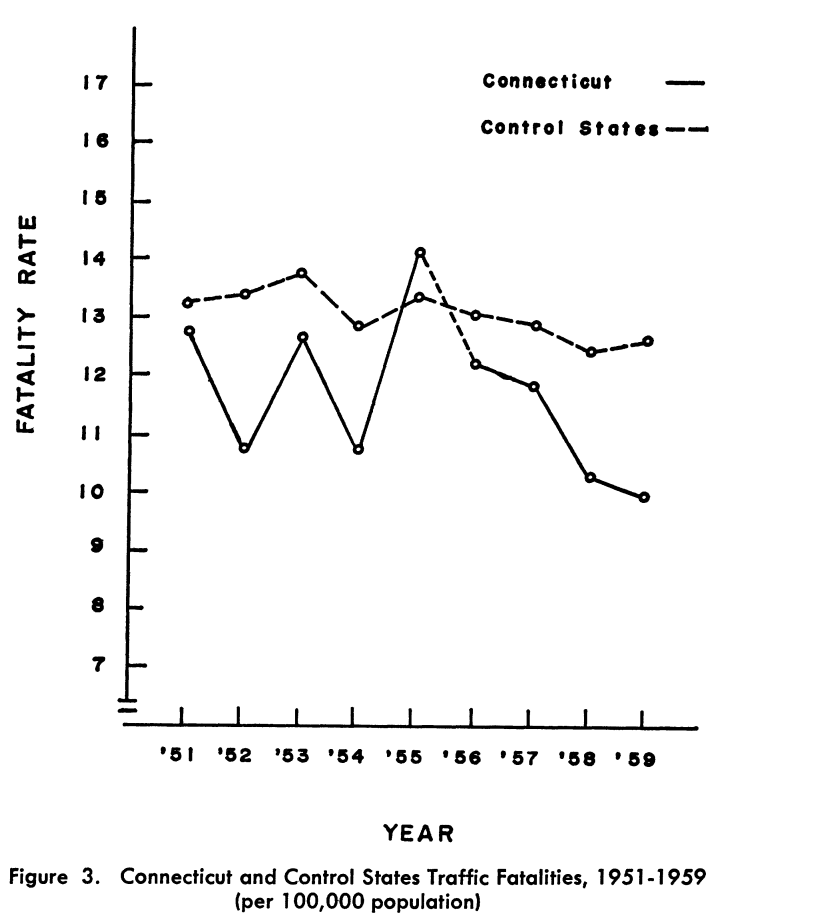


## Same Unit: Example

### NYPD and Stop, Question, Frisk

- Policy used by police for years
- Permitted officers to stop people on the street
- Accusations that many stops were racial profiling/harassment


Can police leadership change officer behavior?

Can police leadership cause officers to reduce racial profiling

## Same Unit: Example

### Design:

In March 2013, NYPD leadership suddenly mandated that officers had to provide a justification for SQF stops when submitting their reports.

- Possibility of penalty for unjustified stops
- Compare application of SQF pre- and post- announcement

### Measure:

Measure police profiling using "success rate" of weapons stops

- **Higher** success rate indicates correct targeting
- **Lower** success rate indicates profiling
 
## Same Unit: Example

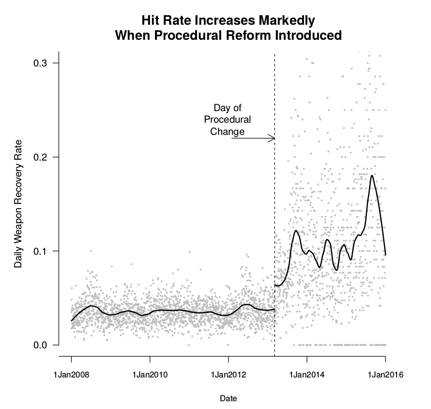

## Same Unit: Example

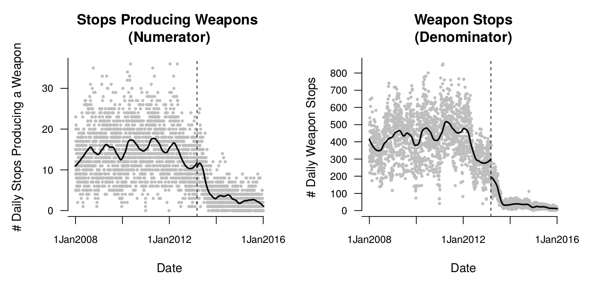

## Same Unit: Example

### Role of argument:

- Looks at sudden event over the course of a couple days (fewer other things change)
- Looks at long-term trends (no pattern)
- Shows policy change was unanticipated
    - no ability to change behavior before policy
    - policy not induced by change in police profiling
- Tests whether measurement bias at play

Argument for design **assumptions** replaces argument for including all variables

## Same Unit and Similar Units

Looking at **same case** over time:

- Eliminates **unchanging** confounding variables for that case
- Does not address confounding variables that **change** with time

Looking at **similar cases** at the same time:

- Eliminates shared confounding variables (both **historical** and **contemporaneous**)
- Does not address confounding variables that are **different between cases**

## Design

Can we design a comparison that combines these approaches?

- Eliminates **unchanging** confounding variables for a case
- Eliminates confounding variables that **change over time** but are **shared** by similar cases?

## Design: Differences in Differences

### Short answer: YES

### Long answer:

Yes, if we make some assumptions.

## Differences in Differences

### Similar units at same points in time

- Similar units experience shared shifts over time
      - E.g.: States in the same region experience similar weather patterns, changes in auto safety, long-term trends in highway safety
      - E.g.: States in the same country experience same stock market, monetary policy, shifts in federal government policy

## Differences in Differences

### Same unit across time

- Same units across time have shared unchanging attributes
    - E.g.: Some states have more hills/forests that make traffic less safe
    - E.g.: Some states have different industries/history of unions that affect unemployment


## Differences in Differences:

**difference in difference**: difference (between cases) in difference (within cases)

Consider 2 states $State_A$ and $State_B$ at two times $Time_0$ and $Time_1$

- $State_A$ implements a higher minimum wage between $Time_0$ and $Time_1$
- $State_B$ does not change its minimum wage

So:

- $State_{?}Diff = State_? Time_1 - State_? Time_0$ gives us change in unemployment in $State_?$...
    - holding **unchanging attributes of state** constant
- $State_{A}Diff - State_{B}Diff$ gives us change in unemployment in $A$ vs $B$
    - holding **shared trends of both states** constant


## Difference in Difference:

|                   | $Time_0$ | $Time_1$ | **First Difference** |
|-------------------|:--------:|:--------:|:----------------:|
| $State_A$         |   $7.3$  |   $7.8$  |       $0.5$      |
| $State_B$         |   $6.2$  |   $6.8$  |       $0.6$      |
| **Second Difference** |          |          |      $-0.1$      |

## Difference in Difference

```{r, echo = F}

dd = data.frame(State = rep(LETTERS[1:2], each = 2),
                Time = rep(0:1, 2),
                Unemployment = c(7.3,7.8,6.2,6.8)
                )

plot(dd$Time,dd$Unemployment, type= 'n', main = "Difference in Difference", xlab = "Time", ylab = "Unemployment Rate (%)", ylim = c(6,8))
points(dd[dd$State == "A", "Time"], dd[dd$State == "A", "Unemployment"])
points(dd[dd$State == "B", "Time"], dd[dd$State == "B", "Unemployment"], col = 'red')
lines(dd[dd$State == "A", "Time"], dd[dd$State == "A", "Unemployment"])
lines(dd[dd$State == "B", "Time"], dd[dd$State == "B", "Unemployment"], col = 'red')
text(dd[dd$State == "A", "Time"][1], dd[dd$State == "A", "Unemployment"][1], pos = 1, label = 'A')
text(dd[dd$State == "B", "Time"][1], dd[dd$State == "B", "Unemployment"][1], pos = 3, label = 'B')
abline(v = 0.5, lty = 2, col = 'gray50')
lines(0:1, c(7.3,7.9), lty = 2)

```


## Difference in Difference: Gun Violence


Consider 2 states $State_A$ and $State_B$ at two times $Time_0$ and $Time_1$

- $State_A$ tightens gun regulations between $Time_0$ and $Time_1$
- $State_B$ does not change its gun laws


## Difference in Difference: Gun Violence


|                   | $Time_0$ | $Time_1$ | **First Difference** |
|-------------------|:--------:|:--------:|:----------------:|
| $State_A$         |   $5.3$  |   $5.4$  |       $0.1$      |
| $State_B$         |   $2.1$  |   $2.7$  |       $0.6$      |
| **Second Difference** |          |          |      $-0.5$      |

## Difference in Difference

```{r, echo = F}

dd = data.frame(State = rep(LETTERS[1:2], each = 2),
                Time = rep(0:1, 2),
                Unemployment = c(5.3,5.4,2.1,2.7)
                )

plot(dd$Time,dd$Unemployment, type= 'n', main = "Difference in Difference", xlab = "Time", ylab = "Homicide Rate (per 100K)",
                ylim = c(2,6))
points(dd[dd$State == "A", "Time"], dd[dd$State == "A", "Unemployment"])
points(dd[dd$State == "B", "Time"], dd[dd$State == "B", "Unemployment"], col = 'red')
lines(dd[dd$State == "A", "Time"], dd[dd$State == "A", "Unemployment"])
lines(dd[dd$State == "B", "Time"], dd[dd$State == "B", "Unemployment"], col = 'red')
text(dd[dd$State == "A", "Time"][1], dd[dd$State == "A", "Unemployment"][1], pos = 1, label = 'A')
text(dd[dd$State == "B", "Time"][1], dd[dd$State == "B", "Unemployment"][1], pos = 3, label = 'B')
abline(v = 0.5, lty = 2, col = 'gray50')
lines(0:1, c(5.3,5.9), lty = 2)
```

## Differences in Differences:

### Difference (b/t cases) in Difference (w/in units)

**first difference**: within cases over time holds fixed all **unchanging** confounding variables for each case

**second difference**: between cases over the same time holds fixed all **shared trends** over time

### Counterfactual:

In terms of counterfactuals:

- Two cases may not be counterfactuals for each other (many unchanging differences between cases)
- But after **first difference**, their **trends** are counterfactuals for each other

## Differences in Differences:

### Assumption:

How do we **know** that trend in untreated case is **counterfactual** for trend in treated case?

## Differences in Differences:

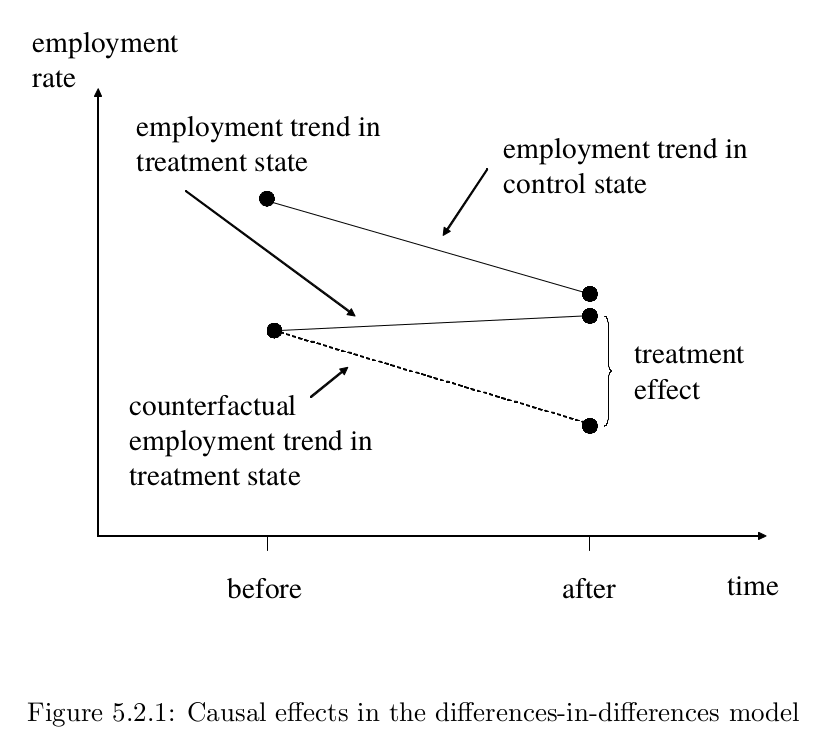

## Difference in Difference: For Real

Does Minimum Wage increase affect unemployment?

- Card and Krueger look at change in law in NJ in April 1992
    - Compare employment in fastfood restaurants in NJ and nearby countries in PA
    
## Difference in Difference: For Real

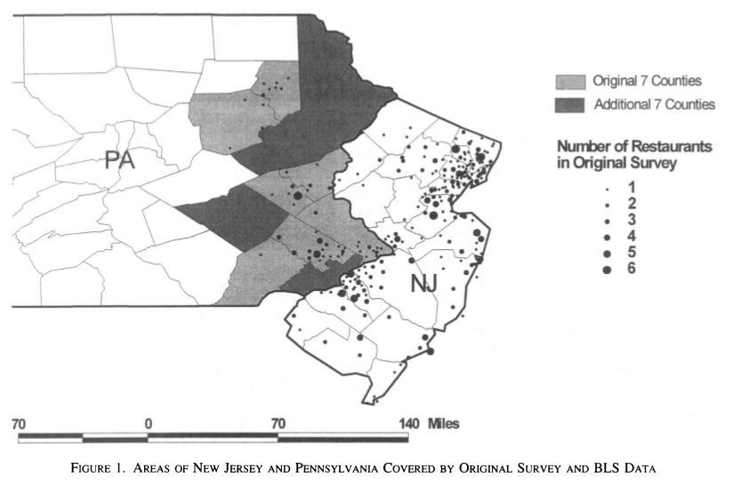


## Difference in Difference: For Real

### Why not look only at NJ vs PA after the law?

- NJ and PA may be different in many ways that affect baseline fastfood employment. 
    - Differences we see could be due to **confounding** variables that are constant within states

### Why not look at NJ pre- and post- law?

- Maybe national or regional economy was changing as well, or seasonal changes in employment
    - Differences we see could be due to **confounding** variables that change over time

## Difference in Difference: For Real

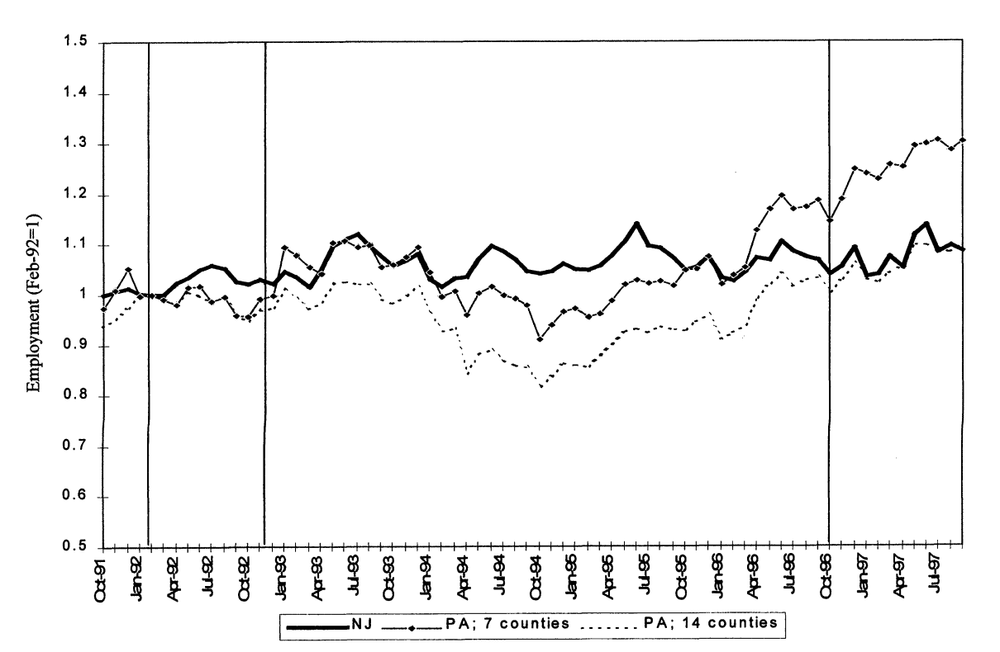


## Difference in Difference: Questions {.build}

### How does NJ change vs. PA?

- Looks like NJ sees the same or higher employment after April 1992
- Difference in Difference shows no increase in unemployment with minimum wage

### How do pre-law trends compare?

- NJ employment is ~flat
- PA is trending down, or trending up (depending on which counties)
- Is PA trend counterfactual for NJ trend?

## Difference in Difference:

### For Difference in Difference to work:

Assumption that "treated" and "untreated" **trends** are counterfactuals

- This is called "parallel trends" assumption
- Can never **know** it is true (because of FPCI)
- But we can see if it **plausible**
- Are the trends similar **prior** to the change in the cause?

## Diff-in-Diff: Parallel Trends


## Diff-in-Diff: Parallel Trends

### Speeding:

- State with spike in speeding deaths passes law in response
    - Decline could be due to the law
    - But also return to normal deaths, after anomaly
    - Compared to other states, violates **parallel trends**
    - "Control" state trends not counterfactuals


## Diff-in-Diff: Guns and Violence {.build}

Does increase in gun ownership lead to more violence?

### Evidence so far

- 0 correlation when we don't adjust
- positive correlation when we adjust

### A design-based approach?

## Diff-in-Diff: Guns and Violence

### Design:

- December 2012, Sandy Hook shooting raised debate on gun control
- Gun purchases rose dramatically following the shooting
- But some states have longer waiting periods than others

### Difference-in-difference

Do states with no waiting periods...

- see relatively more gun purchases post-Sandy Hook?
- see relatively more gun violence post-Sandy Hook?
- holding state/county unchanging attributes constant
- holding national trends constant

## Diff-in-Diff: Parallel Trends


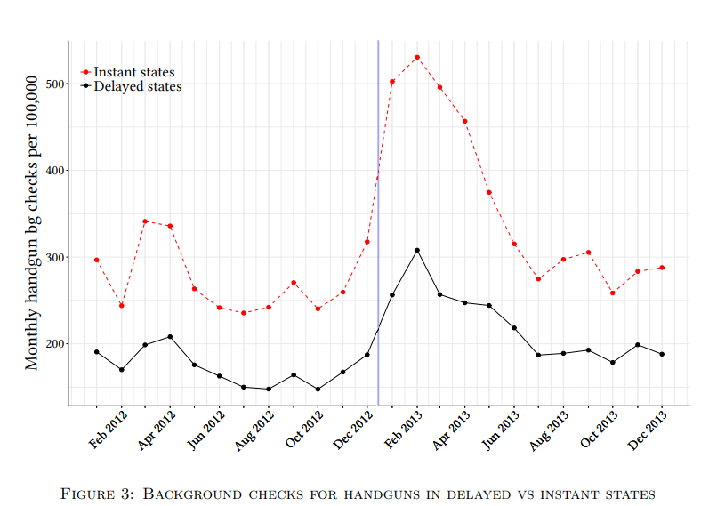

## Diff-in-Diff: Parallel Trends

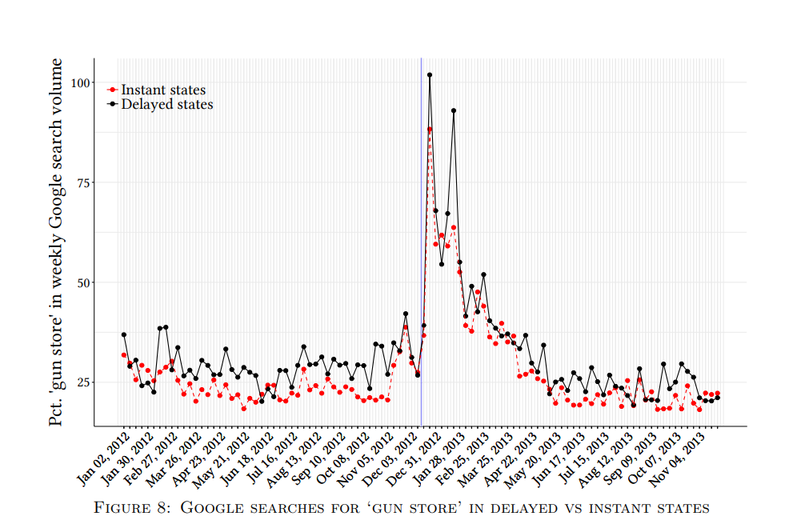

## Diff-in-Diff: Guns and Violence

Assumptions appear to hold:

- Counties in states with and without waiting periods have similar trends
- In both states, an increase in **demand** for guns, but policy limits number obtained


## Diff-in-Diff: Guns and Violence

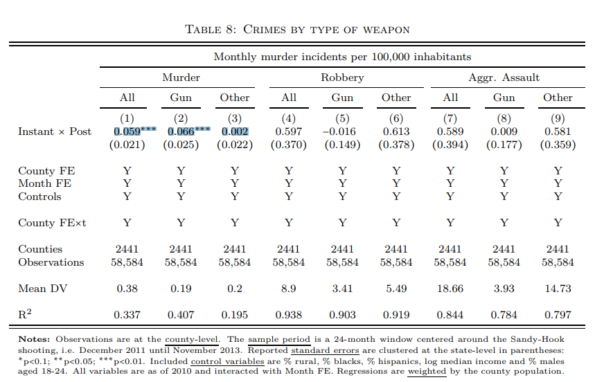


## Diff-in-Diff: Parallel Trends

### Gun Control:

- State with spike in gun-deaths
    - Could pass gun-control law in response
    - Is decline in gun-deaths due to the law?
    - Because of pre-law spike, may not have **parallel trends**
    - "Control" state trends not counterfactuals


## Diff-in-Diff: Parallel Trends?

What do we do if we can't find another case that we think has the same **trend** as the case with treatment?

- One option is to "create" one, by weighting many other cases.
- "Synthetic control": a sort of mathematical Frankenstein counter-factual that looks the same on pre-treatment trends.
- Let's us compare, more plausible that trends are counterfactuals

## Diff-in-Diff: Parallel Trends? {.build}

### Gun Laws:

In 1995, Connecticut passed law requiring permit-to-purchase a handgun.

- Did increasing obstacles to obtaining a weapon lead to fewer firearm homicides?
- Did reducing firearms lead to an increase in non-firearm homicides?

### Researchers find a "synthetic" Connecticut

## Diff-in-Diff: Parallel Trends?

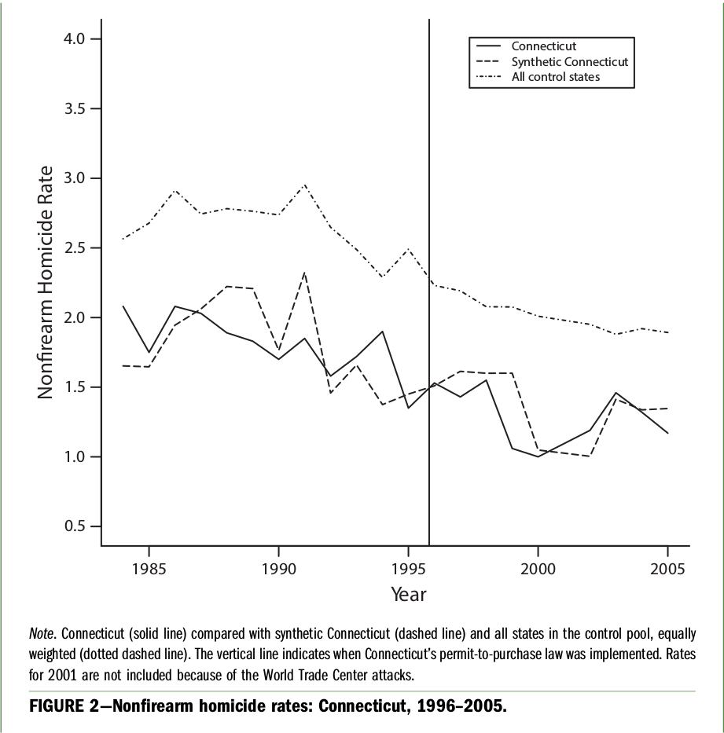

## Diff-in-Diff: Parallel Trends?


## Diff-in-Diff: Parallel Trends?

### Parallel trends?

"Frankenstein" Connecticut has same pre-law trends in:

- Firearm homicides
- Non-firearm homicides

as the Real Connecticut

### Effects?

Compared to the "control", Real Connecticut:

- Has no change in non-firearm homicides
- Decline in firearm homicides

Gun control causes fewer overall homicides, by stopping firearm homicides


## Design-based

### Natural Experiments

Compare groups of cases that differ in exposure to cause **at random** by nature

- Eliminate **all** confounding variables **if** assumption of **randomness** is true

### Varieties:

**standard**: lotteries, simple random process of assigning treatment

**regression discontinuity**: fancy phrase for when treatment is assigned at a cut-off

**instrumental variables**: **antecendent variable** to our cause is **random**ly assigned


## Natural Experiments

**standard** natural experiments:

- Look for a cases for which exposure to our cause is **random**

### Examples:

- Truly random: lotteries
    - Draft lotteries and military service
    - Winning money and lottery
    - Access to government policy
- "As-if" randomization due to unrelated factors
    - e.g. effect of police on crime when police positions chosen to protect synagogues
    - e.g. exposure to cholera water
    
## John Snow, again

In 1854, Cholera broke out again...

This time, Snow was ready to get serious.

## John Snow, again

Noticed a difference between two water suppliers:

1. Southwark & Vauxhall Co.: Collected water from area downstream of sewers on the Thames
2. Lambeth Co.: Previously collected water near sewers, but recently relocated upstream of London (cleaner water)

Importantly:

- Both companies competed in the **same area**, pipes of both companies on the same streets
- Customer base the same 

----

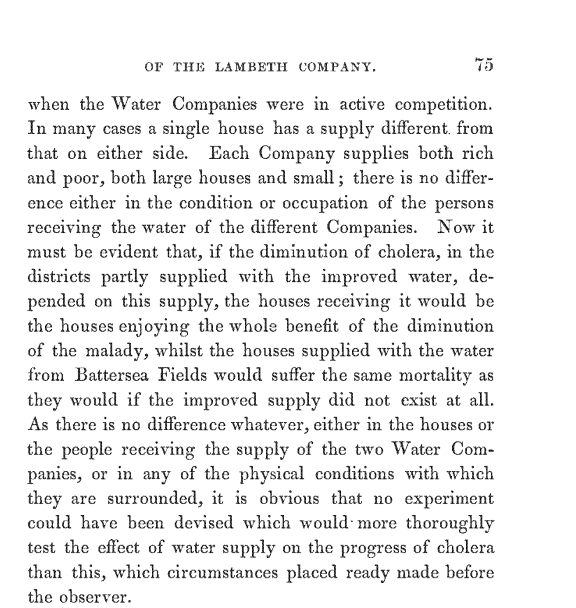

## John Snow, again

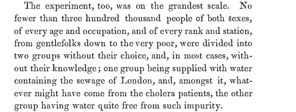

## John Snow, again

Snow's contention is:

- Exposure to contaminated water in these districts **as-if random**

### Collects data

- Identifies number of houses receiving water from these companies
- Identifies water supply of all cholera deaths (goes door-to-door, develops water test)
- Compares **mortality rate** in these two groups

## John Snow, again

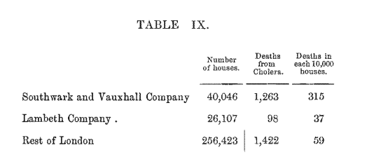

## Natural Experiments

**regression discontinuity** natural experiments:

1. "Treatment" or cause changes at some cut-off: e.g.
    - income-based requirements to get welfare
    - percent of votes to win election
2. Cases **close** to the cutoff are similar
    - random events like rain, or being sick shift cases to one side or the other
    - how close?
3. Assuming...
    - Cases do not **know** the cutoff
    - and/or cases cannot game the system switch sides

## RD: Example: {.build}

### Do *secular* political parties *stop* religious violence?

### Maybe:

- Might back minority rights to ensure religious equality
- Religious violence might make religious parties more attractive
- More committed to law and order?

### Maybe not:

- may be hard for politicians to stop violence
- stopping violence may be seen as "taking sides", alienating voters
- *all* political parties motivated to maintain law and order

## A social scientific approach:

Looking at MLAs in India between 1961 and 2000

- Does having a "secular" MLA reduce religious violence?
    - Does having MLA from Indian National Congress (party of Gandhi, Nehru) reduce violence?
    - INC portrayed itself, seen as protector of minorities

## The study

What can we compare?

- Districts in which Congress MLA barely won, versus barely lost

Why?

- Logic of regression discontinuity says they should be as-if random
- So... no confounding variables to produce spurious correlation

## Close elections (less than 1%)

### Like a coin flip

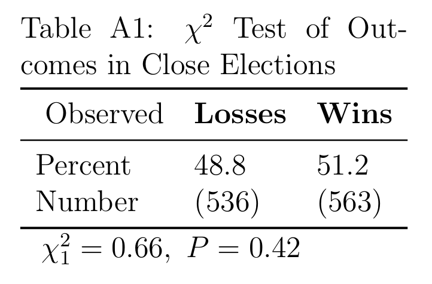


## Close elections (less than 1%)

### INC win unrelated to pre-election variables

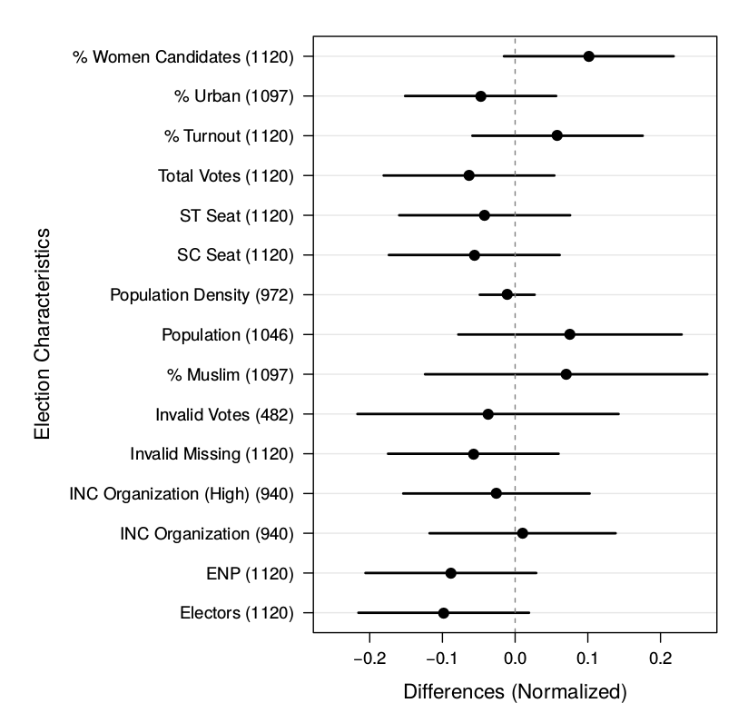

## Results


## Results: {.build}

Places where Congress MLA barely wins:

- Fewer riots, less likely to have **any** riots
- Less intense riots    
    

## Natural Experiments

**instrumental variable** natural experiments:

We isolate changes in our cause $X$ due to **randomness** in **antecedent variable** $Z$

- If **antecedent variable** (cause of) $X$ is random
- Can find random variation in $X$
- **IF** antecedent variable does not affect $Y$ **except** through $X$


## Instrumental variables

```{r, echo = F}
par(mfrow = c(1,1))
dag <- dag.init(y.name = "", x.name = "", 
        covs = c(1,1),
        arcs = c(1, 0, 1,-1,2,0),
        symbols = c('X','W','Z','Y'))
invisible(dag.draw(add.arc(dag, arc = c(1,4), type = 1), legend = F, noxy=1))

```


## Instrumental variables

```{r, echo = F}
par(mfrow = c(1,1))
dag <- dag.init(y.name = "", x.name = "", 
        covs = c(1,1),
        arcs = c( 1,-1,2,0),
        symbols = c('X','W','Z','Y'))
invisible(dag.draw(dag, legend = F, noxy=2))
text(mean(dag$x[c(1,4)]), dag$y[1], "Effect X due to Z unbiased", pos = 1)
```

## Instrumental variables Example

### Economic growth and Civil War

Does increasing economic growth **decrease** likelihood of civil war?

### Empirical Evidence:

- Correlation between high wealth and low civil war
- Possibly spurious

## Instrumental variables Example

Instead of adjusting for possible confounders...

#### What randomly changes economic growth?

### Miguel et al 2004

1. Examines civil war in Africa
2. **Shocks** in rainfall (deviation from norm)
    - Affect the economy (droughts bad for crops, e.g.)
    - Are random (no weather control)
3. Changes in economy **due** to **rain shocks** are as-if random

## Instrumental variables Example

```{r, echo = F}
dag <- dag.init(y.name = "", x.name = "", 
        covs = c(1,1),
        arcs = c(1, 0, 1,-1,2,0), xgap = 0.1, ygap = 0.1,
        symbols = c('Economic\nGrowth','Confounders','Rainfall','Civil\nWar'))
invisible(dag.draw(add.arc(dag, arc = c(1,4), type = 1), legend = F, noxy=1))
text(mean(dag$x[c(1,4)]), dag$y[1], "Possibly spurious", pos = 1)
```

## Instrumental variables Example

```{r, echo = F}
dag <- dag.init(y.name = "", x.name = "", 
        covs = c(1,1),
        arcs = c( 1,-1,2,0), xgap = 0.1, ygap = 0.1,
        symbols = c('Economic\nGrowth','Confounders','Rainfall','Civil\nWar'))
invisible(dag.draw(add.arc(dag, arc = c(1,2), type = 1), legend = F, noxy=2))
text(mean(dag$x[c(1,4)]), dag$y[1], "Growth via Rainfall unbiased", pos = 1)
```

## Instrumental variables Example

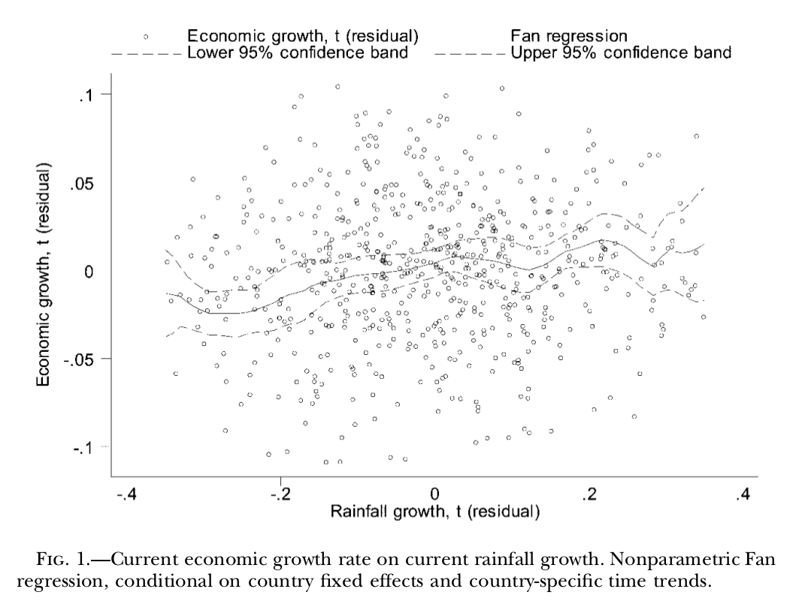

## Instrumental variables Example

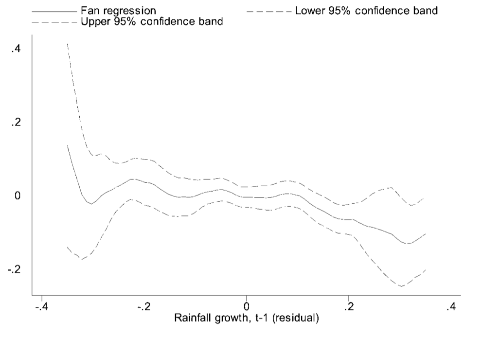

## Instrumental variables Example

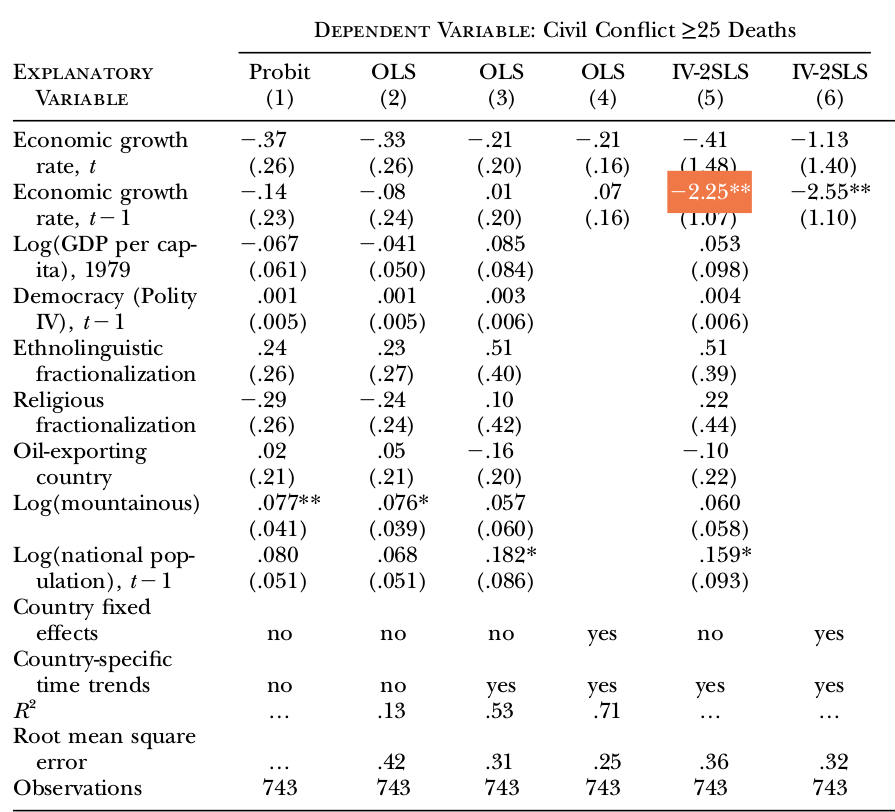

## Instrumental variables Example

Different solutions, different answers:

1. Adjusting for confounding variabels
    - Find **no** significant effect
2. Difference in Difference (country, year "fixed effects")
    - Find **no** significant effect
3. Instrumental Variables (rainfall shocks):
    - Growth causes significant **decrease** in civil war
    


