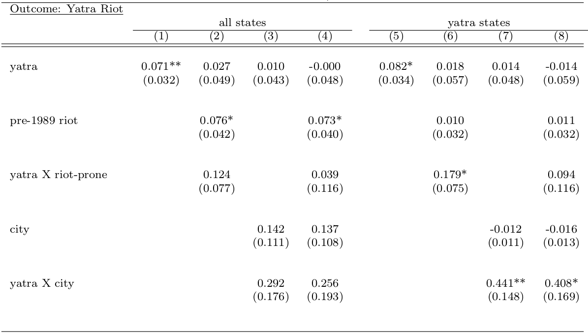
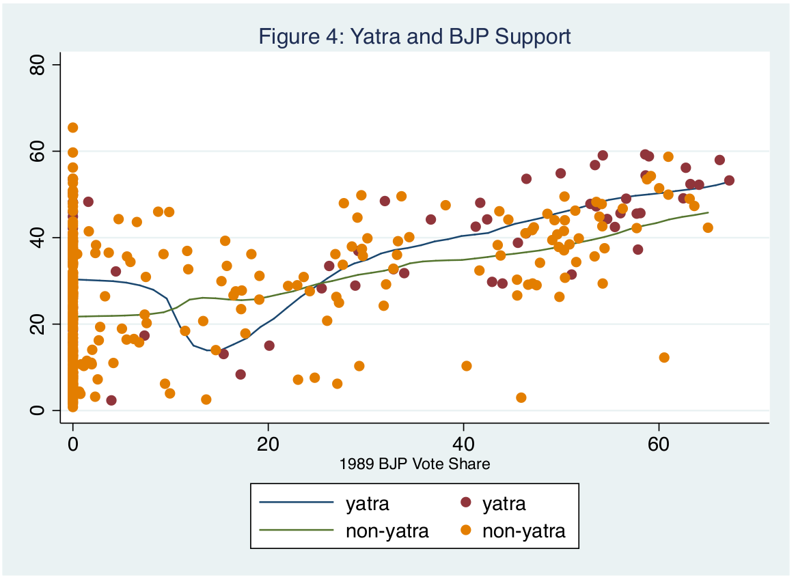
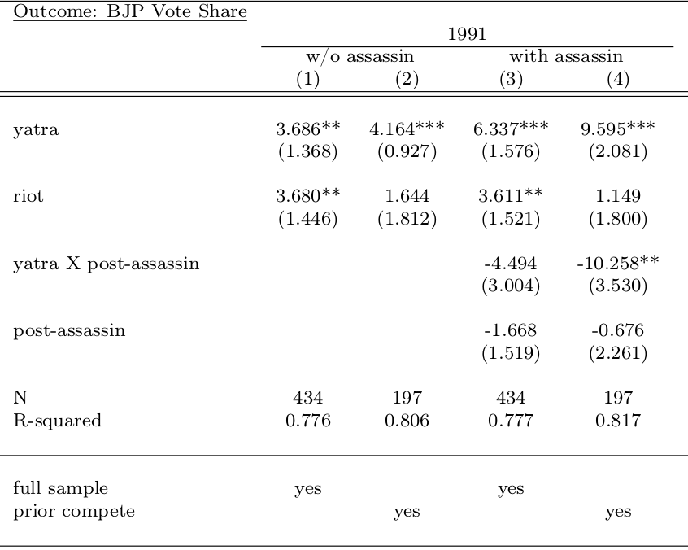
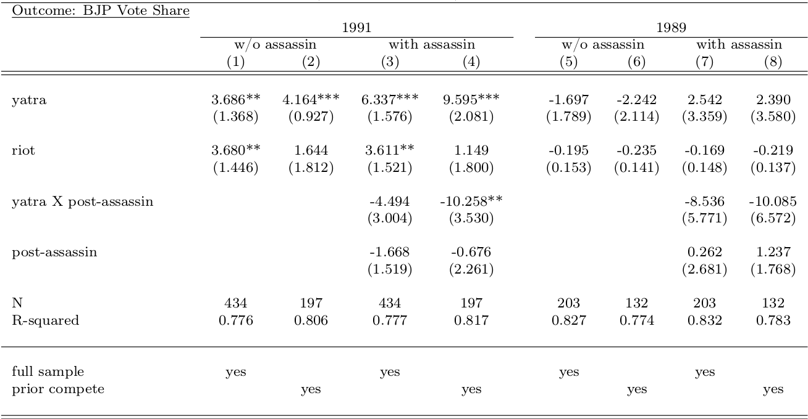
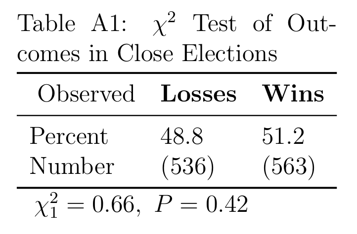
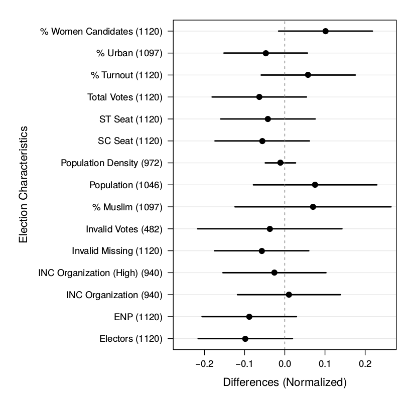
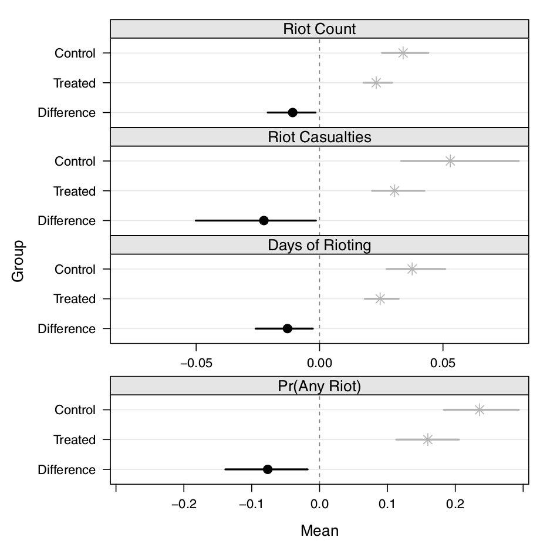
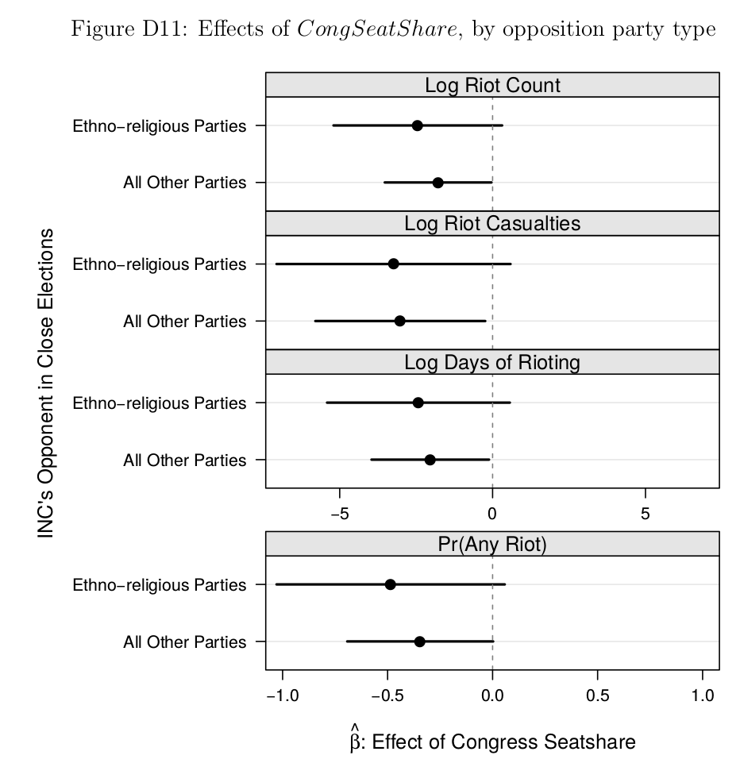
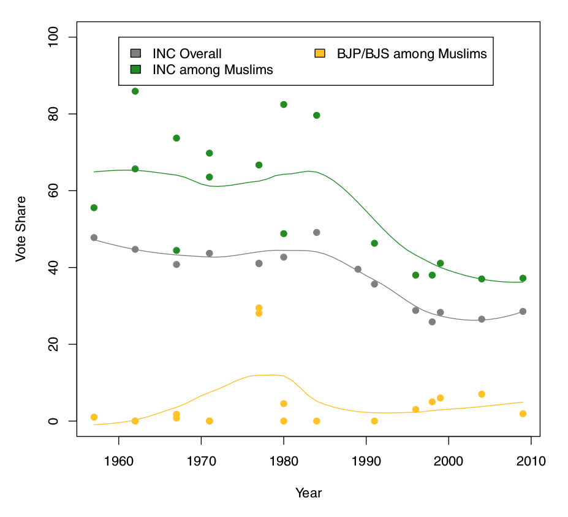

```{r setup, include=FALSE}
knitr::opts_chunk$set(echo = FALSE)
```


```Set up column break```
<style>
.forceBreak { -webkit-column-break-after: always; break-after: column; }
h3, h4 {font-weight: bold;
        color: #515151;}
</style>


# Motivating Puzzles

POLI 110

## Communal Violence in India

>- Largest democracy, arguably most diverse
>- But ethnic violence a problem since Independence (1947)
>- Can democracy be compatible with such diversity?

## Ram Ke Naam
### "In the Name of God"

- 1991 Documentary

- Covers protest and political activity around Babri Masjid (mosque) in Ayodhya

### While you watch

- What questions this film raises for you?

>- particularly about politics

- Write those questions down

## 

<iframe width=100% src="http://www.youtube.com/embed/OO-VaJBHiik?start=0&end=241&autoplay=0" frameborder="0" allowfullscreen></iframe>


## 

<iframe width=100% src="http://www.youtube.com/embed/OO-VaJBHiik?start=695&end=740&autoplay=0" frameborder="0" allowfullscreen></iframe>


## 

<iframe width=100% src="http://www.youtube.com/embed/OO-VaJBHiik?start=900&end=992&autoplay=0" frameborder="0" allowfullscreen></iframe>

## 

<iframe width=100% src="http://www.youtube.com/embed/OO-VaJBHiik?start=1040&end=1353&autoplay=0" frameborder="0" allowfullscreen></iframe>

## 

<iframe width=100% src="http://www.youtube.com/embed/OO-VaJBHiik?start=1859&end=2135&autoplay=0" frameborder="0" allowfullscreen></iframe>
 
##

<iframe width=100% src="http://www.youtube.com/embed/OO-VaJBHiik?start=2174&end=2326&autoplay=0" frameborder="0" allowfullscreen></iframe>

##

<iframe width=100% src="http://www.youtube.com/embed/OO-VaJBHiik?start=3290&end=3456&autoplay=0" frameborder="0" allowfullscreen></iframe>

##

<iframe width=100% src="http://www.youtube.com/embed/OO-VaJBHiik?start=3795&end=3930&autoplay=0" frameborder="0" allowfullscreen></iframe>

## What questions did this raise?


#

## Some kinds of question: {.build}

### Specific

* What caused the conflict over the Babri Masjid?
    + deep historical religious tensions?
    + modern politics?

* Did the Rath Yatra (BJP/Advani's pilgrimage to Ayodhya):
    + have political benefits for the BJP?
    + lead to violence?

* Do caste differences intensify or weaken Hindu-Muslim tensions?

## Some kinds of question: {.build}

### General

- Does democracy intensify or moderate ethnic/religious differences?

- How can minority groups receive protections in a democracy?

- Do political parties stir up ethnic/religious conflicts?

- Do political parties make electoral gains from conflict?

- What kinds of constitutional arrangements make ethnic/religious conflict more or less likely?

# Two investigations

## Rath Yatra {.build}

### What effects did it have on 

- voting?
- violence?

### Why might it have an effect?

Cultural appeals:

- drew upon Hindu religious iconography / pilgrimage 
- aimed to unify religious community
- narrative in which Hindus victims of Muslims

Propaganda:

- major news coverage
- large audience: march moved through cities, towns, villages

## How would we know? {.build}

>- How did the BJP performed in places along the route?
>- Was there violence in places along the route?
>- Ask people on the route?

### Compared to what? 

* Occurrence of Yatra due to prior religious tensions
    + Any violence/ support for BJP incidental
* Yatra route chosen to visit supporters
    + BJP performance is better due to planning process, not event
  
## A social scientific approach:

Blakeslee (2014) looks at effect of location on Yatra Route on:

- 1991 MP elections
- Hindu-Muslim riots


## How

- Data on MP constituencies
    + did Yatra pass through
    + Election outcomes
    + attributes of places on Yatra route
  

## Do you see a pattern? {.columns-2}

- Riots in red
- Yatra route in blue
- States: bold
- MP constituencies: thin 

<p class="forceBreak"></p>


## Results: Riots



## Results: Riots

Finds more riots in places on the route...

...even when comparing MP constituencies

- only from states that saw Yatra
- that were similarly urban / rural
- with similar histories of riots

## Do you see a pattern?
y: 1991 BJP % **|** x: 1989 BJP % **|**
lines: average yatra/non-yatra



## Results: Elections



## Results: Elections

Finds more BJP votes in 1991 MP elections in places on route...

...even when comparing MP constituencies

- with similar histories of violence
- similar proximity to Ayodhya (end of Yatra)
- similar BJP electoral performance in 1989
- within the same state

## Healthy skepticism...

### Couldn't the route have been chosen to visit supporters?

If so, what pattern would you expect to see between:

>- location on Yatra route
>- pre-Yatra BJP electoral performance?

## What we *don't* observe is important:
 


## What have we learned?

When political parties mobilize one religious group and play up religious differences:

- they can win voters from their religious group 
- this religious mobilization can lead to violence

## How have we learned it? {.build}

### Not through:

>- pundits/journalists/politicians
>- documentary narratives
>- common sense

### Using social science

## Another take: {.build}

### Do *secular* political parties *stop* religious violence?

### Maybe:

- Might back minority rights to ensure religious equality
- Religious violence might make religious parties more attractive
- More committed to law and order?

### Maybe not:

- may be hard for politicians to stop violence
- stopping violence may be seen as "taking sides", alienating voters
- *all* political parties motivated to maintain law and order

## A social scientific approach:

Looking at MLAs in India between 1961 and 2000

- Does having a "secular" MLA reduce religious violence?
    - Does having MLA from Indian National Congress (party of Gandhi, Nehru) reduce violence?
    - INC portrayed itself, seen as protector of minorities

## The study

What can we compare?

- Districts in which Congress MLA barely won, versus barely lost

Why?

- Should be quite similar
- Otherwise, e.g., places that vote more secular might have less religious animosity => less violence

## Close elections (less than 1%)

### Like a coin flip




## Close elections (less than 1%)



## Results



## Results: {.build}

Places where Congress MLA barely wins:

- Fewer riots, less likely to have **any** riots
- Less intense riots

### Why?

- Is it just **not** being a religious party?

## Something unique...



## Why?


## Why?



## What have we learned?

- Secular party lives up to commitments to protect minorities

>- But, it appears to only do this when it is electorally beneficial


<!-- ## Internet and democratization -->

<!-- ### Arab Spring -->

<!-- - Protest, demonstrations in Arab world from December 2010 -->

<!-- - Fall of governments in Tunisia, Libya, and Egypt -->

<!-- - Serious threatds to Syrian and Yemeni regimes -->

<!-- - Spread to Bahrain, Saudi Arabia, Jordan -->

<!-- ### "Facebook Revolution"? "Twitter Uprising"? -->


<!-- ## Internet and democratization -->

<!-- ### Maybe... -->

<!-- - new information (increased opposition to regime) -->
<!-- - free expression (wait for others to show public opposition) -->
<!-- - capacity to organize (new ways to plan protest, outmanuever government) -->

<!-- ## Internet and democratization -->

<!-- ### But governments can use the internet -->

<!-- - Iran 2009 -->
<!-- - Hong Kong Umbrella Movement -->

<!-- ## Internet and democratization -->

<!-- ### How do authoritarian regimes control expression via the internet? -->

<!-- (What is their aim?) -->

<!-- # China -->

<!-- ### Three investigations in -->

<!-- ## Study (I) -->

<!-- - Examination of censorship in Chinese social media -->

<!-- - Posts from 1382 Chinese blogs in 2011 -->

<!-- - High-frequency *automated* downloads of posts gets content *before* censors remove it -->

<!-- - Comparison of post-censored to pre-censored content -->

<!-- ## Censorship of one-child policy -->

<!-- ## Censorship of education policy -->

<!-- ## Censorship of corruption -->

<!-- ## Riots in Zengcheng -->

<!-- ## Ai Weiwei -->

<!-- ## Inner Mongolia protests -->

<!-- ## Criticism of censors -->

<!-- ## What is the pattern? -->

<!-- - Chinese government does not censor **criticism** -->

<!-- - Censor internet use to collectively mobilize against the government -->

<!-- Censorship is less about **thought-control** than about stopping **organizing for change** -->

<!-- ## Limitations: -->

<!-- This can only capture **manual** censorship. -->

<!-- Automatic censoring may eliminate regime criticism more easily, biasing the results. -->

<!-- ## Study (II) -->

<!-- - Experiment on social media posts in China in short windows in 2013 -->
<!--   - on major Twitter-like sites (weibo.com, t.qq.com, t.sohu.com) -->

<!-- - Random assignment of posts to be  -->
<!--   - pro-/anti- government -->
<!--   - addressing collective action/ non-collective action events -->

<!-- - Design lets researchers: -->
<!--   - detect automatic and manual censoring -->
<!--   - ensure posts have same keywords, same authors, same length -->
<!--   - events occuring in identical windows of time -->


<!-- ## Study (II) -->

<!-- - Figure 2 -->

<!-- - Censorship of CA vs Non-CA -->

<!-- ## Study (II) -->

<!-- - Figure 3 -->

<!-- - left half: difference in censorship: pro, anti government -->

<!-- ## Study (II) -->

<!-- - Figure 5 -->

<!-- - Automated Review: little difference -->

<!-- ## Study (III) -->

<!-- Astroturf on the internet? -->

<!-- - "50c party" (paid comments) -->

<!-- >- Do they exist?  -->
<!-- >- What do they do?  -->
<!-- >- How many? -->

<!-- Common wisdom: -->

<!-- - act like "trolls", argue/debate with regime opponents -->

<!-- ## Study (III) -->

<!-- How would we know? -->

<!-- >- Internet Propaganda Office emails leaked -->

<!-- >- Emails identify ~43,000 50c posts -->

<!-- >- w -->