```{r setup, include=FALSE}
knitr::opts_chunk$set(echo = FALSE)
```


```Set up column break```
<style>
.forceBreak { -webkit-column-break-after: always; break-after: column; }
h3, h4 {font-weight: bold;
        color: #515151;}
</style>


# What is Social Science?

POLI 110

<div class="notes">
Last week:

- Several examples of questions

Starting point:

- What interests us? Our passions.
    - democracy / human rights/ environment is important
    - gender equality
    

- Specific Events:
    - Rath Yatra
    - Election of Donald Trump
    - How did some major global or national event happen?

</div>

## Answering questions

Lots of types of questions:

- Which ones can we answer?
- Which ones can we answer *scientifically*?
- What is a good answer?


## Science?

Which of these is a **fundamental** quality of **scientific** inquiry?

Explain why.

1. Exact measurement
2. Making conclusions with high certainty
3. Employing transparent procedures
4. Seeking universal truths, laws
5. Controlled experiments

## 

# Making claims

## Claims

A statement about the world

- What things/relationships exist or should exist

We can accept or reject the truth of a claim

- But why would we accept or reject a claim?
- What criteria can we use?

## Criteria

Many possible criteria for evaluating a claim

- Not all are scientific
- Different criteria make different assumptions

## A claim

> Foreign aid is beneficial

Basis for the claim:

> "The war against terror is bound up in the war against poverty." 
> Who said that? Not me. Not some beatnik peace group.
> Secretary of State [and retired General] Colin Powell. 
> And when a military man starts talking like that perhaps we should listen.

- Bono


## What kind of claim is that? {.build}

### Appeal to authority (*argumentum ad verecundiam*)

 Arguing that claim is true **because** a person with **authority** says it is true.
 
> "Chief of police says that the gun control bill will lead to more murders."

> "Immunization against relatively harmless childhood diseases may be responsible for the dramatic increase in autoimmune diseases." — Dr. Robert Mendelsohn MD, pediatrician

## Appeal to authority

>- Herr/Frau Schmidt

>- Herr/Frau Dr. Schmidt

>- Herr/Frau Professor Dr. Schmidt

>- Herr/Frau Professor Dr. Dr. Schmidt

## Basis for Claim: Authority

### Problems with appeals to authority:

>- Expertise **not a guarantee** of being correct

## Experts can be wrong

### Claim: 

> Quantum mechanics is incomplete

### Basis for the claim:

> "God does not play dice"

> "no-spooky-action-at-a-distance"

- Einstein

## Expertise may be false or irrelevant

### Claim: 

> As far as the cyber, I agree to parts of what Secretary Clinton said. We should be better than anybody else, and perhaps we're not. I don't think anybody knows it was Russia that broke into the DNC. I mean, it could be Russia, but it could also be China. It could also be lots of other people. ... So we have to get very, very tough on cyber and cyber warfare. It is — it is a huge problem. ... The security aspect of cyber is very, very tough. And maybe it's hardly doable.

- Donald Trump

### Basis for the claim:

> I have a son. He's 10 years old. He has computers. He is so good with these computers, it's unbelievable.

## Basis for Claim: Authority

### Problems with appeals to authority:

- Expertise **not a guarantee** of being correct

>- Experts may have an **agenda**

## Experts have motive other than the truth

### Claim:

> "Climate change is not caused by human activity"

### Basis for the claim:

> "These scientists say the evidence does not support the claim."

>- These scientists also have had work paid for by Exxon Mobil

## Experts have motive other than the truth

### Claim:

> "Given your condition, you should take this new drug, X."

### Basis for the claim:

> "I am a doctor."

>- This doctor receives gifts, meals, money from manufacturer of drug X.

## Basis for Claim: Authority

### Problems with appeals to authority:

- Expertise **not a guarantee** of being correct

- Experts may have an **agenda**

>- Too easy to **cherry-pick** authorities that agree

##

### Claim:

> Cutting the corporate tax rate will dramatically increase economic growth, offsetting the loss in revenue from the cut in rates

### Basis for the claim:

> Tax Foundation economic models find increase in GDP of 3.7% and deficit increased by only $400 billion over ten years.

>- But models from Joint Committee on Taxation (created by Republicans to use economic models more favorable to tax cuts), Tax Policy Center, and Penn Wharton all find small increases in GDP and deficit increase by $1.5 trillion over ten years.

## Basis for Claim: Authority

### Problems with appeals to authority:

- Expertise **not a guarantee** of being correct

- Experts may have an **agenda**

- Too easy to **cherry-pick** authorities that agree

>- What happens when authorities **disagree**?

## Proliferating authorities

Representative Tom Cole:

> Though **mainstream forecasters** like the Joint Committee on Taxation and University of Pennsylvania have issued **unflattering analyses of GOP proposals**, Cole says his tax-committee colleagues tell him **other models offer sunnier results in line with his core belief** that lower taxes boost the economy. **He doesn't know what those models are**, but doesn't worry about that. He distrusts economic forecasts across the board because, he says, they're so often wrong. **"I don't find any of that persuasive," he explains. "There are about as many economists as there are opinions."**

>- Disagreeing authority leads to cherry-picking and/or irrelevance of evidence

## Problems with appeals to authority:

- Expertise **not a guarantee** of being correct

- Experts may have an **agenda**

- Too easy to **cherry-pick** authorities that agree

- What happens when authorities **disagree**?


## Basis for Claim: Authority

### Beware: 

- The basis of authority is often "science."

- Turns science into something magic and should not make it persuasive


## What foods promote health? {.build}

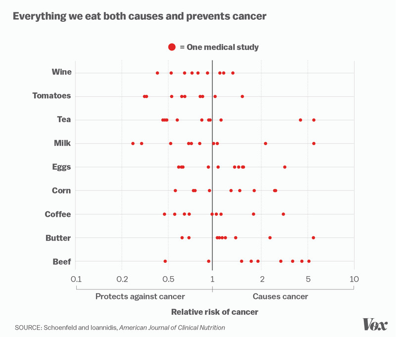

## Worst case scenario:

### Studies Show That You Should Come Into This Room Right Over Here, And That You Should Come Alone

> Recent studies suggest that it’s very important that you come into this room right over here just now. Studies also suggest that it’s equally important you do not waste time asking questions like “what room” and “why” and “why is this so important to you,” but just step this way through the door very quickly and by yourself, immediately.
> The studies were conducted, and the evidence is conclusive: this room just over here is where you should go next, without anyone coming with you. Scientists did them, the studies. Which ones? Yes.
> The studies are all finished now, and you don’t need to see them. The studies suggested that it’s not important you see the studies at all, but it is important that you hurry along, quickly now, because time is of the essence. The studies say now is the best time for you to be alone in that room.

## Worst case scenario:

> Recent studies suggest shhh and hush.
> A number of studies – more studies than you could count, but don’t count them – have all concluded the same thing. The room is for you. Go there now, without looking inside of it first or leaving the door cracked open behind you. All the studies agree. They’re all concerned about you, and they want what’s best for you, and for the room.
> The studies were published. The studies were conducted. The studies started and happened and ended, and they’re full of data, and the data is for you. As it turns out, “Things are best for you when you go into the room right now without bringing anyone with you,” one of the scientists from the study said. “That’s when things are best, in the room.” You should go there now.

[The studies that show this](https://the-toast.net/2015/06/24/studies-show-that-you-should-come-into-this-room-right-over-here-and-that-you-should-come-alone/)

## A claim

> Foreign aid is beneficial

Basis for the claim:

> If developing countries are poor, then obviously the problem is a lack of money. So giving them more money has to help.

## What kind of claim is that? {.build}

### Appeal to common sense

## Bases for claims: Common Sense

Claims from common sense:

- arguing that a claim is true **because** it is something "everyone knows" or "just makes sense"

Examples:

> "Guns kill people, so of course gun control will reduce murders."

> "Corporate tax cuts benefit everyone, because businesses with more money will pay employees more."

## Bases for claims: Common Sense

### Common sense can lead us astray:

>- Often based on **superficial similarities**

## 

### Claim:

> "Governments should rarely or never run deficits"

### Basis for the claim:

> "People or families cannot spend more than they make, neither should the government"

>- Individuals/families have budgets, so do governments. But they are otherwise very dissimilar.


## Bases for claims: Common Sense

### Common sense can lead us astray:

- Often based on **superficial similarities**

>- Often based on **analogy** between **very different situations**

## 

### Claim: 

In 2003:

> "US military invasion in Iraq will bring peace, democracy, and economic growth to the country."

### Basis for the claim:

> "The occupation of Germany promoted demilitarization, denazification, democratization and capitalist development while garnering widespread support within Germany and outside"

>- But the places, context of invasion, and the ways they were undertaken were totally different.

## Bases for claims: Common Sense

### Common sense can lead us astray:

- Often based on **superficial similarities**

- Often based on **analogy** between **very different situations**

>- Often good reasons what the **opposite** claim also makes sense


## {.build}

### Claim and basis:

> "Guns kill people, so of course gun control will reduce murders."

### Counterclaim and basis:

> "People kill people, so gun control will not stop murderers, because other weapons are available."

## {.build}

### Claim and basis:

> "Concealed carry of guns increases public safety, because crimes will be stopped or deterred by using guns in self-defense"

### Counterclaim and basis:

> "Concealed carry of guns decreases public safety, because availability means more people will make rash decisions to use firearms"

## Bases for claims: Common Sense

### Common sense can lead us astray:

- Often based on **superficial similarities**

- Often based on **analogy** between **very different situations**

- Often good reasons what the **opposite** claim also makes sense


## A claim

<iframe width=100% src="https://www.youtube.com/embed/w-SnGA0BKJI?autoplay=0" frameborder="0" allowfullscreen></iframe>

## Campaign ad

### Personally

- feel that painting candidate as plutocrat is damning

### Evidence

- Study of political ads
- Among least effective ads during that campaign

## Bases for Claims: Personal experience

A claim from **personal experience**:

> A claim based on one's own personal (nonsystematic) observation or one's own reaction to an observation

### Examples

"No one I know is voting for ____, so they won't win."

"I've had two identical watches from Timex that broke; they make poor quality products."

## "Broken windows" policing

> "You're not going to find the scientific study that can support broken-windows one way or the other. ... The evidence I rely on is what my eyes show me..."

- NYPD Chief Bill Bratton

## Bases for Claims: Personal experience

### Personal experience can be misleading:

>- We **generalize too quickly** from a small number of cases and our experience

## 

### "I have a gluten intolerance. I had [some product] a few times and each time I felt sick to my stomach afterwards."

### "Donald Trump is protecting manufacturing jobs. Carrier kept jobs after he pressured them."

## Bases for Claims: Personal experience

### Personal experience can be misleading:

- We **generalize too quickly** from a small number of cases and our experience

>- Our exposure to the world may be **skewed**

##

### "Poverty isn't a problem here, I don't know anyone who had trouble making ends meet."


## Bases for Claims: Personal experience

### Personal experience can be misleading:

- We **generalize too quickly** from a small number of cases and our experience

- Our exposure to the world may be **skewed**

>- We **observe** the world **selectively**

##

### "I'm afraid of going to large public events out of fear of a terrorist attack or mass shooting. But I drive to work everyday."

## Bases for Claims: Personal experience

### Personal experience can be misleading:

- We **generalize too quickly** from a small number of cases and our experience

- Our exposure to the world may be **skewed**

- We **observe** the world **selectively**

# What is social science?

## Monday {.build}

### What are the bases for claims?

### What are **unscientific** bases for claims?

### Today: what makes social science different?

## Unscientific bases for claims: {.build}

### Authority

### Commensense

### Personal experience

### Not an exhaustive list


## Bases for Claims: Personal experience

### Personal experience can be misleading:

>- We **generalize too quickly** from a small number of cases and our experience

## {.build}

### "I have a gluten intolerance. I had [some product] a few times and each time I felt sick to my stomach afterwards."

### "Donald Trump is protecting manufacturing jobs. Carrier kept jobs after he pressured them."

## Bases for Claims: Personal experience

### Personal experience can be misleading:

- We **generalize too quickly** from a small number of cases and our experience

>- Our exposure to the world may be **skewed**

##

### "Poverty isn't a problem here, I don't know anyone who had trouble making ends meet."


## Bases for Claims: Personal experience

### Personal experience can be misleading:

- We **generalize too quickly** from a small number of cases and our experience

- Our exposure to the world may be **skewed**

>- We **observe** the world **selectively**

##

### "I'm afraid of going to large public events out of fear of a terrorist attack or mass shooting. But I drive to work everyday."

## Bases for Claims: Personal experience

### Personal experience can be misleading:

- We **generalize too quickly** from a small number of cases and our experience

- Our exposure to the world may be **skewed**

- We **observe** the world **selectively**


## Science not always preferred:

> "What particularly galls police is that ivory-tower academics --- many of whom have never sat in a patrol car, walked or bicycled a beat, lived in or visited regularly troubled, violent neighborhoods or collected any relevant data of their own 'on the ground' --- cloak themselves in the mantle of an empirical 'scientist' and produce 'findings' indicating the 'broken windows' has been disproved. Worse, they allege that police have had little to do with the declines in crime."

## Science not always preferred:

[Click me](https://www.vox.com/2017/12/16/16784498/cdc-seven-words-science-transgender-fetus)


# Scientific bases for claims:

## Features of Science: {.build}

### Transparent procedures

### Systematic use of evidence

###Test claim against alternatives

### Acknowledge uncertainty

## Transparent procedures {.build}

### How did you arrive at your conclusion

- What data / observations did you use?
- What comparisons did you make?
- What choices as a researcher did you make, and why

### Why?

- Others can know the assumptions required to find result
- Others can question your choices
- Others can replicate your work

## Systematic Use of Evidence {.build}

### Observations we make:

- Based on clear rules for selection
- clear rules for comparison
- avoids "cherry-picking" 

### Doesn't need to be statistical:

- We can do this using historical evidence, personal observation
- As long as we set clear rules and procedures to minimize "cherry-picking"

## Consider alternatives {.build}

### Why?

- Openness to being wrong
- One positive piece of evidence can be consistent with many claims

### Test your claim against other competing claims

- Whichever claim "survives" many different tests is best

## Acknowledge uncertainty

Two ways:

### Limitations of your finding:

- Openness about how your evidence could still be wrong
- What questions remain unanswered after your study (what didn't it tell us)

### How certain or precise are our answers?

- Acknowledge possibility of chance relationships
- Given this, how "confident" can we be about our results being real?


# An example

## An issue {.build}

#### Political views tied to upbringing, deep beliefs, cultural values

- Not easy to change 
- Challenging belief on one issue can call all into question

#### But people do change their values on important questions

# How does this happen?

## One example: 

### How did people change their minds about same-sex marriage?

- lots of opposition, rooted in cultural norms, religious belief, tradition

- attitudes changed within generations

## One example: {.centered}

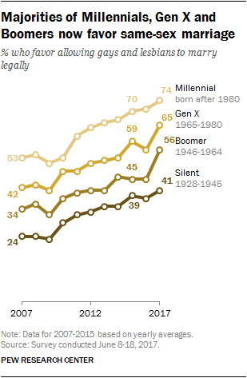

## One answer:

### Contact with a person who is homosexual can change minds

- So-called "contact hypothesis" applied to many excluded minorities

- Contact may humanize the other group, encourage taking their perspective, dispel prejudices

## Some evidence

<iframe width=100% src="https://www.youtube.com/embed/fw9yvuVOp6A?autoplay=0" frameborder="0" allowfullscreen></iframe>

## Some evidence

<iframe width=100% src="https://www.youtube.com/embed/alx2fB9Hu1k?start=24&end=113&autoplay=0" frameborder="0" allowfullscreen></iframe>

## What are the bases of these claims? {.build}

### Personal experience

### Common sense

### Authority?

## Does this prove contact works?

### Many other things are changing, not just contact:

- Portrayals on television
- Public figures who are homosexual
- Political leaders/religious leaders suppoting same-sex marriage

## Does this prove contact works?

### Who has contact?

#### People to whom ...

- Children, relatives, or friends come out
- Strangers reveal their sexual orientation

... may be more open-minded and persuadable. That is why they have these experiences.

## Does this prove contact works?

### Where does contact happen?

#### Places where ...

- People are likely to meet and talk to people who are homosexual 

... may have weaker cultural norms or institutions opposing same-sex marriage. More tolerant places may be more attractive to gay people or make them more comfortable being out. Thus, contact occurs in more tolerant places.

## An investigation {.build}

### Researchers conduct an experiment:

Can a single conversation change minds on divisive social issues, such as same-sex marriage?

Are conversations about same-sex marriage more persuasive when they are with a gay person?

## An investigation: set up

- Gay-rights organization canvassed for same-sex marriage in California
- Researchers worked with them to randomize which people received different "treatments"

### Subjects

- 972 registered voters 
- living in precincts that voted to ban same-sex marriage in 2008

## An investigation: set up

### Treatments

Subjects either saw:

- Canvasser **for** same-sex marriage who was **straight** or **gay**
- Canvasser **for** recycling program who was **straight** or **gay**
- No canvasser

### Survey

- Answered survey questions about homosexuality, same-sex marriage
- From 5 days after canvass to 280 days

## Findings:

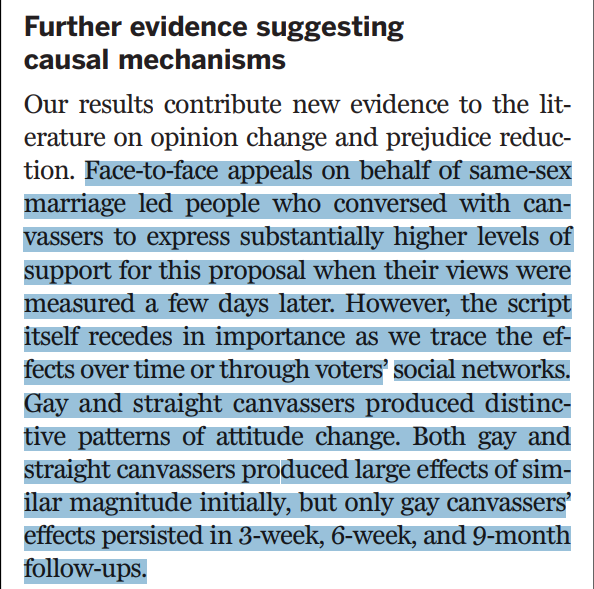

## Transparent Procedures: {.build}

### Paper: 4 pages

### Supplementary Appendix: 24 pages

## Treatments:


## Who was treated?

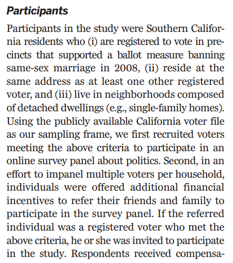

## How did they get treated?


## What were the survey questions?

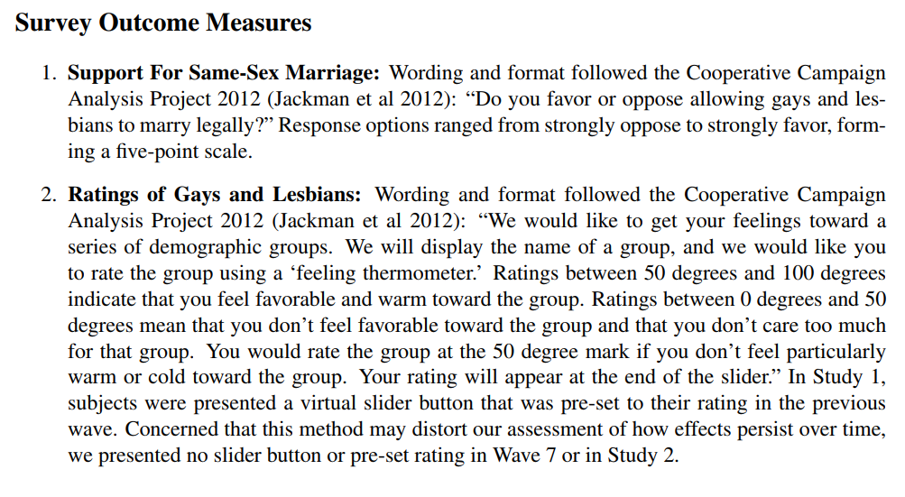

## Systematic use of evidence:

## What was the sample?


## What were the comparisons?

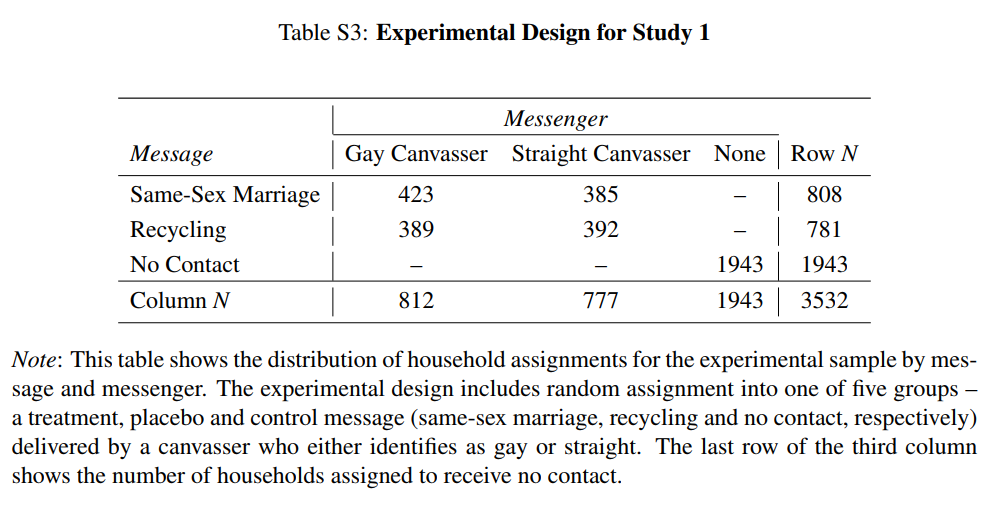

## Systematic use of evidence

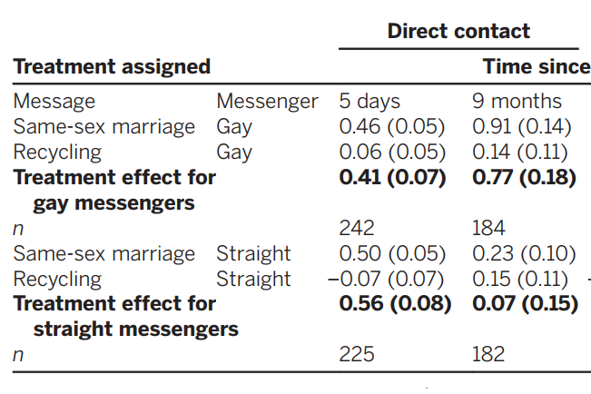


# What is social science

## Wednesday: Recap

- Identified attributes of social scientific evidence

- Contrasted to unscientific evidence

- Examples


## Key attributes

### Transparent procedures

### Systematic use of evidence

###Test claim against alternatives

### Acknowledge uncertainty

## Example: {.build}

### How do people change their minds on important issues?

### How do people change their minds about same-sex marriage?

### Does contact with gay canvasser make appeals for same-sex marriage more persuasive?

## Basic details of study

- Experiment on registered voters

- Two treatment, Two placebo, One control group

- Surveyed over 9 months

>- **Gay canvassers for same-sex marriage increase support, even months out**

## Study is scientific {.build}

### Transparent procedures

- detailed explanation of methods

### Systematic evidence

- Clear rules for who was included, how assigned treatment

### Consider alternatives?

## Consider alternatives: {.build}

### Could it be that some event (other than canvass) led to change?

- If only compared before/after conversation with gay canvasser, would be a problem

##


## Consider alternatives:

### But different treatments help:

- Can compare to "control" with no exposure
- Can compare to straight pro-marriage equality canvasser

## Consider alternatives:

### Could it be that effect is from having someone come to the door?

- Not the content or the contact, simply being canvassed

##


## Consider alternatives:

### Placebo treatments help:

- Recycling treatments show no effects
- Rule out "canvass-only" effect

## Consider alternatives:

### What if gay canvassers are different that straight in other ways?

- Might be better able to articulate issue
- Might be more motivated, so more persuasive
- Might be different in other ways that make them persuasive

## Canvassers rate themselves similar:

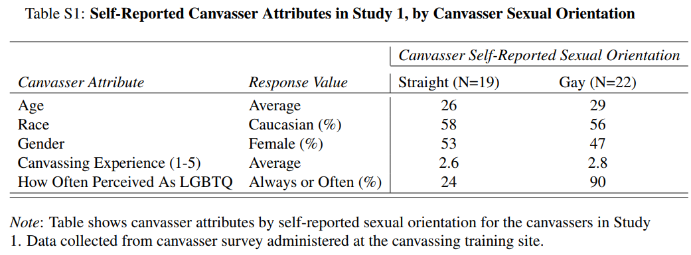

## MTurkers rate canvassers similar:

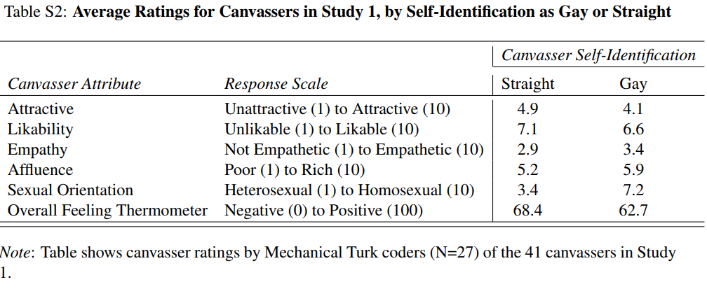

## Canvassers seem equally motivated

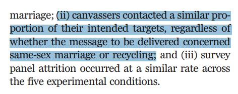

## Canvassers gave similar pitch

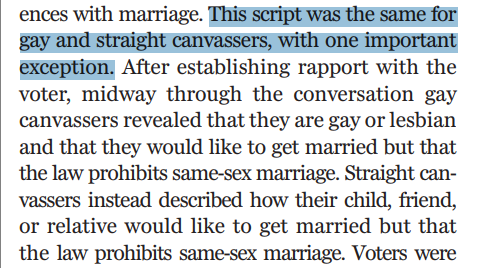

## More transparency!


## Uncertainty

### Statistical uncertainty
### Uncertainty in conclusions

## Results have confidence intervals


## Results leave questions

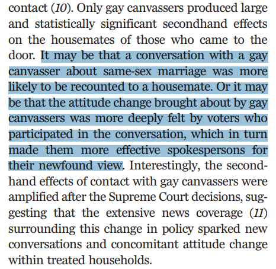

## Results leave questions

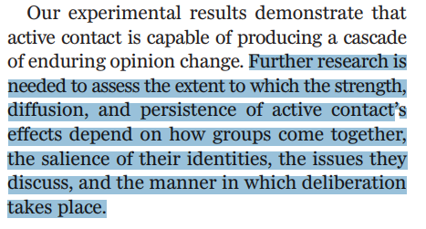

## Takeaway: {.build}

#### Transparency
#### Systematic evidence
#### Considering alternatives
#### Acknowledging uncertainty

### Key attributes: all are vital 

## BUT

# Transparency is key

## Why? {.build}

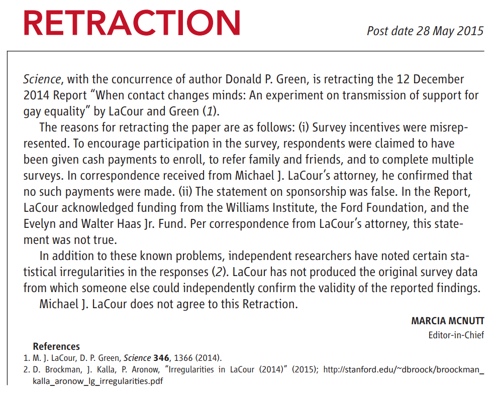

## WHAAAAAAAT?!

<iframe width=100% src="https://www.youtube.com/embed/zyLcNWFbwsc?start=890&end=1080&autoplay=0" frameborder="0" allowfullscreen></iframe>

## Shouldn't this concern us? {.build}

### YES

### BUT

>- Researchers saw important question
>- Uncertainty => more work needed 
>- Attempt to reproduce the study
>- Could not come up with same result 

#### Transparent procedures helped reveal the fraud!

## Replication is valuable!

Broockman and Kalla ultimately run new experiment!

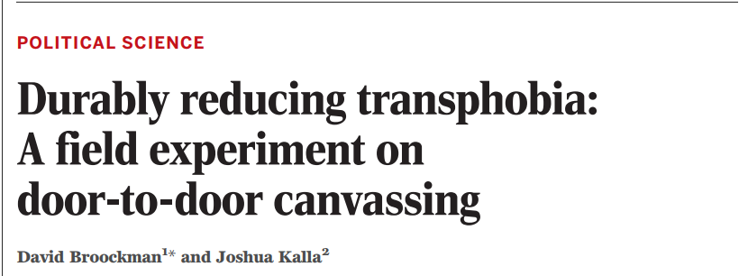

## New experiment

- Trans-rights organization canvassed to reduce transphobia in Miama, FL
- Researchers worked with them to randomize which people received different "treatments"

### Subjects

- 1825 registered voters 
- Drawn from responders to invitation to join online survey

## New experiment

### Treatments

Subjects either saw:

- Canvasser on law againts transgender discrimination who was **cis-gender** or **transgender**
- Canvasser **for** recycling program who was **cis-gender** or **transgender**
- Canvasser in treatment: asked people to consider time when they were judged negatively for being different

### Survey

- Answered survey questions about discrimination law, transgender tolerance
- From 3 days after canvass to 3 months

## Findings {.build}

### Substantially reduced opposition to discrimination law; increased tolerance
### Effects were persistent even 3 months out
### Effects did **not** depend on gender identity of the canvasser.

##

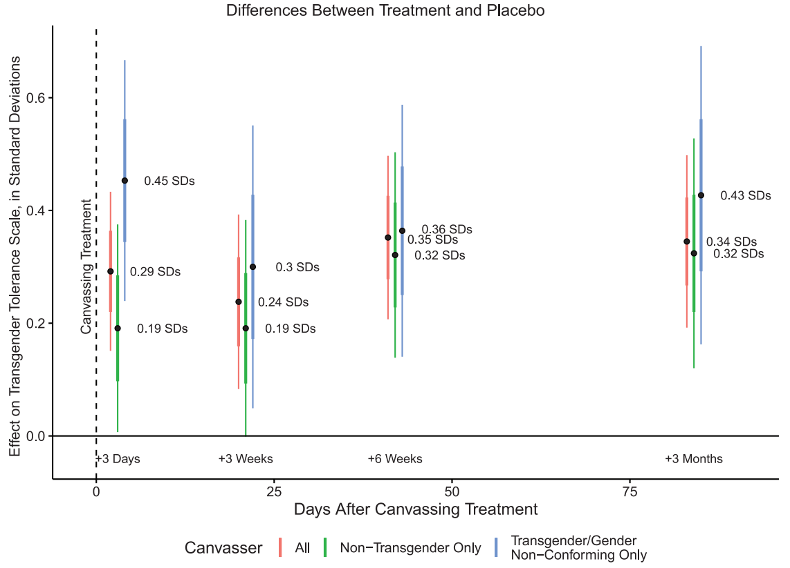

# Another example

## Ethnic and Religious violence {.build}

### Major problem today

### Major problem in much of 20th century

## Rohingya Muslims in Myanmar

## Ethnic cleansing in {.build}

### Syria, Iraq

### Georgia/Abkhazia

### Rwanda

### Balkans

### Northern Ireland

### Israel-Palestine

### Indian Partition

### Holocaust

### Armenian Genocide

## Multiculturalism Policy:

### Looking at these cases, and example of India from last week...

... do government policies that recognize and accommodate ethnic, cultural, religious difference

- create integration, cooperation, and peace?
- foster division and conflict?

## Research question:

### Do government policies aimed at increasing tolerance and cooperation between ethnic groups actually reduce conflict?

## Some evidence:

<iframe width=100% src="https://www.youtube.com/embed/UKG76HF24_k?autoplay=0" frameborder="0" allowfullscreen></iframe>


## Difficult to answer:

### How do we know state multicultural policy works or not?

>- Attitudes might change for other reasons
>- Attitudes might not change but would have been worse without policy
>- What kinds of places get multicultural policies versus not?
>- What kinds of places actually enforce policy vs. not?

## A social scientific approach: 

### Question:

> Can interethnic relationships be durably transformed by a state or government in a way that outlives the government itself?

## Study Design:


## Study Design:

### Use history

- Neighboring regions of Romania: **Transnistria** and **Bessarabia**
- Primarily qualitative/historical comparison

### BOTH regions:

- Part of Russian Empire until 1918
- Government supported very anti-Semitic policies
- Waves of pogroms against Jews

## Study Design:

### Divergence:

- **Transnistria** became part of Soviet Union
- **Bessarabia** became part of Romania
- Soviet Union made policies to stop bigotry toward Jews, integrate Jews
- Romania continued state anti-Semitic policies

### Governments fall

- 1941, both regions become Romania with Nazi-backed regime
- Romanians some of most active collaborators

## Findings: {.build}

From accounts of survivors:

### Bessarabia

- Gentiles active collaborators with Nazis
- Widespread violence against Jews

### Transnistria

- Gentiles far less likely to work with Nazis
- Actively protected Jews


### State policy mattered

- Even after Soviet Union lost control

## Findings:

### Survivor account from Bessarabia:

> "[w]hen the war broke out the Moldovans immediately burned down our house. They were the ones who helped the Germans, they burned houses and people. ... The Moldovans were worse than the SS. ... They started to burn houses, chase out people. ... We didn't have anything that could be taken away, they were searching and grabbing from [Jews] who had things."


## Findings:

### Survivor account from Transnistria:

> "The majority [of the locals] did not perceive the Jews with alienation ... but rather ... the majority perceived the occupying power as alien, but the Jews as theirs."

## Findings:

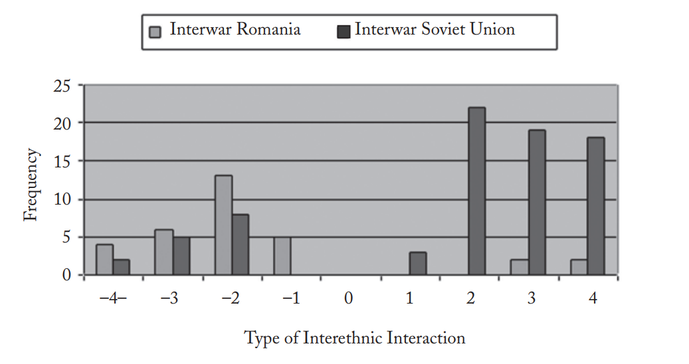


## Why should we believe this? {.build}

### Couldn't they be cherry picking?

### Isn't this just (second-hand) personal experience?

## Acknowledge uncertainty

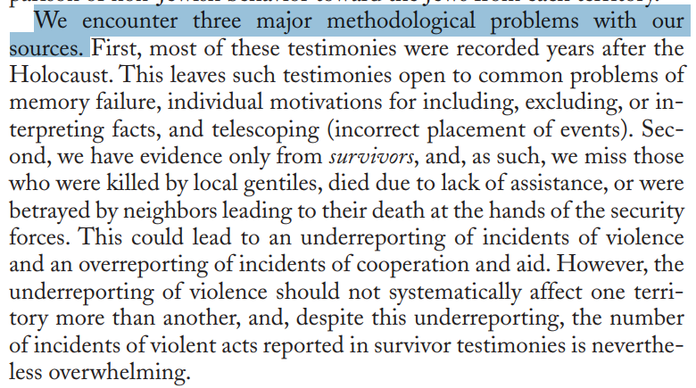

## Systematic Evidence

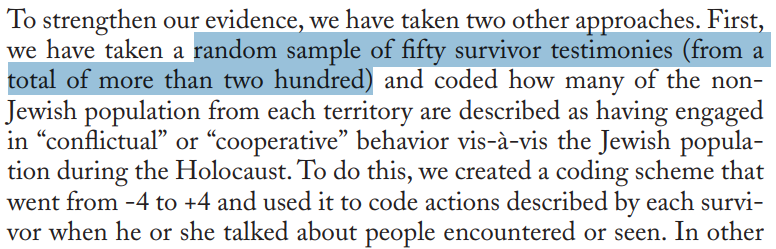

## Systematic Evidence

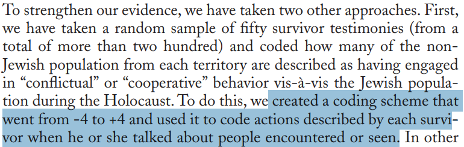

## Systematic Evidence

### How did they get their survivor accounts?

- Holocaust Museum in Washington, DC and Israel
- All testimony of survivors in these regions
- Random sample of 50
- Identify reports of interactions between Jews and Non-Jews
- Categorize interactions

## Systematic Evidence

Validate survivors

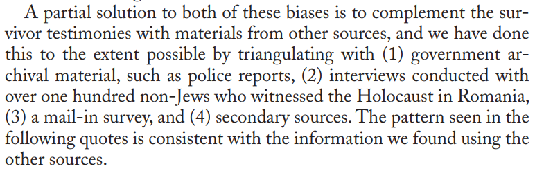

## Systematic Evidence

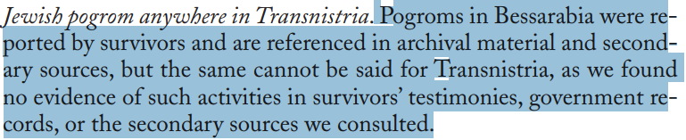

## Transparent Procedures:

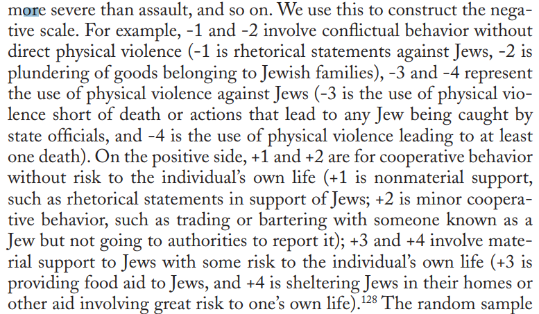

## Transparent Procedures:

We could replicate this data:

- Go to archives
- Select sample
- Use their clear rules for classification

## Transparent Procedures:


## Acknowledge uncertainty

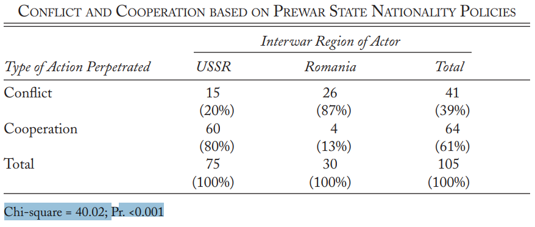

## Consider alternatives: {.build}

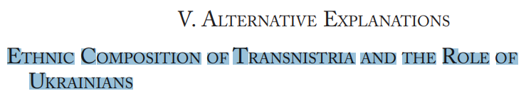

#### Maybe Ukrainians more tolerant of Jews, more Ukrainians in Transnistria.

>- It isn't government policy

## Consider alternatives:

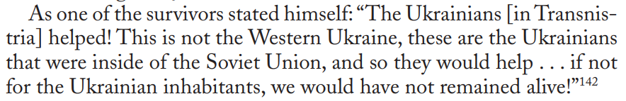

#### Ukrainians outside USSR active in Holocaust

>- Something about the USSR

## Consider alternatives:

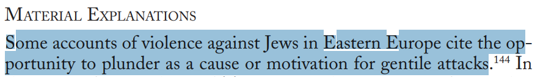

#### Maybe Jews in Bessarabia were wealthier, more desirable target for violence

>- Difference is due to opportunity/motive for violence, not government policy

## Consider alternatives:

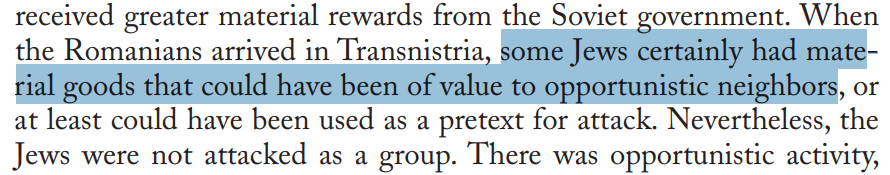

#### Some Jews in Transnistria were better off, benefited from Soviets but no violence

## Consider alternatives:

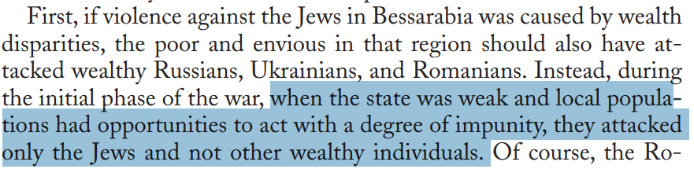

#### No violence against other wealthy minorities in Bessarabia

## What they *could* have said: {.build}

### Trust us, we're experts!

>- authority

### We've spent lots of time there, Bessarabia is more anti-Semitic

>- personal experience

### Soviets were inclusive, of course that made a difference

>- commonsense

## What did they do? {.build .columns-2}

### Transparent procedures

### Systematic evidence

- Clear rules for collection, coding
- Validation against other sources

### Consider alternatives

- Consider several possible objections/counter-arguments
- Go looking for evidence that would prove them wrong

<p class="forceBreak"></p>


### Acknowledge Uncertainty

- open about possible problems
- limits of evidence
- consider statistical variability

## Why do they do this? {.build}

### Credibility

### Do we need to believe every study?

### No.

## Science as collective, on-going {.build}

### Individual studies may be wrong

### But

### A *community* of researchers can:

>- Evaluate work of others (transparency)
>- Replicate prior work (transparency)
>- Identify/eliminate errors (systematic evidence, acknowledge **statistical** uncertainty)
>- Test claims against additional counter arguments (consider alternatives)

## Features of science

### Because of this, science can challenge other bases for claims:

- Give counter-intuitive answers (against common-sense)
- Challenge our personal impressions
- Challenge "authorities"

## Next

### What kinds of claims are there?

### What claims can be scientifically evaluated?

# Slides posted this weekend