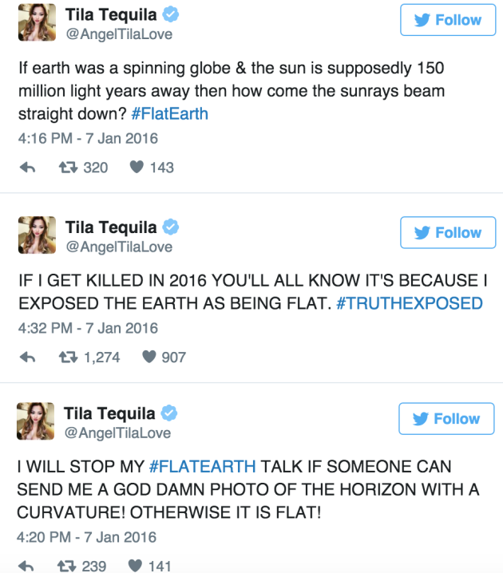
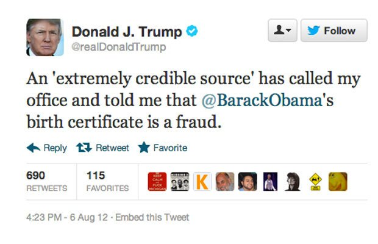
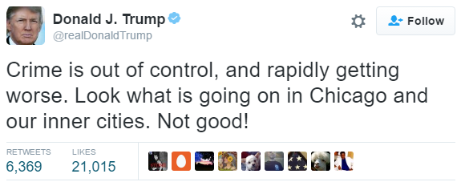
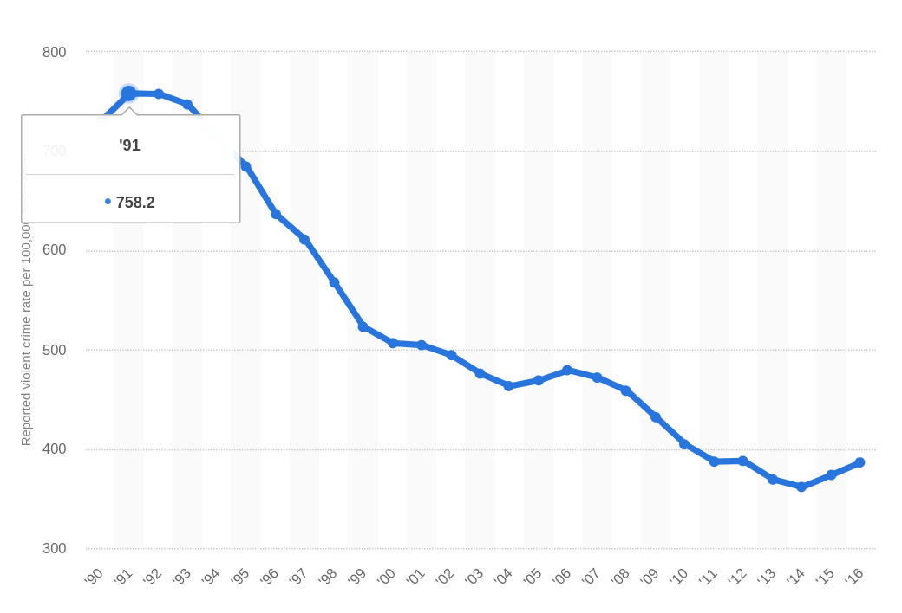
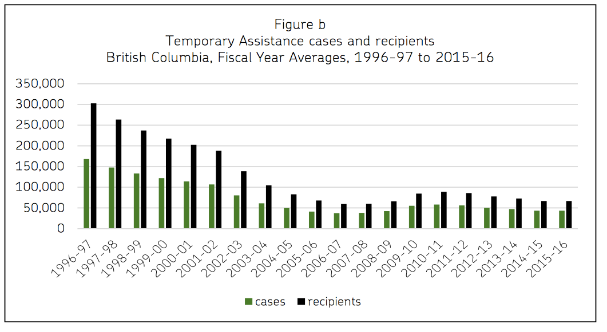

```{r setup, include=FALSE}
knitr::opts_chunk$set(echo = FALSE)
options(knitr.table.format = "html") 
require(magrittr)
require(kableExtra)
require(knitr)
```


```Set up column break```
<style>
.forceBreak { -webkit-column-break-after: always; break-after: column; }
h3, h4 {font-weight: bold;
        color: #515151;}
</style>


# Types of Claims

## Last week {.build}

### What are claims?

### What are bases for claims?

- scientific 
- unscientific

## This week {.build}

### What kinds of questions are there?

### What kinds of claims (answers) are there?

### How to tell them apart?

### Which are answerable?

#

## Some questions: {.build}

### - How many firearms homicides took place in the U.S. and Canada in 2016?

### -What percentage of income is earned by the richest 1% of Canadians?

### - What percentage of Canadians use cannabis recreationally?

# What kinds of questions are these?

## Some claims {.build}

### - Canada had 223 and the US had 11004 firearms homicides in 2016.

### -The top 1% of Canadians make about 14% of all income.

### - About 16% of Canadians over the age of 15 use cannabis.

## Descriptive claims:

### *Descriptive* claim:

#### Claim about something that is (was) in the world or the state of the world

## Some new questions {.build}

### - Why does the U.S. have more firearms homicides per capita than Canada?

### - Why has the share of income going to the top 1% increased nearly twofold since 1977?

### - Would legalizing cannabis result in higher rates of impaired driving?

## What kinds of questions are these?

### How are they different from the first set?

## Some new claims {.build}

### - The US has more firearms homicides per capita than Canada because the US has laxer gun laws than Canada.

### - Income inequality in Canada is higher than 40 years ago, because tax rates on the highest earners have been reduced.

### - Legalizing cannabis would cause in higher rates of impaired driving.

## Causal claims:

### Claims about:

- the **effect** that one thing has (had) on another thing
- the **cause** of some event or thing in the world

## Causal claims:

### How to recognize them:

Causal claims include a **causal verb**. E.g.:

> "causes", "influences","makes happen", "increases", "decreases", "results in", "was necessary for", etc.

## Causal claims: Variations

### *Why* an event/condition/choice happens or doesn't happen:

>- Riots in Ayodhya happened **because** the BJP led a provocative march.

## Causal claims: Variations

### *Why* an event/condition/choice happens or doesn't happen:

-  Riots in Ayodhya happened **because** the BJP led a provocative march.

### The *conditions* under which an event/outcome/choice *happens*:

>- Contact with someone from an oppressed group can change opinions about that group **only when** people have little knowledge or experience with that group.

## Causal claims: Variations

### The *effect* of an event/condition on other things:

>- Government multicultural policies in favor of tolerance **reduce** ethnic hatreds.

## Causal claims: Variations

### The *effect* of an event/condition on other things:

- Government multicultural policies in favor of tolerance **reduce** ethnic hatreds.

### The *process* through which one thing affects another:

>- Secular political parties **prevent** religious violence **by** deploying police more aggressively.

## Causal claims: Variations

### *Why* an event/condition/choice happens or doesn't happen:

### The *conditions* under which an event/outcome/choice *happens*:

### The *effect* of an event/condition on other things:

### The *process* through which one thing affects another:


## How are *causal* claims different? {.build}

### The city of Chicago has strict gun laws and a high gun-related murder rate.

>- is this descriptive or causal?

>- NOT causal

## Descriptive and causal claims: {.build}

### How are they related?

- Descriptive claims basis for causal claim

### What would causal claim be without descriptive claims?

## Examples: {.build}

### - The US has more firearms homicides per capita than Canada because the US has laxer gun laws than Canada.

### - Income inequality in Canada is higher than 40 years ago, because tax rates on the highest earners have been reduced.

### - Legalizing cannabis would cause in higher rates of impaired driving.

## Some more questions  {.build}

### - Should the US have stricter gun control?

### - Should the taxes on the richest Canadians be increased?

### - Should new regulations place restrictions on driving while using cannabis?

## What kinds of questions are these?

## Some more claims:  {.build}

### - The US **should** enact stricter gun control

### - Parliament **should** increase taxes on the rich.

### - New regulations **should** make it illegal to drive while using cannabis.

## Normative/Prescriptive Claims: {.build}

### Claims about what *should or should not* be (or have been) done.

- Claims about what is "right" or "wrong"
- Claims abut "too much", "enough", "not enough" of something
    - implies that something *should* change

## Relationship to descriptive claims:

### Could we have a prescriptive claim without descriptive claims?

## Examples {.build}

### - British voters did the right thing for their country by voting for "Brexit".

### - China is better off under its current government than it would be as a competitive democracy.

### - The US and its allies should have intervened in Syria to stop violence in 2011


## Relationship to descriptive claims:

### Could we have a prescriptive claim without causal claims?

## Examples {.build}

### - British voters did the right thing for their country by voting for "Brexit".

### - China is better off under its current government than it would be as a competitive democracy.

### - The US and its allies should have intervened in Syria to stop violence in 2011

# Types of Claims

## Recap {.build}

### Descriptive claims

### Causal claims

### Normative/prescriptive claims

## Housing prices in BC {.build}

### - Are housing prices in BC too high?

### - Why have housing prices in BC increased dramatically in the past 15 years?

### - Why has the NDP opposed a ban on foreign ownership of property?

### - Should the BC government limit property ownership to residents?

### - How many people commute to Vancouver for work and cannot afford to live there?

## Housing prices in BC

### - Are housing prices in BC too high? *prescriptive*

### - Why have housing prices in BC increased dramatically in the past 15 years? *causal*

### - Why has the NDP opposed a ban on foreign ownership of property? *causal*

### - Should the BC government limit property ownership to residents? *prescriptive*

### - How many people commute to Vancouver for work and cannot afford to live there? *descriptive*

## Summary:

### Descriptive claims

- No explicit statement that one thing causes another

- correlation $\neq$ causation

## {.build}

#### During years in which more (fewer) Japanese passenger cars were sold in the US there were more (fewer) vehicular suicides in the US.


## Summary:

### Causal claims

- **Explicit** statement that one thing exerts influence on another
    - (increase, reduce, prevent, cause, make happen, is necessary, etc.)

## Summary: {.build}

### Causal claims

Does this claim imply that, *if* we could directly change one thing, then we would see a change in the other?


## Summary:

### Example:

"Countries with more women in the legislature have more protections for womens' reproductive and marital rights."

>- Is this a causal claim?

### Example:

"The entry of more women into a legislature results in more legal protections for womens' reproductive and marital rights."

>- If we forced more women into government, we would expect to see a change. CAUSAL

## Summary: 

### Prescriptive/normative {.build}

Build on descriptive, causal claims

**also** must invoke some value about what is desirable/undesirable

##

```{r}

data.frame(
  Type = c("Descriptive", 'Causal', "Prescriptive"),
  Definition = c("...about a thing in the world",
                 "...about effect of one thing on another",
                 "...about what should (not) be done"),
  Terms = c("how many, is an X",
            "causes, increases, influences",
            "should, too much/few, enough"),
  Attribute = c("no cause stated", "y would not happen without x", "what ought to be"),
  Dependence = c('none', 'descriptive', 'descriptive,causal'),
  `Can be false` = c('yes', 'yes', 'no')
) %>% kable(., format = 'pandoc', padding=3) # %>%  kable_styling(., bootstrap_options = c("striped", "hover","condensed"), full_width = T)

```


## Empirical claims:

### Questions that can be answered by

- observing the world
- giving evidence

### Claims that can be justified with:

- observation
- evidence

## Empirical claims {.build}

### Descriptive

- YES

### Causal

- YES

### Prescriptive

- NOT ENOUGH

- Always includes a **value judgment**


## What is a value judgment?

### It isn't

- A claim someone bases on their opinion 

- A claim someone bases on personal experience

- A claim that we can't persuade someone to drop

### Why not?

- People can vehemently assert an opinion that is contrary to evidenc

- Personal experience can be factually incorrect

- Stubbornness to evidence doesn't make it irrelevant

## Flat earth



## Flat earth


## Birthers



## Crime



## Crime



## What is a value judgment? {.build}

Just because you can't persuade **some person** with the evidence, doesn't make it a value judgment

### Value judgements:

- goals/ideals for what should happen, how things should be
- rules for judging which things are better or worse

## Why can't this be empirical?

Can't science tell us how to:

>- grow the economy
>- live longer
>- alleviate poverty
>- reverse climate change

Couldn't it bring us happiness?

## Interlude {.build}

### What is the best music?

### How would we judge?

What criteria do we use?

### How would we scientifically decide which criteria?

## Another example: {.build}

> You have heard that it was said, "An eye for an eye and a tooth for a tooth." But I say to you, Do not resist the one who is evil. But if anyone slaps you on the right cheek, turn to him the other also. And if anyone would sue you and take your tunic, let him have your cloak as well.

### How would we scientifically decide it is correct?

### What other values are **inconsistent** with this?

## Another example: {.build}

Should we donate mosquito nets to stop malaria?

### Evidence

- Malaria kills ~500k per year
- Half of global population possibly exposed
- Mosquito nets reduce likelihood of exposure
- For each 100 to 1000 nets, 1 death prevented
- Cost of mosquito nets is low

### Answer is obvious!

What **value** does it pre-suppose?

What **value** might be in conflict with this?

## Values:

> "Science is meaningless because it gives no answer to our question, the only question important for us: 'What shall we do and how shall we live?' Science can't tell us how to live or how to die."
> - Leo Tolstoi

### Values are in conflict

- Only way to bring them into alignment is to assume a higher order: religion, ideology, philosophy

- But in science we want to work without presupposition/assumption

## What good is science...

### ... if it can't tell us what to do?

## What good is science? {.build}

### "Mosquito nets prevent malaria"

- "A causes B" $\neq$ "we should do A"

- How do we **value** B? 

### But...

- What if mosquite nets don't prevent malaria

- Assuming less malaria is good, resources are finite

- "A does not cause B" is informative!

## Connecting types of claims: {.build}

### Should the BC government spend more on welfare for the poor?

### a prescriptive question

### But what *empirical* questions does it raise?

## What would you want to know... {.build}

#### before spending more on welfare for the poor?

## What would you want to know... {.build}

- What proportion of British Columbians are poor? (descriptive)

- How many people receive welfare benefits in BC now? (descriptive)

- What are current welfare benefits? (descriptive)

- What is the total cost of current welfare programs? (descriptive)

- Does welfare make recipients financially better off? (causal)

- Do more generous welfare benefits lead to lower employment for recipients? (causal)

- Does welfare cause "culture of dependency" (causal)

- What are effects of welfare on recipient's long-term incomes? (causal)


## What would you want to know...

One **descriptive** observation:

- A single person with multiple barriers to work receives $282 per month from the province

## What would you want to know...


## What would you want to know...

### *Causal* findings:

- Receiving welfare reduces employment among recipients

- Receiving welfare does not cause "dependency"

- Receiving welfare as a child does not make it more likely when an adult

>- Reducing welfare increases employment, but does not increase disposable income

## Can we answer the question now? {.build}

### Which values would lead us to say "yes"

and increase welfare spending?

### Which values would lead us to say "no"

## Connecting types of claims: {.build}

### Should the BC adopt proportional representation?

### a prescriptive question

### But what *empirical* questions does it raise?

## What would you want to know... {.build}

#### before voting on a switch to proportional representation?

>- What is proportional representation (PR)?

>- What kind of electoral system does BC have now?

>- What countries use PR?

>- What would composition of legislature be if last election used PR rules?

##

<iframe width=100% src="https://www.youtube.com/embed/laUPeXZlPEg?autoplay=0" frameborder="0" allowfullscreen></iframe>

##

0:50 to 4:00

<iframe src="https://www.cbc.ca/i/caffeine/syndicate/?mediaId=1134285891784" width=100% frameborder="0" allowfullscreen></iframe>

## What would you want to know... {.build}

#### before voting on a switch to proportional representation?

>- Does introducing PR increase the number of political parties with seats?

>- Does introducing PR/having more parties improve representation of different groups?

>- Does PR weaken the accountability of legislatures (party lists, not local legislator)?

>- Does PR cause unstable governments because of coalition politics?

>- Does PR cause extremist parties to have more influence?

>- Does first-past-the-post with create accountability?

>- Does FPP create more effective/productive legislatures?

## What would you want to know... {.build}

### *Causal* findings: 

>- PR often creates better representation

>- PR creates more coalition governments, which spend more money

>- More parties makes accountability difficult

>- PR sometimes increases power of small, extremist parties

## Can we answer the question now? {.build}

### Which values would lead us to say "yes"

and choose PR

### Which values would lead us to say "no"

and oppose PR

## Are these values in conflict?

**"Democratic Representation"**: government should incorporate/voice the views of all 

**"Political liberalism"**: governments/parties should peacefully accept and acknowledge their differences, ensure basic rights/protections for all

**"Democratic Accountability"**: governments/parties/legislators can be punished or rewarded for their behavior by the people

## Clarification {.build}

### Social science can't tell us which value is right


### But can clarify:

- Can tell us which electoral system achieves which value

- Can tell us when values are in conflict
    - Force us to choose which we think is more important
    - Force us to consider different options that might reconcile
    
# Focus on Causation

## Why causation? {.build}

### Prescription *requires* answers to *causal* questions

- not always easy/possible to answer

### **Prediction** requires causal knowledge


### Without prediction, without causes, there is no understanding
    
- Need to know **why** things happen


