```{r setup, include=FALSE}
knitr::opts_chunk$set(echo = FALSE)
require(magrittr)
require(kableExtra)
require(knitr)
```
<style>
.forceBreak { -webkit-column-break-after: always; break-after: column; }
h3, h4 {font-weight: bold;
        color: #515151;}
</style>

# Causal Claims

## Why causation? {.build}

### Prescription *requires* answers to *causal* questions

- not always easy/possible to answer

### **Prediction** requires causal knowledge


### Without prediction, without causes, there is no understanding
    
- Need to know **why** things happen


## Causal questions in politics: {.build}

### 1. Effects of policies and institutions

- Helps answer: which policies or institutions should we adopt/change

### 2. Causes of policy and political actions

- Why do governments/political actors make the choices they do?
- Why do political actors/institutions often **fail** to meet our prescriptive ideals?
- Why do political outcomes vary so widely?

## Causal questions in politics: {.build}

### 3. Causes of *inputs* into political choices

- What causes some actors to be more powerful than others
- Why do political actors **want** certain things?


## Causal claims {.build}

### 1. The U.S. invasion of Iraq *caused* the creation of ISIS

### 2. Sexism in the United States *caused* the victory of Donald Trump over Hillary Clinton

### 3. The threat of nuclear war **caused** the United States and Soviet Union to avoid going to war.

## Counterfactuals: {.build}

### The U.S. invasion of Iraq *caused* the creation of ISIS

- **If** the US **did not invade** Iraq, ISIS **would not** have been created

### Sexism in the United States *caused* the victory of Donald Trump over Hillary Clinton

- **If** there were **less sexism** in the US, then Trump **would not** have won.

### The threat of nuclear war **caused** the United States and Soviet Union to avoid going to war.

- **If** nuclear weapons **had not** existed, the US and USSR would have gone to war.

## Counterfactuals: {.build}

Causality **requires** a counterfactual claim.

### Definition

"C is a cause of E" **necessarily implies**:

#### If C had not happened, E would not have happened

### What is one causal claim

### Restate as counterfactual

## Counterfactuals: {.build}

### What is the object of a counterfactual claim?

It is a claim about the **same** thing, person, country, world **but**

with a **different** exposure to the supposed **cause**

### It compares the same thing/unit to itself, not to something else

### Everything is the same **except** the **cause**

## Counterfactuals and potential outcomes:

### Potential outcomes:

- The state of a unit/person/country/world under different exposures, whether factual or counterfactual

### Example:

1. If the United States had invaded Iraq, then ISIS would have been created
2. If the United states had not invaded Iraq, then ISIS would not have been created

## Counterfactuals and potential outcomes:

A potential outcomes table

```{r}

data.frame(Unit = 'The world',
 Invasion = c("?"),
 `ISIS if invade` = c('Yes'),
 `ISIS if not invade`= c('No'),
 ISIS = c("?")
) %>% kable(., format = 'pandoc', padding=3) # %>%  kable_styling(., bootstrap_options = c("striped", "hover","condensed"), full_width = T)

```

## Counterfactuals and potential outcomes: 

What if we could look at multiple universes?

```{r}

data.frame(
 Universe = 1:2,
 Invasion = c("Yes", "No"),
 `ISIS if invade` = c('Yes', 'Yes'),
 `ISIS if not invade`= c('No', 'No'),
 ISIS = c("Yes", "No")
) %>% kable(., format = 'pandoc', padding=3) # %>%  kable_styling(., bootstrap_options = c("striped", "hover","condensed"), full_width = T)

```

## Counterfactuals and potential outcomes: 

More generally: 

```{r}
data.frame(
 Universe = c("Factual", "Counterfactual"),
 C = c("Yes", "No"),
 `E if C` = c('Yes', 'Yes'),
 `E if not C`= c('No', 'No'),
 E = c("Yes", "No")
) %>% kable(., format = 'pandoc', padding=3) # %>%  kable_styling(., bootstrap_options = c("striped", "hover","condensed"), full_width = T)
```

## Counterfactuals: 

What we actually see:

```{r}
data.frame(
 Universe = c("Factual", "Counterfactual"),
 Invasion = c("Yes", "No"),
 `ISIS if invade` = c('Yes', '?'),
 `ISIS if not invade`= c('?', '?'),
 ISIS = c("Yes", "?")
) %>% kable(., format = 'pandoc', padding=3) # %>%  kable_styling(., bootstrap_options = c("striped", "hover","condensed"), full_width = T)
```

## Counterfactuals:

### Recall:

Causal claims imply descriptive claims.

What descriptive claims are implied here?

### Sexism in the United States *caused* the victory of Donald Trump over Hillary Clinton

- **If** there were **less sexism** in the US, then Trump **would not** have won.

## Counterfactuals:

```{r}
data.frame(
 Universe = c("Factual", "Counterfactual"),
 Sexism = c("Yes", "No"),
 `Trump if sexism` = c('Yes', 'Yes'),
 `Trump if not sexism`= c('No', 'No'),
 Trump = c("Yes", "No")
) %>% kable(., format = 'pandoc', padding=3) # %>%  kable_styling(., bootstrap_options = c("striped", "hover","condensed"), full_width = T)
```

## Counterfactuals: {.build}

### What if the two universes were different in more than one way?

```{r}
data.frame(
 Universe = c(1:2),
 Sexism = c("Yes", "No"),
 Racism = c("Yes", "No"),
 `Trump if sexism` = c('Yes', '**No**'),
 `Trump if not sexism`= c('**Yes**', 'No'),
 Trump = c("Yes", "No")
) %>% kable(., format = 'pandoc', padding=3) # %>%  kable_styling(., bootstrap_options = c("striped", "hover","condensed"), full_width = T)
```

## Counterfactual trouble: {.build}

### - We can only observe the world in one state, not both

### - We only observe history once, can't rerun it.

### - "Fundamental Problem of Causal Inference"

# Types of causes

## First World War: {.build}

### World historical event

- War between all great powers

- Decline or dissolution of empires

- Emergence of Communism

- United States becomes dominant


### Horrific human cost:

- ~ 9 million combat deaths; ~ 8 million civilian deaths

- Set in motion Second World War

### What was the cause?


##

<iframe width=100% src="https://www.youtube.com/embed/XRcg_t2oJkc?autoplay=0" frameborder="0" allowfullscreen></iframe>

## Was it this?

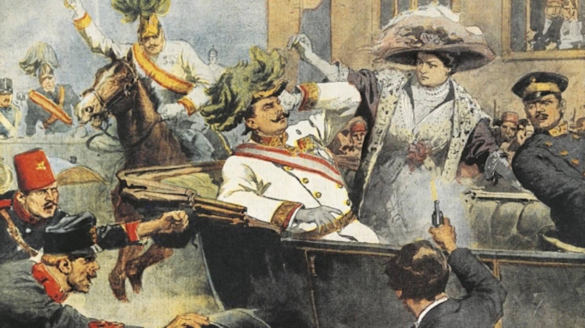

## Was it this?

<iframe src="https://www.newspapers.com/clippings/embed_clipping/?id=16766024&w=394&h=394" scrolling="no" frameBorder="0" width=100% style="border: 3px double #efefef;background: #333 url(https://www.newspapers.com/i/loadingAnimation.gif) no-repeat 50% 50%;"></iframe>

## *Structural* causes

1. Ethno-national tensions within Austria-Hungary

2. Imperialism / competition over resources

3. Militarism and aggressive aims

4. Structure of alliances

## "Triggering Event"? {.build}

### Was assassination the cause?

### Was Russian mobilization the cause?

### Would war have happened anyway?


## The Arab Spring {.build}

### The cause.

- Mohamed Bouazizi, Tunisian peddler self immolates

- His death sparks popular anger, massive protest

- One month later, Tunisian government (under Ben Ali) falls

- Protest sweeps the region

### The cause?

## Cause of Tunisian regime change {.build}

### Bouazizi's death $\xrightarrow{\text{protest}}$ Regime collapse

### What, if anything, would you add to this explanation?

## Cause of Tunisian regime change {.build}

### Oppressive Rule

### $\xrightarrow{\text{hopelessness/anger}}$ 

### Bouazizi's death

### $\xrightarrow{\text{protest}}$ 

### Regime collapse

## Cause of Tunisian regime change

### Consider the counter-factual...

- Could protest and regime collapse have happened even if Bouazizi had not died?

- Maybe oppressive rule made lots of people angry, ready to protest


## Cause of Tunisian regime change {.build}

### Oppressive Rule

### $\xrightarrow{\text{hopelessness/anger}}$ 

### Someone starts hunger strike

### $\xrightarrow{\text{protest}}$ 

### Regime collapse

## Cause of Tunisian regime change

### Oppressive Rule

### $\xrightarrow{\text{hopelessness/anger}}$ 

### Someone else self-immolates

### $\xrightarrow{\text{protest}}$ 

### Regime collapse

## Cause of Tunisian regime change

### Oppressive Rule (*structural cause*)

### $\xrightarrow{\text{hopelessness/anger}}$ 

### Bouazizi's death (*triggering event*)

### $\xrightarrow{\text{protest}}$ 

### Regime collapse

## Structural causes vs. triggering event

### Triggering event:

- Details **how or when** some outcome/event happens

- **Fails** to meet **counterfactual** definition of a cause
    - triggers are **substitutable**
    - **Some** trigger necessary, but **specific** trigger is not

## Structural causes vs. triggering event
    
### Recognizing triggering events:

**Triggering event** is event that:

- Generates outocome **only in combination** with structural causes
    - is not sufficient

- Could have been **substituted** by other events that were also likely
    - is not necessary
    
## Identify the triggering event: {.build}

### Global Financial Crisis of 2008

1. Inequality

2. Weak regulatory structures

3. Collapse of Lehman Brothers investment bank


### Riots in Ferguson, Missouri: 2014

1. Failure of Grand Jury to indict police officer who shot Mike Brown

2. Systemic racial bias in police stops

3. Ferguson city reliance on tickets and fines for revenue

## Structural causes

Social science interested in **structural causes** 

Want causal **patterns/regularities**

### Why?

1. What conditions **generally** necessary for an outcome
    - Revolutions don't generally **require** Mohamed Bouazizi
2. What conditions **generally** contribute to outcomes
    - Self-immolation of peddlers does not **typically** lead to revolution

### Structural Causes $\xrightarrow{}$ Portable Knowledge

# Structure vs. Agency

## Structural causes vs. individual choices {.build}

### Common to explain the world through individuals:

- Individuals' choices
- Individuals' qualities

### e.g.

- Charisma / skill of political candidates
- Brilliance/incompetence of generals in war
- Celebrity bringing attention to a cause
- Individual responsible for atrocity

### Why?

- Gives us characters, a narrative, maybe exciting

## Structural causes vs. individual choices

### BUT

Individual choices can be **produced** by structural causes

>- E.g., Gavrilo Princip shot the Archduke, but why was he in town, with a political agenda, armed with a pistol?

Individual qualities can be **selected** by structural causes

>- Why was what someone like Hitler saying in 1920s Germany attractive?
>- Parties with more public support may have a better pool of qualified candidates

## Structural causes vs. individual choices {.build}

Political interactions are sum of individual choices, but:

1. Individual choices are often **produced by** structural factors
    - Constraints on what you can do
    - Incentives/motivations for what to do
    - Resources available
    - Grievances that drive action
2. Individuals are **selected** for by structural factors
    - Structures make certain traits favorable 
    - Structures attract individuals with certain traits
    
## Structural causes vs. individual choices

Political interactions are sum of individual choices, but:

3. Individual choices **overwhelmed** by structural forces
    - Individual chocies may only matter at the margins
    - E.g.: capability of generals on Eastern Front in Second World War
    
## Structural causes vs. individual choices  {.build}

### Why did Trump win and Clinton lose?

### Clinton was "weak" candidate

- Baggage of Benghazi
- Those **emails**
- Cozy with big business
- Political "insider"
- Not "relatable"/"likeable"

## Structural causes vs. individual choices  {.build}

### Why did Trump win and Clinton lose?

### Trump was "strong" candidate?

- Political 'outsider'
- No ties to the "swamp"
- Charismatic?
- Knew how to mobilize white voters

## Structural causes vs. individual choices 


## Why did Trump win and Clinton lose?

### Incumbency?

- Voters reject two-term incumbents

### Economy?

- Economy weak

## Why did Trump win and Clinton lose?

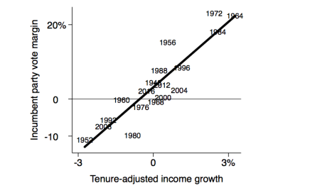


## Why did Trump win and Clinton lose?

### Incumbency?

- Voters reject two-term incumbents

### Economy?

- Economy weak

### Anti-immigration

- Rise in sentiment pre-dates Trump
- Backlash against Obama?

### Gender Bias

# Kinds of causality

## A puzzle:

### How could war happen between two countries that know each others' capabilities?

### War is costly...

and if capabilities are known, they can reach a settlement

## An example: US and Soviet Union

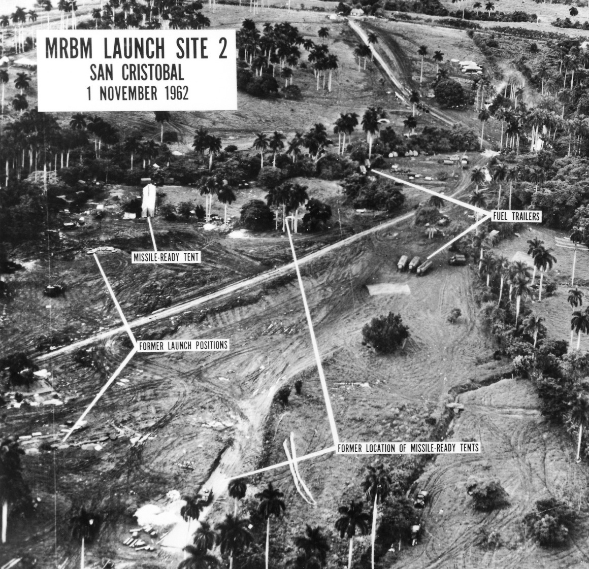

## Cuban missile range

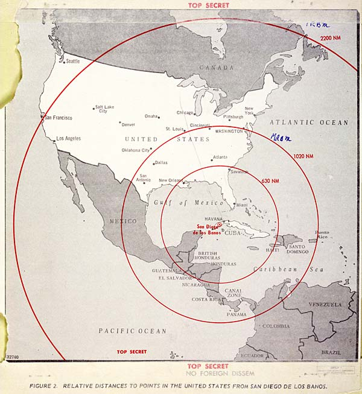

## US missiles

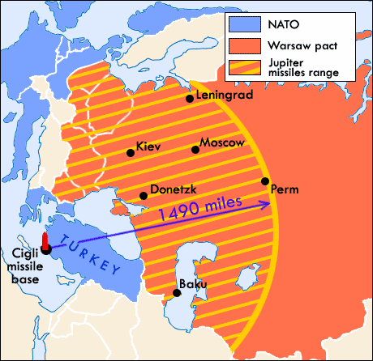

## US Blockade

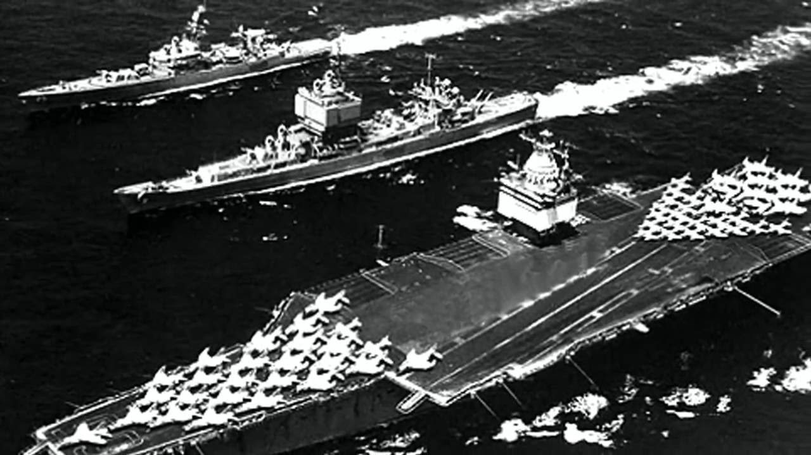


## War averted

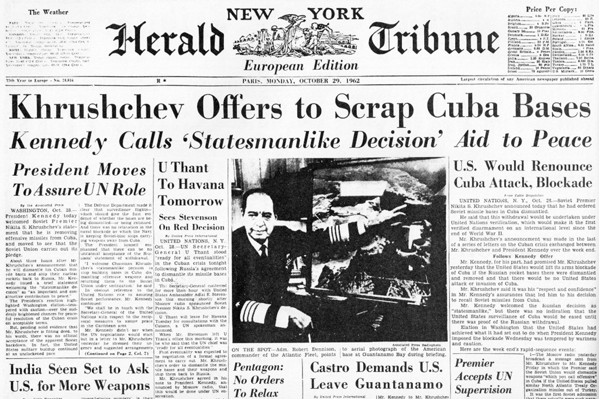

## War avoided

### Capabilities of both sides known, agreement reached

## Saddam and the US:

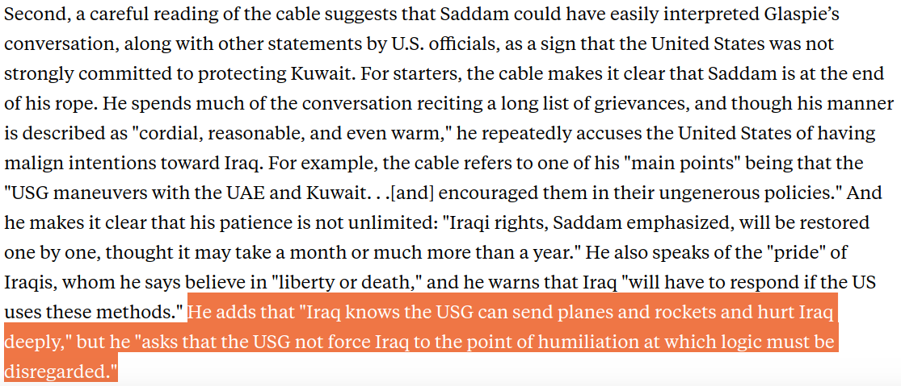

## US response

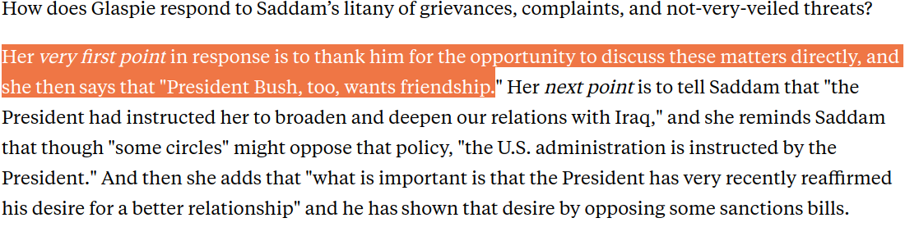


## A greenlight?

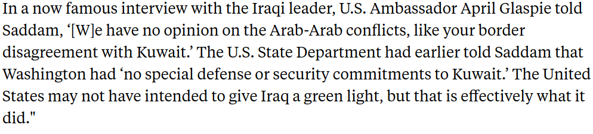


## War

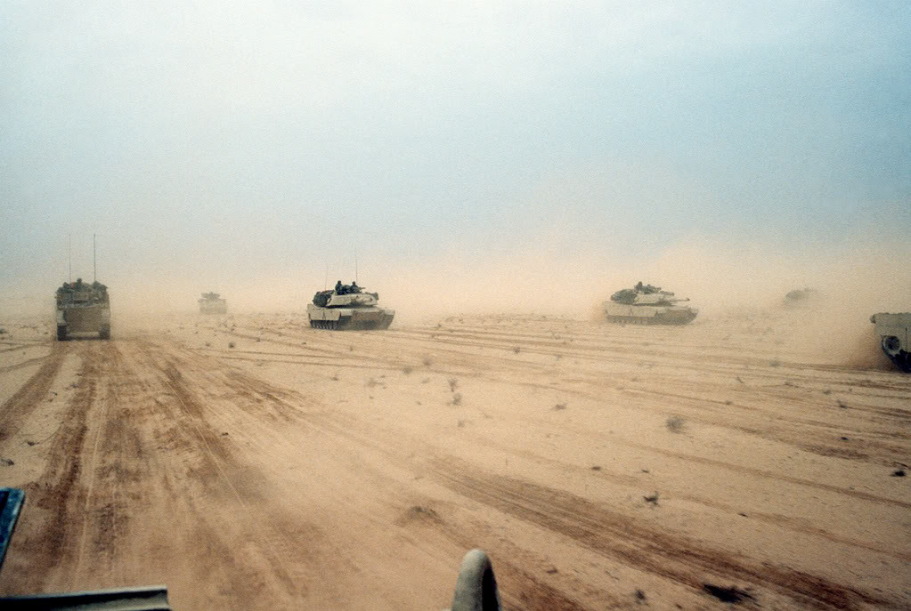

## A causal claim

### For war to happen, there must be strategic miscalculation

### Strategic miscalculation is a *necessary condition* for war

## Necessary conditions:

### If a causal claim is:

"Condition C **must happen** for outcome E to occur."

### Then:

Condition C is a **necessary** condition for E


## Necessary conditions:

### __Necessary Condition__

> A cause without which an effect cannot occur

### **But note**:

Does not imply: "If condition C, effect E will occur."

Only: "Without condition C, effect E will **not** occur."

## Necessary conditions: Example {.build}

A large middle class is a necessary condition for emergence of democracy

## China's growing middle class

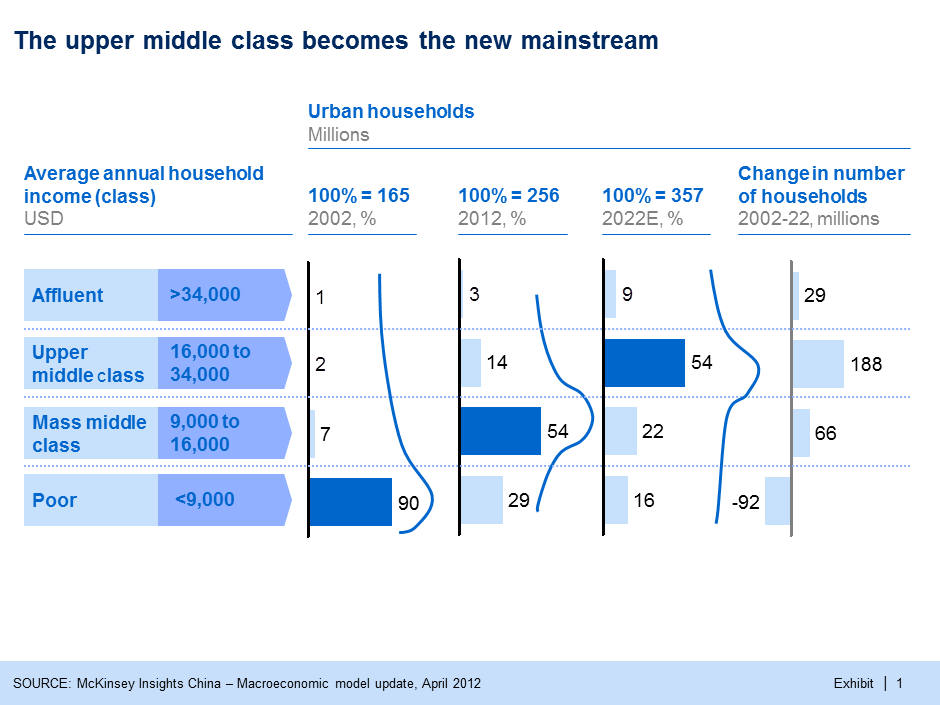

Will China become democracy?

## Why has the Syrian Civil War been so long?

### Arab Spring

- Affected many countries
- Unlike most, in Syria this led to long-term Civil War

## Why a Syrian Civil War?

1. Assad government tied to ethnic minority

2. Assad government backed by regional allies (Iran, Hezbollah)

3. Opposition was fragmented

4. Opposition backed by wealthy Gulf States, US, Turkey

5. Kurdish population divides coalition against Assad

6. Presence of experienced fighters/insurgents from Iraq

## *Many* necessary conditions

1. Assad government tied to ethnic minority

2. Assad government backed by regional allies (Iran, Hezbollah)

3. Opposition was fragmented

4. Opposition backed by wealthy Gulf States, US, Turkey

5. Kurdish population divides coalition against  Assad

6. Presence of experienced fighters/insurgents from Iraq

## Conjunctural causation

When an effect $E$ depends on a combination of causes:

$\lbrace C_1, C_2, \dots, C_k \rbrace \in \mathbb{C}$

### __Multiple necessary conditions__

Effect happens only when more than one cause is present

>- Plant growth requires **both** water and sunlight
>- Revolutions require **both** material deprivation AND arbitrary rule
>- War requires **both** miscalculation AND offensive capabilities

## Conjunctural causation

When an effect $C\xrightarrow{} E$ depends on some other cause $D$

### __Conditional Effects__

- Hour of sunlight causes
    - 1 cm of plant growth **without rain**
    - 2 cm of plant growth **with rain**
- Secular political parties cause:
    - Fewer communal riots **when religious minorities are numerous and electorally relevant**
    - No change in communal riots **when religious minorities are electorally irrelevant**

## Example:

Indian National Congress and communal riots:

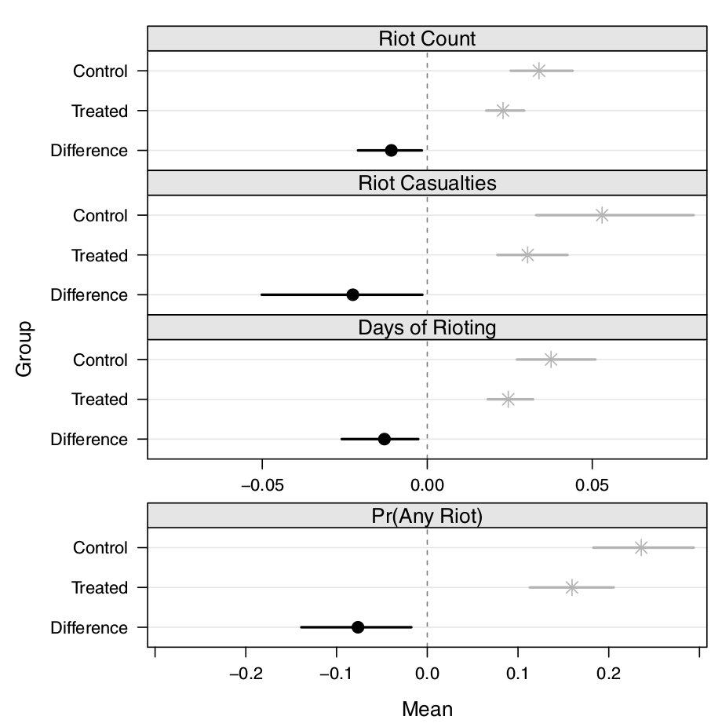


## Conditional effect of INC

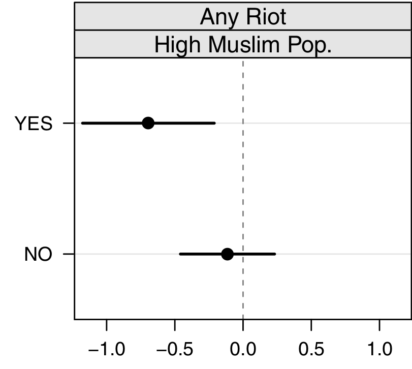

## Sufficient conditions

### In contrast to __necessary conditions__

**Sufficient condition**: a cause that **always** produces an effect.

### **Examples**:

- Fire is sufficient cause of heat
- Social science examples?
    - Rare, conjunctural causation is the norm.
    
## Multiple causation

### Different from **conjunctural causation**

**Multiple causation**:

> When there is **more than one set of causes** that produce an effect

$A \rightarrow{} E$ OR $C \rightarrow{} E$

### Examples:

What causes political leaders to fall from power?

- Military defeat (Argentina, 1980s)
- Economic decline (Gorbachev, 1990)
- Personal scandal (Nixon, 1974)

## Multiple __and__ conjunctural causation

### We can combine these two ideas:

#### $A + B \rightarrow{} E$

or

#### $C + D \rightarrow{} E$
    
## Multiple __and__ conjunctural causation

### Example: Why do civil wars happen?

1. Combination of ethnic diversity **and** political inequality between groups (Sri Lanka,Sudan)
2. Combination of foreign meddling **and** ideological polarization (Nicaragua, Spain)


# Summary

## Key takeaways: {.build}

### *Counterfactual* definition of causality

### Structural causes vs.

- Triggering events
- Individual actions/qualities

### Necessary and sufficient causes

### Complex causality

- Conjunctural causation
- Multiple causation