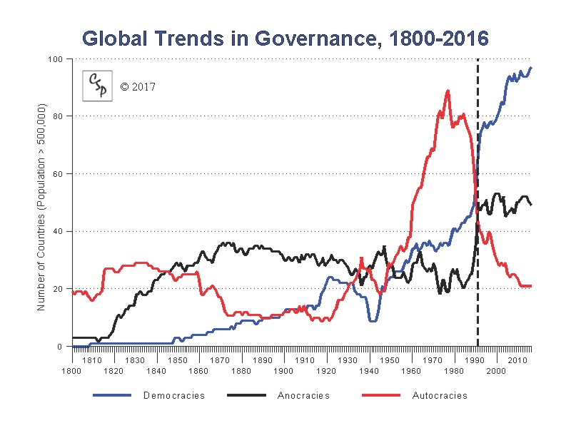
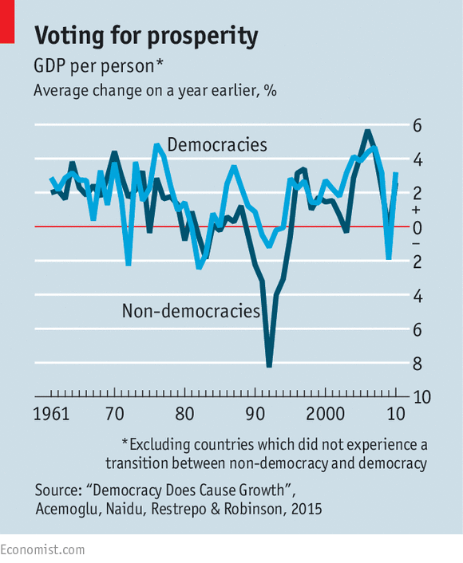
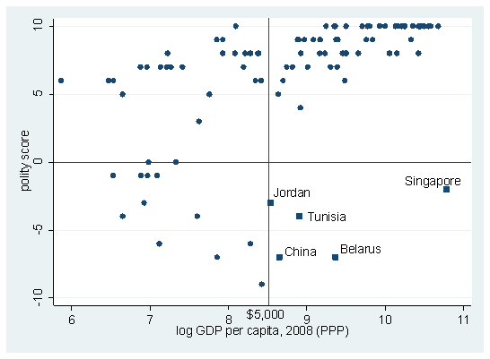
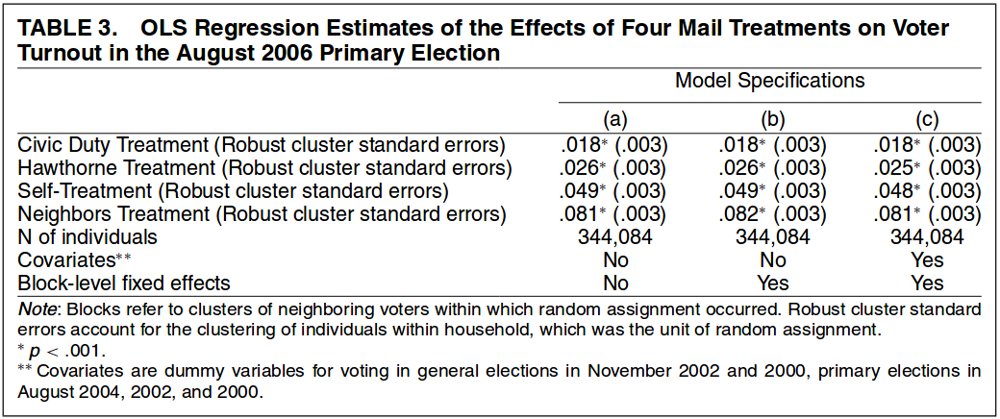
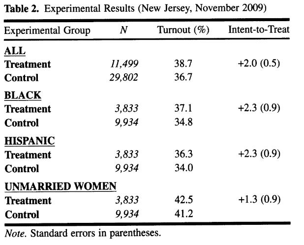
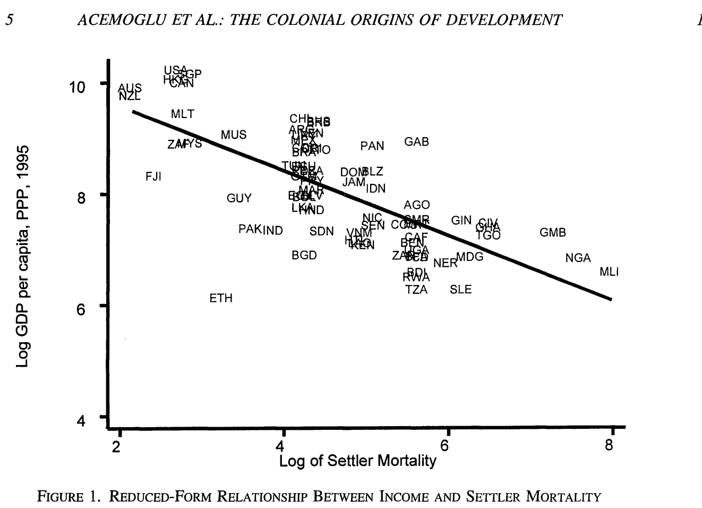
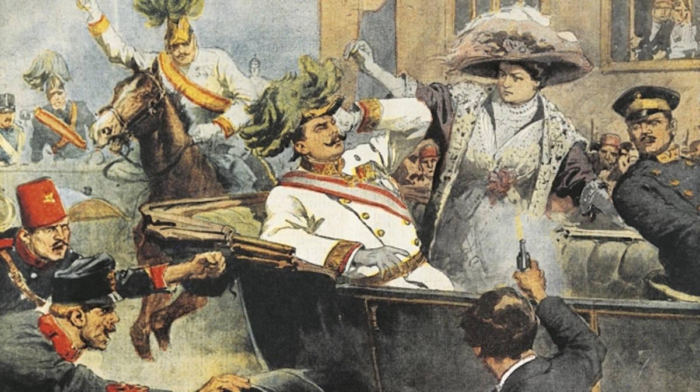
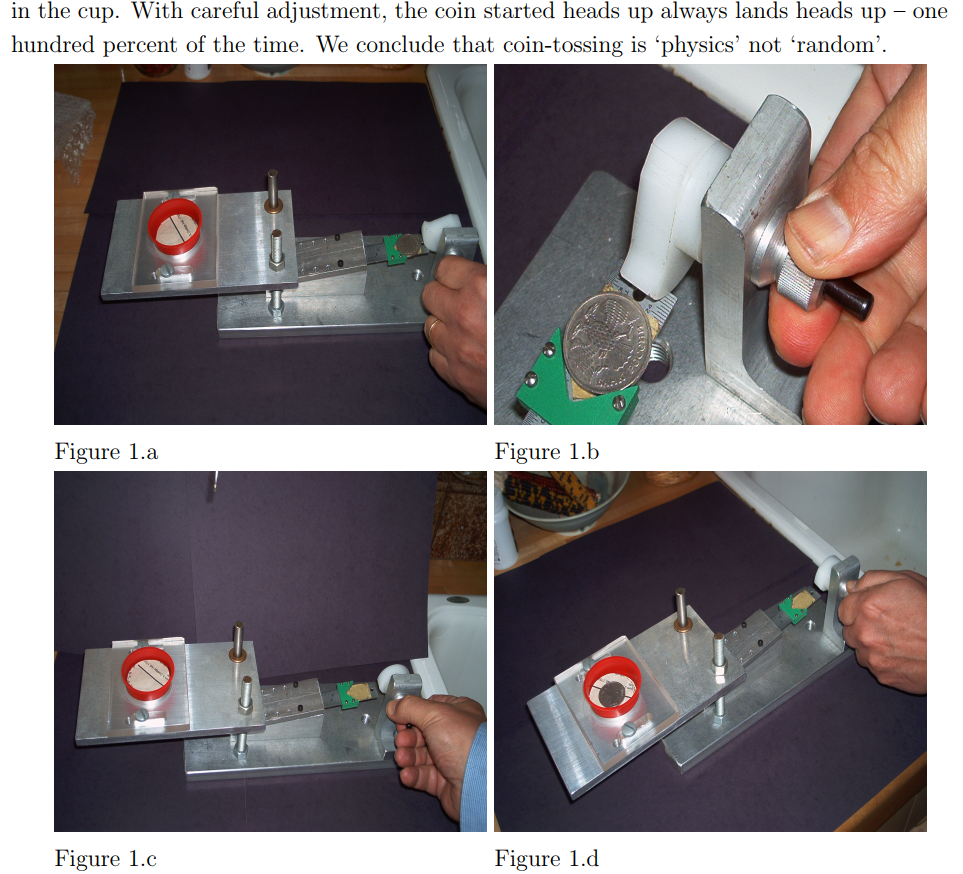
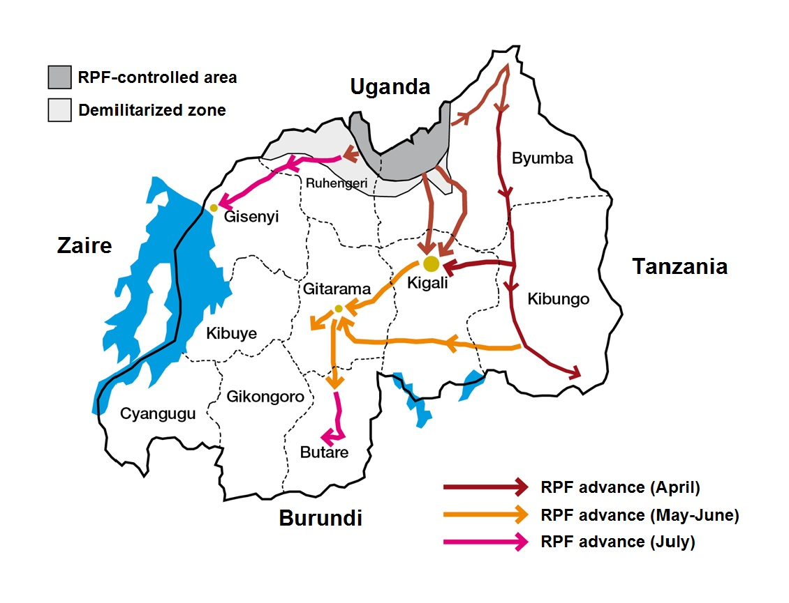

```{r setup, include=FALSE}
knitr::opts_chunk$set(echo = FALSE)
require(magrittr)
require(kableExtra)
require(knitr)
```
<style>
.forceBreak { -webkit-column-break-after: always; break-after: column; }
h3, h4 {font-weight: bold;
        color: #515151;}
</style>

# Causal Claims, continued

## Deterministic claims {.build}

### So far...

Claims about what will happen **with certainty** under particular causal conditions.

### Examples:

- Necessary conditions
- Sufficient conditions
- Conjunctural causality
- Multiple causality
- Conjunctural and multiple causality

## Deterministic claims {.build}

### Key implication:

- Effect **cannot happen** when cause(s) is(are) absent
- Effect **must happen** when cause(s) are present

### Do we always want to make these claims?

>- Democracy and economic development

## An example: 1966

<iframe src="https://data.worldbank.org/share/widget?end=2016&indicators=NY.GDP.PCAP.KD&start=1960&type=points&view=map&year=1966" width=100%' frameBorder='0' scrolling="no" ></iframe>

## An example: 1986

<iframe src="https://data.worldbank.org/share/widget?end=2016&indicators=NY.GDP.PCAP.KD&start=1960&view=map&year=1986&type=points" width=100%' frameBorder='0' scrolling="no" ></iframe>


## An example: 2006

<iframe src="https://data.worldbank.org/share/widget?end=2016&indicators=NY.GDP.PCAP.KD&start=1960&view=map&year=2006&type=points" width=100%' frameBorder='0' scrolling="no" ></iframe>

## An example: 2016

<iframe src="https://data.worldbank.org/share/widget?end=2016&indicators=NY.GDP.PCAP.KD&start=1960&view=map&year=2016&type=points" width=100%' frameBorder='0' scrolling="no" ></iframe>


## Trends in democracy



## Global economic growth

<iframe src="https://data.worldbank.org/share/widget?indicators=NY.GDP.PCAP.KD" width=100% frameBorder='0' scrolling="no" ></iframe>

## Democracy causes growth? {.build}

### Seems plausible

### Why?

## Growth in democracies/vs non democracies




## But:




## What can we see? {.build}

### Yes:

- lots of rich democracies
- lots of poor autocracies

### but

- Democracies with low GDP per capita
- Autocracies that are wealthy

## Nevertheless


Looks positive to me!

## Another example:

### Voter turn out:

- Low in many countries
- Low in many local, off-year elections.

### How can you get people to vote?

## Shaming?


## Why shaming? {.build}

### Inspire sense of duty; 

### Want to be seen as doing the right thing

## Does it work?



## Does it work?



## But

### not *everyone* voted

## In these two examples

#### 1. Democracy and economic growth:

- ~~Democracy is a **necessary condition** for economic growth~~

- ~~Democracy is a **sufficient condition** for economic growth~~

>- Democracy makes economic growth **more likely**?

#### 2. Shaming and voter turnout

- ~~Shaming eligible voters is a **necessary condition** for turnout~~

- ~~Shaming eligible voters is a **sufficient condition** for turnout~~

>- Shaming eligible voters makes turnout **more likely**?

## In contrast to deterministic claims:

### Probabilistic causal claims:

Claim that the presence of a cause makes an effect more (or less) likely

- Effect **can happen** with cause is absent
- Effect **may not happen** when cause is present

## Example:

### Legacies of imperialism

Long term effects of colonizing

What **kind** of imperialism?

>- Resource extraction $\xrightarrow{weak-property-rights}$ Poor growth
>- Settlement $\xrightarrow{property-protected}$ Good growth


## Settler mortality and growth



## But... {.build}

### Not entirely deterministic

- Would expect every country along the same line 
- Instead, e.g., Ethiopia has low mortality but low growth

### Also, other costs of colonialism?

- Economists ignore the **human cost**


##  Settler mortality and growth

### Deterministic causal claim:

~~High(low) settler mortality is sufficient to cause low(high) economic growth~~

### Probabilistic causal claim:

Higher settler mortality during the colonial error makes it more(less) likely that countries have low(high) growth today.

## Deterministic vs Probabilistic

### Deterministic causal claim (necessary condition)

~~For two countries with competing to go to war, at least one of them must not be a democracy~~

### Probabilistic causal claim

When two countries have competing interests, one of them being non-democratic makes war more likely

## Which is a probabilistic causal claim?

### A) It's probably true that leftwing government reduce student tuition fees

### B) Having a leftwing, rather than rightwing, government makes it more likely that tuition fees wil be reduced

### C) Leftwing governments are more likely to reduce tuition fees than rightwing governments

## Which is a probabilistic causal claim?

### ~~A) It's probably true that leftwing government reduce student tuition fees~~

### B) Having a leftwing, rather than rightwing, government makes it more likely that tuition fees wil be reduced

### ~~C) Leftwing governments are more likely to reduce tuition fees than rightwing governments~~

## From deterministic to probabilistic {.build}

### Oppression is a necessary condition for rebellion.

>- "Oppression makes rebellion more likely to occur."

### Democracy cannot emerge without a large middle class

>- "The absence of a large middle class reduces the likelihood that democracy will emerge"

## Recognizing probabilistic causal claims {.build}

Not every probabilistic statement is **causal**

#### 1. ~~"Oppression is more likely to cause a rebellion"~~

- Says oppression is probably a cause out rebellion
- Should say: cause $A$ **changes likelihood** of outcome $B$

#### 2. ~~"A rebellion is more likely to occur if the population is oppressed"~~

- Says we are more likely to **see** rebellion where population is oppressed
- Not clearly **causal**; just a descriptive claim.
  
  
## Why probabilistic causal claims?

### Sometimes unnecessary:

In some situations, life is deterministic:

- E.g., gravity

>- Does this apply to humans?

## Tic-tac-toe

Where will $O$ go?

- - -
X . O
. X .
. . .  
- - -  

## Predictability

Social/political interactions/choices predictable when:

1. Rules/institutions are present
2. Goal-oriented behavior
  - material incentives, costs, benefits
3. **Strategic** interaction
4. Resource constraints
5. Known cognitive biases


## Tic-tac-toe

Where will $O$ go?

- - -
. . . 
. X . 
. . .
- - -  

## Why probabilistic causal claims?

### Sometimes unnecessary:

### BUT

Human choice not perfectly predictable:

1. Humans make random error?
2. Free will?

## Triggering Events:



## Triggering Events: {.build}

Identified structural causes of WWI:

- But trigger was needed!
- Could only say war was likely, not **when** or **where**

### Like conjunctural causation?

- Structural cause and trigger **necessary**
- But triggers are idiosyncratic, unknowable

## Interlude: Coin flips:

<iframe src="https://www.youtube.com/embed/AYnJv68T3MM" width=100% frameborder="0" allow="autoplay; encrypted-media" allowfullscreen></iframe>

## Interlude: Coin flips:



## Why probabilistic causal claims?

### Sometimes unnecessary:

but

### Human choice not perfectly predictable:

1. Humans make random error?

2. Free will?

### Causal complexity

- Many causal factors that are unknown
    - multiple necessary conditions
    - conditional causal effects
- Creates appearance of randomness

## Causes of democratization

Country|Growth|Democratize?
-------+------+------------
A|Yes|Yes
B|Yes|No
C|Yes|No
D|Yes|No
E|No|**No**

## Causes of democratization

Country|Growth|Middle class|Democratize?
-------+------+------------+-----------
A|Yes|Yes|Yes
B|Yes|Yes|No
C|Yes|Yes|No
D|Yes|No|**No**
E|No|Yes|**No**

## Causes of democratization

Country|Growth|Middle class|Pressure|Democratize?
-------+------+------------+--------+------------
A|Yes|Yes|Yes|Yes
B|Yes|Yes|No|**No**
C|Yes|Yes|Yes|No
D|Yes|No|Yes|**No**
E|No|Yes|Yes|**No**


## Causes of voter turnout

Person|Shame|Vote?
-------+-----+-----
A|Yes|Yes
B|Yes|Yes
C|Yes|No
D|No|Yes
E|No|No
F|No|No

## Causes of voter turnout

Person|Shame|Degree|Vote?
-------+-----+-------+-----
A|Yes|Yes|Yes
B|Yes|No|Yes
C|Yes|No|No
D|No|Yes|Yes
E|No|No|No
F|No|No|No


## Causes of voter turnout

Person|Shame|Degree|Urban|Vote?
-------+-----+-------+----+-----
A|Yes|Yes|Yes|Yes
B|Yes|No|Yes|Yes
C|Yes|No|No|No
D|No|Yes|Yes|Yes
E|No|No|Yes|No
F|No|No|No|No


## Why probabilistic causal claims?

Do not need to assert social world is **fundamentally** random.

### Causal complexity

Conjunctural causation + many causes:

- **Multiple necessary conditions** abound
- **Conditional effects** abound
- Additional conditions are unknown/too many to count


### Complexity makes certainty ~~impossible~~ really hard

## Systematic and Random

Social life has both:

- systematic/deterministic component
- "random" or probabilistic component

### Example:

1. In a jar with twice as many red balls as green, what is probability of pulling a red?
2. In a jar with four times as many green balls as red, what is probability of pulling a red?

## Systematic and Random


### Systematic component:

Number of balls of each type

### Random component:

Process of blindly grabbing creates uncertainty

## Systematic and Random {.build}

### Democracy and growth:

- Increasing democracy like adding "growth"-colored balls in the jar (systematic)
- Complex/conjunctural causation is like process of pulling from the jar (random/probabilistic)

### Shaming and voter turnout

- Shaming someone is like adding "turnout"-colored balls to the jar (systematic)
- Complex/conjunctural causation is process of pulling from the jar (random/probabilistic)

## Triggering events vs. Random causes

### Triggering Event:

- Works conditional on structural/systematic causes (conjunctural causation)
- Trigger by itself has little causal effect

### Random cause:

- Produces an effect **independent** of structural causes
- E.g.: highly-educated, high-income citizen does not vote because of the flu 

# Specific vs. General knowledge

## Rwandan Civil War



## Causes of Rwandan Civil War

### Case-specific

- Belgian colonial policies on race
- Hutu-Tutsi ethnic rivalry
- Tutsi exiles/refugees

### General:

Of what is Rwandan Civil war a case/instance/example?

>- Genocide?
>- Civil war?
>- Revolution/regime change?

## Causes of Rwandan Civil War

### General

Civil War:

- Compare Rwanda to many other places that could have had civil wars
- Maybe general causes are:
    - colonial race/ethnic policies (in general)
    - ethnic diversity (in general)


## Specific vs General Knowledge

### Specific

What caused the rise of the right-wing nationalist party Fidesz in Hungary?

- Corruption of predecessor leftwing governments
- Lack of economic growth in Hungary after joining EU
- Large number of migrants fleeing to Europe from Middle East/Africa

Explains one **case**

## Specific vs General Knowledge


### General

What causes ethno-nationalist parties to become powerful?

- Threat to status of dominant ethnic group
- Loss of control over policy to international organizations/other countries

Explains a **class of phenomena**

## Specific vs General Knowledge

### Specific

What caused inequality in Canada to rise?

- Tax cuts by Liberals and PCs 
- Weakness of labor unions

### General

What causes inequality to rise in capitalist economies?

- Weakening the political power of lower-income groups
- Reducing government tools to redistribute wealth


## Moving from specific to general:

- Remove **proper nouns** (subject/objects of causes/effects are general)
- Change in **tense**
    - **specific** $\xrightarrow{}$ past tense
    - **general** $\xrightarrow{}$ present tense
- Cause, effect, context are conceptual, not concrete cases

## Moving from specific to general:

### Specific:

Laws that eased restrictions on gun purchases in Missouri in 2006 caused an increase the state's homicide rate.

### General

1. **Cause**: Missouri law $\xrightarrow{}$ Laws that reduce barriers to gun availability
2. **Effect**: Missouri homicide rate $\xrightarrow{}$ homicide rates
3. **Context**: Missouri $\xrightarrow{}$ places with effective governments


