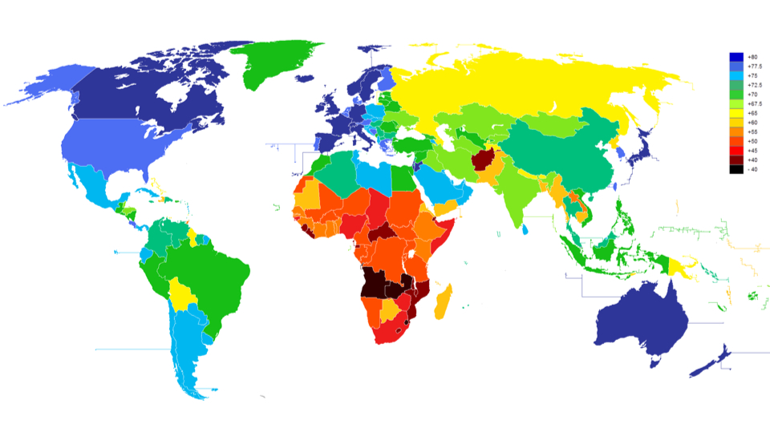
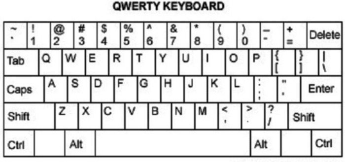

```{r setup, include=FALSE}
knitr::opts_chunk$set(echo = FALSE)
require(magrittr)
require(kableExtra)
require(knitr)
```
<style>
.forceBreak { -webkit-column-break-after: always; break-after: column; }
h3, h4 {font-weight: bold;
        color: #515151;}
</style>

# Causal Logics

## Causal Theory

A **causal theory** identifies **systematic** causes that operate across space and time

- It is a kind of **general** knowledge
- **Patterns** within complexity
- Helps to **predict**
- Helps explain **specific** event

## An example:



## Patterns?

### Democracies appear to have better health

- Better life expectancy

- Lower infant/maternal mortality

## Democracy and health


 
## What explains this pattern?

### Why does more democracy improve health?

## Answering "why" {.build}

### More democracy $\xrightarrow{}$

Voting can remove a government $\xrightarrow{}$

Government officials need to appease large electorate to keep office $\xrightarrow{}$

Governments must spend more on improving citizen health $\xrightarrow{}$

### Better health for citizens

### A *Causal Logic* (Mechanisms)

## Causal Logic

### A *causal logic*:

A set of statements about **how** or **why** a cause produces its effect.

## Causal Logic

### Details

Given a claim $C \xrightarrow{} E$:

- Causal logic given a **causal chain** that logically connects cause to the effect
- $C \xrightarrow{} e_1 \xrightarrow{} e_2 \xrightarrow{} e_3 \xrightarrow{} E$

Makes additional assumptions/assertions:

- Need to believe additional causal claims about each step in the logic
- E.g.: do we believe this story if we don't accept $e_2 \xrightarrow{} e_3$

## Making a causal logic

1. Must start with **cause**, end with the **effect**
2. Each step is logically related to the next through a **causal** relationship
3. It is **not** a chronological list of specific events. It is a **general** sequence through which one things causes another

## Democracy and Health

**More democracy** $\xrightarrow{}$

Voting can remove a government $\xrightarrow{\mathbf{?}}$

Government officials need to appease large electorate to keep office $\xrightarrow{}$

Governments must spend more on improving citizen health $\xrightarrow{}$

**Better health for citizens**

### For "?" step to work, assume that:

- Politicians motivated to stay in office
    - Would this step work if politicians did not care?
    
## Democracy and Health

**More democracy** $\xrightarrow{}$

Voting can remove a government $\xrightarrow{}$

Government officials need to appease large electorate to keep office $\xrightarrow{\mathbf{?}}$

Governments must spend more on improving citizen health $\xrightarrow{}$

**Better health for citizens**

### For "?" step to work, assume that:

- Votes are cast based on health policy/outcomes
    - Would this step work if votes based on shared ethnicity? Best ads?
  
## Democracy and Health

**More democracy** $\xrightarrow{\mathbf{?}}$

Voting can remove a government $\xrightarrow{}$

Government officials need to appease large electorate to keep office $\xrightarrow{}$

Governments must spend more on improving citizen health $\xrightarrow{}$

**Better health for citizens**

### For "?" step to work, assume that:

- Governments only changed by voting
    - would this step work if authoritarian governments can be removed by revolution/mass protest?
    
## What goes into a Causal Logic?

Focus on actors/agents

### How do actors make choices?

- What are actors' goals?
- What incentives do they have?
- What resources do they lack/possess?
- What rules/institutions must they work within?
- What cultural norms do they follow?

### How do actors form attitudes/beliefs/goals?

- Cognitive mechanisms
- Emotional processes
- What information do they have?

### How do organizations/collective groups "behave"


## Competing Causal Logics

Wealthy countries are less likely to experience civil war. Why?

### Three different logics

1. Wealth $\xrightarrow{}$ Larger defense budget $\xrightarrow{}$ Rivals deterred $\xrightarrow{}$ Less civil war
2. Wealth $\xrightarrow{}$ Higher standard of living $\xrightarrow{}$ Fewer grievances $\xrightarrow{}$ Weak support for change $\xrightarrow{}$ Less civil war
2. Wealth $\xrightarrow{}$ Lots of job opportunities $\xrightarrow{}$ Fewer listless young men $\xrightarrow{}$ Fewer rebel recruits $\xrightarrow{}$ Less civil war

## Common causal logics: {.build}

Why do individuals not take action to achieve societal goals?

- E.g.: People want to stop climate change, but don't cut carbon footprint

## Collective Action Problems {.build}

When: 

- Success depends on cooperation
- Individual action is costly 
- Everyone benefits from success regardless of whether they participate 

Then:

- Rational to NOT contribute
- Individuals will not work towards goal they all share
- "Tragedy of the Commons": In **no one's** individual interest to work toward collective goal preferred by **all**


## Collective Action Problems

Helps us explain:

- Why consumer groups weaker than business/corporate groups

- Nations fail to take action on climate change

- Global fishery populations in jeopardy

- Why deeply unpopular governments go unchallenged


## Common Causal Logics

### Markets

Competition and learning lead to efficiency

- Better products beat out worse products
- Better parties/candidates defeat worse
- Mistakes corrected by learning

## But keyboards:



## But keyboards:


## Path Dependence:

Silly keyboard due to time-specific tech problem  $\xrightarrow{}$

Lots of firms buy silly keyboard  $\xrightarrow{}$

Lots of typists learn silly keyboard  $\xrightarrow{}$

NEW, BETTER KEYBOARD (1932)

$\xrightarrow{}$ Still sensible for firms to buy silly keyboard
 
$\xrightarrow{}$ Still more sensible for typists to learn silly typing
  
$\xrightarrow{}$ Stuck with silly keyboard
   


