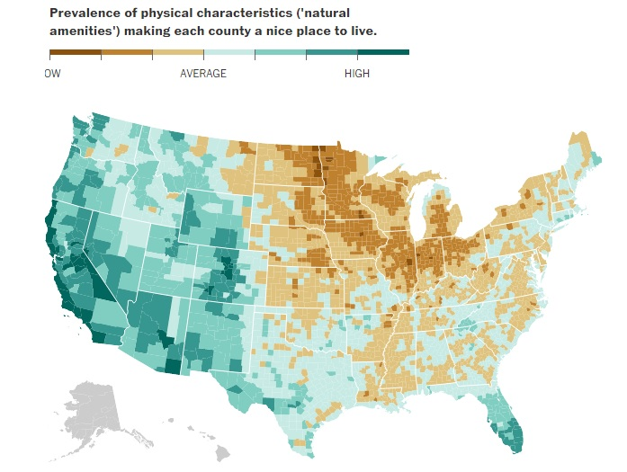
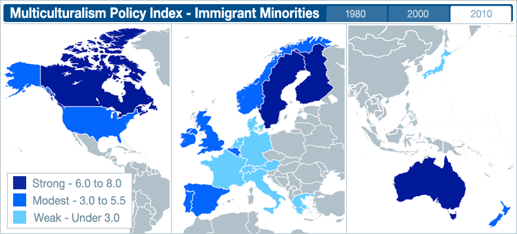
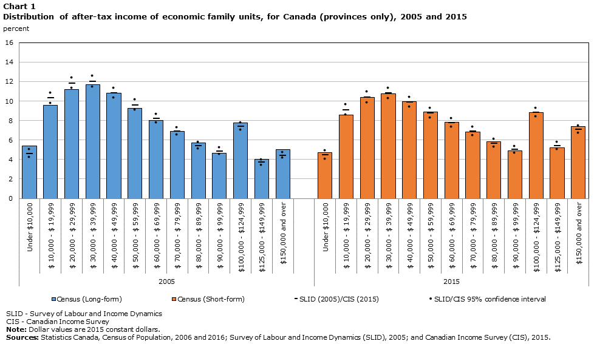
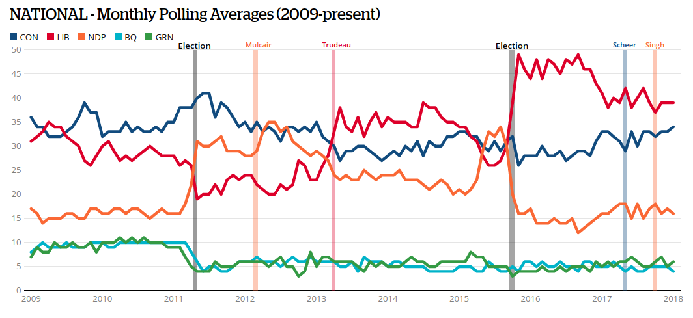

```{r setup, include=FALSE}
knitr::opts_chunk$set(echo = FALSE)
require(magrittr)
require(kableExtra)
require(knitr)
```
<style>
.forceBreak { -webkit-column-break-after: always; break-after: column; }
h3, h4 {font-weight: bold;
        color: #515151;}
</style>

# Concepts

## From Theory to Empirics {.build}

### Until now:

Posing questions, making claims

### Now

Answering questions, evaluating claims


## From Theory to Empirics

### What is the first step?

## Some claims: {.build}

The election of ethnic political parties cause an increase in ethnic violence.

Democratic governments improve the health of their citizens.

Technologies that favor offensive over defensive warfare make war more likely to occur.

Introducing proportional representation causes a decline in the accountability of legislators.

## Before we evalute these claims

### What are the first things we need to know?

## Before we evalute these claims

The election of **ethnic political parties** cause an increase in **ethnic violence**.

### What are...

- ethnic political parties?
- ethnic violence?

What do these mean? How would we recognize them?

## Before we evalute these claims

**Democratic** governments improve the **health of their citizens**.

### What are...

- democracies?
- health?

What do these mean? How would we recognize them?

## Before we evalute these claims

Technologies that favor **offensive** over **defensive** warfare make **war** more likely to occur.

### What are...

- Offensive technologies?
- Defensive technologies?
- Wars?

What do these mean? How would we recognize them?


## Before we evalute these claims

Introducing **proportional representation** causes a decline in the **accountability** of legislators.

### What is

- Proportional representation?
- Accountability?

What do these mean? How would we recognize them?

## What we need:

**Concepts**: abstract definitions that are used to describe phenomena, groups, individuals, and their attributes.

- Help us clarify what causal or descriptive claims mean.


## Concepts:

### More attributes

- **General**, not specific
    - no proper nouns
    
## Concepts:

Aren't these really easy?

## Concepts:

What is a ...

### Democracy

## Concepts:

What is a ...

### War

## A procedure:

1. List all cases where concept clearly applies...
    - E.g., everyone would agree that Canada is a democracy
2. Propose a "covering definition".
    - A definition that would apply concept to all clear cases
3. Does this definition include other cases that intuitively do not belong
    - This includes both actual or hypothetical cases
4. Go back to 2, reformulate definition
    - avoid many of conditions using "or", add criteria to fit a sintle idiosyncratic case

## A procedure:

Repeat 3 and 4 until:

- No more exceptions you can think of
- Remaining exceptions are borderline cases where no one has a strong intuition on whether they fit the category

## An example: "Ethnic violence"

### 1. What are the "clear" cases?

>- Holocaust, Rwandan Genocide, Ethnic Cleansing in Balkans, KKK attacks against African Americans


## An example: "Ethnic violence" {.build}

### 2. A "covering" definition?

>- "ethnic violence is violence between ethnic groups"

## An example: "Ethnic violence" {.build}

"ethnic violence is violence between ethnic groups"

### 3. Are there exceptions to this rule?

>- white American mugged by an African American?
>- fight between fans of Brazil and Argentina national football teams?

### Fit the rule, but are they "ethnic violence"

- Is mugging "economic crime" rather than "hate crime"?


## An example: "Ethnic violence"

- Are attacks on an ethnic group to take their land, jobs, material goods "ethnic violence" in absence of "hatred"?
- What if soldier from separatist armed group plants a bomb that kills many from a different ethnic group. Soldier may lack hatred, does it count?
- Could mugging be ethnic violence if ethnicity of victim is pretext for theft?
- Can wars between countries be "ethnic violence"?

## An example: "Ethnic violence"

### Refined definition:

Violence is "ethnic" if it involves members of different ethnic groups and either:

1. it is motivated by hatred or dislike of ethnic others;

2. The criterion for selecting victims is ethnicity;

3. it is committed on behalf of in in the name of an ethnic group, or against those claiming to represent an ethnic group (and because of that)

and at least one of the actors is not a state.


## Another concept: "natural amenities"

In the 1990s, the US government sought to evaluate the best and worst places in American with respect to the natural scenery and climate.

**natural amenities**: "physical characteristics of an area that enhance the location as a place to live"

## Natural amenities



## Natural amenities

Vancouver would probably rank "very high" on natural amenities. 

### But

Just what physical characteristics "enhance a location as a place to live"?

## Natural amenities

Several dimensions of "natural amenities"

### According to the US Department of Agriculture:

- Warm winters
- Winter sunlight
- Temperate summer
- Low summer humidity
- Topographic variation
- Surface water

## Dimensions of a concept: {.build}

**dimensions of a concept**: phenomena that both:

1. Are **part** of the concept

2. Could exist, disappear, change **independently** of one another. They are **not redundant**

### Dimensions are like "sub-concepts"

### Why do dimensions matter?

- Clarify causal logics
- Moving from concept to measurement

## Example: Multiculturalism and conflict

claim:

### "**Multicultural policy** reduces **ethnic conflict**"

## Multicultural policy:

Defining the concept:

> "Forms of public recognition, support, or accommodation for ethnocultural minorities to maintain and express their distinct identities and practices."

## Multicultural policy:

A multidimensional concept (for immigrant minorities):

- **Formal state commitment** to MCP:
- Multiculturalism in **school curricula**
- Required diversity in **media**
- Exemptions from **dress codes**
- Permitting **dual citizenship**
- **Funding ethnic groups/organizations**
- **Funding** bilingual/mother-tongue instruction
- **Affirmative action** for disadvantaged minorities

## Multicultural policy:



## Multicultural policy:

Does it matter **which** dimensions are present and absent?

## Multicultural policy:

Country|Commit|Curric.|Media|Dress Code|Dual Citizens|Ethnic Funding|Bilingual Ed|Affirm. Action|Total
-------+------+------------+--------+---------+--+--+--+--+--
Germany|Kinda|No|No|Kinda|No|Yes|Kinda|No|2.5
Greece|No|Kinda|Kinda|No|Yes|No|No|Kinda|2.5

Kinda = 0.5
Yes = 1

## Multicultural policy:

Does it matter **which** dimensions are present and absent?

- Different dimensions may have different **effects**
- Should inform our theory, causal logics
- Conversely, need to **measure** correct dimension of concept as it corresponds to theory

# From Concepts to Measurement

## Once we have concepts... {.build}

### What do we do?

### Identify *variables*

### Propose *measures*


## Concept to Measurement:

### Concept 

### $\xrightarrow{}$

### Variable 

- Something **observable** that captures/maps onto concept

### $\xrightarrow{}$

### Measure:

- Procedure for observing the variable

## Concept to Measurement: {.build}

### Concept: Height (of a mountain)

Prominence of peak from the earth's surface

### $\xrightarrow{}$

### Variable: Vertical distance from top of peak to sea level

### $\xrightarrow{}$ 

### Measure:

Use difference in barometric pressure to calculate difference in elevation

## Concept to Measurement: {.build}

### Concept: Democracy

Regime in which government decided by contested elections and incumbents lose and leave office peacefully.

### $\xrightarrow{}$

### Variable: Occurrence of contested elections, turn-over in government

### $\xrightarrow{}$ 

### Measure:

- Historical data on each countries electoral rules, their application, results of elections

## Concept to Measurement: {.build}

### Concept: Accountability

Legislators vote in a manner similar to (median) preferences of constituents

### $\xrightarrow{}$

### Variable: Difference between legislator behavior and constituent preferences

### $\xrightarrow{}$ 

### Measure:

- Random survey of constituents on policy areas on which legislator voted. List of votes on these policies by the legislator.


## Concept to Measurement:

### Concept:

- An **abstract** definition for characteristics of or types of phenomena, groups, or individuals.

### Variable:

A **measurable property** of a phenomena, group, or individual that takes on different values (it *vari*es). Maps onto a concept.

### Measure:

A **procedure** for determining the value of a variable for **specific cases** based on **observation**.

## Concept to Measurement:

### Concepts and Variables vs. Measures:

Concepts and variables are **general**

- Concept: Intensity of civil war
- Variable: Casualties in a civil war
- NOT: "intensity of civil war in Syria"

## Let's try it: {.build}

### Claim:

"Ethnic diversity in a country causes poor economic growth"

### Causal Logic:

- Ethnic diversity leads to group-based politics 
- This leads to fewer public goods (e.g. education), policies that enrich one group 
- This discourages investment and innovation
- Weaker economic growth

### Ethnic diversity:

- concept?
- variable?
- measure?

## Ethnic diversity: concept

- Presence of many different ethnic groups?
- Presence of many distinct and large ethnic groups?

## Ethnic diversity: variable

### Probability that any two random individuals belong to different ethnic groups

"Ethno-linguistic fractionalization": "ELF"

### $$ELF = 1 - \sum_{i=1}^{n} s_i^2$$ 

Where $s_i$ is fraction of population for group $i \in \lbrace 1 \ldots n \rbrace$

## Ethnic diversity: measure {.build}

Measure size of ethnic groups using *Atlas Narodov Mira*:
  
Soviet anthropological text from 1964 

- lists ethnic groups in each country
- lists the size of these groups

### Anything wrong here?

## Ethnic diversity: revisions

### Concept:

- Different dimensions of ethnicity (e.g. language, religion, race, caste, tribe)
- Causal logic suggests **political relevance** matters (differences between Greek, Italian, German, Irish immigrant descendants in US are not relevant today)

### Variable:

- Country A: Group 1 50%, Group 2 50%
    - $ELF = 0.5$
- Country B: Group 1 66.6%, Group 2 16.6%, Group 3 16.6%
    - $ELF = 0.5$

## Ethnic diversity: revisions
    
### Measure:

Soviet anthropologists: 

- Are group sizes from 1964 correct?
- Distinct ethnic groups treated as the same, unified ethnic groups treated as different
- Rwanda: Hutus and Tutsis coded as one ethnic group.

## Ethnic diversity: revisions

### Concept:

Presence of distinct and large **politically relevant** ethnic groups

### Variable:

Probability that any two random individuals belong to different politically relevant ethnic groups


### Measure:

- Identify relevant groups in each country using histories, news, academic books
- Calculate size of these groups using up-to-date census counts

# Variables

## Definition

**variable** : a **measurable property** of a phenomenon, group, person that can potentially take on different values.

- Derived to capture a concept
- *Vari*ation across **cases** or over **time**.

### In practice:

Variables take on values for each specific case at a specific point in time

- "Annual household income"
- Case is a household, time is a year
- Can vary between households in year
- Can vary across years within a household


## Annual Family Income:

This is a variable. What values does it take?

- Numeric values
- Range: 0 to ?
- Range: -? to ? (if business losses included)

Variations:

- Gross Annual Household Income
- Annual after-tax family income

## Annual Family Income:




## Languages


## Language spoken: {.build}

This is a variable: what values does it take?

- Categories
- No numeric range
- One language is not "higher"/"lower" than another.

### But what if we counted the fraction of people?

## Another example:



## Levels of measurement

**Variables** imply a **level of measurement**

- Nominal
- Ordinal
- Interval
- Ratio

## Levels of measurement: *nominal*

### Categorical:

- Place cases into discrete groups based on presence/absence of attribute
- No category is ranked higher or lower than another
- Categories are exhaustive
    - sometimes we just have "other"
    - sometimes they are nested (categories within categories)
    
### Examples:

- Religion
- Pastisan affiliation
- Type of electoral system
- Occupation


## Levels of measurement: *ordinal*

### Categorical:

- Categories are **ranked**, may have a number attached
- Cases can be said to have **more** or **less** of something
- Intervals between categories **not meaningful**
- **relative** levels, **not absolute** levels

### Examples:

- University rankings
- Test score percentiles
- Education (on a survey: elementary or less, high school or less, some university, university degree, post-graduate)
- Ideology (very liberal, somewhat liberal, neither, somewhat conservative, very conservative)
- Income bins

## Levels of measurement: *interval*

### Numerical:

- intervals between values are meaningful and consistent
- difference in values indicates **how much** more or less of something one case is from another
- no meaningful zero point

### Examples

- Years (but not years since some event)
- Current Events quiz score
- Temperature (in Celsius, but not Kelvin)

## Levels of measurement: *ratio*

### Numerical:

- intervals between values are meaningful and consistent
- difference in values indicates **how much** more or less of something one case is from another
- **zero indicates absence**

### Examples

- Years since some event
- Age
- Counts of events
- Rates (unemployment, language spoken, political party preference)

## Choosing the right variable:

### Gun Violence:

Which is best?

1. Number of gun deaths?
2. Number of gun deaths per 10,000
3. Change over time in number of gun deaths
4. Proportion of all deaths that involve guns
5. Proportion of all murders that involve guns

### What questions might fit each of these?

## Choosing the right variable:

### Absolute?

- Measures made in measurement **units**
- Do not compare cases against one another directly
- Examples:
    - dollar amounts
    - Number of events
    - Number of deaths


## Choosing the right variable:

### Relative?

- Measures that **compare** cases with one another
    - Units are fractional (deaths/population, events/time)
    - No units (percentile, rankings)
    - May **directly** compare cases (rankings, percentiles)
    - May facilitate standard comparisons (ratios)


