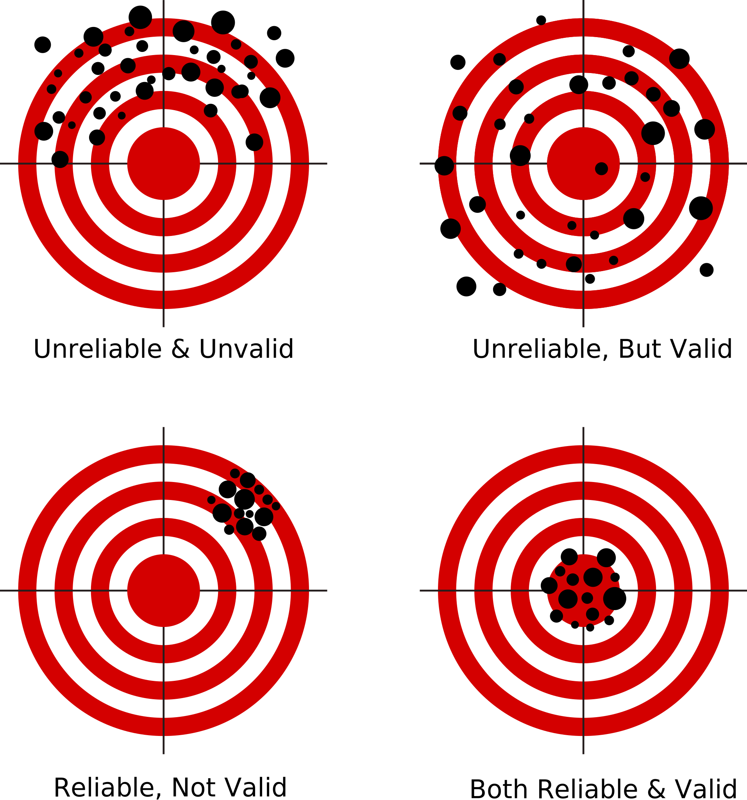
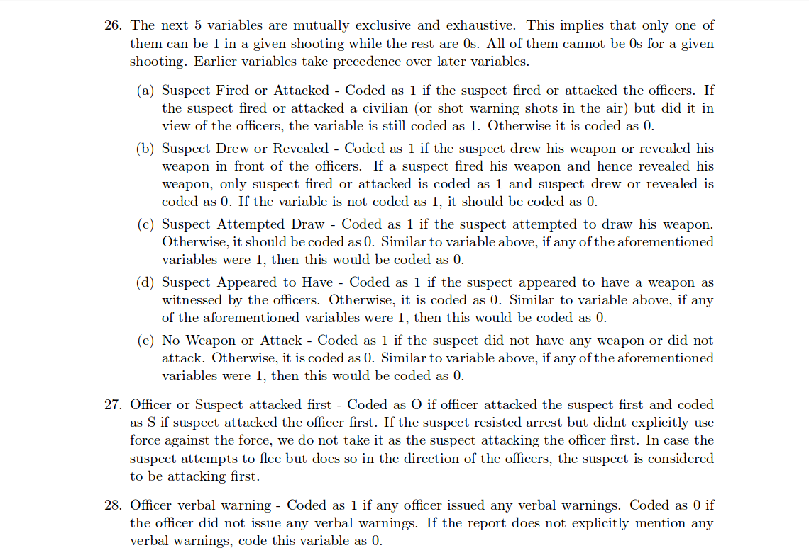
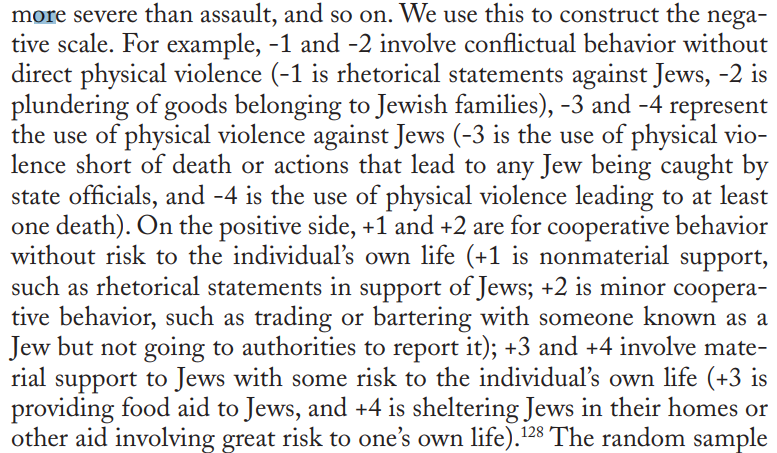
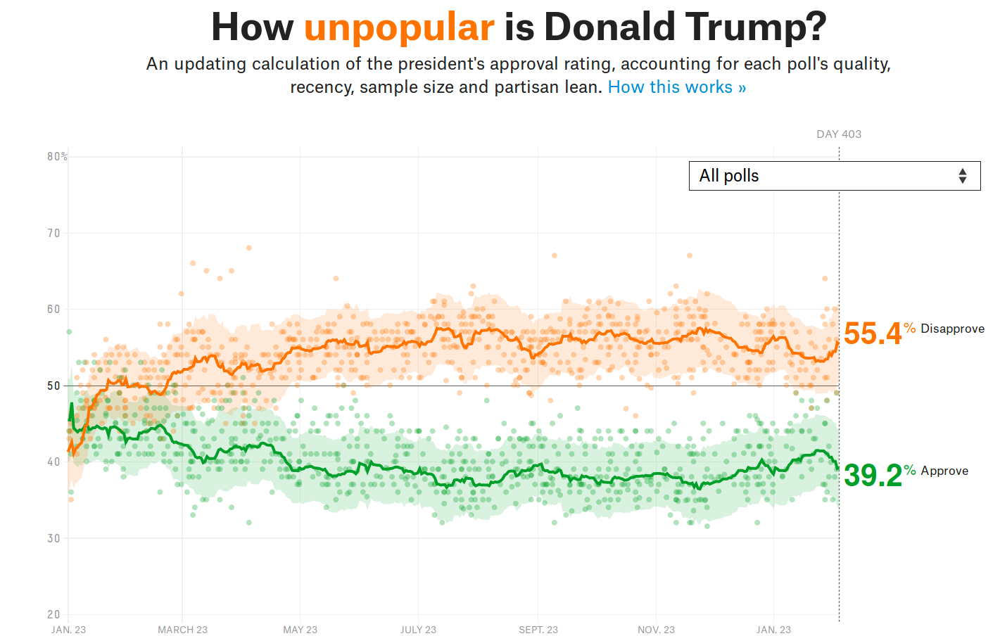
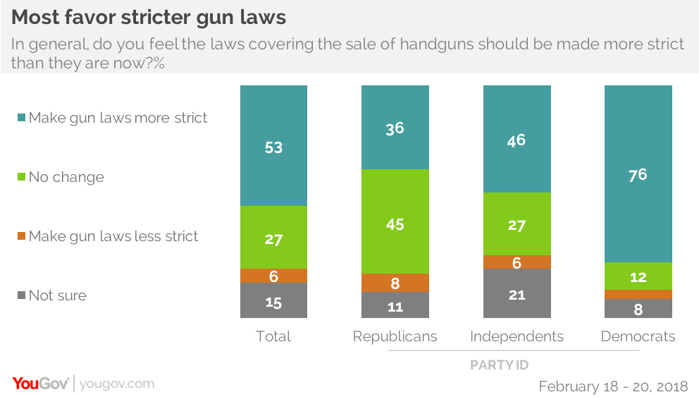

```{r setup, include=FALSE}
knitr::opts_chunk$set(echo = FALSE)
require(magrittr)
require(kableExtra)
require(knitr)
require(ggplot2)
require(gtools)
```
<style>
.forceBreak { -webkit-column-break-after: always; break-after: column; }
h3, h4 {font-weight: bold;
        color: #515151;}
</style>

# Measurement

## Recap {.build}


### Concept 

### $\xrightarrow{}$

### Variable 

- Something **observable** that captures/maps onto concept

### $\xrightarrow{}$

### Measure:

- Procedure for observing the variable

## Concept to Measurement:

### Concept:

- An **abstract** definition for characteristics of or types of phenomena, groups, or individuals.

### Variable:

A **measurable property** of a phenomena, group, or individual that takes on different values (it *vari*es). Maps onto a concept.

### Measure:

A **procedure** for determining the value of a variable for **specific cases** based on **observation**.


## Concept to Measurement: Concepts

**dimensions of a concept**: phenomena that both:

1. Are **part** of the concept

2. Could exist, disappear, change **independently** of one another. They are **not redundant**


## Concept to Measurement: Variables 

### Levels of Measurement:

- Nominal
- Ordinal
- Interval
- Ratio

### Choices:

- Absolute levels
- Relative levels

## Testing Claims:

### Causal Theory vs. Causal Claim

- Concepts $\xrightarrow{}$ Variables
    - Independent (Cause) and Dependent (Outcome) Variables
- Direction of effect
- Causal logic

# But how do we decide what measurement to use?

# Examples

## Political Knowledge:

### Democracy:

- Does democratic governance require that citizens have sufficient knowledge to make decisions?

### What might they need to know?

>- What are government policies?
>- What policies do parties/candidates support?
>- What are effects of various policies on their (citizen's) interests?


## Political Knowledge:

What do people actually know?

### Not a lot:


## Political Knowledge:

Does the kind of knowledge required for democracy correspond to questions about current events, institutional rules of government? 

### Two measures:

- Survey people on factual questions; more correct answers mean more knowledge

- Interviewer talks with person for a two hours, then rates their knowledge.


## Racial Bias in Police Shootings

Recent renewal of long-standing controversy:

### Is police/government violence in the US biased against African Americans?

### How would we know?

One way is to think of "statistical discrimination":

- Are African Americans treated differently to white Americans in otherwise identical situations?
- Requires measuring things like "objective threat" to a police officer posed by a suspect

## Racial Bias in Police Shootings

How do we measure "objective threat" in a civilian-police officer interaction?

## Guns {.build}

### Gun Control vs Self Defense

Many argue that guns provide a means of self-defense and can deter crime

### Measurement

How would we measure whether this occurs?

## Guns

### Survey people 

Ask about their use of firearms, ask if they use in self-defense, then obtain details to clarify whether it was in fact a use of a firearm in a situation with another person.

Ask about whether these incidents occurred during criminal actions

# Problems

## Measurement Trouble

### Validity

**validity of a measure**: 

- Degree of fit between a measurement procedure for a variable, and the concept that the variable is intended to capture
- How well as measure "captures" or "maps onto" the concept


## Measurement Trouble

### Threats to validity

Validity can break down in two places:

1. Concept $\xrightarrow{Mismatch}$ Variable
2. Variable $\xrightarrow{Mismatch}$ Measure


## Measurement Trouble

### Threats to validity

1. Measure does not cover **enough**s of the concept:
    - Measure only captures some but not all relevant **dimensions** of the concept
    
    
## Measurement Trouble {.build}

**Concept**: Political knowledge needed for democratic citizen

**Variable**: Recall of factual questions about current politicians, political parties

**Measure**: Survey containing a list of factual questions

### Factual recall may not capture all of the kinds of knowledge that is relevant

- Knowing you and all of your neighbors lost their jobs and are struggling might be enough information to vote against incumbent

- Breakdown at Concept/Variable


## Measurement Trouble {.build}

**Concept**: Political Participation in Democracy

**Variable**: Frequency with which a person participates in political activity

**Measure**: Survey containing questions about frequency of voting in elections

### Voting may not be the only kind of political activity that is relevant

- Working on  campaigns, protesting, writing to representatives could also be participation
- Breakdown at Variable/Measure


## Measurement Trouble

### Threats to validity

1. Measure does not cover **enough** of the concept:
    - Measure only captures some but not all relevant **dimensions** of the concept
2. Measure covers things **outside** the concept:
    - Could cover somethings inside the concept, or **nothing** inside the concept
    
## Measurement Trouble {.build}

**Concept**: Political knowledge needed for democratic citizen

**Variable**: Level of perceptiveness about politics and political issues

**Measure**: Survey where interviewer rates respondent after questions and discussion.

### Interviewer may bring in things outside of "political knowledge" when rating

- Respondent's verbal skills/ agreement between interviewer and respondent
- Breakdown at Variable/Measure

## Measurement Trouble {.build}

**Concept**: Self Defense Gun Use

**Variable**: Event where person deters crime using a firearm

**Measure**: Survey where people report their use of firearms to deter crimes

### People may be bad at reporting their use of guns

- Respondents perceive crimes that are not there (people actually use their weapons to threaten others)
- Respondents inflate their ego by exaggerating threat (estimated 400,000 murders prevented by firearms annually)
- Breakdown at Variable/Measure

## Measurement Trouble {.build}

**Concept**: Political Corruption

**Variable**: Rate of corruption among individual politicians in a place

**Measure**: Rate of corruption prosecutions among politicians in a place

### Does this capture **anything** inside the concept?

- Places with lots of corruption do not prosecute corruption
- Places with low corruption successfully prosecute corruption
- Breakdown at Variable/Measure

## Measurement Trouble {.build}

**Concept**: Framing/Racial Priming of government social programs

**Variable**: Portrayal of social programs as "Welfare" or "Assistance to the Poor"

**Measure**: Survey people on support for "welfare" or "assistance to the poor"

### Does this capture the concept?

- "Welfare" might have racial connotation in the US.
- But, people actually think of different policies when asked about "welfare" and "assistance to the poor".
- Variable captures both framing AND policy preferences.
- Breakdown at Concept/Variable

## Measurement Trouble {.build}

**Concept**: Racism

**Variable**: Opposition to having neighbor of a different race

**Measure**: Survey people on opposition to having a neighbor of a different race

### Does this capture the concept?

- People are unlikely to be truthful: desirability bias
- Breakdown at Variable/Measure

## Measurement Trouble:

### List Experiments?

> "I am going to read ou a list of things that sometimes make people angry, after I read them just tell me HOW MANY of them upset you. I don't want to know which ones."

## Measurement Trouble {.columns-2}

1. Increase in gasoline tax
2. Professional athletes with multi-million $ contract
3. Large industrial corporations polluting
4. Construction of high-rise in your neighborhood

<p class="forceBreak"></p>

1. Increase in gasoline tax
2. Professional athletes with multi-million dollar contract
3. Large industrial corporations polluting
4. Black family moving in next door


## Measurement Trouble

### Threats to validity

1. Measure does not cover **enough** of the concept:
    - Measure only captures some but not all relevant **dimensions** of the concept
2. Measure covers things **outside** the concept:
    - Could cover somethings inside the concept, or **nothing** inside the concept
    - Measure of concept cannot be a **cause** or an **effect** of the concept
3. Measure captures different things across units: **non-comparability**

## Measurement Trouble {.build}

**Concept**: Objective threat to police

**Variable**: Possession of a weapon by suspect

**Measure**: Reported possession of weapon in police officer report after Officer Involved Shooting

### Does this capture the concept?

- Police might report item as a weapon differently in case of black vs. white suspect
- Measurement is not the same across units
- Breakdown at Variable/Measure


## Measurement Trouble {.build}

**Concept**: Exposure to political information

**Variable**: Frequency of reading a newspaper

**Measure**: Survey of people asking for frequency with which they read a newspaper

### Does this capture the concept?

- If we want to compare exposure to political information over time, this could be a problem
- In the 1940s/1950s, newspapers major source of information, but now televisiona nd internet more common.
- Breakdown at Concept/Variable

## Measurement Trouble

### Reliability

**reliability of a measure**: 

- How consistently a measurement procedure produces the same result, when repeated for the same case
    - If two researchers use same procedure, do they get the same result?
    
## Reliability vs Validity {.vcenter .flexbox}



## Reliability vs Validity

### Measuring Individual Income:

|               | **Less Valid**                             | **More Valid**                 |
|:-------------:|-----------------------------------------|-----------------------------|
| **Less Reliable** | Are you high, middle, or low income?    | What is your annual income? |
| **More Reliable** | What is the make and model of your car? | Tax Records                 |


## Measurement Trouble

### Threats to Reliability

1. Room for researcher **interpretation**. **Imprecise** procedures for measurement
    - Expert Ratings (e.g. democracy)
    - Assessing motives (e.g. Donald Trump and "Muslim ban")
    - Assessing motives (e.g. Police shootings)
    
## Measurement Trouble



## Measurement Trouble



## Measurement Trouble

### Threats to Reliability

1. Room for researcher **interpretation**. Imprecise procedures for measurement
    - Expert Ratings (e.g. democracy)
    - Assessing motives (e.g. Donald Trump and "Muslim ban")
    - Assessing motives (e.g. Police shootings)
2. **Instability**: measurement may be unstable over time, even when underlying phenomenon is stable.
    - People's responses to interview questions change
    - Survey response can change due to "randomness": memory/recall, different circumstances
    - Repeated measures can help


## Measurement Trouble




# Measurement Error

## Measurement Error

Weak **validity** or **reliability** $\xrightarrow{}$ **measurement error**

### Two Varieties

1. One type is mostly harmless
2. The other is a problem

## Measurement Error

### Bias

**bias** or **systematic error**: error produced when our measurement procedure obtains scores that are, on average, too high or too low.

- can have an *upward* or *downward* bias
- "on average": even if you repeat the measurement, the tendency is toward a value that is too high or too low
- **not** "politically" biased
- bias (measuring too high or too low) might be all cases or just for certain subgroups
      
## Measurement Error

### Random Measurement Error

**random error**: Error derivces from random features of measurement process or phenomenon

- Because of chance, we get a value that is too high or too low
- There is not systematic tilt one way or another

## Measurement Error

### Random vs. Bias

|  | **Bias** | **Random Error** |
|-----------------------|-------------------------------------------|-------------------------------------------------------------|
| **Attribute** | Validity | Reliability |
| **Pattern** | Related to another concept | Unrelated to other concept;<br>related to unrelated concept |
| **Testing Causal Theory** | Unknown change in results;<br>hard to fix | Find no relationship<br>even if there is one |
| **When it's OK** | If it is UNIFORM across cases | If  false negative better<br>than false positive |

## Measurement Error

### Random vs. Bias

```{r, echo = F}
n = 10000
x1 = rnorm(n, 0, 0.5) + 1
x2 = rnorm(n, 0, 3)
plot_data = data.frame(Measure = rep(paste0("X",1:2), each = n), value = c(x1, x2))
xlims = range(c(x1,x2))
ggplot(plot_data, aes(value, fill = Measure)) + 
  geom_histogram(bins = 100, alpha = 0.5, position = 'identity') +
  labs(title = 'Different measures of X') + xlab("Observed X") + ylab("Frequency") + 
  theme_bw() +
  geom_vline(xintercept = 0, colour = 'red')
```

## Measurement Error

### $X1$ is *biased*

### $X2$ has *random error*

## Random Error vs. Bias


## Bias

### Sources

(1) Researcher subjectivity/interpretation
    - Researcher systematically over-weights, under-weights dimension of concept


## Example

### Political Knowledge

Overweighting verbal skills in measure of political knowledge

$\xrightarrow{DownwardBias}$ political knowledge of less articulate respondents


## Bias

### Sources

(2) **Gap** between concept and measure

- Measure things **outside**/extraneous to the concept
    - Upward bias for cases with extraneous features
    - Downward bias for cases without extraneous features
    - e.g. Survey on self-defense gun use gives upward bias for people who are paranoid
- Fail to measure things **inside** the concept:
    - Upward bias for cases that lack missing dimensions
    - Downward bias for cases that have missing dimensions

## Bias

### Sources

(3) **Obstacle to observation**
    - **social norms** may discourage revelation of information; downward bias in "undesirable" phenomena
    - e.g. survey measure of racism or drug use $\xrightarrow{}$ **social desirability bias**

## Bias

### Sources

(3) **Obstacle to observation**
    - **incentives to hide/misrepresent**: political actors have strategic reasons to conceal information from each other
    - e.g. states may present their military capacity to be better than it is (upward bias)
    - e.g. wealthy people may present themselves as less wealthy to avoid negative attention (downward bias)
    
## Bias

### Sources

(3) **Obstacle to observation**
    - **anticipated reactions**: political actors anticipate what others will do. They don't pick fights they will use.
    - e.g. Measure what Trudeau wants on policy by looking at his proposed legislation
    - e.g. Measure opposition to dictator using public protest
    - Downward bias for actions likely to be unsuccessful.
    

## Bias: Solutions?

1. Researcher subjectivity:
    - More precise, clear rules for measurement procedure
2. **Gap** between concept and measure
    - Adjust measure to fit concept
    - Use multiple measures that miss **different** parts of concept
3. Obstacles to observation:
    - Social norms: Protect anonymity, subtle measurement (list experiment)
    - Incentives to hide/misrepresent: use private records, behavior not statements, interview after incentives gone
    - Anticipated reactions: protect anonymity, subtle measurement, examine less costly behaviors
    
## Random Error

### Sources

- Imperfect memory (survey/interviews)
- "Random" changes in mood/concerns (for surveys)
    - e.g. rain might make you more angry and support government less
- Counting errors (e.g., national statistics)
- Researcher interpretation 
    - e.g. random differences in classifying cases

## Random Error

If truly random: errors **cancel out** with many trials

### Solutions

- Repeat measure for lots of cases/individuals
- Repeat measure for same case at multiple points in time
- Have multiple researchers apply measure to same case

## Bias

Because it is **not** random:

- Repeating measurement does not help

Instead:

- Improve the measurement procedure
- Use **multiple** measures with different problems:
    - Upward bias in measure 1 may be balanced by downward bias in measure 2
    - Ideally, measures from entirely different sources
    
## Rule of Thumb:

### "Truth lies at the confluence of *independent* streams of evidence"

- Karl Deutsch


# Too much to measure?

## Gun Control:




## Gun Control:


## Can't interview *everybody* {.build}

### Only asked $1500$ people... 

### Can they be accurate?

## Don't need *everybody*

**population**: full set of cases (countries, individuals, etc.) we're interested in learning about

**sample**: subset of the population that we observe and measure

**inference**: description of the population we make *based on a sample*

## Example:

Measuring attitudes on gun control in the US:

The **population**:

- All adults in the US

The **sample**: 

- 1500 people chosen at random

The **inference**:

- 53% of Americans want stricter gun laws, with some **uncertainty** due to sampling

## Example:

We want to measure how the press covered lynchings at the turn of the 20th century

**population**: all lynching events

**sample**: a few hundred events chosen at random

**inference**:

- What fraction of press coverage condemned lynching, with **uncertainty** due to sampling.

## Method of Sampling {.build}

For sampling to work:

- Sample must be similar to, **representative** of the population

### How to ensure this?

Commonly: **random sampling**:

Selecting cases from the population in a manner that gives all cases an equal probability of being chosen

## Random sampling:

**random sampling**, or selecting cases from the population in a manner that gives all cases an equal probability of being chosen

### Two nice properties:

1. **Law of large numbers**: 
    - If we sample many times at random from population, the values in the sample will **converge** to the true value of the population.
    - More precisely: as $N$ increases the expected value/**mean**/**average** of the sample will approach the expected value/**mean**/**average** of the population.
    
2. **Central Limit Theorem**: 
    - As sample size $N$ increases, the possible values of the sample mean becomes **normally distributed** (bell curve)
    
## Random sampling at work:

Imagine we consider the following situation:

**population**: all coin flips of a fair coin

**sample**: a set of coin flips we perform

## After 10 flips:

```{r, echo = F}
f = sample(0:1, 10000, replace = T)
cum_mean = cumsum(f) / 1:length(f)

idx = 1:10
plot(idx, cum_mean[idx], xlab = 'Number of flips', ylab = 'Fraction Heads', main = 'Fair coin flips', type= 'l')
abline(h=0.5, col = 'red')

```

## After 100 flips:

```{r, echo = F}

idx = 1:100
plot(idx, cum_mean[idx], xlab = 'Number of flips', ylab = 'Fraction Heads', main = 'Fair coin flips', type= 'l')
abline(h=0.5, col = 'red')

```

## After 1000 flips:

```{r, echo = F}

idx = 1:1000
plot(idx, cum_mean[idx], xlab = 'Number of flips', ylab = 'Fraction Heads', main = 'Fair coin flips', type= 'l')
abline(h=0.5, col = 'red')

```


## After 1000 flips:

```{r, echo = F}

idx = 1:10000
plot(idx, cum_mean[idx], xlab = 'Number of flips', ylab = 'Fraction Heads', main = 'Fair coin flips', type= 'l')
abline(h=0.5, col = 'red')
```

## Random Sampling:

### Random Sampling and large sample 

### $\xrightarrow{N\rightarrow\infty}$

### (1) Sample Mean $\approx$ Population Mean

### (2) Uncertainty of Sample Mean $\rightarrow 0$

## Random Sampling: {.build}

If we wanted to know: what is ideal temperature you keep thermostat?

**population**: all students at UBC

**sample**: students in this class who didn't wear a coat today

### Where does this go wrong?

## Sampling Error:


**sampling error**:

The difference between the value of the measure for the sample and the true value of the measure for the population

## Sampling Error vs. Measurement Error:

**Measurement Error**: 

- Incorrectly describe the world because you **incorrectly** observe the cases you study
- e.g.: measure "Racism" by asking people "are you racist?"

**Sampling Error**:

- Incorrectly describe the world because **cases you study** are different from the population you want to learn about
- e.g.: you want to measure anti-immigration sentiment in Canada by interviewing Canadian university students
- Sample deviates from population **in a manner related to what you study**

## Sampling Error:

Types:

1. **Random Sampling Error**:
    - Error caused by random process of selecting samples
    - By chance, samples will be higher or lower than population average
    - **SOLUTION**: Sample more cases. Random errors get smaller as $N \rightarrow \infty$
    
## Sampling Error:

```{r, echo = F, include=F}
incomes = seq(1000,2500, length.out = 6)
```

Imagine there are six people whose monthly incomes are:

`r incomes`

## Sampling Error:

Rather than asking all six, we take a sample of $3$ at random and take the mean.

```{r, echo = F, include = F}
s = sample(incomes, 3)
```
Our sample is: `r s`

The sample mean is: `r mean(s)`

The population mean is: `r mean(incomes)`


## Sampling Error:

What if we took **all possible** samples of size $3$

```{r, echo = F}
all_samples = permutations(length(incomes), 3, incomes, set = F)
all_sample_means = rowMeans(all_samples)

kable(all_samples)
```

## Sampling Error:

```{r, echo = F}
hist(all_sample_means, xlab = 'Sample Means', main = 'All possible sample means', breaks= 30)
abline(v = mean(incomes), lwd = 4)
abline(v = mean(all_sample_means), lwd = 1, col = 'red')
```

## Size of Random Sampling Error:

### Get's smaller as $n$ gets larger

### at rate of $1\over\sqrt{n}$

## Size of Random Sampling Error:

```{r, echo=F}
sd = 0.5
se = sd / sqrt(1:10000)

plot(1:10000, se, xlab = 'Sample Size',
     ylab = 'Size of Sampling Error', 
     main = "Sampling Error for Coin Flips",
     type = 'l')
```

## Sampling Error:

Types:

2. **Sampling Bias**:
    - **sampling frame** or group from which you randomly sample $\neq$ population
    - If you sample from group different from population you care about, you get bias
    - This means not every member of population has equal chance of being in sample


## Sampling Error:

### Sampling bias: sampling frame:

- Election poll based on sampling from phone book
- Survey on drug use sampling by list of home addresses


## Sampling Error:

Types:

2. **Sampling Bias**:
    - **self selection**: respondents/cases control whether they join the sample
    - Choice to join or not join the sample means not every member  of population has equal chance of being in sample


## Sampling Error:

### Sampling bias: selection bias

During 2016 Presidential campaign, large swings in polls due to 

What if...

- When bad news came out about Hillary, **Democrats** didn't want to answer the phone.
- When bad news came out about Trump, **Republicans** didn't want to answer the phone.
