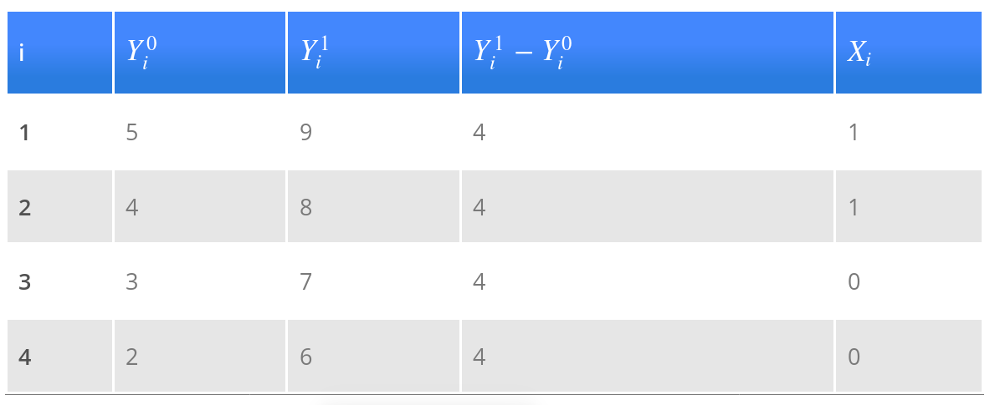

```{r setup, include=FALSE}
knitr::opts_chunk$set(echo = FALSE)
require(magrittr)
require(kableExtra)
require(knitr)
require(ggplot2)
require(gtools)
require(dagR)
require(data.table)
require(MASS)
```
<style>
.forceBreak { -webkit-column-break-after: always; break-after: column; }
h3, h4 {font-weight: bold;
        color: #515151;}
</style>

# Review

## Concepts, Variables, Measures

How are they related/different?

## Concepts, Variables, Measures

What are dimensions of a concept?

## Concepts, Variables, Measures

What are the levels of measurement?

## Validity

What does validity imply about relationship between concept and variable/measure?

## Reliability

What does validity imply about relationship between concept and variable/measure?

## Measurement Error

Compare/contrast random error and systematic measurement error

## Sampling

What is an inference?

## Sampling error/bias

What is random sampling error? What is sampling bias?

Why do they happen?

What are solutions?

## Causal Inference

What is fundamental problem of causal inference?

What is counterfactual in terms of potential outcomes?

## Causal Inference



## Causal Inference

What is the indepedent variable?

What are dependent variables when cause is present/absent?

What is the causal effect for an individual case?

Which values are counterfactual?


## Causal Inference


## Comparative Method

What is the empirical prediction of the comparative method?

What must be true of two compared cases to find evidence in support of X causes Y?

## Correlation

What is empirical prediction for a causal claim that is tested by correlation?

## Statistical Significance

What is a p value?

How is it related to statistical significance?

## Spurious Correlation

What is direction of bias induced by confounding variable?

## Spurious Correlation

What is an interceding variable?

Does it induce spurious correlation?

What is an antecedent variable?

Does it induce spurious correlation?

## Solutions to Spurios Correlation

What is adjustment?

How does adjustment/conditioning solve spurious correlation differently than experiments?
