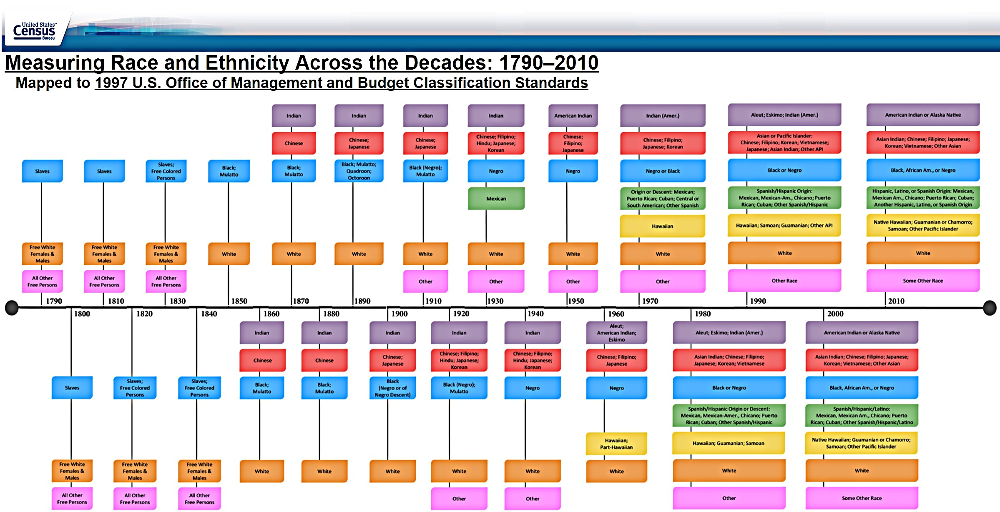
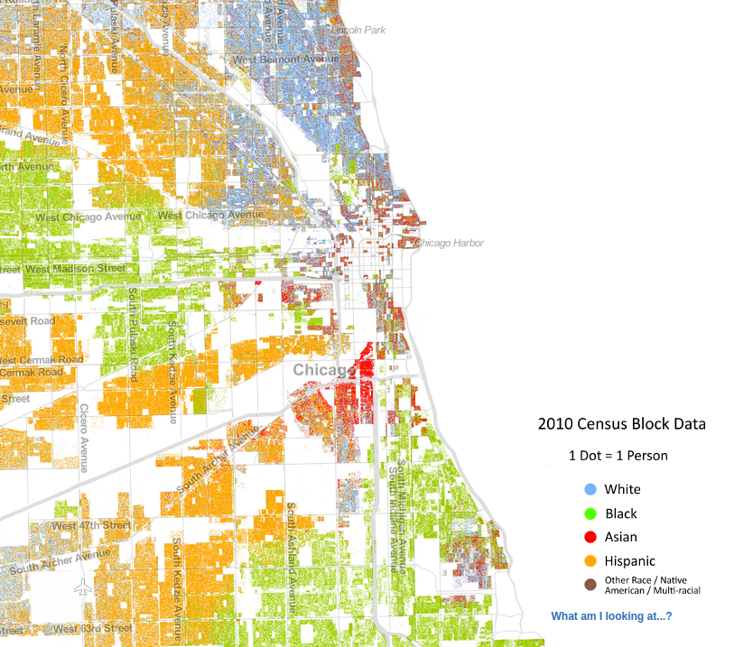

```{r setup, include=FALSE}
knitr::opts_chunk$set(echo = FALSE)
require(knitr)
require(kableExtra)
require(magrittr)
```


# Ethnicity and Structure

## Outline

- Ethnic boundary practices
- Ethnic boundaries as structures
- Assignment 1

# Ethnic Boundaries

## Ethnic Boundaries

### **social boundaries** (Tilly, Wimmer)

### 1. categories for people and category rules

- "labels" and "definitions" (Chandra)

### 2. real-world practices that use those categories

- what we "do" with those labels
    - in thought and speech; 
    - in action/in shaping our material world


# Ethnic Boundary Practices

## Ethnic Boundaries: Institutions

**institutional use**: the use of ethnic/racial categories by formal institutions to label people (not necessarily in a discriminatory manner)

- examples: census forms, school forms, voting rules, government social service records

**institutional separation**: the presence of distinct formal institutions for people labelled as members of different ethnic/racial categories (not necessarily *unequal*)

- examples: churches/houses of worship, stores, schools, private associations, voting constituencies, governments, political parties, newspapers

## Ethnic Boundaries: Institutional Use




## Ethnic Boundaries: social closure

**social closure**:  the use of ethnic/racial categories to separate or organize personal/informal interactions between people (not **necessarily unequal**)

- examples of separation: neighborhoods, use of space (e.g. pools), marriage, reproduction (endogamy), friendship, the **types** of interaction (e.g. equal/unequal status)

## Ethnic Boundaries: social closure



## Ethnic Boundaries: power
  
**power disparity**: the use of ethnic/racial categories to discriminate in access to goods, services, rights, recognition (e.g. in institutional use, institutional separation, social closure) that enhances/restricts the life choices

- legal examples: property rights, marriage/inheritance, education, government jobs, government services, elected representation, criminal law, affirmative action

- market: housing discrimination, job discrimination, restricting spaces (e.g. private clubs, gated communities)

- interpersonal: employer/employee relations; customer/client relations; formal/informal modes of address; non-reciprocity in forms of interaction; status hierarchy

## Ethnic Boundaries: power


## Ethnic Boundaries: cultural difference

**cultural differentiation**: the use of ethnic/racial categories to differentiate cultural practices (food, clothing, traditions), language, and religious belief.

*Note*: Sometimes cultural difference is used to *define* category membership. Sometimes cultural difference is a way to *use categories*:

examples: choice of alphabet/spellings; changing vocabulary (Hindustani vs Urdu vs Hindi)

## Ethnic Boundaries: cognitive

**marking**: using category labels for some groups as distinct from a "reference" or "unmarked" category that is the unspoken default (e.g. in Canada, "white" is often an unspoken default)

**groupness**: using category labels to proclaim or invoke the existence and unity of a group (parades, mass performances, history, education, assigning blame)

## Ethnic Boundaries: cognitive

**explain behavior**: using ethnic/racial category labels to explain behavior or **outcomes** (basically, stereotyping)

- you are group X, you must believe/do Y
- you did Y BECAUSE you are group X
- you are in status Y because you are in group X

**exemption**: use of ethnic/racial categories to claim or identify exemption (stereotypes by "exception proves the rule"):

- you are group X, but you are "all right" (implicitly group X is not "all right")
- I am an X, so I can criticize other people within X (implicitly outsiders cannot legitimately criticize)

## Ethnic Boundaries: cognitive

**behavioral scripts**: use of racial/ethnic categories to differentiate the "proper" or "default" way of interacting with a person

- e.g., policing, code switching, academic research (race vs racial practices)


# Structure vs Individuals

## Ethnic Boundaries

- **multitude of ways** of ethnicity to be used in practice
- boundaries may or may not reflect intentional/conscious discrimination
- boundaries may or may not be detrimental to people on either side
- consequences of increasing/decreasing one boundary practice likely to be different from another.
    - some more relevant to strategic choice vs psychological response

## Ethnic Boundaries

useful to think of **ethnic boundaries** as **structures** 

- durable and reproduced over time
- order and constrain individual choices/actions
- but not **essential**... boundary practices vary across context and change over time

They are often durable because:

- categories/ways of thinking about ethnicity shape material world
- material reality can reinforce categories/ways of thinking
- e.g. race and crime; colonial regimes


## Ethnic Boundaries

But: there is a tension between ethnic **boundaries** and ethnic **identification** (Wimmer)

we can resolve the paradox: social boundaries are **intersubjective**

- $S_2O$: two subjects (people), one object (material world)
- mutual intelligibility and shared understanding of material world
- people understand the categories, rules for membership, and how they are used, even if they DO NOT CONSENT/AGREE WITH these practices.

- boundaries **made up of** and **reproduced by** individual interactions


## Ethnic Boundaries

Because boundaries are made of individual actions, they are changeable

But because they involve understanding and coordination between many people, hard to change (not the same as **slow to change**)


# Assignment:

## Assignment 1:

- Due October 6 at 11:59 pm
- 3-5 pages, double spaced, Times New Roman
- Required readings; use of **key terms**
- Don't put your name on it (blind grading)
- Citations: be consistent, cite required readings
- References: not required to do additional research, but it is permitted