```{r setup, include=FALSE}
knitr::opts_chunk$set(echo = FALSE)
require(knitr)
require(kableExtra)
require(magrittr)
```


# Origins of Ethnic Boundaries

## Outline

- Recap
- A Puzzle
- The state and ethnic boundaries
- "Second nature": naturalizing boundaries

# Review

## Ethnic Boundary Practices

- institutional use
- institutional separation
- social closure
- power disparity
- cultural differentiation
- marking
- performing groupness
- explaining behavior/exemption

## Causes of boundary change

1. Encounter: new contact can generate new line (e.g. immigrants)
2. **Imposition**: state/powerful actor uses categories in new way
3. **Borrowing**: transposing boundary practices into a new domain
4. Conversation: ordinary interactions
5. **Incentive shift**: strategic behavior

# A Puzzle

## Yoruba in Nigeria

**Ancestral City Identity**

Pre-Colonial Origins:

- Oyo Empire (15th-19th Cent.): coalition of cities, each with an identity
- *alaafin* (king) in Oyo-Ile (dominant city)
- tribute from lesser "kings" in other "ancestral cities", protecting trade
- *basorun* (army leaders) acquired wealth through conquest
- shared religious practice legitimized Oyo leadership

## Yoruba in Nigeria

**Ancestral City Identity**

- 19th century: internal war between *alaafin* and *basorun*
- alliance between *basorun* and Islamic armies, challenged traditional Oyo authority
- war led to founding of new city Ibadan, populated by Yoruba from many ancestral cities

## Yoruba in Nigeria

**Competing identities**

at end of 19th century...

- increasing awareness of unified **Yoruba** identity
- rise of identities tied to military factions
- **rapid spread of Christianity and Islam**

## Yoruba in Nigeria

Even though, at turn of the 20th century

- Oyo political power had disappeared
- War refugees settled outside ancestral cities
- Political mobilization of Yoruba as a group
- Most Yoruba are Christian (40%) or Muslim (40%)

    - divided by religious practice, limited intermarriage
    - Christians more educated, wealthier, politically influential


## Yoruba in Nigeria

By late 20th century...

- ancestral cities primary political form of identification
- ancestral city competition informed political parties in Nigeria
- city-specific rituals/festivals, pilgrimages to visit ancestral city
- competition for civil service jobs/university spots by ancestral city
- outright denial/refusal of possibility of politics around religion, despite strategic reasons to do so

## A puzzle:

What might explain the **persistence** of ancestral cities as both a ethnic category **and** as the **activated** ethnic identity?


#

## Colonial State:

British Colonial State intervened, using a system of indirect rule:

- delegated powers to "traditional" political institutions

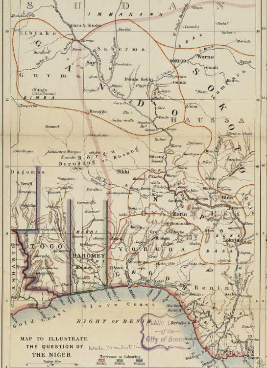

## Colonial State:

Borrowing:

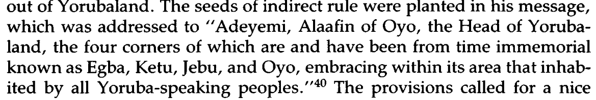

## Colonial State:

Borrowing:

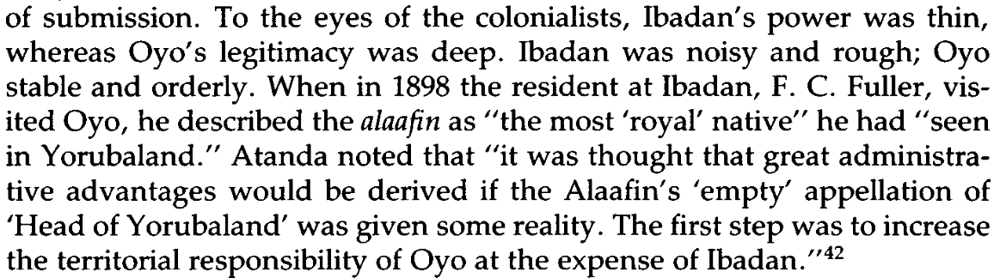

## Colonial State:

Imposition:

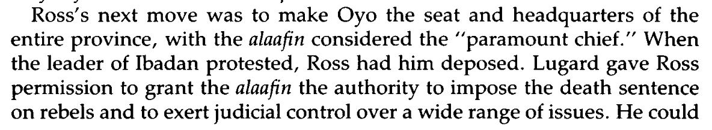

## Colonial State:

Imposition:

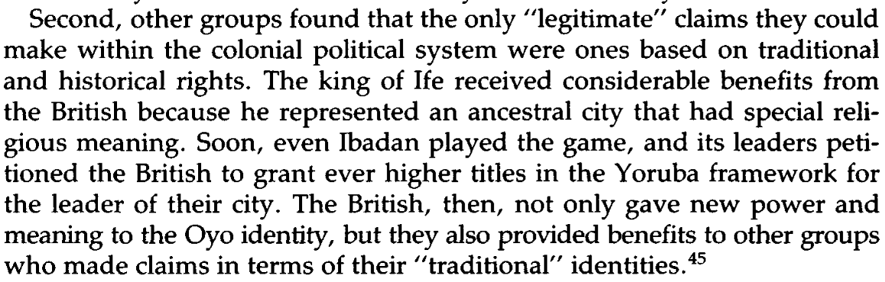

institutional recognition, institutional separation, power disparity

## Colonial State:

Incentive Shift:

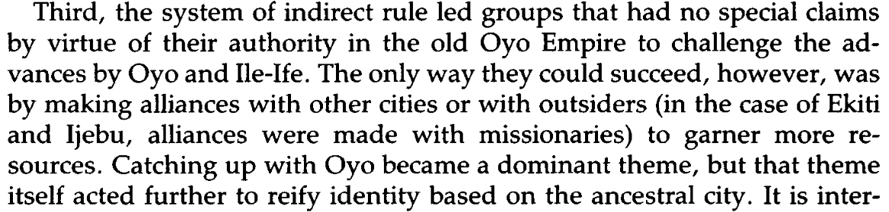


borrowing, performing groupness, cultural differentiation

## Colonial State:

Incentive Shift:

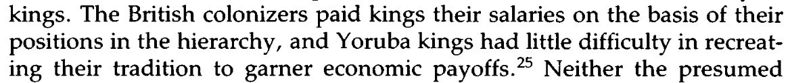


## Colonial State:

Incentive Shift:

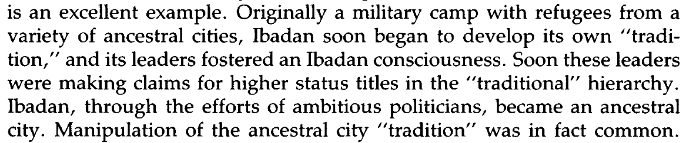

## Colonial State: Ideas

The colonial state changes not just material resources, but what is **thinkable**, what is **commonsense**

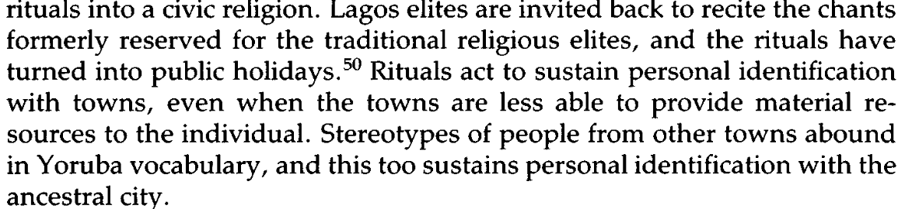

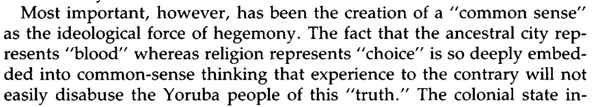


## Colonial State: Ideas

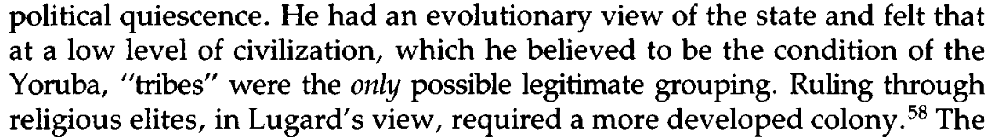


Local institutions $\to$ colonial thought $\to$ power/institutions $\to$ local thought

- Structures: both material resources, but also thoughts/ideas

# Another example


## Racial Hierarchy

In Louisiana, how did racial categories move from three (white, colored, black) to two?

Multiple regimes of racial identity:

- French, Spanish, Early Louisiana, Late Louisiana


## Racial Hierarchy:

Racial categories embedded in laws about inter-group marriage, co-habitation, reproduction, and inheritance 

- as white ideas about racial categories change, these are embedded in the state (court decisions, legislation)
- these state rules shape what is **thinkable**

## Racial Hierarchy:


- use of racial categories in legislation forces people treat them as natural


## Racial Hierarchy:

These rules have consequences:

- despite extensive interracial relationships in early Louisiana history...
- children of mixed parentage, potentially inheriting white wealth, incompatible with idea of racial binary/hierarchy
- laws *reduce* legal cases over inheritance of mixed-race children

## Racial Hierarchy:

Because the stakes of  **observing** racial group membership are high:

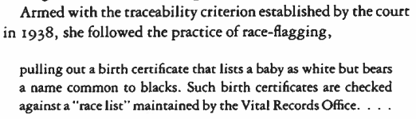


## Racial Hierarchy:

Bureaucracy, resources invested in developing "knowledge" of who has specific descent-based attributes...

- race/ethnicity not **natural**, but state can make it **appear natural**


    