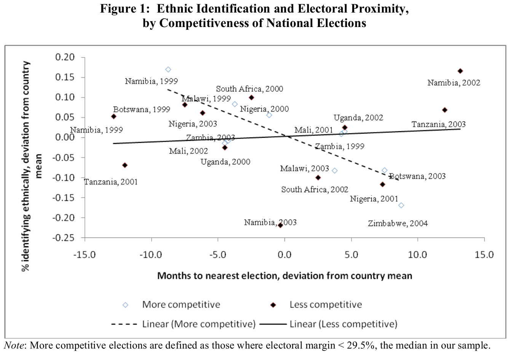
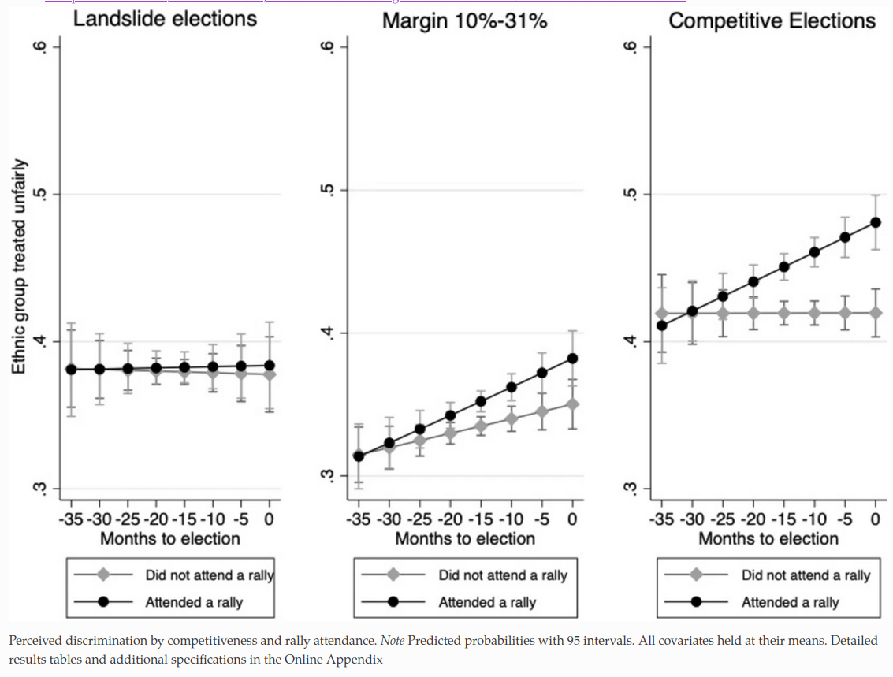
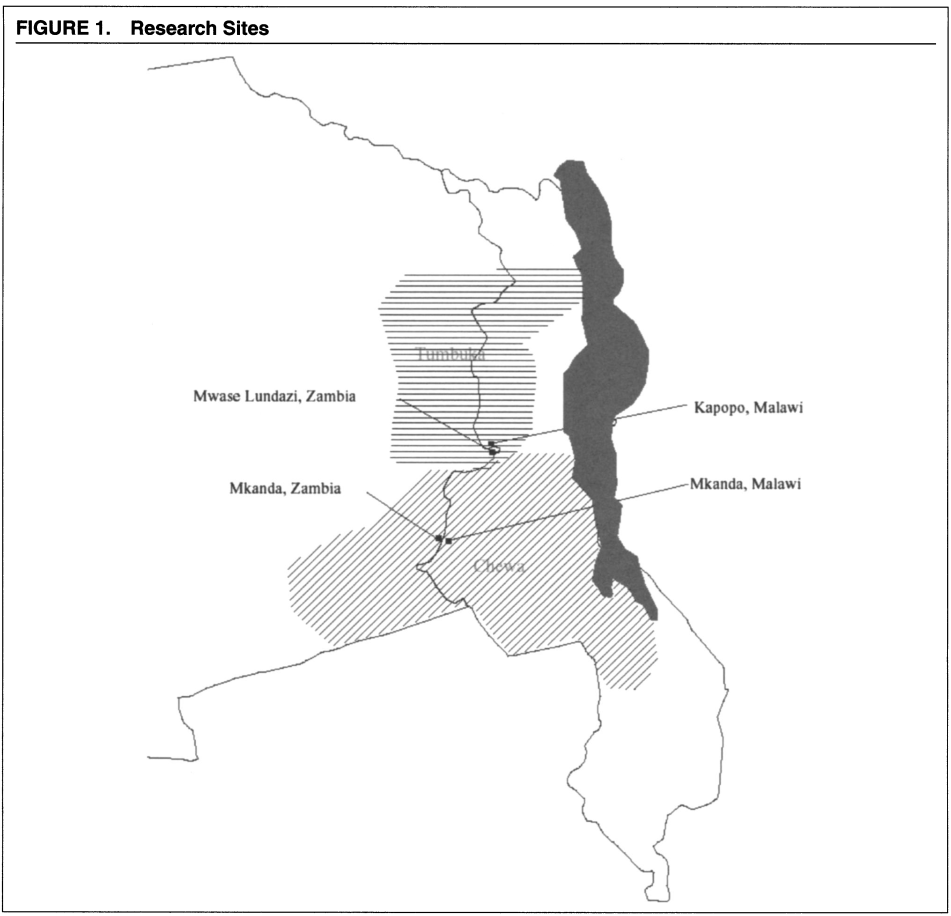
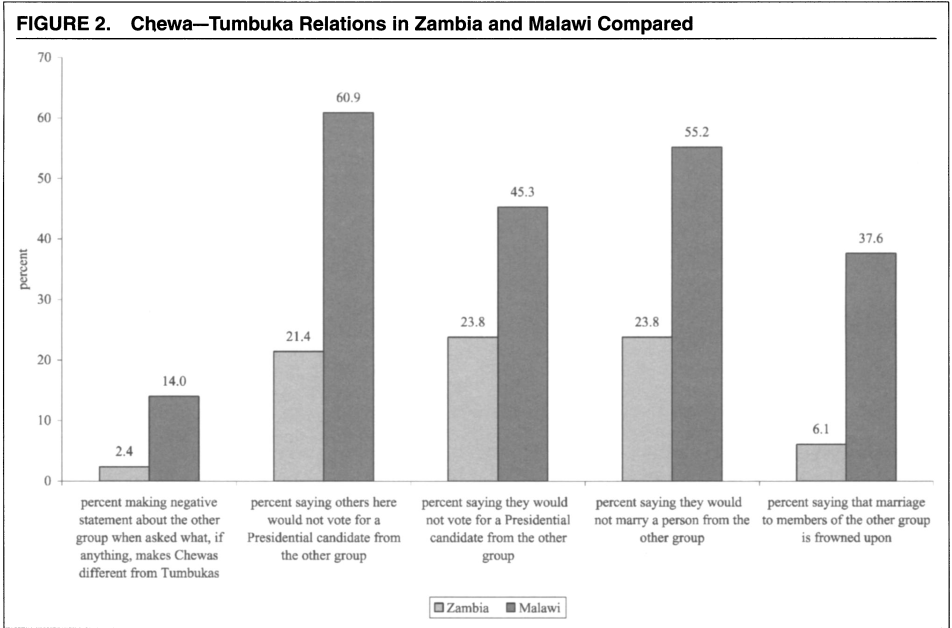
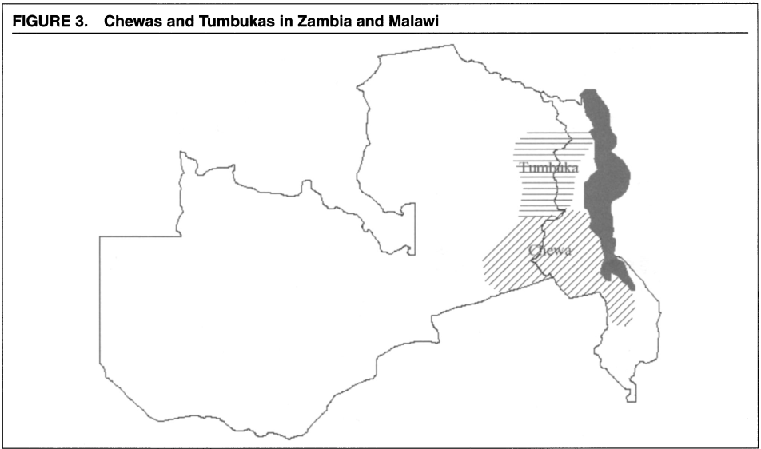

```{r setup, include=FALSE}
knitr::opts_chunk$set(echo = FALSE)
require(knitr)
require(kableExtra)
require(magrittr)
require(ggplot2)
require(data.table)
```


# Ethnicity and Conflict

## Outline

- Do elections $\to$ ethnic conflict?
- Institutions Matter

  - Horowitz
  - Posner
  - Chandra

# Elections and Conflict

## Elections and Conflict

Horowitz suggests ethnic parties contesting elections can drive conflict:

1. Ethnic parties face strategic logic that pulls them toward extreme positions.
2. Like all parties, ethnic parties downplay internal divisions: avoid issues that might unify voters across ethnic groups, emphasize issues that divide ethnic groups
3. Elections become ethnic censuses: for ethnic parties, loss portrayed as losing group is  FOREVER  shut out of power.  exclusion $\to$ conflict

If ethnic parties likely to emerge (and reasons to expect this), then likely to generate conflict.

## Elections and Conflict

If this logic is true: should expect that **proximity to elections**, particularly **competitive** elections increases conflict.

- ethnic party leaders should mobilize people along ethnicity (around election time)
- ethnic parties should deploy divisive rhetoric (esp. when elections are competitive)

As a result, 

- people should intensify their identification with an ethnic group, have more antagonistic inter-group attitudes
- violence should be more likely (we'll come back to this later)

## Elections and Conflict

Eifert et al (2010); Gadjanova (2021)

- look at respondents to Afro-Barometer (several rounds, random sample survey in many countries)
- compare respondents in the *same* country when election is *recent* vs. *distant* in time
- when elections are nearby, are people more/less likely to...

  - identify **ethnically** vs other identities? 
  - perceive ethnic discrimination? 
  - distrust other ethnic groups?

## Elections and Conflict

Eifert et al (2010); Gadjanova (2021)

- look at respondents to Afro-Barometer (several rounds, random sample survey in many countries)
- compare respondents in the *same* country when election is *recent* vs. *distant* in time
- when elections are nearby, are people more/less likely to...

  - identify **ethnically** vs other identities?: **YES** (Eifert et al 2010)
  - perceive ethnic discrimination? **YES** (Gadjanova 2021)
  - distrust other ethnic groups? **YES** (Gadjanova 2021)

Especially, when elections are more **competitive**.

## Elections and Conflict



## Elections and Conflict




# Doomed to conflict?

## Maybe not.

Empirical evidence is mixed:

- Nellis (2022) looks at surveys of attitudes/trust of **religious** out-groups *globally*
- proximity to elections does **NOT** affect distrust/negative attitudes out-groups, even in competitive elections.

## Maybe not.

Horowitz (1991) identifies how the **specific** institutions shape conflict

Says we want electoral institutions that:

1. Promote party **fractionalization**: we want there to be multiple viable parties. Makes it harder for anyone party/group to win/govern on its own $\to$ coalition building
2. Reward parties for trying to win votes across ethnic boundaries
3. Reduce the risk / costs of not winning


## Institutions and Instrumentalism

Institutions: 

- sets of rules that dictate how people interact
- can be laws/constitutions, rules within organizations
- can be informal rules that people just know

They are the "rules of the game":

- just like in boardgames, card games, changing rules alter the rational strategies of self-interested players.

## Institutional Design

Worst institutional design?

**First past the post**: single member districts, plurality winner (Canada, UK, US, etc.)

- encourage two party competition (opposite of fractionalization)
- no gains by appealing to members of other ethnic groups
- winners get more seats than votes (exacerbates exclusion of losers)
 
## Institutional Design

**proportional representation**: many variants, but, generally: multi-member constituencies, seats allocated in proportion to votes won

Pros:

- encourages party fractionalization $\to$ coalitions
- avoids total exclusion of minority groups

Cons:

- does not create incentives for ethnic parties to seek votes from other ethnic groups
- possibly unstable coalitions
- a clearer ethnic "census"

## Institutional Design

What is the problem with PR (according to Horowitz)?: difference between vote-pooling vs. seat-pooling:

**vote pooling**: political parties try to collect votes from multiple ethnic groups in advance of the election. This drives parties to propose moderate policies that are palatable to ethnic moderates in both groups.

**seat pooling**: political parties representing different ethnic groups form a ruling coalition **after the election**. May not be very stable.

- Northern Ireland: in recent years, government is coalition of Sinn Fein and DUP: the ethnic extremes. Took until 2020 to complete negotiations over 2017 elections.

## Institutional Design

**Alternative Vote**: single member districts, rank order candidates

- drop candidate with fewest first preferences, allocate second preferences
- repeat until one candidate has majority

Pros:

- encourages fractionalization
- encourages parties to win second preferences from other ethnic groups...

Why? Moderate ethnic parties can beat extremist ethnic parties with second preference votes from other ethnic group.

## Institutional Design

**Federalism**:

dispersing power from central government to regional/local governments can reduce the costs of losing

- can win some offices at local level that have meaningful power

## Other institutions?

But do other kinds of institutions limit/encourage conflict?

# A puzzle:

## Chewas and Tumbukas {.centered}



Two ethnic groups divided by Zambia-Malawi border.

## Chewas and Tumbukas

In Malawi:

- Extensive hostility between the groups
- Express negative stereotypes of each other

In Zambia

- These groups get along amicably
- Often express that they are actually united, one people.

**Even when comparing villages just across the border from each other**

## Chewas and Tumbukas  {.centered}

Despite recognizing same cultural differences in both countries...



## Chewas and Tumbukas

### **Why do the same ethnic groups behave differently just across the border?**

- cannot be electoral rules, as they are the same in both places

## Administrative Boundaries

- If elites (and possibly voters) are rational, they seek to mobilize ethnic categories that generate **minimum winning coalitions**(Posner 2005)
- Jurisdictional boundaries (within which laws made, policies set, patronage given) determine ethnic demography (relative size of membership within different ethnic categories)

## Administrative Boundaries



## Administrative Boundaries

Posner (2004):

**Malawi**: Much smaller country...

- Chewas and Tumbukas make up a large share of the population. Large enough to win elections.
- President mobilized Chewas *as Chewas* during elections, expanded membership rules to include more people as "Chewa".

**Zambia**: Much larger country...

- Chewas and Tumbukas are small groups, not large enough to matter for national elections.
- Parties mobilize regional language groups: Chewas and Tumbukas mobilized together as "Easterners"

# Another Puzzle:

## Zambia

In 1960s, Language/Region was politically salient ethnic cleavage

Between the 1970s and 1980s, tribal divisions were more important.

In the 1990s, language/region became the more salient divide.

- Always used FPTP, SMD... can't be electoral rules
- Zambia hasn't changed in size... can't be administrative boundaries

## Party System

Between 1972 and 1990, Zambia was a one-party state. Elections were held within the ruling party.

- National level office (President, party control of parliament) not decided in competitive elections
- Only choice of who local MP would be was competitive $\to$ competition at the **local** level

Before 1972 and after 1990, Zambia had multi-party competition.

- Elections do choose national leadership (President *and* ruling party)
- Competition takes place at **national** level

## Party System

Changing the focus of competition from national to local changes the **relevant ethnic demography** (Posner 2005)

With one-party rule, only demography of constituency matters: 

- language does not form minimum winning coalition $\to$ tribe

With multi-party competition, national demography matters:

- tribal groups are too small to win, rational to mobilize by language/region 

# Final Puzzle:

## BSP and SC Voters

Indian Constitutions recognized and created special protections for previously "untouchable" caste groups

- new category of "Scheduled Castes" or SCs

Despite these protections, by 1980s, growing number of educated and upwardly mobiles SCs faced discrimination, inadequate employment.

Enter the Bahujan Samaj Party:

- Ethnic political party that sought SC votes and campaigned on policies to help out SC community

## BSP and SC Voters

Uttar Pradesh:

- Large province, population divided along religious, linguistic, and caste lines
- Large SC population (21%), with ~20% literate by 1981.
- SMD, SPTP, multi-party elections.

Karnataka:

- Medium province, population divided along religious, linguistic, and caste lines
- Large SC population (16%), with ~20% literate by 1981.
- SMD, SPTP, multi-party elections.

## Puzzle:

Despite similarities...

- In Uttar Pradesh, BSP won SC votes, able to lead state assembly
- In Karnataka, BSP could not even recruit candidates to run.

Why does the same ethnic party fail to win in two places?

- cannot be electoral rules, administrative boundaries, party system

## BSP and SC Voters

Chandra (2004)

Even if voters/elites want to distribute government resources to their group...

- will support whatever party able to do this best, *regardless of whether it is exclusively ethnic*
- parties that are best able to distribute to an ethnic group:

    - have enough support to win
    - include ethnic group members in leadership positions
    
## BSP and SC Voters

In Uttar Pradesh:

- Major non-ethnic parties (Congress) run by upper castes, would not permit SC leaders to take high ranking positions in the party
- BSP leadership mostly SC and could conceivably win elections.

In Karnataka:

- Major non-ethnic party (Congress) had open competition for leadership positions; SCs included in proportion to their population
- BSP could not offer a credible improvement for representing SC interests 

## BSP and SC Voters

Key takeaway:

**Party institutions** in ethnic and non-ethnic parties, along with ethnic demography, determine whether ethnic parties can successfully compete.

# Conclusion

## Institutions and Conflict:

Many formal/informal rules enable/constrain ethnic conflict:

- Constitution/electoral rules
- Administrative boundaries
- Party systems
- Internal party rules

Change the strategic benefits/costs to pursuing ethnic extremism or compromise.

But institutions are not easily be changed.

