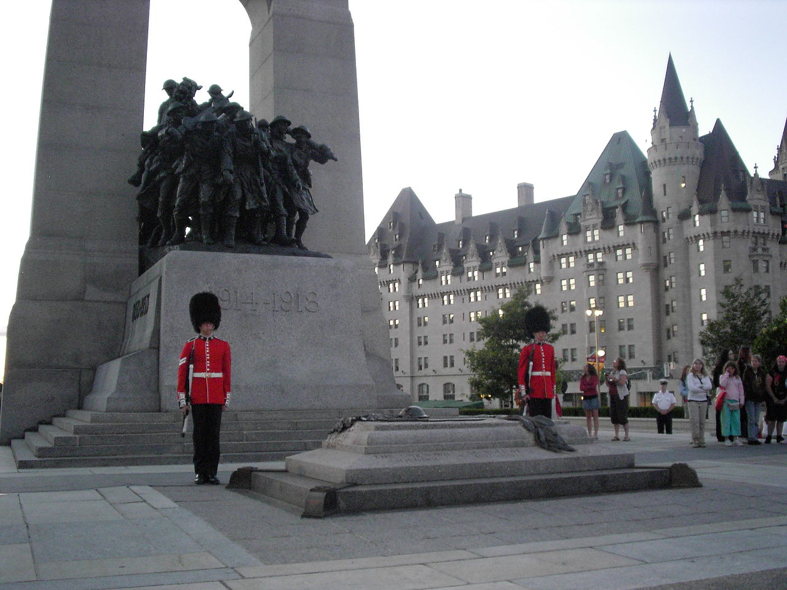
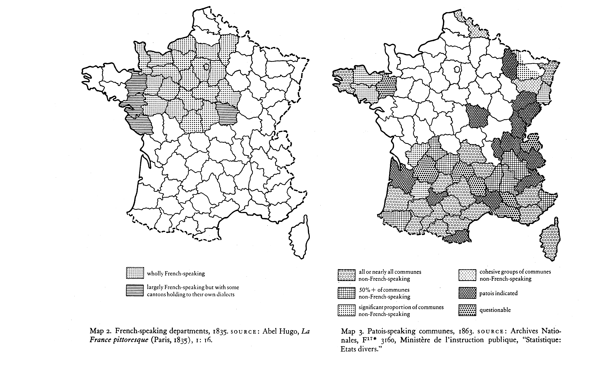
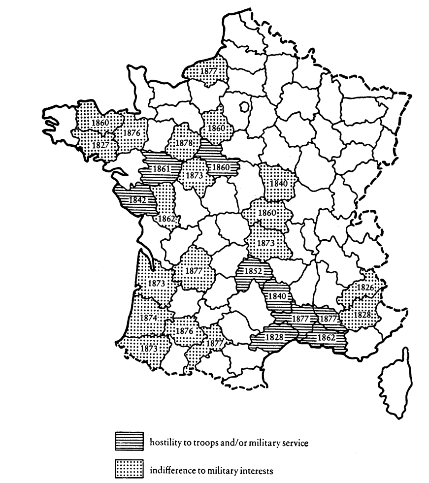

```{r setup, include=FALSE}
knitr::opts_chunk$set(echo = FALSE)
require(knitr)
require(kableExtra)
require(magrittr)
```


# Origins of Ethnic Boundaries

## Outline

- Questions
- Nations as "imagined communities"
- States and imagination

# Questions

## Tomb of Unknown Soldier



[many countries](https://en.wikipedia.org/wiki/Tomb_of_the_Unknown_Soldier) have this... Why is this a powerful symbol?

## Imagined Communities

Anderson's book coins a phrase: "imagined communities"

- nations (ethnic groups) are "imagined" (comes up in Chandra's definition)
- Ethnic boundaries include material practices/institutions AND shares understanding (imagination)


## Imagined Communities

What makes it possible to **imagine membership** in a community?

---

<iframe width="560" height="315" src="https://www.youtube.com/embed/07n-I71VfgE?start=162" title="YouTube video player" frameborder="0" allow="accelerometer; autoplay; clipboard-write; encrypted-media; gyroscope; picture-in-picture" allowfullscreen></iframe>

---

## Latvian Song and Dance Festival

- nearly 20,000 people singing, dancing in unison.
- ~1% of all Latvians in Latvia participate
- impossible to know all singers/dancers, let alone all Latvians

How does this help imagine Latvia as a nation?

## Imagined Communities

In small groups:

Thinking of the national/ethnic identifications you hold: what kinds of experiences, rituals, institutions, practices make it POSSIBLE for you to imagine yourself as a part of a community?

# Origins of Imagined Communities

## Modernity and Imagined Communities

Last class: possibility to imagine oneself in ethnic categories shaped by the state.

Anderson:

- The kind of broad imagined communities of nation/ethnicity only became possible in modernity

## Print Capitalism 

Printing press transformed society:

- widespread availability of texts
- rise of vernacular languages (as opposed to sacred language)

Consequences:

- new written language connected people across variations in spoken language
- **materialized** language: constrained change in language
- standardization: in language, in cultural practice

## Print Capitalism 

Consequences:

- emphemeral texts:

    - rather than religious tracts about the meaning of human existence, 
    - texts on markets, current politics, current fashion...
    - possible to imagine someone like yourself reading the same thing

## Print Capitalism 

Religious time:

- time is cyclical
- simultaneity of past and present: religious stories part of the present

Homogenous Empty Time

- time is linear, progressing forward in time
- we inhabit shared moment in time (simultaneity of the present)
- events linked as sequence of cause and effect

---

<iframe width="560" height="315" src="https://www.youtube.com/embed/H9Z3_ifFheQ?start=26" title="YouTube video player" frameborder="0" allow="accelerometer; autoplay; clipboard-write; encrypted-media; gyroscope; picture-in-picture" allowfullscreen></iframe>


## Print Capitalism 

Technology makes it possible to imagine that we inhabit the same time:

- print, railroad, telegraph, telephone, internet
- comments and likes take this further
- memes

Homogeneous Empty Time:

- also lets us imagine membership in community THROUGH TIME: gives "groups" as past, present, future
- linguists and historians were among first nationalists


# The State and Imagination

## The State and Imagination

But how were these imagined communities achieved?

- Print is one thing, but people didn't become national overnight: illiteracy

## The State and Imagination


Even though it was possible to imagine the nation, not everyone did

### France:

Even though Europe was the birthplace of nationalism; nationalism tied to wars in Europe...

- large segments of France could not understand French
- rejected the label of French
- actively resisted cooperation with the French government

as late as the end of the 19th century!!!

## The State and Imagination



## The State and Imagination



## The State and Imagination

How did the state facilitate imagined community?

### Schools

Reformers sought:

- French language instruction
- Instruction in French history, membership in French nation

## The State and Imagination

Even with these ideas in the curriculum, how to make it real?

### Schools:

- mandatory public schools (free schooling)
- increased regulation of schools
- training of educators, increased pay of educators

### Incentives:

- French as qualification for government jobs, civil service exams, increased need to navigate 
    
    
## The State and Imagination
    
States...

- choose which print language to use; invest it with power
- spend money on training/education
- provide carrots/sticks to compel people to adopt this education

Producing "commonsense"    

## The State and Imagination

Why do they do this?

- Nationalists in control of government (aligned with republican/democratic ideals)
- State building: easier to compel people to pay taxes, join army, follow the law if they believe in the nation

## The State and Imagination

State use similar tools:

- by colonial states here in Canada
- by colonial states in Africa (last class)
- within EUROPE on EUROPEANS, compelled people to adopt national identity
- EMULATED by anti-colonial national liberation movements.    
    


    